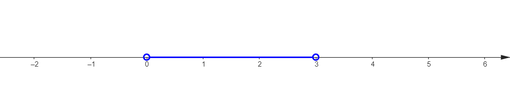
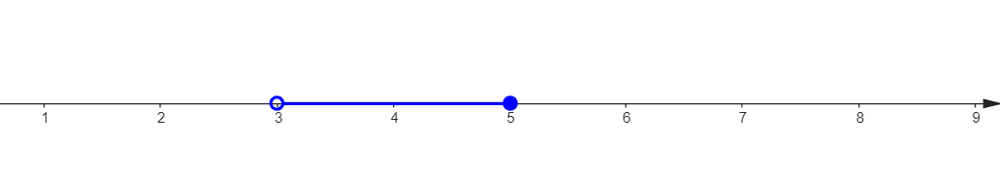

## UNITA' 1: Diseguaglianze ed intervalli

La scrittura $3 \gt 5$ afferma una **relazione** tra due numeri, precisamente che il numero 3 è maggiore del numero 5 ed è chiaramente falsa. Si dice che il suo "***valore di verità***" è "Falso" e si scrive che $3 \gt 5 \longrightarrow{} False $ . Invece $4 = 2 + 2$ afferma una cosa vera e si scrive che $4 = 2 + 2 \longrightarrow True$ , dove $True$ sta per "Vero". Analogamente "$\lt$" è il simbolo di "minore"; $1+2 \lt 5$ afferma che il risultato dell'espressione $1+2$ è minore del numero 5, è chiaramente vera, e simbolicamente scriviamo che $1+2 \lt 5 \longrightarrow True$ . Osserviamo che $1+2 \lt 3 \longrightarrow False$ .

I simboli "$\le$" e "$\ge$" significano "minore o uguale" e "maggiore o uguale", per cui $3 \le 5 \longrightarrow True$  e  $3 \le 3 \longrightarrow True$​ .

Come per le equazioni, scrivere $x < -2$ significa scrivere qualcosa che di per se non è ne vera ne falsa in quanto non contiene solo numeri, ma è importante perché con essa possiamo porci un problema , che è quello di trovare i numeri che sostituiti alla lettera $x$​ rendono la relazione vera.

La scrittura $x \lt -2$ si chiama "disequazione" ed i numeri che la rendono vera si chiamano "soluzioni" della disequazione. Come si vede, le soluzioni della disequazione sono tutti i numeri che sono minori di $-2$, ad esempio $-3$, $-10$, $-100$, ma non $0$. Sono un insieme infinito di numeri che indichiamo con la notazione $\{x: x \lt -2\}$ che si legge "***l'insieme delle x tali che x è minore di meno due*** ". In particolare "$\{$" si legge "L'insieme delle... ":" si legge "tali che" .... e la parentesi chiusa non si legge.

Per indicare questo insieme si utilizza anche un'altra notazione, detta "**intervallo**": $(-\infty, -2)$; in questo modo si indicano tutti i numeri minori di $-2$ tranne il numero $-2$ che non fa parte dell'insieme. Se vogliamo includere anche il numero $-2$ scriviamo $(-\infty, -2]$.

Se volessimo indicare tutti numeri minori di $-2$ ma maggiori di -$4$, scriveremmo $[-4, -2]$, intendendo che sia $-4$ che $-2$ fanno parte dell'insieme. Se vogliamo escludere $-4$ scriviamo $(-4, -2]$, e così via.

Gli intervalli si possono rappresentare anche graficamente su una retta. Il grafico dell'intervallo $(0,3)$ è:

Nella simbologia grafica usata da GEOGEBRA, se il numero non fa parte dell'intervallo l'estremo del segmento è un puntino vuoto; se il numero invece fa parte dell'intervallo l'estremo è un puntino pieno: l'intervallo $(3, 5]$ ha la figura riportata di seguito.

### ESERCIZIO 1.1 - Disuguaglianze e disequazioni

a) Indicare quali delle seguenti disuguaglianze sono vere e quali false.  

1. $9 - 2 \lt 3$;
2. $5+8 \gt 19$;
3. $5 \cdot 2 \le 5 \cdot 7$;
4. $4 \cdot 8 \gt  2 \cdot 16$;
5. $8-2 \lt 14$;
6. $x + 1 \gt 0$;
7. $6 + 4 \le 10$

b) Trovare almeno due numeri che rendono vere le seguenti disequazioni.

1.  $x + 1 \gt 0; x + 3 \le 4$;
2.  $2x-1 \lt 6; x^2 + 2x -1 \ge 0$; 

### ESERCIZIO 1.2 - Soluzione di Disequazioni I

a) Nei casi riportati di seguito, determina quali tra i valori indicati nell'insieme è soluzione della disequazione associata.

1. $\{0, 1, -1\}: x-2<6;$   $\{0, 3\}: 2x-1<3$;
2. $\{0, 5, 7\}: 3(x-5) - 6 < 0$;   $\{0, 5, 7\}: 5x - (6-x) \ge 0$;

b) Scrivi la disequazione corrispondente alle frasi riportate di seguito.

1. Insieme dei numeri minori o uguali ad 1; Insieme dei numeri non maggiori di 2;
2. Insieme dei numeri il cui doppio è minore di 3; Insieme dei numeri non maggiori di $-\dfrac{4}{13}$.

#### Laboratorio GEOGEBRA

a) Risolvi la prima parte del punto a.1) dell'esercizio con la sequenza di comandi GEOGEBRA riportata di seguito.

1. $d1(x) : x - 2 < 6$ &#9166; 
2. $\{d1(0), d1(1), d1(-1)\}$ &#9166;

### ESERCIZIO 1.3 - Intervalli e disequazioni elementari

a) In ciascuno dei casi riportati di seguito determina se il numero indicato appartiene all'intervallo associato.

1. $2\in [0; 3]$;   $\dfrac{1}{3} \in (-2; 2]$;   $2, \in [0; 3]$;   $\dfrac{2}{5}, \in (\dfrac{2}{5}; 1)$;   
2. $-1, \in [-3; -2]$;   $-4, \in [-4; 0)$;   $0, \in (0; 1]$.

b) Rappresenta graficamente su una retta gli intervalli riportati di seguito.

1. $(0;1)$;   $[-1;1]$;   $(1;+\infty)$;   $(-\infty;5)$;   $(0;1)$;   
2. $[-1;0)$;   $[-3;+\infty)$;   $(-\infty; +\infty)$;   $(2;\dfrac{33}{5}])$;   $[\dfrac{1}{2};3)$.
3. $(-1;3) \cap (-2;0)$;   $(-1;3) \cup (-2;0)$;
4. $(1;5) \cap (5;7)$;   $(1;5) \cup (5;7)$;
5. $(3;+\infty) \cap [3;7]$;   $(3;+\infty) \cup [3;7]$;
6. $[0;\dfrac{3}{2}) \cap (-\dfrac{4}{5};0]$;   $[0;\dfrac{3}{2}) \cup (-\dfrac{4}{5};0]$.

c) Per ciascuno dei casi seguenti, scrivi la disequazione (elementare) o il sistema di disequazioni che ha come soluzioni l'intervallo indicato.

1.  $(-\infty;-5)$;   $[1;+\infty)$;   $(1;+\infty)$;   $(-\infty;-\dfrac{50}{11})$;   $(-3;+\infty)$;
2.  $[0; 3]$;   $(-2; 2]$;   $(2; \dfrac{33}{5}]$;   $(\dfrac{2}{5}; 1)$;
3.  Gli intervalli dei punti b.3) e b.4).

#### Laboratorio GEOGEBRA

Per il presente laboratorio, utilizzare la versione on-line di GEOGEBRA Classic all'indirizzo: https://www.geogebra.org/classic.

a) Risolvi la prima parte del punto a.1) dell'esercizio con la sequenza di comandi GEOGEBRA riportata di seguito.

1. $a : 0 \le x \and x \le 3$ &#9166; 
2. $a(2)$ &#9166;

Per rappresenta graficamente l'intervallo:

1. Dal "Menu Principale" seleziona "Cambia Calcolatrice" / "Grafici";
2. Dal menu della casella di input, seleziona "Impostazioni" e quindi dalla scheda "Stile" seleziona "Mostra sull'asse X".

b) Risolvi la restante parte del punto a.1) con sequenze di comandi GEOGEBRA analoghi a quelli precedenti. Ricorda di utilizzare altre etichette per indicare gli intervalli ($b, c$, etc.).

## UNITA' 2: Disequazioni di I grado con una incognita

### ESERCIZIO 2.1 - Soluzione di Disequazioni II

a) Per ciascuno dei casi seguenti, scrivi l'insieme delle soluzioni delle disequazioni come intervalli.

1. $x-1\ge 2$;   $7x-1\ge 2$;   $-x-1\le 2$;   $\dfrac{x}{5}-1\ge 2$;
2. $4x - 3 > 5x + 1$;   $4[2(1 - x) -3] > 5x + 1$;    $5(x-1) < 2(x-3)$;
3. $3\left[(x+3)+\dfrac{1}{3}x\right]<7x$;   $3(x-1)-1 < \dfrac{x-2}{3} - \left(x-\dfrac{x-1}{3}\right)$;
4. $\dfrac{2+x}{3} \ge x + \dfrac{1}{2}$;   $2x-5\lt 3+2x$;   $2(x+1) - 5x\ge 3x + 4(x+1)$.