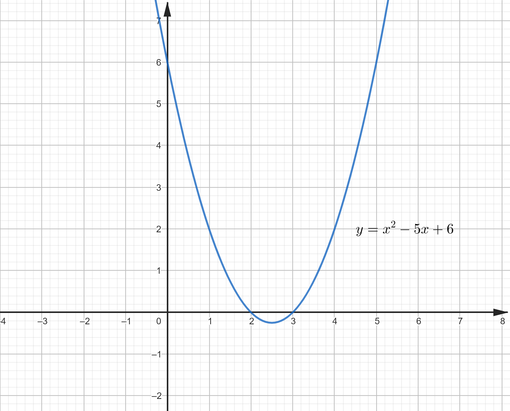
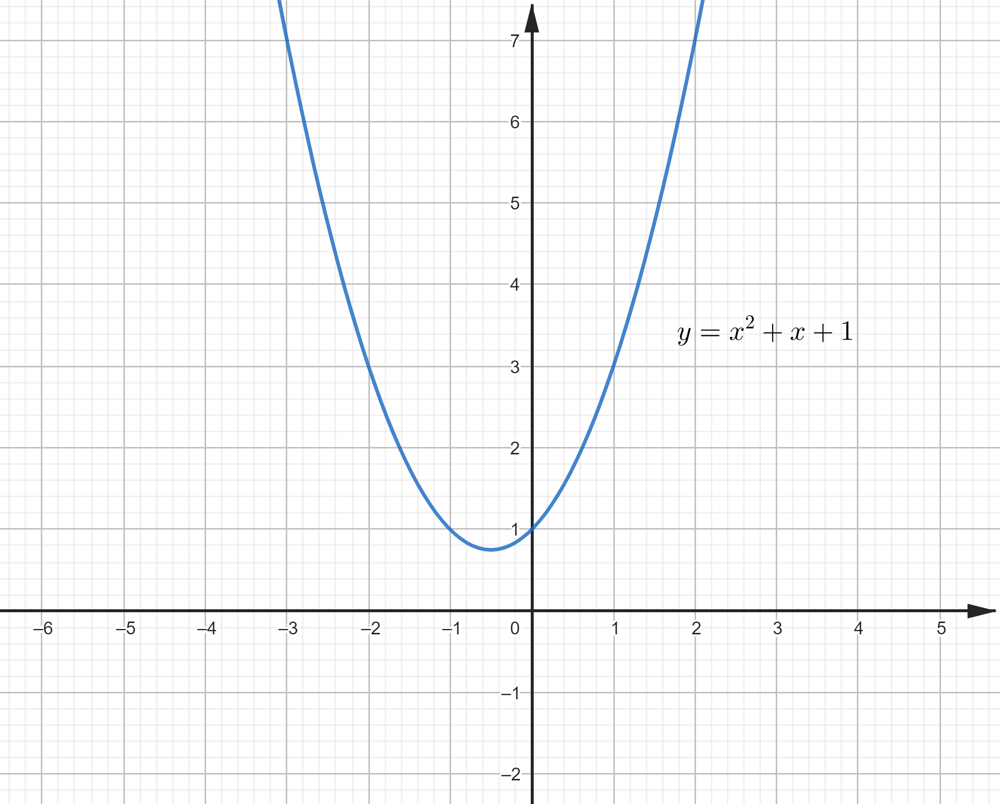
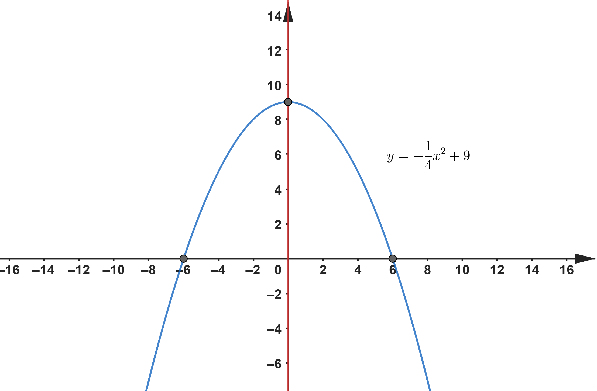

# Equazioni di II Grado e Parabola

## UNITA' 1: I radicali

Diverse lezioni fa abbiamo visto il significato ed il calcolo delle potenze. Abbiamo visto come calcolare il ***valore*** della potenza $a^n$ se conosciamo $a$, la ***base*** della potenza (numero intero) e $n$, l'***esponente*** (numero intero), ad esempio

a) $3^2 \longrightarrow 9$;      $3^{-2} \longrightarrow \dfrac{1}{3^2} \longrightarrow \dfrac{1}{9}$;

b) $(-3)^2 \longrightarrow 9$;      $(-3)^{-2} \longrightarrow \dfrac{1}{(-3)^2} \longrightarrow \dfrac{1}{9}$.

Adesso ci occupiamo del problema inverso, trovare la ***base*** di una potenza, conoscendo il suo ***valore*** e l'***esponente***. In pratica trovare il numero che sostituito alla $x$ ci da il valore della potenza, ad esempio $x^2 \longrightarrow 9$, oppure $x^3 \longrightarrow 8$.

Facendo qualche tentativo si vede che nel primo caso $x = 3$, perché $3^2 \longrightarrow 9$ e nel secondo $x = 2$ perché $2^3 \longrightarrow 8$ (facendo più attenzione notiamo che nel primo caso anche $x = -3$ risolve il problema perché anche $(-3)^2 \longrightarrow 9$).

Questi numeri si chiamano **radici** rispettivamente di $9$ e di $8$ e precisamente $3$ è radice quadrata di $9$ e $2$ è radice cubica di $8$ e si indicano $\sqrt[2]{9} = 3$ e $\sqrt[3]{8} = 2$.

In generale la radice n-esima di un numero $b$ si scrive utilizzando l'espressione $\sqrt[n]{b}$ , detta **radicale**, con $n$ detto *indice* del radicale. La radice n-esima di $b$ è un numero positivo $a$ tale che $a^n= b$. Tranne che in casi particolari le radici si trovano con la calcolatrice o con GEOGEBRA, trasformando il radicale in potenza.

Oltre che con il caratteristico simbolo di radice, i radicali si possono infatti scrivere come potenze; ad esempio $\sqrt[2]{9}$ si può scrivere anche $9^{\frac{1}{2}} \longrightarrow 3$ e $\sqrt[3]{8} = 8^{\frac{1}{3}} \longrightarrow 2$, ossia con esponenti frazionari corrispondenti al reciproco dell'indice del radicale.

Abbiamo poi che si può scrivere $8^{\frac{2}{3}} = \sqrt[3]{8^2} \longrightarrow \sqrt[3]{64} \longrightarrow 4$. Cioè in generale:
$$
x^{\frac{m}{n}} = \sqrt[n]{x^m}
$$

Osserviamo che se l'indice del radicale è pari ed il numero sotto la radice è negativo non esiste nessun numero corrispondente al radicale. Ad esempio $\sqrt[2]{-4}$ non è un numero perché se esistesse $a$ tale che $\sqrt[2]{-4}=a$ allora $a^2 = -4$ e questo numero non esiste.

 

### ESERCIZIO 1 - Calcolo di radicali

a) Usando la calcolatrice, trova il valore, approssimato alla quarta cifra decimale, dei radicali riportati di seguito. Fai una prova della correttezza del calcolo dopo aver trovato il numero.

1. $\sqrt[2]{4};$   $\sqrt[2]{81};$   $\sqrt[3]{125};$   $\sqrt{2};$   $\sqrt[3]{2};$
2. $\sqrt[2]{\dfrac{1}{2}};$   $\sqrt[2]{\dfrac{3}{4}};$   $\sqrt[3]{12.345};$
3. Nel caso di $\sqrt2$ e $\sqrt[3]{12.345}$ trova l'errore relativo percentuale tra il risultato della calcolatrice e quello approssimato alla quarta cifra decimale.

b) Calcola $\sqrt[n]{x}$ in ciascuno dei casi seguenti:  $n=2, x=1;$   $n=3, x=8;$   $n=4, x=16;$ 

c) Stabilisci quali delle relazioni seguenti sono vere.

1. $\sqrt[2]{4}+2=0;$     $\sqrt[2]{4}-5=0;$     $\sqrt[4]{2}-\sqrt[2]{-4}=0;$ 
2. $\sqrt[2]{25}=\sqrt[2]{36}-1;$     $\sqrt[5]{1}-1=0$;
3. $\sqrt[2]{-4}=-2$;    $\sqrt[2]{4} = -2$;     $2 - \sqrt[2]{4}=0$.

#### Laboratorio GEOGEBRA

a) Risolvi il quinto esercizio del punto a.1) con la sequenza di operazioni GEOGEBRA riportata di seguito.

1. $\sqrt[3]2$ &#9166; 
2. Premi sul pulsante $\approx$ e da $1.259921049895$ prendi $1.2599$.
3. $1.2599^3$&#9166; ottenendo $1.9998$.

b) Risolvi il quarto esercizio del punto a.1) con una sequenza di operazioni GEOGEBRA analoga a quella del punto precedente ma inserendo in input la radice in forma di esponenziale:  $2^\frac{1}{2}$ &#9166; 

c) Risolvi il punto c.1) dell'esercizio con la sequenza di operazioni GEOGEBRA riportata di seguito.

1. $\sqrt4 + 2==0$&#9166;    $4^\frac{1}{5}-5==0$&#9166;    $2^\frac{1}{4}-4^\frac{1}{2}==0$&#9166; 

### ESERCIZIO 2 - Operazioni e Semplificazioni di Radicali

a) Scrivi ciascuno dei radicali seguenti in forma di potenza e semplifica, dopo aver eventualmente scomposto la base in fattori primi. 

1. $\sqrt[2]{4};$   $\sqrt[2]{81};$   $\sqrt[3]{15};$   $\sqrt[2]{7};$   $\sqrt[4]{64};$
2. $\sqrt[6]{\dfrac{1}{8}};$   $\sqrt[4]{2187};$   $\sqrt[3]{\dfrac{4}{9}};$

b) Calcola il valore delle seguenti potenze

1. $9^{\frac{3}{2}};$    $27^{\frac{2}{3}};$    $1^{\frac{2}{3}};$    
2. $\left(\dfrac{1}{4}\right)^{\frac{3}{2}};$    $\left(\dfrac{25}{9}\right)^{\frac{3}{2}};$    $8^{-\frac{2}{3}};$    $25^{-\frac{1}{2}};$

#### Laboratorio GEOGEBRA

a) Risolvi il punto a) dell'esercizio con la sequenza di operazioni GEOGEBRA riportata di seguito.

1. $r: Fattorizza(4)$ &#9166;    $r^\frac{1}{2}$&#9166; 
2. $r: Fattorizza(81)$ &#9166;    $r^\frac{1}{2}$&#9166; 
3. $r: Fattorizza(64)$ &#9166;    $r^\frac{1}{4}$&#9166; 

a) Risolvi il secondo esercizio del punto b.1) con la sequenza di operazioni GEOGEBRA riportata di seguito.

1. $27^{\frac{2}{3}}$  &#9166; 

## UNITA' 2: Le equazioni di II grado

Le equazioni di II grado, con una sola incognita, sono equazioni in cui l'incognita compare al quadrato (e non con esponente più alto).

Le seguenti sono equazioni di II grado:

a) $x^2 - 4 = 0$;

b) $x^2 = -1$;

c) $x(x + 3) = 0$;

d) $x^2 -5x + 6 = 0$;

e) $x^2 + x + 1 = 0$.

Le equazioni di II grado possono avere due soluzioni, una sola soluzione o nessuna soluzione. Un esempio di equazione che ha due soluzioni è la a) e le soluzioni sono $2$ e $-2$, infatti sostituendo, ad esempio $-2$ si ottiene $(-2)^2 - 4 = 0 \longrightarrow 4 - 4 = 0$ che è vera.

Un esempio di equazione che non ha soluzione è la b) perché non c'è nessun numero che al quadrato possa dare $-1$. Prima di scrivere le formule per calcolare le soluzioni di una equazione di II grado bisogna esaminare la loro forma "standard" detta *normale*.

Una equazione di II grado è in forma normale se è scritta come un polinomio uguale a zero, ossia ha la forma generica:
$$
ax^2+bx+c=0
$$
con $a$, $b$, e $c$ numeri detti ***coefficienti***. Ad esempio, tra le equazioni di esempio la a), d) ed e) sono in forma normale, le altre no. Per mettere la b) in forma normale basta trasportare il $-1$ a sinistra. Nella a) quindi abbiamo che $\{a = 1, b=0, c=-4\}$, mentre nella d) abbiamo $\{a = 1, b=-5, c=6\}$. 

Per trovare le soluzioni di una equazione di II grado in forma normale si possono applicare le formule seguenti (dette ***risolutive***):
$$
x_1 = \dfrac{-b+\sqrt{b^2 - 4ac}}{2a} \\
x_2 = \dfrac{-b-\sqrt{b^2 - 4ac}}{2a}
$$
Per calcolare le soluzioni della equazione d) basta sostituire i numeri specifici ai coefficienti generici ottenendo:
$$
x_1 = \dfrac{-(-5)+\sqrt{(-5)^2 - 4\cdot 1 \cdot 6}}{2 \cdot 1} \longrightarrow \dfrac{5+\sqrt{25-24}}{2} \\
x_2 = \dfrac{-(-5)-\sqrt{(-5)^2 - 4\cdot 1 \cdot 6}}{2 \cdot 1} \longrightarrow \dfrac{5-\sqrt{25-24}}{2}
$$

Facendo il calcolo si ottiene $x_1=3$, $x_2 = 2$.

L'esistenza o la non esistenza delle soluzioni dipende dalla quantità sotto radice $b^2-4ac$​. Se la quantità è negativa la sua radice quadrata non esiste e quindi non esiste la soluzione dell'equazione.

Quando una equazione di II grado è in forma normale, è scritta come un polinomio (con un'unica incognita, la $x$) uguale a $0$. Il polinomio si chiama polinomio "associato" all'equazione e le soluzioni dell'equazioni, quando esistono, si chiamano anche "radici" del polinomio.

### ESERCIZIO 3 - Forma Normale delle Equazioni

a) Per ciascuna delle equazioni seguenti, individua, nel caso sia di secondo grado, i valori di $a$, $b$ e $c$, dopo averla scritta in forma normale.

1. $3x^2-2 = x;$  
2. $4-x^2 = 2;$  
3. $1-x=x;$
4. $(x-3)(x-3)=0;$
5. $x(x-6)=0$.

#### Laboratorio GEOGEBRA

a) Scrivi le equazioni dei punti a.1), a.2), a.3) dell'esercizio in forma normale con la sequenza di operazioni GEOGEBRA riportata di seguito.

1. $3x^2-2 - x=0$ &#9166; 
2. $4-x^2 - 2 = 0$ &#9166; 
3. $1 - x - x = 0$ &#9166; 

### ESERCIZIO 4 - Soluzioni delle Equazioni di II Grado

a) Trova, se esistono, le soluzioni delle equazioni seguenti.

1. $2x^2 + x = 0;$   $\dfrac{x^2}{4} - 81 = 0;$   $x^2 -5 = 0;$

2. $3x^2 - 12x + 9 = 0;$   $4x^2 + 12x + 9 = 0;$   $x^2 + x + 1 = 0;$
3. Equazioni dei punti a.3, a.4 e a.5 dell'esercizio 3.
4. $3(x-x^2)-\dfrac{4}{3} = \dfrac{1}{2}x - 1;$   $\dfrac{x+4}{5}+\dfrac{33}{10}=(2+x)(2-x);$   $\dfrac{4}{3}x(12-x)=45$.

b) Scrivi l'equazione, calcola il valore del discriminante e trova le soluzioni, nei casi in cui i coefficienti della forma normale a, b, c abbiano i valori riportati di seguito:

1. $a=2, b=8, c=1;$   $a=3, b=-1, c=2;$
2. $a=2, b=8, c=10;$   $a=0, b=-1, c=2$.

#### Laboratorio GEOGEBRA

a) Risolvi il secondo esercizio del punto a.1) con la sequenza di operazioni GEOGEBRA riportata di seguito.

1. $Risolvi(\dfrac{x^2}{4} - 81 = 0, {x})$ &#9166; 

b) Risolvi il secondo e terzo esercizio del punto b.1) con la sequenza di operazioni GEOGEBRA riportata di seguito.

1. $d : b^2-4ac$  &#9166;
2. $e1: ax^2 +bx +c = 0$  &#9166;
3. $l1: \{a=3, b=-1, c=2\}$  &#9166;
4. $Sostituisci(d, l1)$  &#9166;						  // Si ottiene il discriminante
5. $e1: Sostituisci(e1,l1)$  &#9166;					// Si ottiene l'equazione con i coefficienti numerici
6. $Risolvi(e1)$  &#9166;							      // Si ottengono le soluzioni dell'equazione
7. $l2: \{a=2, b=8, c=1\}$  &#9166;
8. $Sostituisci(d, l2)$  &#9166;
9. $e_2: Sostituisci(e,l2)$  &#9166;	
10. $Risolvi(e2)$  &#9166;	

## UNITA' 3: La parabola

In questa unità vogliamo studiare le proprietà di una figura geometrica che è definita, nel piano cartesiano, dalle soluzioni di un particolare tipo di equazione con due incognite. Come per le rette, i cui punti hanno le coordinate che sono soluzioni di una equazione di I grado della forma, ad esempio $x + y = 5$, le parabole sono figure i cui punti hanno le coordinate che sono soluzioni di equazioni quali $y = 2x^2 + 1$, $y=x^2 -5x +6$ oppure $y = -x^2-3$, cioè della forma generale:
$$
y = ax^2 + bx + c
$$
dove $ax^2 + bx + c$ è un polinomio in $x$ come quello associato alle equazioni di II grado in forma normale.

Se disegniamo sul piano cartesiano le soluzioni delle equazioni di questo tipo, otteniamo sempre delle figure come queste:

Questa forma è chiamata "Parabola". Prendendo in esame quelle che hanno $a > 0$, osserviamo che hanno una parte che "scende" fino ad un minimo, detto "vertice" e poi risale. In alcuni casi, come quello della prima figura, una parte della parabola è nel semipiano delle $y$ negative, e la parabola incrocia l'asse orizzontale, mentre in altri casi la parabola è tutta nel semipiano delle $y$ positive.

Come si vede dalle figure, una parabola può incrociare entrambi gli assi coordinati. Per trovare le coordinate dei punti di intersezione della parabola con gli assi, si devono risolvere due sistemi. Con la soluzione del primo troviamo l'intersezione con l'asse orizzontale e con il secondo troviamo l'intersezione con l'asse verticale:

$$
\left\{  
\begin{array}{c} 
y = ax^2+by+c  \\  
y =0			\\   
\end{array} 
\right.
$$

$$
\left\{  
\begin{array}{c} 
y = ax^2+by+c \\  
x=0			\\   
\end{array} 
\right.
$$

Il punto più "basso" delle parabole, è detto vertice, è un punto importante che ha le coordinate che si possono calcolare a partire dall'equazione della parabola mediante le formule seguenti:
$$
V = (-\dfrac{b}{2a}, -\dfrac{b^2 - 4ac}{4a})
$$
Se consideriamo le parabole che hanno il coefficiente di $x^2$ negativo, come ad esempio $y = -\dfrac{1}{4}x^2 +9$, abbiamo la figura seguente:

A differenza delle figure precedenti, dove la parabola era rivolta verso l'alto, questa è rivolta verso il basso. Il vertice, che in questo caso ha coordinate $(0,10)$ corrisponde al punto più alto dell parabola. La parabola ha un ramo ascendente (crescente) ed un altro discendente (decrescente).

 

### ESERCIZIO 5 - Caratteristiche della Parabola

a) Determina tre punti delle parabole seguenti:

1. $y=25x^2;$   $y=-10x^2;$   $y=-\dfrac{1}{8}x^2;$
2. $y = x^2;$   $y = -x^2;$   $y = 2x^2;$   $y = -2x^2;$   $y = 4x^2;$   $y = -4x^2;$ 
3. $y=\dfrac{1}{4}x^2-9;$   $y=-\dfrac{5}{2}x^2-5x;$   $y=x^2+x+1;$

b) Determina l'intersezione con gli assi delle parabole seguenti.

1. Parabole del punto a.2) dell'esercizio;
2. Parabole del punto a.3) dell'esercizio.

c) Determina il vertice delle parabole seguenti.

1. Parabole del punto a.2) dell'esercizio;
2. Parabole del punto a.3) dell'esercizio.

d) Fai un grafico approssimativo delle parabole seguenti.

1. $y = x^2$​;   $y = -x^2$​;   $y=\dfrac{1}{4}x^2-9;$   $y=-\dfrac{5}{2}x^2-5x;$   $y=x^2+x+1;$

#### Laboratorio GEOGEBRA

a) Disegna con GEOGEBRA il grafico della parabola $y=\dfrac{1}{4}x^2-9$ e calcola l'intersezione con gli assi, il vertice e l'asse di simmetria con le istruzioni riportate di seguito.

1. $p: ax^2 +bx +c = 0$ 
2. $V_x: -\dfrac{b}{2a}$ &#9166; 
3. $V_y: -\dfrac{b^2-4ac}{4a}$ &#9166; 
4. $l : \{a=\dfrac{1}{4}, b=0, c=-9\}$ &#9166; 
5. $p_1: Sostituisci(p, l)$ &#9166; 					// Si ottiene l'equazione della parabola ed il grafico
6. $Sostituisci(\{V_x, V_y\}, l)$ &#9166;  				 // Si ottiene il vertice della parabola
7. $x = Sostituisci(V_x, l)$ &#9166;  				   // Si ottiene l'asse di simmetria
8. $(0, p_1(0))$ &#9166; ;  				   			// Si ottiene l'intersezione con l'asse delle y
9. $Risolvi(p_1)$ &#9166;  				  			// Si ottengono le ascisse dell'intersezione con l'asse delle x

### ESERCIZIO 6 - Problemi sulla Parabola

a) Scrivi l'equazione della parabola che passa per tre punti nei casi riportati di seguito e fanne un grafico approssimativo.

1. $A(0;0), B(-1;1), C(1;1);$
2. $A(-2;9), B(0;3), C(1;4);$
3. $A(1;\dfrac{11}{2}), B(2;8), C(\dfrac{3}{2};\dfrac{13}{2});$

b) Scrivi l'equazione della parabola che passa per il vertice ed un altro punto nei casi riportati di seguito.

1. $V(0;1), P(1;0)$
2. $V(0;2), P(1,6)$

#### Laboratorio GEOGEBRA

a) Risolvi il punto a.1) dell'esercizio con la sequenza di operazioni GEOGEBRA riportata di seguito.

1. $e1: 0 = a(0)^2+b(0)+c$   &#9166; 
2. $f: 1 = a(-1)^2+b(-1)+c$   &#9166;
3. $g: 1 = a(1)^2+b(1)+c$   &#9166;
4. $s: Singola(Risolvi(\{e1,f,g\},\{a,b,c\}))$ &#9166;  
5. $Sostituisci(y= ax^2 + bx+c,s)$ &#9166;  

### ESERCIZIO 7 - Retta e Parabola

a) Trova le coordinate dei punti di intersezione tra le parabole e le rette nei casi seguenti e rappresenta graficamente le due curve

1. $$\left\{  
   \begin{array}{c} 
   y=x^2 \\  
   y=x \\   
   \end{array} 
   \right.$$
2. $$\left\{  
   \begin{array}{c} 
   y = -x^2+5x \\  
   y - 3x =0 \\   
   \end{array} 
   \right.$$

#### Laboratorio GEOGEBRA

Risolvi il punto a.1) dell'esercizio con la sequenza di operazioni GEOGEBRA riportata di seguito.

1. $y=x^2$&#9166;

2. $y=x$&#9166;  

## UNITA' 4: Intervalli di positività e relazione con le equazioni di II grado

### ESERCIZIO 8 - Equazioni di II Grado e Parabole Associate

a) Discuti la presenza di una, due o nessuna soluzione delle equazioni seguenti dopo aver disegnato la parabola associata.

$2x^2 + x = 0;$   $\dfrac{x^2}{4} - 81 = 0;$   $x^2 -5 = 0;$   $x^2 +x +1 = 0;$   $-x^2 +4x -4 = 0;$

b) Individua per quali intervalli i polinomi seguenti sono positivi o negativi

1. $x^2-x;$   $-x^2-x;$   $x^2-4;$ 
2. $\dfrac{1}{4}x^2-9;$   $-\dfrac{5}{2}x^2-5x;$   $x^2+x+1;$ (polinomi delle parabole dell'esercizio 5, punto a.3)).

#### Laboratorio GEOGEBRA

a) Risolvi il primo punto dell'esercizio b.1) con la sequenza di operazioni GEOGEBRA riportata di seguito.

1. $x^2-x \ge 0 $   &#9166; 

