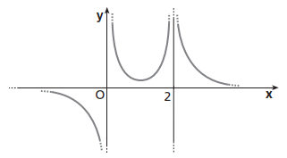
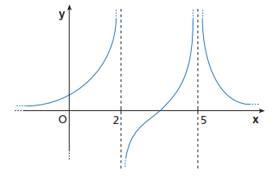
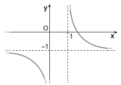
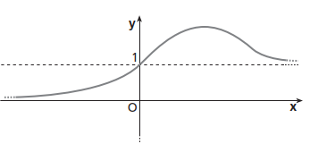
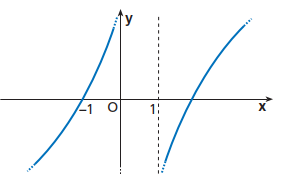
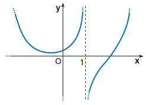

# Funzioni: Limiti e Continuità

### ESERCIZIO 1 - Limite finito per x tendente a valore finito

a) Verifica i limiti seguenti disegnando con una tabella di punti o con GEOGEBRA un grafico approssimativo della funzione in prossimità del valore di $x$.

1. $\displaystyle \lim_{x\to 1}(2-3x)=-1$;    $\displaystyle \lim_{x\to -3}(x+5)=2$;    $\displaystyle \lim_{x\to \frac{1}{2}}(4x-1)=1$;
2. $\displaystyle \lim_{x\to 0^+}\sqrt x = 0$;    $\displaystyle \lim_{x\to -1^-}(2x+3)=1$;    $\displaystyle \lim_{x\to 2^-} \sqrt{2-x} = 0$;

b) Data le funzioni seguenti
$$
f(x) = \begin{cases} 2x-4  & se \; x \ge 1 \\ 2 - x & se \; x \lt 1 \end{cases}
$$
$$
g(x) = \begin{cases} x^2 & se \; x \ge 0 \\ x^2 - 1 & se \; x \lt 0 \end{cases}
$$

verifica i limiti $\displaystyle \lim_{x\to 1^+}f(x) = -2$;    $\displaystyle \lim_{x\to 0^-}g(x) = 0$.

### ESERCIZIO 2 - Limite infinito per x tendente a valore finito

a) Verifica i limiti seguenti disegnando con una tabella di punti o con GEOGEBRA un grafico approssimativo della funzione in prossimità del valore di $x$.

1. $\displaystyle \lim_{x\to 0^+} \frac{1}{x} = +\infty$;   $\displaystyle \lim_{x\to 0} \dfrac{1}{x^2} = +\infty$;    $\displaystyle \lim_{x\to 0^+}-\dfrac{1}{4x^4} = -\infty$;

b) Dal grafico della funzione deduci i valori dei limiti richiesti.

1.  

   $\displaystyle \lim_{x\to 0} f(x) = ...$;  $\displaystyle \lim_{x\to 0^+} f(x) = ...$;  $\displaystyle \lim_{x\to 0^-} f(x) = ...$;  $\displaystyle \lim_{x\to 2^+} f(x) = ...$;  $\displaystyle \lim_{x\to 2^-} f(x) = ...$; 

c) La funzione rappresentata dal grafico della figura ha due asintoti verticali. Scrivi le loro equazioni e i limiti che li esprimono.

1.  

### ESERCIZIO 3 - Limite finito per x tendente a valore infinito

a) Verifica i limiti seguenti disegnando con una tabella di punti o con GEOGEBRA un grafico approssimativo della funzione per un insieme di valori di $x$ che tendano a $+\infty$ o $-\infty$.

1. $\displaystyle \lim_{x\to +\infty} \frac{2}{x+10} = 0$;    $\displaystyle \lim_{x\to +\infty} \dfrac{4x-1}{2x+1} = 2$;    $\displaystyle \lim_{x\to +\infty}\dfrac{1}{1+e^x} = 0$;

b) Dal grafico della funzione deduci i valori dei limiti richiesti.

1.  

  $\displaystyle \lim_{x\to ...} f(x) = -1^-$;  $\displaystyle \lim_{x\to \infty} f(x) = ...$;  $\displaystyle \lim_{x\to 1^+} f(x) = ...$.

2.  

  $\displaystyle \lim_{x\to \infty} f(x) = ...$;  $\displaystyle \lim_{x\to -\infty} f(x) = ...$;   $\displaystyle \lim_{x\to ...} f(x) = 1$.

### ESERCIZIO 4 - Limite infinito per x tendente a valore infinito

a) Verifica i limiti seguenti disegnando con una tabella di punti o con GEOGEBRA un grafico approssimativo della funzione per un insieme di valori di $x$ che tendano a $+\infty$ o $-\infty$.

1. $\displaystyle \lim_{x\to 0^+} \frac{1}{x} = +\infty$;    $\displaystyle \lim_{x\to 0} \dfrac{1}{x^2} = +\infty$;    $\displaystyle \lim_{x\to 0^+}-\dfrac{1}{4x^4} = -\infty$;

b) Dal grafico della funzione deduci i valori dei limiti richiesti.

1.  

  $\displaystyle \lim_{x\to -\infty} f(x) = ...$;  $\displaystyle \lim_{x\to +\infty} f(x) = ...$.

2.  

  $\displaystyle \lim_{x\to -\infty} f(x) = ...$;  $\displaystyle \lim_{x\to +\infty} f(x) = ...$;   $\displaystyle \lim_{x\to 1} f(x) = ...$.

### ESERCIZIO 5 - Definizione di Continuità

a) Quali delle funzioni rappresentate dai seguenti grafici non sono continue in $c$ e perché?

b)  Verifica se le funzioni riportate di seguito sono continue nel punto $x_0$ indicato.

1. $\displaystyle  f(x) = 4x + 3$,   $x_0 = -4$;      $\displaystyle  f(x) = x^2 - 6$,    $x_0 = -1$; 

3. $$
   f(x) = \begin{cases} x^2  & se \; x \lt 0 \\ 2x & se \; x \ge 0 \end{cases} 
   \,\,\,\,\,\,\,\,\,\,\,\,\,\,\,\,\,\,\,\,    x_0 = 0
   $$
   

### ESERCIZIO 6 - Tipi di Discontinuità

a) Classifica le discontinuità nei punti $x_0$ dei grafici seguenti.

b) Date le funzioni riportate di seguito, individua i loro punti di discontinuità e la relativa specie.

1. $f(x) = \dfrac{|x^2 - 16|}{x-4}$; 

2. $f(x) = \dfrac{x^2 - 1}{x-1}$; 

3. $$
   f(x) = \begin{cases} -x^2-1  & se \; x \lt 0 \\ 2x & se \; x \ge 0 \end{cases} \,\,\,\,\,\,\,\,\,\,\,\,\,\,\,\,\,\,\,\,    x_0 = 0
   $$

4. $$
   f(x) = \begin{cases} 2x  & se \; x \le 1 \\ \ln(x-1) & se \; x \gt 1 \end{cases} \,\,\,\,\,\,\,\,\,\,\,\,\,\,\,\,\,\,\,\,    x_0 = 0
   $$
