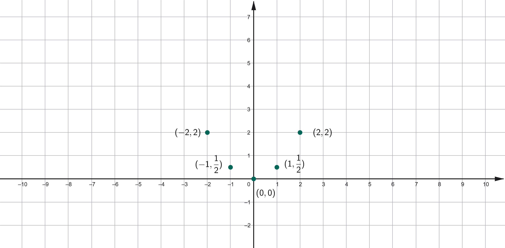
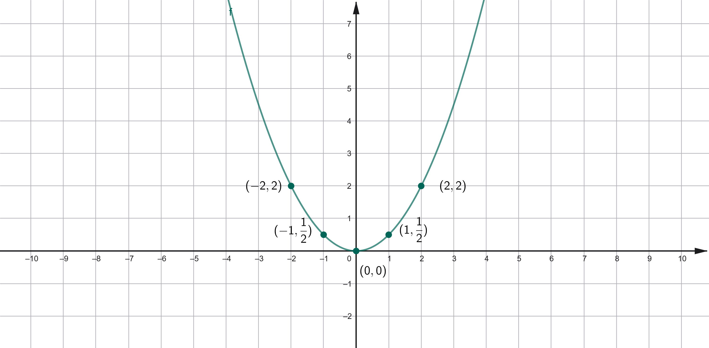
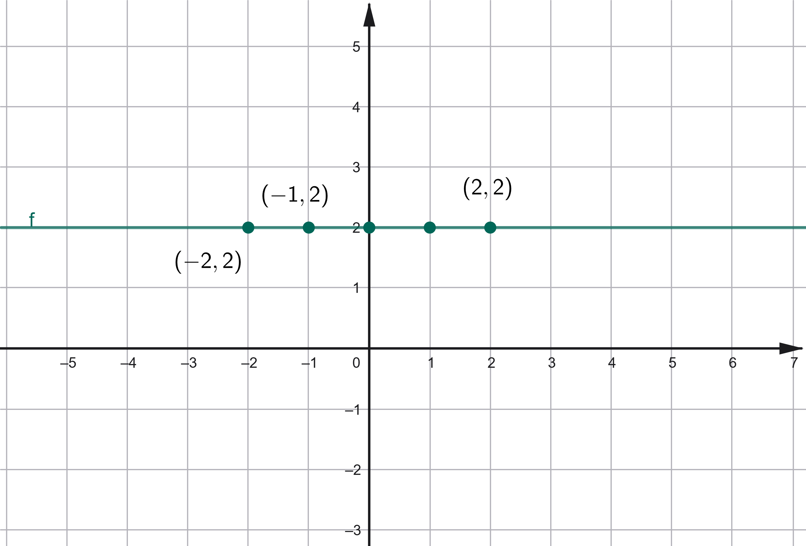
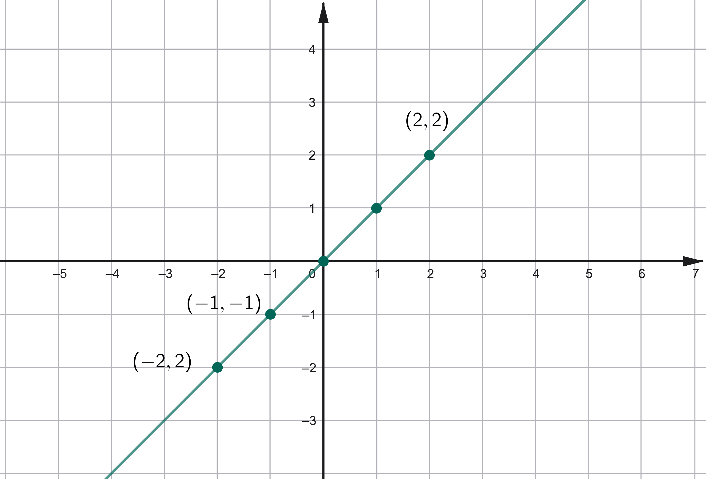
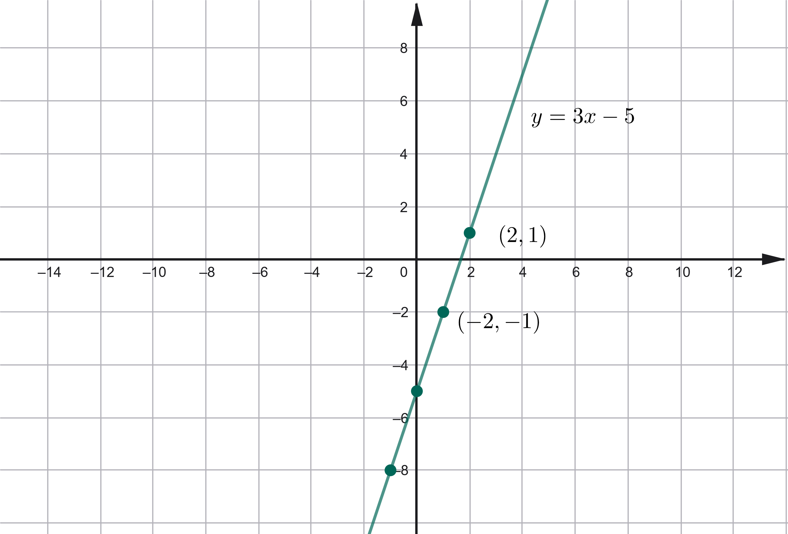
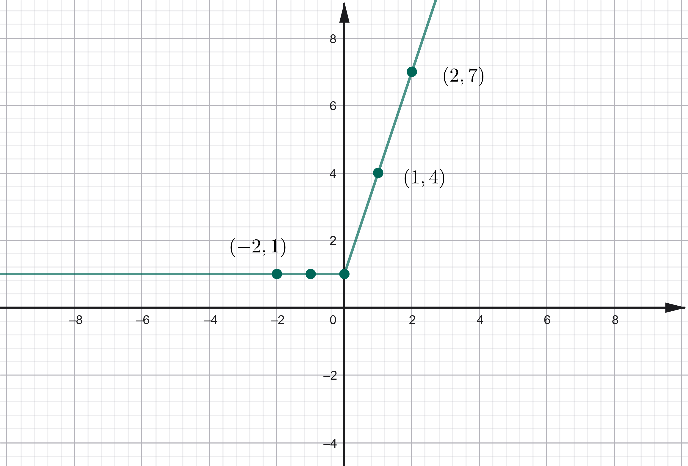
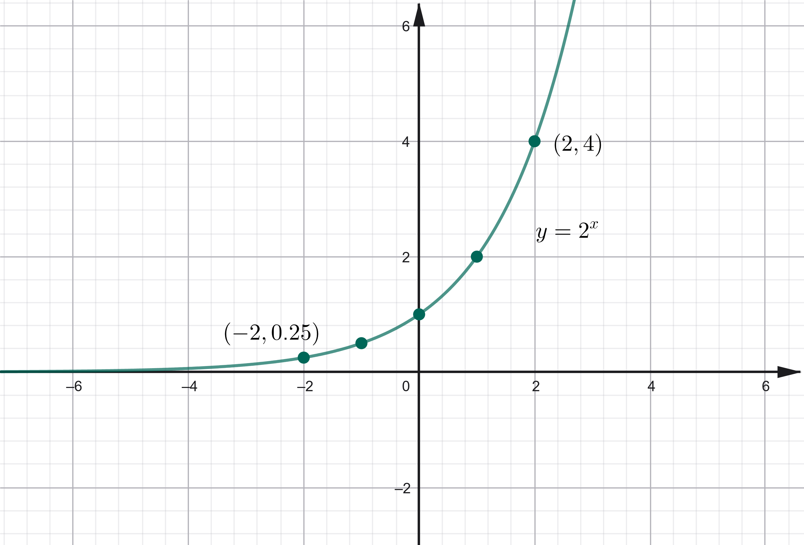
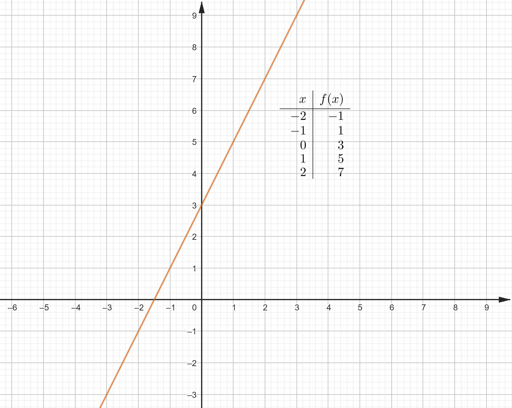
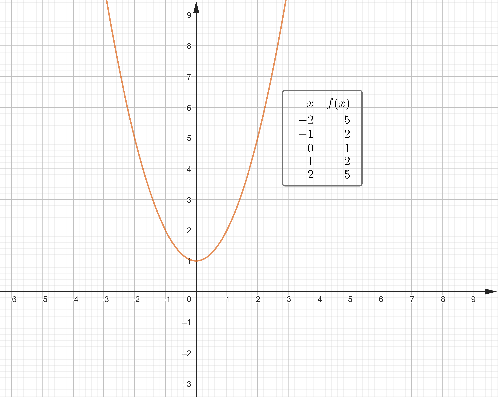

# Funzioni: Definizioni ed Esempi

## UNITA' 1: Definizione di funzione

Il concetto di funzione è uno dei più importanti in matematica. Serve a rappresentare il legame, ossia la relazione, che c'è tra due quantità, a calcolare quanto vale la seconda quando la prima ha un certo valore. Facciamo un esempio.

#### ESEMPIO 1

Andiamo in macchina da Latina a Roma ad una velocità media di $90 \; Km$. Quanti chilometri abbiamo fatto dopo un quarto d'ora? e dopo $20$ minuti? e dopo mezz'ora?

Rispondere a queste domande significa mettere in relazione la posizione della macchina sulla Pontina, in particolare la distanza da Latina, con il tempo che passa da quando la macchina è partita, ossia la durata del viaggio: più il tempo passa e più la distanza aumenta, ma come facciamo a calcolare la distanza?

Se indichiamo con la lettera $x$ il tempo trascorso dalla partenza e con la lettera $y$ la distanza da Latina, abbiamo che il calcolo della distanza è dato da $90 \cdot x$, ossia
$$
y = 90 \cdot x
$$
Misurando il tempo in ore, abbiamo che un quarto d'ora è $0.25$ ore, venti minuti sono $0.33$ ore e mezz'ora $0.5$ ore, per cui le distanze sono
$$
\begin{array}{c|c}
\hline\textbf{Durata (h) } & \textbf{Distanza (Km)} \\
\hline
0.25 & 22.5 \\
0.33 & 29.7 \\
0.5 & 45 \\
\end{array}
$$

Come si vede all'aumentare della durata aumenta la distanza.    $\bullet$

Questo è un esempio di **funzione**, ossia di regola o legge che lega una quantità, nel nostro caso la durata del viaggio, detta **indipendente**, ad un altra, la distanza dal punto di partenza, detta **dipendente**, perché quanto vale dipende da quanto vale la prima e precisamente è $90$ volte il valore della prima: la regola di calcolo è la moltiplicazione $90 \cdot x$.

Spesso è utile dare anche un nome o etichetta alle funzioni: se questa funzione la chiamiamo con la lettera $f$, si scrive $f(x) = 90 \cdot x$. Allora abbiamo 
$$
\begin{array}{c|c}
\hline\textbf{Durata (h) } & \textbf{Distanza (Km)} \\
x & y = f(x)\\
\hline
0.25 & 22.5 = f(0.25) \\
0.33 & 29.7 = f(0.33) \\
0.5 & 45 = f(0.5) \\
\end{array}
$$

Il calcolo si fa sostituendo alla lettera $x$ dell'espressione i corrispondenti numeri, quindi, ad esempio 

a) $f(0.33) = 90 \cdot x, \{x = 0.33\}$; 

b) $f(0.33) = 90 \cdot 0.33$;

c) $f(0.33) = 29.7$.

Non sempre l'espressione che definisce una funzione è così semplice; potrebbe essere costruita con un prodotto ed una somma come ad esempio $2\cdot x + 10$ oppure il quadrato di un numero come $x^2$ o una frazione, ad esempio $\dfrac{1}{x}$. 

In ogni caso una tabella come quella di sopra rappresenta una funzione, che è sempre data da un insieme di **coppie di numeri**: il primo numero riguarda la variabile indipendente, la $x$, ed il secondo la variabile dipendente, $f(x)$.

$$
\begin{array}{r|l}
x & y = x^2\\
\hline
0 & 0 = f(0) \\
1 & 1 = f(1) \\
-1 & 1 = f(-1) \\
2 & 4 = f(2) \\
-2 & 4 = f(-2) \\
\end{array}
$$

Le coppie di numeri della funzione possono essere scritte in forma di tabella, come nel caso di sopra, come **insieme di coppie**, ad esempio:
$$
F = \{(0,0), (1,1), (-1, 1), (2, 4), (-2, -4)\}
$$
La funzione può essere rappresentata in un grafico **grafico cartesiano**. Ogni punto viene posizionato sul grafico e l'ascissa del punto (la $x$) rappresenta il punto del dominio, l'ordinata (la $y$) rappresenta il **valore della funzione**, che risulta quindi **l'altezza del punto rispetto all'asse orizzontale,** come nella figura seguente che riporta sul piano cartesiano gli stessi valori del campione.

Una funzione può quindi essere definita in vari modi, ad esempio con una espressione, con una tabella con un insieme di coppie o con un grafico cartesiano. Questi sono tutti modi in cui associamo a dei valori della variabile indipendente i corrispondenti valori della variabile dipendente. 

Non tutte le associazioni sono però funzioni: **una funzione associa ad un valore della variabile indipendente uno ed un solo valore della dipendente**.

Quindi tutti gli esempi visti finora sono funzioni, ma quella definita dal grafico seguente non lo è perché ad $x = -1$ associa sia $y=1$ che $y = 2$.

Osserviamo da ultimo che una funzione, ad esempio $f(x) = \dfrac{1}{2}x^2$ può anche essere scritta con la notazione $x \rightarrow \dfrac{1}{2}x^2$ dove la freccia indica proprio che ad un valore di $x$ viene associato quello ricavato dal calcolo di $\dfrac{1}{2}x^2$ attraverso una sostituzione.

### ESERCIZIO 1.1 - Definizione di Funzione

a) Determina quali dei seguenti insiemi di coppie cartesiane definisce una funzione e rappresenta l'insieme in forma tabellare e cartesiana.

1. $\{(1, 3), (2, 5), (3, 7), (4, 8)\}$;
2. $\{(2, 1), (3, 3), (2, 5), (4, 7)\}$;
3. $\{(0, -2), (2, -2), (4, 6), (6, 6)\}$.

b) Determina quali delle seguenti tabelle definisce una funzione $y=f(x)$ e rappresenta le tabelle in forma grafica cartesiana.

 

c) Disegna in un grafico cartesiano un insieme di punti che non corrisponde ad una funzione.

## UNITA' 2: Dominio di funzioni

Se consideriamo una funzione, ad esempio quella vista nell'unità precedente:
$$
\begin{array}{r|l}
x & y = x^2\\
\hline
0 & 0 = f(0) \\
1 & 1 = f(1) \\
-1 & 1 = f(-1) \\
2 & 4 = f(2) \\
-2 & 4 = f(-2) \\
\end{array}
$$
l'insieme dei numeri, o valori, che prende di volta in volta la $x$ è detto **dominio della funzione**. Quindi il dominio della funzione che abbiamo chiamato $f$ è l'insieme seguente che potremmo chiamare $D_f$:
$$
D_f = \{0, 1, -1, 2, -2\}
$$
I numeri che fanno parte del dominio vengono anche chiamati **punti del dominio** e quindi **punti della funzione**. I numeri che calcoliamo per la $y$, associati a quelli del dominio, vengono chiamati **valori della funzione**. Il loro insieme è chiamato **codominio della funzione**. Il codominio è un insieme di valori che possiamo indicare con $C_f$ e nell'esempio precedente è: 
$$
C_f = \{0, 1, 4\}
$$
Consideriamo ora solo l'espressione che abbiamo usato per definire la funzione $f$, ossia $x^2$; vediamo che con essa si possono calcolare molti altri valori, come $-5$, $30$, $-100$ e così via. Praticamente di tutti i numeri che conosciamo può essere calcolato il quadrato, e questo insieme, cioè tutti i possibili numeri utilizzabili per calcolare l'espressione viene chiamato **dominio naturale dell'espressione**. Quindi il dominio naturale di $f(x) = x^2$ sono tutti i numeri reali ossia $\mathbb{R} = (-\infty, +\infty)$.

L'espressione $\dfrac{1}{x}$ può essere calcolata sostituendo ad $x$ tutti i numeri tranne lo zero, quindi il dominio naturale sarà $(-\infty, 0) \cup (0, +\infty)$, analogamente $\sqrt{x}$ può essere calcolata solo sostituendo ad $x$ numeri positivi ed il dominio è quindi l'intervallo $[0, +\infty)$.

Consideriamo ora una funzione che ha come dominio tutti i numeri, ad esempio $f(x) = \dfrac{1}{2}x^2$. I valori che possiamo dare alla $x$ sono infiniti e quindi se volessimo scrivere una tabella dei suoi valori la tabella sarebbe infinita.

Poiché è impossibile scrivere una tabella infinita, si sceglie un **campione di punti del dominio**, ad esempio $\{0, 1, -1, 2, -2\}$ e su questo campione si calcola il valore ottenendo una tabella come quella seguente.
$$
\begin{array}{r|l}
x & y = \dfrac{1}{2}x^2\\
\hline
0 & 0 = f(0) \\
1 & \dfrac{1}{2} = f(1) \\
-1 & \dfrac{1}{2} = f(-1) \\
2 & 2 = f(2) \\
-2 & 2 = f(-2) \\
\end{array}
$$
Rappresentando il campione su un grafico cartesiano abbiamo il disegno seguente:

Se volessimo rappresentare le infinite coppie della funzione corrispondenti agli infiniti valori del dominio avremmo la figura seguente, dove i punti sono sulla linea verde.

### ESERCIZIO 2.1 - Dominio naturale di funzioni

a) Determina il dominio naturale delle funzioni seguenti.

1. $y = \dfrac{1}{2x}$;    2. $y = \dfrac{1}{2}x$;    3. $y = x^2+1$;

b) Determina il dominio naturale delle funzioni seguenti.

1. $y = 1$;    2. $y = \dfrac{1 + x}{x}$;    3. $y = \sqrt{x+1}$;

c) Determina il dominio delle funzioni seguenti.

1. $y = \sqrt{|x|}$;    2. $y = \dfrac{1}{\sqrt{x}}$;    3. $y = \sqrt{x^2+1}$;

d) Determina il dominio delle funzioni seguenti rappresentate con dei grafici cartesiani.

## UNITA' 3: Esempi di Funzioni

In questo capitolo vediamo alcuni esempi di importanti categorie di funzioni.

### Funzioni costanti e funzione identica

Le funzioni più semplici che esistono sono probabilmente le funzioni costanti e la funzione identica.

Una funzione è costante se al cambiare del valore della $x$ non cambia ed è sempre uguale ad un numero fissato, ad esempio $y = 2$ oppure $y = -1$. Il suo grafico cartesiano ha la forma di una retta orizzontale che ha altezza pari al valore della funzione.

La funzione identica associa ad ogni numero (nel dominio) il numero stesso (nel codominio), cioè $y = x$. Il suo grafico è una retta inclinata di $45^o$.

### Funzioni lineari

Una funzione tra due grandezze $x$ ed $y$ si dice "lineare" se l'espressione che definisce la funzione è un polinomio di primo grado nella grandezza indipendente $x$​, come nel caso dell'equazione seguente:
$$
y = 3x -5
$$
ed in generale
$$
y = mx+q
$$
dove $m$ e $q$ sono due numeri.

Si chiamano "lineari" perché l'equazione che le definisce è uguale a quella di una retta in forma esplicita ed il loro grafico in un piano cartesiano è una retta.

#### ESEMPIO 1

Una palestra applica i prezzi seguenti: per entrare bisogna iscriversi e l'iscrizione costa $40$ euro a semestre; ogni ingresso poi costa $12$ euro. Scrivi la formula che calcola il costo semestrale al variare del numero di ingressi $x$.

Il calcolo del costo è dato dalla funzione $f(x) = 40 + 12x$, che ha i valori riportati nella tabella seguente.    $\bullet$
$$
\begin{array}{c|c|c}
\hline
\textbf{Caso } & \textbf{N. Ingressi } & \textbf{Costo} \\
& x & f(x) = 40 +12x \\ 
\hline 
1 & 5 & 100 \\ 
2 & 10 & 160 \\ 
3 & 15 & 220 \\  
4 & 20 &  280 \\  
5 & 25 &  340 \\  
\end{array}
$$

Le funzioni lineari hanno l'importante caratteristica che la differenza tra due valori della $y$ è direttamente proporzionale alla differenza tra i corrispondenti valori della $x$, ed è pari ad $m$​. Vediamolo con un esempio.

#### ESEMPIO 2

Riprendiamo l'esempio precedente. Se consideriamo la differenza tra $5$ e $15$ ingressi ($10$ ingressi, $\Delta x = x_3 - x_1 \longrightarrow 15 - 5 = 10$), il costo passa da $100$ a $220$ euro, con un aumento di $\Delta y = y_3 - y_1 \longrightarrow 220 - 100 = 120$ euro; il rapporto tra i due incrementi è $\dfrac{\Delta y}{\Delta x} = \dfrac{120}{10} = 12$. 

Lo stesso calcolo tra $10$ e $25$ ingressi ($\Delta x = x_5 - x_2 \longrightarrow 25 - 10 = 15$ ingressi), comporta un incremento di costo da $160$ a $340$ euro, ossia $180$ euro ($\Delta y = y_5 - y_2 \longrightarrow 340 - 160 = 180$) ed il rapporto è sempre $\dfrac{\Delta y}{\Delta x} = \dfrac{180}{15} = 12$, ossia è costante ed è pari al costo unitario dell'ingresso, che è $12$ euro.    $\bullet$

### Funzioni definite a tratti

Ci sono casi in cui per definire una funzione servono due espressioni diverse, che saranno calcolate su due insiemi di numeri diversi del dominio. Facciamo l'esempio di una funzione costante che vale $1$ su tutti i numeri negativi ed è lineare $x \rightarrow 3x + 1$ sui numeri positivi. La funzione sarà scritta così:

$$
f(x) = 
\begin{cases} 
1  & se\; x\; \lt 0 \\ 
3x+1 & se\; x\; \ge 0 
\end{cases}
$$

Il grafico è il seguente.

### Funzioni Esponenziali

Si chiamano esponenziali le funzioni la cui espressione che le definisce è una potenza e la variabile indipendente compare all'esponente, come ad esempio $x \rightarrow y = 2^x$ oppure $x \rightarrow y = 5^x$.

Il valori si possono calcolare facilmente solo per i punti interi del dominio; se l'argomento è decimale serve la calcolatrice. Il grafico ha la forma seguente.

I valori della funzione diventano subito molto grandi per $x = 5$, $x = 10$, mentre diventano molto piccoli (ma positivi) per $x$ negative come $x = -5$, $x = -10$.

### Funzioni Logaritmiche

 

### ESERCIZIO 3.1 - Funzioni lineari

a) Costruisci una tabella ed un grafico cartesiano assegnando cinque numeri a scelta (positivi e negativi) a $x$ per ciascuna delle funzioni riportate di seguito:

1. $f(x) = x$;
2. $f(x) = -x$;
3. $f(x) = \dfrac{1}{2} x$;
4. $f(x) = -2x +1$;
5. $f(x) = 4x$.

b) Individua quali delle funzioni sono crescenti e quali decrescenti.

### ESERCIZIO 3.2 - Le funzioni definite a tratti

a) Calcola il valore della funzione seguente per $n \in \{0, 1, -1, 2, -2, 3, -3, 4, -4\}$: 
$$
f(n) = 
\begin{cases} 
1  & se\; n\; \lt 0 \\ 
3n+1 & se\; n\; \ge 0 
\end{cases}
$$

b) Disegna un grafico della funzione seguente.
$$
f(x) = \begin{cases} 
-x-1  & se \; x \le -1 \\ 
0 & se \; -1 \lt x \le 1 \\
x -1 & se \; 1 \lt x
\end{cases}
$$

### ESERCIZIO 3.3 - Funzioni Esponenziali e Logaritmiche

a) Per ciascuna delle funzioni seguenti disegna un grafico approssimativo costruendo una tabella di punti dopo aver determinato il dominio.

1. $y = 2^x$;   $y = 3^x$;   $y = 2^x-5$; 
2. $y = e^x$;   $y = 5\cdot e^x$;   $y = e^{2x}$; 
3. $y = ln(x)$;   $y = ln(x) + 2$;   $y = ln(2x)$; 
4. $y = ln(|x|)$;   $y = ln(x^2)$;   $y = -ln(x)$; 

## UNITA' 4: Crescenza, decrescenza, massimi e minimi

Un concetto molto importante nell'analisi di una funzione è quello di della sua "crescenza" e "decrescenza". Una funzione si dice **crescente** in un intervallo di numeri, ad esempio tra $-2$ e $2$,  $[-2, 2]$ se passando da un valore della $x$ in $[-2, 2]$ ad un altro più grande, il valore della funzione $f(x)$ aumenta; si dice **decrescente** se, sempre passando da un valore della $x$ in $[-2, 2]$ ad un altro più grande, il valore della funzione $f(x)$ diminuisce. Vediamo un esempio.

#### ESEMPIO 1

La funzione $f(x) = 2x+ 3$ ha i valori riportati di seguito:

Come si vede dal campione di valori in tabella e dall'esame del grafico, la funzione ha come dominio naturale tutti i numeri (reali) ed è crescente in tutto l'intervallo $(-\infty, +\infty)$.

La funzione $f(x) = x^2 + 1$:

ha come dominio naturale tutti i numeri (reali) ed è decrescente a sinistra dello zero, nell'intervallo $(-\infty, 0)$, e crescente in $[0, \infty)$.    $\bullet$

Se una funzione, come $f(x) = x^2 + 1$, decresce a sinistra di un punto del dominio, ad esempio $x = 0$ e cresce a destra, si dice che quello è un  **punto di minimo**. Se chiamiamo $x_{min}$ il punto di minimo, $f(x_{min})$ è il **valore minimo** della funzione. Questo significa che ci sarà almeno un intervallo intorno ad $x_{min}$ in cui $f(x_{min})$ è il valore più basso della funzione nell'intervallo.

#### ESEMPIO 2

Nella funzione $f(x) = x^2 + 1$ consideriamo il punto $x = 0$, il valore $f(0) = 1$ ed un intervallo intorno a $0$, ad esempio $(-0.5, +0.5)$. Abbiamo che qualsiasi numero $x \in (-0.5, +0.5)$ la funzione è minore di $f(0)$. In simboli:
$$
f(x) \le f(0)
$$
$x = 0$ è un punto di minimo e $f(0) = 1$ è il valore minimo della funzione.    $\bullet$

### ESERCIZIO 4.1

a) Individua quali delle funzioni dell'esercizio 3.1 sono crescenti e quali decrescenti.

## UNITA' 5: Funzioni composte e funzioni inverse

### ESERCIZIO 5.1 - Funzioni Composte

a) Per ciascuno dei punti seguenti scrivi le due funzioni composte $f(g(x))$ e $g(f(x))$ e disegna il grafico di ciascuna.

1. $f(x)=x^2$,   $g(x)=2x-1$;
2. $f(x)=x+12$,   $g(x)=x-3$;
3. $f(x)=2^x$,   $g(x)=-x^2$.

