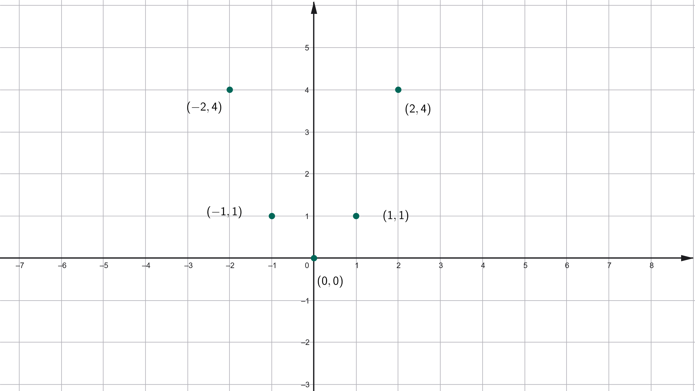
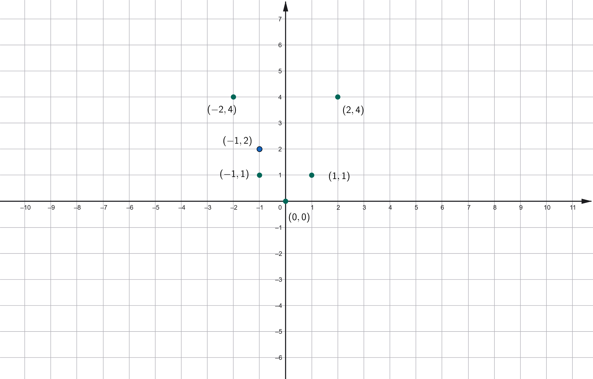

# Funzioni: Definizioni ed Esempi

## UNITA' 1: Definizione di funzione

Il concetto di funzione è uno dei più importanti in matematica. Serve a rappresentare il legame, ossia la relazione che c'è tra due quantità, ossia a calcolare quanto vale la seconda quando la prima ha un certo valore. Facciamo un esempio.

#### ESEMPIO 1

Andiamo in macchina da Latina a Roma ad una velocità media di $90 \; Km$. Quanti chilometri abbiamo fatto dopo un quarto d'ora? e dopo $20$ minuti? e dopo mezz'ora?

Rispondere a queste domande significa mettere in relazione la posizione della macchina sulla Pontina, in particolare la distanza da Latina, con il tempo che passa da quando la macchina è partita, ossia la durata del viaggio: più il tempo passa e più la distanza aumenta, ma come facciamo a calcolare la distanza?

Se indichiamo con la lettera $x$ il tempo trascorso dalla partenza e con la lettera $y$ la distanza da Latina, abbiamo che il calcolo della distanza è dato da $90 \cdot x$, ossia
$$
y = 90 \cdot x
$$
Misurando il tempo in ore, abbiamo che un quarto d'ora è $0.25$ ore, venti minuti sono $0.33$ ore e mezz'ora $0.5$ ore, per cui le distanze sono
$$
\begin{array}{c|c}
\hline\textbf{Durata (h) } & \textbf{Distanza (Km)} \\
\hline
0.25 & 22.5 \\
0.33 & 29.7 \\
0.5 & 45 \\
\end{array}
$$

Come si vede all'aumentare della durata aumenta la distanza.    $\bullet$

Questo è un esempio di **funzione**, ossia di regola o legge che lega una quantità, nel nostro caso la durata del viaggio, detta **indipendente**, ad un altra, la distanza dal punto di partenza, detta **dipendente**, perché quanto vale dipende da quanto vale la prima e precisamente è $90$ volte il valore della prima: la regola di calcolo è la moltiplicazione $90 \cdot x$.

Spesso è utile dare anche un nome o etichetta alle funzioni: se questa funzione la chiamiamo $f$, si scrive $f(x) = 90 \cdot x$. Allora abbiamo 
$$
\begin{array}{c|c}
\hline\textbf{Durata (h) } & \textbf{Distanza (Km)} \\
x & y = f(x)\\
\hline
0.25 & 22.5 = f(0.25) \\
0.33 & 29.7 = f(0.33) \\
0.5 & 45 = f(0.5) \\
\end{array}
$$

Non sempre l'espressione che definisce una funzione è così semplice; potrebbe essere costruita con un prodotto ed una somma come ad esempio $2\cdot x + 10$ oppure il quadrato di un numero come $x^2$ o una frazione, ad esempio $\dfrac{1}{x}$. 

In ogni caso una tabella come quella di sopra rappresenta il calcolo di un **campione di valori della funzione**, che sono dati da una **coppia di numeri**: il primo riguarda la variabile indipendente, la $x$, ed il secondo la variabile dipendente, $f(x)$.

$$
\begin{array}{r|l}
x & y = x^2\\
\hline
0 & 0 = f(0) \\
1 & 1 = f(1) \\
-1 & 1 = f(-1) \\
2 & 4 = f(2) \\
-2 & 4 = f(-2) \\
\end{array}
$$

Le coppie di numeri del campione, nel caso precedente un campione di $5$ elementi, possono essere rappresentate in forma di tabella, come nel caso di sopra, come **insieme di coppie**, ad esempio:
$$
F = \{(0,0), (1,1), (-1, 1), (2, 4), (-2, -4)\}
$$
o come **grafico cartesiano**, dove sull'asse orizzontale si posizionano i valori della variabile indipendente e su quello verticale i valori della variabile dipendente, come nella figura seguente che riporta sul piano cartesiano gli stessi valori del campione.

Una funzione può essere definita in vari modi, ad esempio con una espressione, con una tabella con un insieme di coppie o con un grafico cartesiano. Questi sono tutti modi in cui associamo a dei valori della variabile indipendente, i corrispondenti valori della variabile dipendente. Non tutte le associazioni sono però funzioni: una funzione associa ad un valore della variabile indipendente uno ed un solo valore della dipendente.

Quindi tutti gli esempi visti sono funzioni, ma quello definito dal grafico seguente non lo è perché ad $x = -1$ associa sia $y=1$ che $y = 2$.

### ESERCIZIO 1 - Definizione di Funzione

a) Determina quali dei seguenti insiemi di coppie cartesiane definisce una funzione (per la coppia $(x, y)$ la funzione è $y=f(x)$.) e rappresenta la funzione in forma tabellare e cartesiana

1. $\{(1, 3), (2, 5), (3, 7), (4, 8)\}$;
2. $\{(2, 1), (3, 3), (2, 5), (4, 7)\}$;
3. $\{(0, -2), (2, -2), (4, 6), (6, 6)\}$.

b) Determina quali delle seguenti tabelle definisce una funzione $y=f(x)$ e rappresenta le tabelle in forma grafica cartesiana.

 

c) Disegna in un grafico cartesiano un insieme di punti che non corrisponde al grafico di una funzione.

## UNITA' 2: Dominio di funzioni

Se consideriamo una funzione, ad esempio quella vista nell'unità precedente:
$$
\begin{array}{r|l}
x & y = x^2\\
\hline
0 & 0 = f(0) \\
1 & 1 = f(1) \\
-1 & 1 = f(-1) \\
2 & 4 = f(2) \\
-2 & 4 = f(-2) \\
\end{array}
$$
l'insieme dei numeri, o valori, che prende di volta in volta la $x$ è detto **dominio della funzione**. Quindi il dominio della funzione che abbiamo chiamato $f$ è l'insieme seguente che potremmo chiamare $D_f$:
$$
D_f = \{0, 1, -1, 2, -2\}
$$
I valori che diamo alla $y$, associati a quelli del dominio, detti **codominio della funzione**. Il codominio è un insieme che possiamo indicare con $C_f$: 
$$
C_f = \{0, 1, 4\}
$$
Se consideriamo però solo l'espressione che abbiamo usato per definire la funzione $f$, ossia $x^2$, vediamo che può calcolare molti altri valori, come $-5$, $30$, $-100$ e così via. Praticamente di tutti i numeri che conosciamo può essere calcolato il quadrato, e questo insieme, cioè tutti i possibili numeri utilizzabili per calcolare l'espressione viene chiamato dominio naturale dell'espressione. Quindi il dominio naturale di $f(x) = x^2$ sono tutti i numeri reali ossia $\mathbb{R} = (-\infty, +\infty)$.

L'espressione $\dfrac{1}{x}$ può essere calcolata sostituendo ad $x$ tutti i numeri tranne lo zero, quindi il dominio naturale sarà $(-\infty, 0) \cup (0, +\infty)$, analogamente $\sqrt{x}$ può essere calcolata solo sostituendo ad $x$ numeri positivi ed il dominio è l'intervallo $[0, +\infty)$.

### ESERCIZIO 2 - Dominio naturale di funzioni

a) Determina il dominio naturale delle funzioni seguenti.

1. $y = \dfrac{1}{2x}$;    2. $y = \dfrac{1}{2}x$;    3. $y = x^2+1$;

b) Determina il dominio naturale delle funzioni seguenti.

1. $y = 1$;    2. $y = \dfrac{1 + x}{x}$;    3. $y = \sqrt{x+1}$;

c) Determina il dominio delle funzioni seguenti.

1. $y = \sqrt{|x|}$;    2. $y = \dfrac{1}{\sqrt{x}}$;    3. $y = \sqrt{x^2+1}$;

d) Determina il dominio delle funzioni seguenti rappresentate con dei grafici cartesiani.

## UNITA' 2: Le Funzioni Esponenziali e Logaritmiche

### ESERCIZIO 3 - Funzioni Esponenziali e Logaritmiche

a) Per ciascuna delle funzioni seguenti disegna un grafico approssimativo costruendo una tabella di punti dopo aver determinato il dominio.

1. $y = 2^x$;   $y = 3^x$;   $y = 2^x-5$; 
2. $y = e^x$;   $y = 5\cdot e^x$;   $y = e^{2x}$; 
3. $y = ln(x)$;   $y = ln(x) + 2$;   $y = ln(2x)$; 
4. $y = ln(|x|)$;   $y = ln(x^2)$;   $y = -ln(x)$; 

### ESERCIZIO 4 - Funzioni Composte

a) Per ciascuno dei punti seguenti scrivi le due funzioni composte $f(g(x))$ e $g(f(x))$ e disegna il grafico di ciascuna.

1. $f(x)=x^2$,   $g(x)=2x-1$;
2. $f(x)=x+12$,   $g(x)=x-3$;
3. $f(x)=2^x$,   $g(x)=-x^2$.
