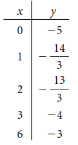
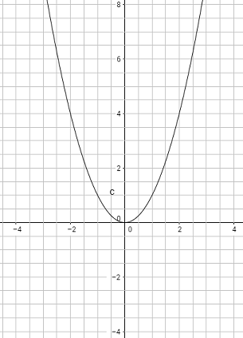
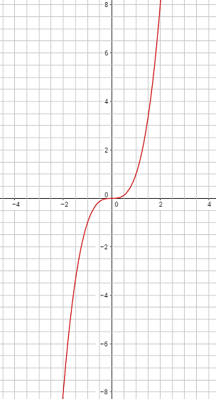
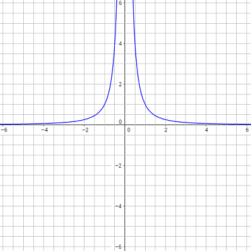
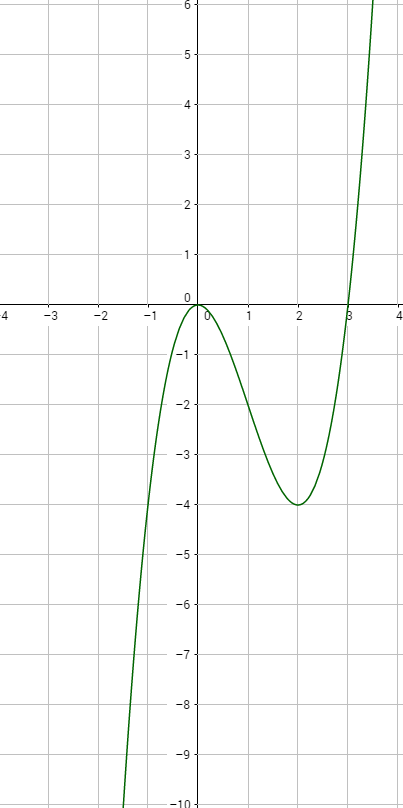

# Funzioni e Grafici

### ESERCIZIO 1: Definizione di funzione

a) Una agenzia di noleggio auto fa pagare per una automobile 50 euro al giorno più 32 centesimi a Km percorso. Il costo giornaliero dell'auto è quindi una funzione del numero di Km calcolato da $c(x) = 0,32x + 50$. Calcola c(75), c(150), c(225) e c(650).

b) Calcola il valore della funzione definita dall'espressione $x^2$ per i punti del dominio indicati nella tabella seguente.
$$
\begin{array}{r|c} 
x & y = x^2 \\ 
\hline 
0 & ... \\ 
1 &  ...\\ 
-1 & ... \\  
2 &  ...\\  
-2 & ...\\  
\end{array}
$$

c) Calcola il valore della funzione definita dall'espressione $\dfrac{1}{1-x}$ per i punti del dominio indicati nella tabella del punto b).

d) Determina quali dei seguenti insiemi di coppie cartesiane definisce una funzione

1. {(1, 3), (2, 5), (3, 7), (4, 8)}
2. {(2, 1), (3, 3), (2, 5), (4, 7)}
3. {(0, -2), (2, -2), (4, 6), (6, 6)}

#### Laboratorio

a) Risolvi il punto a) dell'esercizio con la sequenza di comandi GEOGEBRA:

1. $c(x) := 0.32x + 50$ &#9166; 
2. $\{c(75), c(150), c(225), c(650)\}$ &#9166; . 

b) Risolvi il punto b) dell'esercizio con la sequenza di comandi GEOGEBRA:

1. $d = \{0, 1, -1, 2, -2\}$ &#9166; 
2. $Compatta( \{k,k^2+1\}, k, d )$ &#9166; . 

c) Risolvi il punto c) dell'esercizio modificando la funzione nel comando del punto b) del laboratorio.

### ESERCIZIO 2 - Proporzionalità diretta ed inversa

a) La retribuzione di Andrea varia proporzionalmente al numero delle ore che lavora. Se per 38 ore viene pagato 475 euro, quanto prenderà se lavora 30 ore? 

b) Il tempo necessario ad una auto per raggiungere una destinazione varia inversamente alla velocità tenta durante il viaggio. Se viaggia 4 ore ad 80 Km l'ora per raggiungere la destinazione, quanto tempo impiegherà a 60 Km l'ora?

c) I litri di vernice necessari per imbiancare una stanza variano direttamente con il numero di metri quadri delle pareti. Una parete di 16 metri quadrati richiede due litri di vernice. Quanta vernice è necessaria per una parete di 6 m^2^ ?

d) La dose (in milligrammi) raccomandata di Demerol, un medicinale preoperatorio per bambini, varia direttamente con il peso (in Kg) del paziente. Se la dose per un paziente di 30 Kg è di 18 mg, quale è la dose per un bambino di 45 Kg?  

### ESERCIZIO 3 - Formule della proporzionalità

a) Esprimere le relazioni seguenti con una formula dopo aver scelto le lettere che rappresentano le quantità:

1. L'ammontare dell'IVA da pagare (aliquota 22%) varia direttamente con il costo (imponibile) di acquisto di una macchina.
2. Le ore impiegate da un pendolare per recarsi da casa al posto di lavoro variano inversamente alla velocità (media) di percorrenza del tragitto.
3. L'ammontare dell'IVA (al 22%) ed il prezzo (IVA inclusa) di acquisto di una macchina.

### ESERCIZIO 4 - Funzioni numeriche
Costruire una tabella assegnando cinque valori (positivi e negativi) a x per ciascuna delle funzioni riportate di seguito:

a) y = x;

b) y = -x;

c) y = 1/2 x;

d) y = 2x +1;

e) y = 4x

#### Laboratorio

a) Risolvi i punti a), b) e d) dell'esercizio con i seguenti comandi GEOGEBRA, cambiando di volta in volta la funzione $f(x)$:

1. $f(x) := x$ &#9166; 
2. $d = \{0, 1, -1, 2, -2\}$ &#9166; 
3. $Compatta( \{x,f(x)\}, x, d )$ &#9166;

b) In riferimento all'esercizio "STAMPA LIBRI DI TESTO":

1. Scrivere due espressioni algebriche (con la sola variabile x che indica il numero di copie) che calcolano il costo effettivo della stampa;
2. Disegna il grafico della funzione ottenuta dalla espressione.

a) In riferimento all'esercizio "QUOTA ISCRIZIONE":
1. Scrivere una espressione algebrica (variabile x: Numero settimane di ritardo) che calcola il costo effettivo analogamente ai dati nella tabella del punto 3;  
2. Disegnare il grafico della funzione ottenuta dalla espressione.

### ESERCIZIO 5 - La funzione lineare
Date le seguenti tabelle, stabilisci se tra x e y c’è una dipendenza lineare. In caso affermativo, scrivi la corrispondente funzione e rappresentala nel piano cartesiano.

        

### ESERCIZIO 6 - La funzione valore assoluto

Per ogni funzione costruisci una tabella con cinque valori di x (positivi, negativi o nulli) e rappresenta il grafico

a) y = 2|x|;

b) y = 1 + |x|;

c) y = -2|x|

#### Laboratorio

a) Risolvi il punto a) dell'esercizio con i seguenti comandi GEOGEBRA:

1. $\{\{0, abs(0)\}, \{1, abs(1)\}, \{-1, abs(-1)\}, \{2, abs(2)\}, \{-2, abs(-2)\}\}$.
2. $\{(0, abs(0)), (1, abs(1)), (-1, abs(-1)), (2, abs(2)), (-2, abs(-2))\}$

b) Risolvi il punto b) dell'esercizio con la seguente sequenza di comandi GEOGEBRA:

1. $f(x) := 1 + abs(x)$ &#9166; 
2. $d = \{0, 1, -1, 2, -2\}$ &#9166; 
3. $Compatta( \{x,f(x)\}, x, d )$ &#9166;
4. $Compatta((x,f(x)), x, d )$ &#9166;

### ESERCIZIO 7 - Le funzioni definite a tratti

a) Calcola il valore della funzione seguente per $n \in \{0, 1, -1, 2, -2, 3, -3, 4, -4\}$: 
$$
f(n) = 
\begin{cases} 
1  & se\; n\; \lt 0 \\ 
3n+1 & se\; n\; \ge 0 
\end{cases}
$$

b) Disegna un grafico della funzione seguente.
$$
f(x) = \begin{cases} 
-x-1  & se \; x \le -1 \\ 
0 & se \; -1 \lt x \le 1 \\
x -1 & se \; 1 \lt x
\end{cases}
$$
c) STAMPA LIBRI DI TESTO. Un editore valuta che il costo per stampare un numero variabile tra 1.000 e 10.000 copie di un certo libro di testo è 50 euro a copia; tra 10.001 e 20.000 copie il costo è 40 euro a copia e tra 20.001 e 50.000 il costo è 35 euro per copia (non si stampano meno di 1000 copie).  

1. Trova quanto costa stampare 5.500 copie e 23.000 copie;
2. Compila una tabella (2 colonne,  prima colonna: Numero di Copie, seconda colonna: Costo) che riporta i casi del punto 1 più quelli relativi a 2.000, 7.000, 45.000 copie.

d) QUOTA ISCRIZIONE. L'iscrizione ad una piscina costa 250 euro per le 12 settimane della stagione estiva. Se qualcuno si iscrive dopo l'inizio della stagione, una parte della della quota (proporzionale al ritardo) si può recuperare dalla quota dell'anno successivo.

1. Calcolare quanto spende nell'anno successivo chi si iscrive in ritardo di 5 settimane;  
2. Calcolare la spesa se il ritardo è di 2 settimane;  
3. Compilare una tabella (2 colonne, Prima colonna: Numero settimane di ritardo, Seconda colonna: Spesa nell'Anno Successivo) che riporta la spesa nell'anno successivo per ogni settimana di ritardo della prima iscrizione.  

#### Laboratorio

a) Risolvi il punto a) dell'esercizio con la seguente sequenza di comandi GEOGEBRA:

1. $f(n) := Se(n<0, 1, 3n+1)$
2. $d = \{0, 1, -1, 2, -2, 3, -3, 4, -4\}$ &#9166; 
3. $t_a = Compatta( \{k,f(k)\}, k, d )$ &#9166;

b) Risolvi il punto b) dell'esercizio con il comando GEOGEBRA: $f(x) := Se(n<=-1, -x-1, Se(-1<x<=1, 0, x-1))$

c) Risolvi il punto c) dell'esercizio con la sequenza seguente di comandi GEOGEBRA:

1. $c(x) := Se(1000<=x<10000, 50x, Se(10001<=x<20000, 40x, Se(20001<=x<50000, 35x)))$
2. $d = \{2000, 5500, 7000, 23000, 45000\}$ &#9166; 
3. $t_c = Compatta( \{x,c(x)\}, k, d )$ &#9166;

### ESERCIZIO 8 - Caratteristiche delle funzioni

a) Per ciascuno dei grafici seguenti individua:  
- I tratti dell'asse x in cui la funzione è crescente o decrescente;
- i punti di massimo o minimo relativo ed i rispettivi valori. 

1. $y = x^2$;

    

2. $y = x^3$;

    

3. $\displaystyle y = \frac{1}{x}$

    

4. $\displaystyle y = \frac{3}{x^2}$

    

5. $\displaystyle y = (x - 3)x^2$  

     

6. $\displaystyle y = (x-1)(x+1)x^2$  

  

#### Laboratorio

a) Individua i punti di massimo e minimo relativo delle funzioni dei punti a.1) ed a.5) dell'esercizio con i seguenti comandi GEOGEBRA:

1. $Max(x^2, -1, 1)$ &#9166;
2. $Max((x-3)x^2, -1, 1)$  &#9166;    $Min((x-3)x^2, -1, 4)$ &#9166;  

b) Analogamente al punto precedente, scrivi i comandi GEOGEBRA che individuano i punti di massimo e minimo relativo della funzione del punto a.6) dell'esercizio.

### ESERCIZIO 9

a) Una società di film a noleggio ha 1000 abbonati ognuno dei quali paga 15 euro al mese. Sulla base di un indagine, il management ritiene che per ogni 25 centesimi di riduzione del costo mensile di abbonamento si avrebbero 20 tesserati in più. Quale dovrebbe essere il prezzo di abbonamento mensile per avere il massimo numero di abbonati?

b) 50 studenti, contribuendo ciascuno con 5 euro, riescono a raccogliere 250 euro per un regalo. Da questo punto in poi però, decidono che per ogni studente in più che aderisce, la somma da versare diminuirà di 5 centesimi per tutti. Quanti studenti dovranno contribuire per ottenere la somma massima possibile?