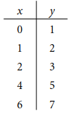
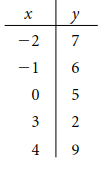
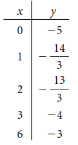
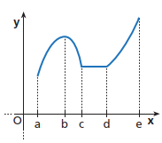
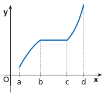
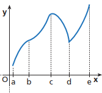
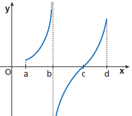

# Funzioni Elementari e Modelli Matematici

## UNITA' 1: Modelli matematici di relazioni

Nei capitoli precedenti abbiamo incontrato problemi come quelli riportati di seguito:

a) L'ultimo anno un organizzazione caritatevole ha venduto un certo numero di torte per una raccolta fondi. Quest'anno spera di venderne il $150\%$ in più. Scrivi l'espressione che indica il numero di torte che ci si aspetta di vendere.

b) In $4$ giorni $16$ operai costruiscono un prefabbricato; in quanti giorni farebbero lo stesso lavoro $x$ operai?

Questi problemi hanno in comune la richiesta di scrivere una espressione letterale che calcola una quantità (il numero di torte di quest'anno) che **dipende** da un'altra quantità (numero di torte dello scorso anno). Il numero di torte di quest'anno si chiama ***variabile dipendente*** e quello dell'anno scorso ***variabile indipendente***. Se ho questa espressione posso calcolare la quantità della variabile dipendente sapendo la quantità della variabile indipendente, . 

Se chiamo $x$ il numero delle le torte dello scorso anno $x$ ed $y$ quello di quest'anno, la relazione tra $y$ ed $x$ è $y = 250 \% \cdot x$. Questa equazione si chiama ***modello matematico del problema***. Per calcolare quante torte venderò quest'anno devo calcolare l'espressione $250\% \cdot x$ all'interno dell'equazione (elementare) dopo aver sostituito alla $x$ il numero delle torte dell'scorso anno, ad esempio $30$, per cui $ y = 250\% \cdot x, \{x = 30\} \longrightarrow y = 2,5 \cdot 30 \longrightarrow y = 75$.

Un esempio di calcolo per alcuni valori possibili di $x$ è nella tabella seguente​.​
$$
\begin{array}{c|c}
\hline
\textbf{N. Torte } & \textbf{N. Torte} \\
\textbf{Scorso Anno } & \textbf{Anno in Corso} \\
x & y = 250\% \cdot x \\ 
\hline 
10 & 25 \\ 
30 &  75\\ 
50 & 125 \\  
100 &  250 \\  
200 & 500 \\  
\end{array}
$$

 Per semplicità, alle espressioni letterali si dà un nome, ad esempio $f$, come nell'esempio seguente:
$$
f(x) = 250\% \cdot x
$$
La $x$ tra parentesi indica la lettera da sostituire per calcolare i valori, per cui $f(50)$ significa automaticamente la sostituzione e calcolo seguente: $f(50) = 250 \% \cdot x, \{x = 50\} \longrightarrow 250 \% \cdot 50 \longrightarrow 125$, cioè in breve
$$
f(50) = 125
$$
L'espressione $f(x)$ ha la capacità di associare ad un numero messo al posto di $x$ un solo altro numero risultato del calcolo dell'espressione; questa corrispondenza, si chiama ***<u>funzione</u>*** tra la variabile $x$ e la variabile $y$ e si indica
$$
y = f(x)
$$
La tabella delle torte è un esempio di calcolo della funzione $f(x) = 250\% \cdot x$ su un campione di valori possibili della $x$.

### ESERCIZIO 1.1: Calcolo del valore di una espressione

a) Calcola il valore dell'espressione $x^2$ per i valori della $x$ indicati nella tabella seguente.
$$
\begin{array}{r|c} 
x & y = x^2 \\ 
\hline 
0 & ... \\ 
1 &  ...\\ 
-1 & ... \\  
2 &  ...\\  
-2 & ...\\  
\end{array}
$$

b) Calcola il valore della espressione $\dfrac{1}{1-x}$ per i valori della $x$ indicati nella tabella del punto b).

c) Rappresenta le coppie di numeri formate dal valore della $x$ e dal valore dell'espressione degli esercizi a), b) e c) in un grafico cartesiano. 

d) Una agenzia di noleggio auto fa pagare per una automobile 50 euro al giorno più 32 centesimi a Km percorso. Il costo giornaliero dell'auto, in euro, dipende quindi dal numero di Km percorsi $x$ secondo l'espressione $0,32x + 50$.

Se chiamiamo l'espressione del costo $c(x) = 0,32x + 50$, calcola $c(75)$, $c(150)$, $c(225)$ e $c(650)$.

#### Laboratorio GEOGEBRA

a) Risolvi il punto a) dell'esercizio con i comandi: 

1. Inserisci la funzione $f(x) := x^2$​ &#9166; 
2. Seleziona lo strumento GEOGEBRA "Tabella";
3. Inserisci nella prima colonna della tabella GEOGEBRA "x" i valori della prima colonna della tabella dell'esercizio;
4. Seleziona lo strumento GEOGEBRA "Algebra" e sul menu di riga della funzione $f(x)$ scegli "Tabella di valori";
5. Viene automaticamente riempita la colonna dei valori di $f(x)$.

b) Risolvi il punto d) dell'esercizio con i comandi seguenti:

1. $c(x) := 0.32x + 50$ &#9166; 
2. $\{c(75), c(150), c(225), c(650)\}$ &#9166; . 

## UNITA' 2: Proporzionalità diretta ed inversa

Nell'unità precedente abbiamo fatto l'esempio del numero di torte $y$ vendute da una organizzazione caritatevole in un anno, rispetto a quelle dell'anno precedente $x$ ed abbiamo visto come tra le due quantità esista la relazione $y = 250\% \cdot x$. Questa relazione implica che il **rapporto** tra $y$ e $x$ è costante e vale $250 \% = 2,5$, ossia $\dfrac{y}{x} = 2,5$. Quando al variare di due quantità il loro rapporto rimane costante si dice che le due quantità sono ***direttamente proporzionali*** ed al crescere dell'una ($x$), cresce anche l'altra ($y$), con un fattore moltiplicativo pari a $2,5$​ della seconda.

Un altro importante esempio di grandezze direttamente proporzionali sono le distanze percorse ed il tempo impiegato per percorrerle quando ci si muove a velocità fissa (costante).

#### ESEMPIO

Consideriamo il caso di una automobile che si muove sempre con la stessa velocità (costante), senza accelerare, a $60 \; Km/h$. 

In $10$ minuti, che corrispondono a $10 \cdot \dfrac{1}{60} \cong 0,166$ ore, la macchina percorre $0,166 \cdot 60 \cong 10$ Km, secondo la formula $\Delta s = v \cdot \Delta t$, dove $\Delta s$ sono i $Km$ che la macchina percorre nel tempo $\Delta t$ (nel nostro caso $10$ minuti), alla velocità $v = 60\; Km/h.$ 

Poiché la velocità è sempre la stessa, sia i primi $10$ minuti, che i secondi $10$ minuti che gli ultimi $10$ minuti del viaggio, la macchina, farà sempre $10$ Km, cosa che non succede se la macchina accelera. Questa caratteristica è specifica dei movimenti a velocità costante, detti "**moti uniformi**": si dice anche che la macchina percorre "spazi uguali in tempi uguali" e se il tempo aumenta, aumenta anche lo spazio. $\blacksquare$

Vediamo ora una situazione diversa, in cui al crescere di una quantità, l'altra diminuisce in modo che se una raddoppia l'altra si dimezza.

#### ESEMPIO

In $4$ giorni $16$ operai costruiscono un prefabbricato; in quanti giorni farebbero lo stesso lavoro $x$​ operai?

Per analizzare questo problema, introduciamo una misura del lavoro necessario per realizzare qualcosa, il **giorno-persona**. Un giorno persona è la quantità di lavoro espresso da un lavoratore in un giorno, per cui se due persone lavorano due giorni per realizzare qualcosa, quel qualcosa richiede $4$ giorni persona di lavoro per essere realizzata. 

Nel caso dell'esempio, la costruzione del prefabbricato richiede $16 \cdot 4 = 64$ giorni-persona di lavoro. Se cambiamo il numero di operai del cantiere, cambierà la durata, ma non il lavoro complessivo necessario per realizzare la stessa opera, per cui se $x$ operai lavorano $t$ giorni, avremo comunque che $t \cdot x = 64$, ossia $x \longrightarrow t = \dfrac{64}{x}$. Se calcoliamo la durata della costruzione in vari casi, abbiamo la tabella seguente.
$$
\begin{array}{c|c}
\hline
\textbf{N. Operai } & \textbf{N. Giorni} \\
x & t = \dfrac{64}{x} \\ 
\hline 
2 &  32\\ 
4 & 16 \\ 
8 & 8 \\  
16 &  4 \\  
\end{array}
$$

Come si vede quando $x$ aumenta, $t$ diminuisce ed il loro prodotto è costante ed uguale a $64$​​. Quando al variare di due quantità il loro **prodotto** resta costante si dice che le due quantità sono ***inversamente proporzionali***.

Un altro caso importante di grandezze inversamente proporzionali è quello del tempo e della velocità nei moti uniformi.

#### ESEMPIO

Una macchina va da Latina a Roma la mattina e percorre la distanza di $60 \; Km$ in un'ora, andando ad una velocità media di $60 \; Km/h$. La sera rientra a Latina andando a $120 \; Km/h$​. Quanto tempo impiega?

La formula di riferimento è sempre $\Delta s = v \cdot \Delta t$, dove $\Delta s$ sono i $Km$ che la macchina percorre (nei nostri due casi di andata e ritorno $60 \;Km$).

$$
\begin{array}{c|c}
\hline\textbf{Velocita (Km/h) } & \textbf{Durata (h)} \\
\hline
60 & 1 \\
120 & 0,5 \\
\end{array}
$$

Come si vede la velocità raddoppia ed il tempo si dimezza. $\blacksquare$

### ESERCIZIO 2.1 - Proporzionalità diretta

a) La retribuzione di Andrea varia proporzionalmente al numero delle ore che lavora. Se per $38$ ore viene pagato $475\, \mbox{\euro}$ euro, quanto prenderà se lavora $30$ ore? 

b) I litri di vernice necessari per imbiancare una stanza variano direttamente con il numero di metri quadri delle pareti. Una parete di $16$ metri quadrati richiede due litri di vernice. Quanta vernice è necessaria per una parete di $6$ m^2^ ?

c) La dose (in milligrammi) raccomandata di Demerol, un medicinale preoperatorio per bambini, varia direttamente con il peso (in Kg) del paziente. Se la dose per un paziente di $30$ Kg è di $18$ mg, quale è la dose per un bambino di $45$ Kg?

### ESERCIZIO 2.2 - Proporzionalità inversa

a) Il tempo necessario ad una auto per raggiungere una destinazione varia inversamente alla velocità tenta durante il viaggio. Se viaggia $4$ ore ad $80$ Km l'ora per raggiungere la destinazione, quanto tempo impiegherà a $60$ Km l'ora? ed a $100$?

b) Un negozio di bricolage acquista $2.871$ Kg di chiodi e deve decidere la grandezza delle confezioni in cui inscatolarli. Indicando con $v$ il numero di chiodi che entra in ogni scatola e con $n$ il numero di scatole necessarie per confezionare tutti i chiodi, scrivi una tabella con la relazione tra $n$ e $v$ quando la capienza $v$ ha i valori $9, 11, 29, 33$.

c) Un negozio di abiti per i saldi natalizi applica percentuali di sconto del $10, 25, 33, 50 \%$ . Quale sarebbe lo sconto di una giacca da $300\, \mbox{\euro}$ nei vari casi?

### ESERCIZIO 2.3 - Formule di proporzionalità

a) Esprimi con una formula le relazioni tra le quantità nei casi riportati di seguito.

1. La retribuzione di Andrea varia proporzionalmente al numero delle ore che lavora. Se per $38$ ore viene pagato $475$ euro, quale sarà la sua retribuzione $y$ per $x$ ore di lavoro?
2. I litri di vernice necessari per imbiancare una stanza variano direttamente con il numero di metri quadri delle pareti. Se una parete di $16$ metri quadrati richiede due litri di vernice, quanti litri $y$ di vernice sono necessari per una parete di $x$ m^2^ ?
3. Il tempo necessario ad una auto per raggiungere una destinazione varia inversamente alla velocità tenuta durante il viaggio. Se viaggia $4$ ore ad $80$ Km l'ora per raggiungere la destinazione, a che velocità $v$ dovrà andare per percorrere il tragitto in $t$ ore?

b) Per ciascuno dei punti dell'esercizio a) fare una tabella ed un grafico cartesiano con $5$ valori scelti a caso.  La relazione tra la variabile dipendente e quella indipendente è crescente o decrescente?

c) Esprimi le relazioni seguenti con una formula dopo aver scelto le lettere che rappresentano le quantità:

1. L'ammontare dell'IVA da pagare (aliquota $22\%$) varia direttamente con il costo (imponibile) di acquisto di una macchina.
2. Le ore impiegate da un pendolare per recarsi da casa al posto di lavoro variano inversamente alla velocità (media) di percorrenza del tragitto.
3. L'ammontare dell'IVA (al $22\%$) ed il prezzo (IVA inclusa) di acquisto di una macchina.

## UNITA' 3: Relazioni lineari tra grandezze

Una funzione tra due grandezze $x$ ed $y$ si dice "lineare" se l'espressione che definisce la funzione è un polinomio di primo grado nella grandezza indipendente $x$​, come nel caso dell'equazione seguente:
$$
y = 3x -5
$$
ed in generale
$$
y = mx+q
$$
dove $m$ e $q$ sono due numeri.

Le funzioni lineari hanno la caratteristica che la differenza tra due valori della $y$ è direttamente proporzionale alla differenza tra i corrispondenti valori della $x$, ed è pari ad $m$. Vediamolo con un esempio.

#### ESEMPIO

Una palestra applica i prezzi seguenti: per entrare bisogna iscriversi e l'iscrizione costa $40$ euro a semestre; ogni ingresso poi costa $12$ euro. Scrivi la formula che calcola il costo semestrale al variare del numero di ingressi $x$.

Il calcolo del costo è dato dalla funzione $f(x) = 40 + 12x$, che ha i valori seguenti:
$$
\begin{array}{c|c|c}
\hline
\textbf{Caso } & \textbf{N. Ingressi } & \textbf{Costo} \\
& x & f(x) = 40 +12x \\ 
\hline 
1 & 5 & 100 \\ 
2 & 10 & 160 \\ 
3 & 15 & 220 \\  
4 & 20 &  280 \\  
5 & 25 &  340 \\  
\end{array}
$$
Se consideriamo la differenza tra $5$ e $15$ ingressi, ossia $10$ ingressi ($\Delta x = x_3 - x_1 \longrightarrow 15 - 5 = 10$), il costo passa da $100$ a $220$ euro, con un aumento di $\Delta y = y_3 - y_1 \longrightarrow 220 - 100 = 120$ euro; il rapporto tra i due incrementi è $\dfrac{\Delta y}{\Delta x} = \dfrac{120}{10} = 12$. 

Lo stesso calcolo tra $10$ e $25$ ingressi ($\Delta x = x_5 - x_2 \longrightarrow 25 - 10 = 15$ ingressi), comporta un incremento di costo da $160$ a $340$ euro, ossia $180$ euro ($\Delta y = y_5 - y_2 \longrightarrow 340 - 160 = 180$) ed il rapporto è sempre $\dfrac{\Delta y}{\Delta x} = \dfrac{180}{15} = 12$, ossia è costante ed è pari al costo unitario dell'ingresso, che è $12$ euro.

### ESERCIZIO 3.1 - Funzioni lineari
a) Costruisci una tabella ed un grafico cartesiano assegnando cinque numeri a scelta (positivi e negativi) a $x$ per ciascuna delle funzioni riportate di seguito:

1. $f(x) = x$;
2. $f(x) = -x$;
3. $f(x) = \dfrac{1}{2} x$;
4. $f(x) = -2x +1$;
5. $f(x) = 4x$.

b) Individua quali delle successioni trovate sono crescenti e quali decrescenti.

#### Laboratorio GEOGEBRA

a) Risolvi i punti dell'esercizio con i seguenti comandi GEOGEBRA, cambiando di volta in volta la funzione $f(x)$.

1. $f(x) := x$ &#9166; 
2. $\{(0,f(0)), (2, f(-2)), (-2, f(-2)), (4,f(4)), (-4, f(-4)) \})$ &#9166; 

Risultato analogo si ottiene con i passi seguenti.

1. Inserisci la funzione $f(x) := \dfrac{1}{2}x$ &#9166; 
2. Seleziona lo strumento GEOGEBRA "Tabella";
3. Inserisci nella prima colonna della tabella GEOGEBRA "$x$" i $5$ numeri a scelta;
4. Automaticamente saranno calcolati nella colonna con intestazione $f(x)$ i corrispondenti valori della funzione.

### ESERCIZIO 3.2 - Dipendenza lineare

a) Date le seguenti tabelle, stabilisci se tra $x$ e $y$ c’è una dipendenza lineare. In caso affermativo, scrivi la corrispondente funzione e rappresentala nel piano cartesiano.

        

b) Individua quali delle successioni indicate dalle tabelle sono crescenti e quali decrescenti.

#### Laboratorio GEOGEBRA

Risolvi l'esercizio eseguendo i passi seguenti.

1. Seleziona lo strumento GEOGEBRA "Tabella";
2. Inserisci nella prima colonna della tabella GEOGEBRA "x" i valori della prima colonna della prima tabella dell'esercizio;
3. Inserisci nella seconda colonna della tabella GEOGEBRA gli analoghi valori dell'esercizio;

Compariranno i punti sul grafico. Se i punti sono allineati la dipendenza è lineare, altrimenti no.

### ESERCIZIO 3.3 - Interesse semplice

Una persona prende in prestito da una finanziaria $1.000 \, \mbox{\euro}$ (capitale) per pagare un corso di formazione. Dovrà restituire il capitale dopo $5$ anni in una unica soluzione ma pagare trimestralmente l'$1\%$ dell'importo ricevuto, a titolo di interesse, finché non estingue il debito.

a) Se $I_n$ è l'ammontare degli interessi pagati fino all'$n$-esimo trimestre e $I_{n-1}$ quello fino al trimestre precedente, quale è la relazione tra i due importi?

b) Quale sarà la somma di capitale ed interessi (detta montante) dopo $n$ trimestri? Quale sarà l'importo totale degli interessi pagati dopo $5$ anni?

### ESERCIZIO 3.4 - Prezzo delle bibite

In una scuola si sta decidendo di introdurre dei distributori di bibite e valutando il prezzo dei prodotti. Se il prezzo fosse molto basso, ad esempio $10 \textcent$ a lattina, si venderebbero molte bibite. Se viceversa il prezzo a lattina fosse alto, ad esempio $4\, \mbox{\euro}$, è probabile che solo pochi studenti pagherebbero e molti altri ne farebbero a meno. Un sondaggio tra gli studenti dice che ad un prezzo di $40 \textcent$ a lattina si venderebbero $141$ lattine a settimana, e che ogni $5 \textcent$ di aumento sul prezzo, farebbe scendere le vendite settimanali di $12$ lattine.

a) Indicando con $p$ il prezzo di una lattina e con $q$ il numero di lattine settimanali vendute, calcola le quantità vendute per i prezzi riportati in tabella.
$$
\begin{array}{c|c}  p & q\\
\hline
40 & 141\\
45 & ...\\
50 & ...\\
55 & ...\\
60 & ...\\
\end{array}
$$
b) Posiziona i punti della curva di domanda della tabella precedente in un grafico cartesiano dove sull'asse orizzontale è riportata la quantità $q$ e su quello verticale il prezzo $p$​;

c) Scrivi la funzione che lega la quantità di lattine vendute alla settimana $q$ (variabile dipendente) al prezzo $p$ (variabile indipendente) delle lattine; [R. $q = -\dfrac{12}{5}p + 237$].

d) Se il prezzo diminuisse, cosa ci si può aspettare dalla quantità?

### ESERCIZIO 3.5 - Consumo di carburante

Per arare i campi, una azienda agricola utilizza un trattore diesel. L'azienda ha osservato che il trattore consuma $25$ litri di gasolio l'ora e, all'inizio dell'attività di aratura, ha una scorta di $1500$ litri di gasolio. Considerato che ogni giorno lavorativo il trattore ara per circa $6$ ore, calcolare:

a) il consumo giornaliero di gasolio;

b) il livello della scorta di gasolio a fine di ogni giornata per i primi 5 giorni (fare una tabella);

c) il numero di giorni necessari per l'esaurimento completo della scorta.

### ESERCIZIO 3.6 - Studio epidemiologico

Uno scienziato studia la diffusione di una epidemia in una piccola città con un modello lineare. Lo scienziato stima che all'inizio dello studio c'erano $3.700$ casi e $45$ nuovi casi al giorno. 

a) Calcola il numero dei casi dopo $5, 10, 15$ ed $x$ giorni. Organizza i risultati in una tabella.

b) Lo scienziato ha trovato che il $3\%$ degli individui che hanno contratto la malattia richiede un trattamento con un farmaco ospedaliero. All'inizio dello studio, l'ospedale cittadino aveva $500$ dosi del farmaco. Secondo il modello dal punto precedente, quanti giorni possono passare prima che il farmaco finisca?

### ESERCIZIO 3.7 - La dipendenza quadratica

a) L'area di un quadrato dipende dalla lunghezza del suo lato. Scrivi la funzione che calcola l'area $y$ di due quadrati uguali, ciascuno con un lato lungo $x$ metri.

b) Un edificio ha porte e finestre rettangolari di diversa grandezza, ma per tutte il lato più lungo è il doppio di quello più corto. Scrivi la funzione che calcola l'area di ogni porta o finestra in dipendenza del lato più corto e calcola l'area del rettangolo quando il lato più corto misura $10, 25, 30, 50$.

c) Un negozio di borse annuncia uno sconto sugli acquisti: ogni borsa acquistata oltre alla prima si ha uno sconto di $10$ euro sul prezzo di entrambe le borse. Nel caso si acquistino $n$ unità della stessa borsa del prezzo di $100$ euro, scrivere la funzione che calcola il ricavo del negozio e si calcoli il valore della funzione se $n$ vale $1, 2, 3, 4, 5$.

## UNITA' 4: Crescenza, decrescenza ed esempi di funzioni

### ESERCIZIO 4.1 - Funzioni crescenti e decrescenti

a) Nelle seguenti figure indica gli intervalli in cui le funzioni rappresentate sono crescenti o decrescenti.

1.          
2.             

### ESERCIZIO 4.2 - La funzione valore assoluto

Per ogni funzione costruisci una tabella con cinque valori di $x$ (positivi, negativi o nulli) e rappresenta il grafico

a) $y = 2|x|$;

b) $y = 1 + |x|$;

c) $y = -2|x|$.

#### Laboratorio GEOGEBRA

a) Risolvi il punto a) dell'esercizio con i seguenti comandi GEOGEBRA:

1. $f(x) := 2 \cdot |x|$ &#9166; 
2. $L=Successione((k,f(k)),k,-5,5,1)$ &#9166; 

           

### ESERCIZIO 4.3 - Le funzioni definite a tratti

a) Calcola il valore della funzione seguente per $n \in \{0, 1, -1, 2, -2, 3, -3, 4, -4\}$: 
$$
f(n) = 
\begin{cases} 
1  & se\; n\; \lt 0 \\ 
3n+1 & se\; n\; \ge 0 
\end{cases}
$$

b) Disegna un grafico della funzione seguente.
$$
f(x) = \begin{cases} 
-x-1  & se \; x \le -1 \\ 
0 & se \; -1 \lt x \le 1 \\
x -1 & se \; 1 \lt x
\end{cases}
$$
c) STAMPA LIBRI DI TESTO. Un editore valuta che il costo per stampare un numero variabile tra 1.000 e 10.000 copie di un certo libro di testo è 50 euro a copia; tra 10.001 e 20.000 copie il costo è 40 euro a copia e tra 20.001 e 50.000 il costo è 35 euro per copia (non si stampano meno di 1000 copie).  

1. Trova quanto costa stampare 5.500 copie e 23.000 copie;
2. Compila una tabella (2 colonne,  prima colonna: Numero di Copie, seconda colonna: Costo) che riporta i casi del punto 1 più quelli relativi a 2.000, 7.000, 45.000 copie.

d) QUOTA ISCRIZIONE. L'iscrizione ad una piscina costa 250 euro per le 12 settimane della stagione estiva. Se qualcuno si iscrive dopo l'inizio della stagione, una parte della della quota (proporzionale al ritardo) si può recuperare dalla quota dell'anno successivo.

1. Calcolare quanto spende nell'anno successivo chi si iscrive in ritardo di 5 settimane;  
2. Calcolare la spesa se il ritardo è di 2 settimane;  
3. Compilare una tabella (2 colonne, Prima colonna: Numero settimane di ritardo, Seconda colonna: Spesa nell'Anno Successivo) che riporta la spesa nell'anno successivo per ogni settimana di ritardo della prima iscrizione.  

#### Laboratorio GEOGEBRA

a) Risolvi il punto a) dell'esercizio con la seguente sequenza di comandi GEOGEBRA (calcolatrice GRAFICA):

1. $f(n) := Se(n<0, 1, 3n+1)$
2. $d = \{0, 1, -1, 2, -2, 3, -3, 4, -4\}$ &#9166; 
3. $Compatta( (k,f(k)), k, d )$ &#9166;

    

b) Risolvi il punto b) dell'esercizio con il comando GEOGEBRA: $f(x) := Se(n<=-1, -x-1, Se(-1<x<=1, 0, x-1))$

c) Risolvi il punto c) dell'esercizio con la sequenza seguente di comandi GEOGEBRA:

1. $c(x) := Se(1000<=x<10000, 50x, Se(10001<=x<20000, 40x, Se(20001<=x<50000, 35x)))$
2. $d = \{2000, 5500, 7000, 23000, 45000\}$ &#9166; 
3. $Compatta( (x,c(x)), k, d )$ &#9166;

### ESERCIZIO 4.4 - Analisi qualitativa del grafico di funzioni

a) Per ciascuno dei grafici seguenti individua:  

- I tratti dell'asse $x$ in cui la funzione è crescente o decrescente;
- i punti di massimo o minimo relativo ed i rispettivi valori. 

        

        

        

## UNITA' 5: Applicazioni dei modelli lineari: modelli decisionali

Negli esercizi che seguono $y$ indica il costo sostenuto da un soggetto ed $x$ di volta in volta il numero di oggetti/servizi acquistati o prodotti. La formula che lega i costi ai prodotti in generale è la seguente:
$$
y = mx+q
$$
dove $m$ e $q$ devono essere di volta in volta stimati. "$mx$" è una parte dei costi che varia con il numero degli oggetti/servizi acquistati e $q$ è una parte che non varia (quota fissa).

### ESERCIZIO 5.1 - Applicazioni varie

a) Un circolo di tennis affitta i campi sia a membri del circolo che ad esterni (non membri). I membri pagano 40 euro a semestre di iscrizione e poi 10 euro l'ora per il campo, mentre gli esterni pagano 15 euro l'ora. 

1. Scrivere le formule che, al variare di $x$, numero di ore di affitto a semestre, esprime i costi nel caso dei membri e degli esterni.
2. Individuare quale è il numero semestrale minimo di ore di campo da affittare perché convenga l'iscrizione al circolo. (*Suggerimento*: si scrivano i costi mensili in entrambi i casi e si confrontino i grafici dei costi.)  

b) Una sala chirurgica ambulatoriale prevede, da parte del paziente, il pagamento di un ticket composto da una quota fissa più una variabile per ogni minuto di durata dell'operazione. Un paziente ha pagato 250 euro per un intervento di 30 minuti ed un altro 450 euro per uno di 90 minuti. Scrivi la formula per calcolare il costo del ticket a partire dalla durata dell'intervento ed utilizzala per calcolare il costo di una operazione di 45 minuti.

c) Una industria dolciaria produce dei cioccolatini che vende in scatole confezionate da 200 grammi l'una. Per la produzione dei cioccolatini, l'azienda sostiene una spesa fissa mensile di 4.000 euro ed un costo al Kg di 4 euro; ci sono da considerare poi altri 60 centesimi di costo di confezionamento per ogni scatola. Determinare:

1. la formula che esprime il costo mensile per la produzione di $x$ scatole di cioccolatini;
2. la formula che esprime i ricavi della vendita di $x$ scatole di cioccolatini al mese, considerato che il prezzo di ogni scatola è di 5 euro;
3. la formula per il calcolo dell'utile come differenza tra i ricavi ed i costi.

### ESERCIZIO 5.2 - Esercizio Riassuntivo   

a) L'agenzia di noleggio auto EZ ha dei prezzi alla clientela che, per il noleggio, prevedono una quota fissa al giorno più una quota variabile secondo il numero di chilometri percorsi. Antonio ha noleggiato due auto in due occasioni diverse. La prima volta ha pagato, per un giorno e 100 Km percorsi, un totale di 70 euro e la seconda, sempre per un giorno e 350 Km percorsi, 120 euro.

1. Scrivi la formula che calcola il costo di noleggio per la clientela.
2. Antonio potrebbe noleggiare anche dall'agenzia A-OK che costa 25 euro al giorno più 0,30 euro al Km. Ad Antonio conviene di più servirsi di EZ oppure di A-OK? 

b) Sempre l'agenzia di noleggio EZ, per la gestione del suo parco automezzi, sostiene dei costi che, per ogni auto, sono la somma di un costo fisso di ammortamento e di uno variabile, che dipende dai Km percorsi, di manutenzione.

I costi annui si possono calcolare considerando che, dopo 10 anni di utilizzo, il valore di un'automobile acquistata nuova per 30.000 euro ha un valore nullo e per la manutenzione, se si percorrono mediamente 60 Km/giorno per 150 giorni l'anno, si spendono 1.000 euro/anno (ossia 0,111 euro al giorno al Km).

1.  Considerando $x$ giorni di utilizzo l'anno, calcola i costi totali per la gestione di un'auto da 30.000 euro dell'agenzia EZ come somma di costi fissi e costi variabili (in dipendenza del numero dei giorni) annui; fai l'ipotesi di una percorrenza media giornaliera di 60 Km;
2.  Nelle ipotesi del punto 1 e ricavando dalla risposta dell'esercizio a.1) i ricavi giornalieri del noleggio, scrivi la formula del ricavo annuo, supponendo che l'auto sia utilizzata $x$ giorni l'anno;
3.  Scrivi la formula dell'utile annuo come differenza tra i ricavi ed i costi. Disegna la curva dell'utile in un piano cartesiano ed individua il numero minimo di giorni che in un anno l'auto deve essere noleggiata perché non ci sia una perdita ("Punto di Pareggio"), ossia l'intervallo dei giorni $x$ in cui l'utile è positivo ("Regione dei Profitti") e quello dei giorni in cui è negativo ("Regione delle Perdite").

#### Laboratorio GEOGEBRA

a) Disegna le curve dei costi dei punti b) e c) e rileva, per il punto c.2), quali sono graficamente i criteri che se applicati conducono alle decisioni ottimali per il consumatore.

b) Disegna le curve dei Ricavi-Costi-Utile del punto d) ed individua graficamente le regioni dei profitti, delle perdite ed il punto di pareggio.

### ESERCIZIO 5.3 - Analisi dei prezzi

a) Una società di film a noleggio ha 1000 abbonati ognuno dei quali paga 15 euro al mese. Sulla base di un indagine, il management ritiene che per ogni 25 centesimi di riduzione del costo mensile di abbonamento si avrebbero 20 tesserati in più. Quale dovrebbe essere il prezzo di abbonamento mensile per avere il massimo numero di abbonati?

b) 50 studenti, contribuendo ciascuno con 5 euro, riescono a raccogliere 250 euro per un regalo. Da questo punto in poi però, decidono che per ogni studente in più che aderisce, la somma da versare diminuirà di 5 centesimi per tutti. Quanti studenti dovranno contribuire per ottenere la somma massima possibile?
