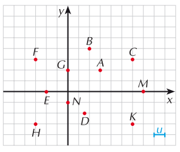

# Geometria Analitica: Retta e Parabola

### ESERCIZIO 1 - Posizione dei Punti
Posiziona i punti degli insiemi seguenti su di un piano cartesiano  

a) Q = {(1;1), (-1;1), (-1;-1), (1;-1)}   
b) T = {(-1;0), (1;0), (0;1)}  
c) R = {(-3;-1), (-1; -1), (0;-1), (1;-1), (2;-1), (3;-1)}

### ESERCIZIO 2 - Coordinate dei punti
Scrivi l'insieme delle coppie di coordinate relative ai punti in figura

### ESERCIZIO 3 - Punti allineati
Disegna la retta che passa per ciascuno dei seguenti insiemi dei punti allineati. Descrivi a parole le caratteristiche di ciascuna retta.  

a) A = {(-5;3), (1; 3), (6; 3)}  
b) B = {(0; 0), (0; -4)}  
c) D = {(-4; 4), (-2; 2), (3; -3)}

### ESERCIZIO 4 - Campione di punti
Per ciascuno degli insiemi riportati di seguito trova un campione di 4 punti che vi appartiene e riporta i punti su di una tabella e su un piano cartesiano.  
a) A = {(x; y): y = -1}  
b) B = {(x; y): x = 3}  
c) C = {(x; y): y = -x}  
d) D = {(x; y): y = x + 1}  
e) E = {(x; y): x + y = 1}

### ESERCIZIO 5 - Coefficiente angolare di una retta
Calcola il coefficiente angolare delle rette passanti per ciascuna delle seguenti coppie di punti  
a) {(4; -5), (2; 3)}  
b) {(-3; 1), (-1; -2)}  
c) {(4; 1/2), (2/3; -2)}  

### ESERCIZIO 6 - Appartenenza di un punto ad una retta
Scrivi l’equazione della retta, passante per l’origine e per il punto A. Verifica se il punto B appartiene alla retta trovata  
a) A(1/2; 1), B(-1;-2)  
b) A(-2; 0), B(-2; 10)   
c) A(1;-1), B(-1/2;1/2)    

### ESERCIZIO 3 - Grafico della retta
Disegna le rette rappresentate dalle seguenti equazioni:  
a) $y = \dfrac{1}{2}x$, $y = \dfrac{-1}{3}x$  
b) $y = \dfrac{-1}{3}x$, $y = 3x$  
c) $y = \dfrac{11}{8}x$, $y = 11 x$  

### Esercizio 4 - Forma implicita ed esplicita
a) Scrivi in forma implicita le seguenti equazioni di rette
1. 
2. 
3. 

b) Scrivi in forma esplicita le seguenti equazioni
1. 
2. 
3. 