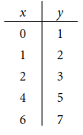
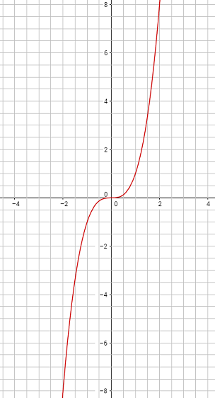

# Grafici e funzioni

### ESERCIZIO 1 - Posizione dei Punti

Posiziona i punti degli insiemi seguenti su di un piano cartesiano  

a) Q = {(1;1), (-1;1), (-1;-1), (1;-1)}   
b) T = {(-1;0), (1;0), (0;1)}  
c) R = {(-3;-1), (-1; -1), (0;-1), (1;-1), (2;-1), (3;-1)}

### ESERCIZIO 2 - Coordinate dei punti

Scrivi l'insieme delle coppie di coordinate relative ai punti in figura

### ESERCIZIO 3 - Punti allineati

Disegna la retta che passa per ciascuno dei seguenti insiemi dei punti allineati. Descrivi a parole le caratteristiche di ciascuna retta.  

a) A = {(-5;3), (1; 3), (6; 3)}  
b) B = {(0; 0), (0; -4)}  
c) D = {(-4; 4), (-2; 2), (3; -3)}

### ESERCIZIO 4 - Campione di punti

Per ciascuno degli insiemi riportati di seguito trova un campione di 4 punti che vi appartiene e riporta i punti su di un piano cartesiano.  
a) A = {(x; y): y = -1}  
b) B = {(x; y): x = 3}  
c) C = {(x; y): y = -x}  
d) D = {(x; y): y = x + 1}  
e) E = {(x; y): x + y = 1}

### ESERCIZIO 5 - Coefficiente angolare di una retta

Calcola il coefficiente angolare delle rette passanti per ciascuna delle seguenti coppie di punti  
a) {(4; -5), (2; 3)}  
b) {(-3; 1), (-1; -2)}  
c) {(4; 1/2), (2/3; -2)}  

### ESERCIZIO 6 - Appartenenza di un punto ad una retta

Scrivi l’equazione della retta, passante per l’origine e per il punto A. Verifica se il punto B appartiene alla retta trovata  
a) A(1/2; 1), B(-1;-2)  
b) A(-2; 0), B(-2; 10)   
c) A(1;-1), B(-1/2;1/2)    

### ESERCIZIO 7 - Grafico della retta

Disegna le rette rappresentate dalle seguenti equazioni:  
a) $y = \dfrac{1}{2}x$, $y = \dfrac{-1}{3}x$  
b) $y = \dfrac{-1}{3}x$, $y = 3x$  
c) $y = \dfrac{11}{8}x$, $y = 11 x$  

### ESERCIZIO 8 - Forma implicita ed esplicita
a) Scrivi in forma implicita le seguenti equazioni di rette
1. $y = \dfrac{1}{2}x$, $y = \dfrac{-1}{3}x - 4$  
2. $y = \dfrac{11}{8}x$, $y = 11$  

b) Scrivi in forma esplicita le seguenti equazioni
1. $y - \dfrac{1}{2}x = 5$, $y +\dfrac{-1}{3}x - 4 = 0$  
2. $y - x +2 = 0$, $y - 4 = x + 9$  

### ESERCIZIO 8 - Modelli e funzioni, la proporzionalità diretta ed inversa

a) Esprimere le relazioni seguenti con una equazione dopo aver scelto le lettere che rappresentano le quantità:
1. I litri di vernice necessari per reimbiancare una stanza variano direttamente con il numero di metri quadri delle pareti
2. L'ammontare dell'IVA da pagare varia direttamente con il prezzo di acquisto di una macchina
3. Le ore impiegate da un pendolare per recarsi da casa al posto di lavoro variano inversamente alla velocità media di percorrenza del tragitto  

b) La dose (in milligrammi) raccomandata di Demerol, un medicinale preoperatorio per bambini, varia direttamente com il peso (in Kg) del paziente. Se la dose per un paziente di 30 Kg è di 18 mg, quale è la dose per un bambino di 45 Kg?  

a) *QUOTA DI ISCRIZIONE*  
L'iscrizione ad una piscina costa 250 euro per le 12 settimane della stagione estiva. Se qualcuno si iscrive dopo l'inizio della stagione, una parte della della quota (proporzionale al ritardo) si può recuperare dalla quota dell'anno successivo.
1. Calcolare quanto consuma effettivamente chi si iscrive 5 settimane dopo l'inizio della stagione;  
2. Calcolare il consumo dopo 2 settimane;  
3. Compilare una tabella (2 colonne, 12 righe, I colonna: Numero settimane di ritardo, II colonna: Costo effettivo) che riporta quanto viene consumato da chi si iscrive in ritardo;  

b) *STAMPA LIBRI DI TESTO*  
Un editore valuta che il costo per stampare un numero variabile tra 1.000 e 10.000 copie di un certo libro di testo è 50 euro a copia; tra 10.001 e 20.000 copie il costo è 40 euro a copia e tra 20.001 e 50.000 il costo è 35 euro per copia.  
1. Trova quanto costa stampare 5.500 copie e 23.000 copie;
2. Compila una tabella (2 colonne, 5 righe, I colonna: Numero di copie, II colonna: Costo) che riporta i casi del punto a più quelli di 2.000, 7.000, 45.000 copie.  

### ESERCIZIO 9 Funzioni suriettive, iniettive, biiettive, inverse e composte
a) Indica quali delle seguenti funzioni da A a B sono suriettive:  
1. A = {-2, -1, 0, 1}, B = {-2, 1, 1, 2}, f(-2) = 2, f(-1) = 1, f(0) = -1, f(1) = 2;
2. A = {-1, 0, 1, 2}, B = {-1, 0, 1}, f(-1) = 0, f(0) = 1, f(1) = 0, f(2) =-1;
3. A = {-1, 0, 1}, B = {0, 1, 2}, f(-1) = 0, f(0) = 2, f(1) = 1.

b) Indica quali delle seguenti funzioni da A a B sono iniettive.
1. A = {1, 2, 3, 4}, B = {-1, 0, 1, 2}, f(1) = 2, f(2) = 0, f(3) = 2, f(4) = -1
2. A = {a, b, c, d}, B = {a, b, c}, f(a) = c, f(b) = a, f(c) = b, f(d) = c
3. A = {-2, -1, 0, 1}, B = {-1, 0, 1, 2, 3}, f(-2) = 2, f(-1) = 0, f(0) = -1, f(1) = 3

c) Consideriamo gli insiemi A = {0, 1, 2, 3, 4} e B = {a, b, c, d, e} e la funzione che associa 0 -> b; 1 -> c; 2 -> a; 3 -> e.  
Quale elemento di B va associato a 4 affinché la funzione risulti invertibile?

### ESERCIZIO 10 - Le funzioni numeriche
a) Costruire una tabella assegnando cinque valori (positivi e negativi) a x per ciascuna delle funzioni riportate di seguito:
1. y = x;
2. y = -x;
3. y = 1/2 x;
4. y = 2x +1;
5. y = 4x

a) In riferimento all'esercizio "Quota di Iscrizione":
1. Scrivere una espressione algebrica (variabile x: Numero settimane di ritardo) che calcola il costo effettivo analogamente ai dati nella tabella del punto 3;  
2. Disegnare il grafico della funzione ottenuta dalla espressione.

b) In riferimento all'esercizio "Stampa Libri di Testo":
1. Scrivere due espressioni algebriche (con la sola variabile x che indica il N. di copie) che calcolano il costo effettivo analogamente ai dati nella tabella del punto 2;
2. Disegna il grafico della funzione ottenuta dalla espressione.

### ESERCIZIO 11 - La funzione lineare
a) Date le seguenti tabelle, stabilisci se tra x e y c’è una dipendenza lineare. In caso affermativo, scrivi la corrispondente funzione e rappresentala nel piano cartesiano.

  
  

### ESERCIZIO 12 - La funzione valore assoluto
a) Per ogni funzione costruisci una tabella con cinque valori di x (positivi, negativi o nulli) e rappresenta il grafico
1. y = 2|x|;
2. y = 1 + |x|;
3. y = -2|x|

### ESERCIZIO 13 - Le funzioni definite a tratti

### ESERCIZIO 14 - Caratteristiche delle funzioni
a) Per ciascuno dei grafici seguenti indica se:
* E' simmetrico rispetto all'asse x o all'asse y;

* E' simmetrico rispetto all'origine.

$y = x^2$;

    

$y = x^3$;

    

$\displaystyle y = \frac{1}{x}$

    

$\displaystyle y = \frac{3}{x^2}$

    

b) Per ciascuno dei grafici seguenti individua:  

* I tratti dell'asse x in cui la funzione è crescente o decrescente;

* Quali sono i punti di massimo o minimo relativo ed i rispettivi valori.  

$\displaystyle y = (x - 3)x^2$  

     

$\displaystyle y = (x-1)(x+1)x^2$  

  

