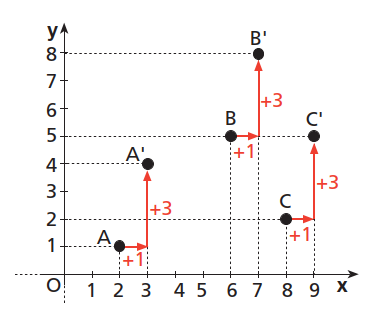
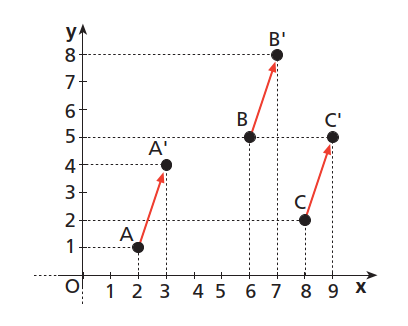
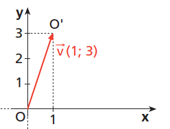
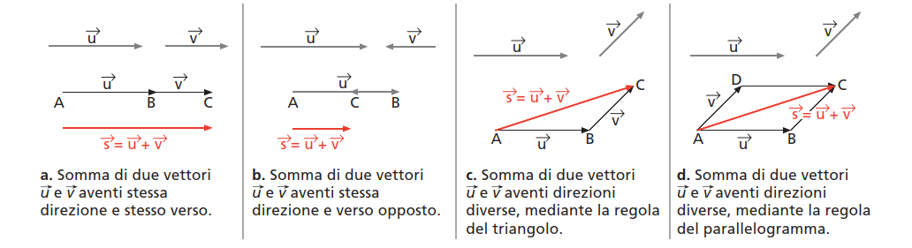
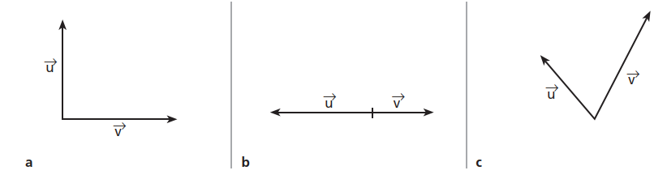
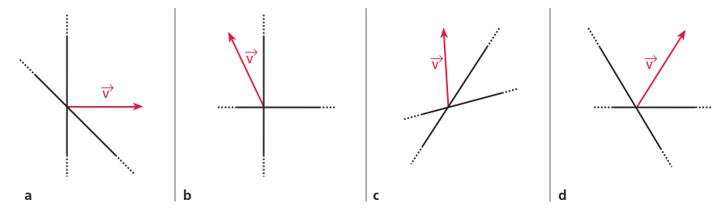
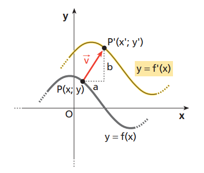
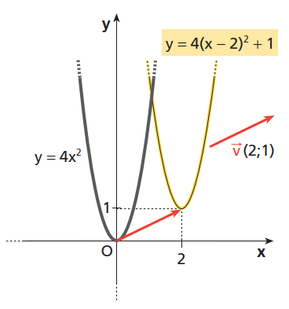

# I Vettori

## UNITA' 1: Le Trasformazioni Geometriche ed i Vettori

Una **trasformazione geometrica** nel piano è una corrispondenza biunivoca che associa a ogni punto del piano uno e un solo punto del piano stesso, che quindi "sposta" un qualunque punto del piano in un nuovo punto.

Per individuare il nuovo punto, scriviamo delle equazioni che ci consentano di calcolare le coordinate del nuovo punto, che indichiamo con un apice, $(x^{\prime}; y^{\prime})$, a partire dalle coordinate del vecchio punto $(x;y)$.

Ci occuperemo di alcune particolari trasformazioni le cui equazioni sono di primo grado, del tipo:
$$
\left\{  
\begin{array}{l} 
x^{\prime} = a x + b y + e \\  
y^{\prime} = c x + d y + f \\   
\end{array} 
\right.
$$
dove $a$, $b$, $c$, $d$, $e$, $f$, sono numeri reali.

#### ESEMPIO 1

Determiniamo i trasformati $A^\prime$ e $B^\prime$ dei punti $A(2; 1)$ e $B(0; − 4)$ nella trasformazione di equazione:
$$
\left\{  
\begin{array}{l} 
x^{\prime} = x -2y + 6 \\  
y^{\prime} = -x + 2y -1 \\   
\end{array} 
\right.
$$

Sostituiamo le coordinate di $A$:
$$
\left\{  
\begin{array}{l} 
x^{\prime} = 2 -2 \cdot 1 + 6 \longrightarrow 6\\  
y^{\prime} = -2 + 1 -1 \longrightarrow -2 \\   
\end{array} 
\right.
$$
Possiamo quindi scrivere la corrispondenza:
$A(2; 1) \longrightarrow A^\prime(6; − 2)$ ed analogamente $B(0; 4) \longrightarrow B^\prime(14; 0,5)$.    $\bullet$

### Le Traslazioni ed i Vettori

Vediamo ora alcune trasformazioni particolari. Una **traslazione** è una trasformazione geometrica che ha le equazioni della forma seguente:
$$
\left\{  
\begin{array}{l} 
x^{\prime} = x + e \\  
y^{\prime} = y + f \\   
\end{array} 
\right.
$$

#### ESEMPIO 2

Determiniamo la traslazione dei punti $A(2; 1)$, $B(6; 5)$, $C(8; 2)$ secondo le equazioni:
$$
\left\{  
\begin{array}{l} 
x^{\prime} = x + 1 \\  
y^{\prime} = y + 3 \\   
\end{array} 
\right.
$$
Sostituendo le coordinate dei punti nelle equazioni otteniamo: $A(2; 1) \longrightarrow A^\prime(3; 4)$,  $B(6; 5) \longrightarrow B^\prime (7; 8)$,  $C(8; 2) \longrightarrow C^\prime(9; 5)$.

Rappresentando nel piano cartesiano i punti $A, B, C$ ed i loro trasformati, vediamo che ogni punto viene traslato, in pratica **spostato**, aumentando di una unità la sua ascissa e di $3$ unità la sua ordinata.

Se congiungiamo ogni punto con il suo trasformato otteniamo dei segmenti orientati.

I segmenti ottenuti hanno la stessa <u>lunghezza</u>, appartengono a rette parallele ed hanno quindi la stessa <u>direzione</u> e sono orientati nello stesso <u>verso</u>.

In pratica ogni punto viene spostato come indicano le frecce, che sono però tutte "uguali" (si dice congruenti) a parte il fatto che  partono da punti diversi      $\bullet$

Il fatto che i segmenti $\overrightarrow{AA^\prime}$, $\overrightarrow{BB^\prime}$, $\overrightarrow{CC^\prime}$ abbiano queste caratteristiche è importante perché possiamo dire che ognuno rappresenta lo stesso vettore $\vec{v}$ applicato ad un punto diverso.

Gli elementi caratteristici di un vettore $\vec{v}$ sono:

- la misura del segmento $AA^\prime$, detta modulo del vettore, che indichiamo con $\|AA^\prime\|$;
- la direzione, che è la direzione della retta $AA^\prime$;
- il verso, da $A$ ad $A^\prime$.

I vettori vengono rappresentati con un particolare segmento orientato che ha come primo estremo sempre il punto $O(0; 0)$ e come secondo il punto $O^\prime$ che ha le coordinate opportune per indicare la lunghezza e la direzione del vettore. Le coordinate del punto $O^\prime$ sono dette **componenti del** **vettore**, come nella figura seguente.

Le componenti del vettore sono proprio i coefficienti $a$ e $b$ delle
equazioni della traslazione, per cui si scrive che $\vec{v} = \vec{v}(1;3)$, oppure con una notazione detta "a colonna", che la differenzia da quella delle coordinate dei punti: $\vec{v} =$ $\begin{pmatrix} 1 \\ 3 \end{pmatrix}$.

Quindi ricapitolando, se abbiamo le equazioni di una traslazione possiamo definire un vettore e se abbiamo un vettore possiamo scrivere le equazioni di una traslazione che utilizza il vettore per spostare ogni punto del piano.

#### ESEMPIO 3

Consideriamo il vettore $\vec{v} =$ $\begin{pmatrix} -2 \\ 1 \end{pmatrix}$. Scriviamo la traslazione che utilizza il vettore e trovare le coordinate dei punti $A(0;0)$, $B(1;0)$, $C(0;-1)$ dopo lo spostamento.

Le equazioni che ci forniscono le nuove coordinate sono:
$$
\left\{  
\begin{array}{l} 
x^{\prime} = x -2 \\  
y^{\prime} = y + 1 \\   
\end{array} 
\right.
$$
Sostituendo abbiamo $A(0; 0) \longrightarrow A^\prime(-2; 1)$,  $B(1; 0) \longrightarrow B^\prime (-1; 1)$,  $C(0; -1) \longrightarrow C^\prime(-2; 0)$.     $\bullet$

### Somma di vettori e moltiplicazione per uno scalare

Esaminiamo ora due operazioni molto comuni che si fanno con i vettori per creare vettori nuovi a partire da vettori vecchi: la somma di vettori e la moltiplicazione per uno scalare. 

Se abbiamo due vettori, $\vec{v} =$ $\begin{pmatrix} 0 \\ 1 \end{pmatrix}$ e  $\vec{w} =$ $\begin{pmatrix} 1 \\ 1 \end{pmatrix}$, possiamo creare un nuovo vettore, il vettore somma, semplicemente sommando le componenti dei due:
$$
\vec{v} + \vec{w} = \begin{pmatrix} 0 \\ 1 \end{pmatrix} + \begin{pmatrix} 1 \\ 1 \end{pmatrix} \longrightarrow \begin{pmatrix} 1 \\ 2 \end{pmatrix} = \vec{z}
$$
Lo spostamento di un punto secondo il nuovo vettore $\vec{z}$ corrisponde alla sequenza dei due spostamenti di $\vec{v}$ e poi di $\vec{w}$.

Se vediamo l'operazione dal punto di vista delle frecce, la costruzione della freccia risultato avviene secondo la regola detta del "triangolo" o "parallelogramma".

 

Se abbiamo un vettore e vogliamo costruirne uno lungo il doppio, possiamo sommare il vettore a se stesso ed otteniamo:
$$
\vec{w} + \vec{w} = \begin{pmatrix} 1 \\ 1 \end{pmatrix} + \begin{pmatrix} 1 \\ 1 \end{pmatrix} \longrightarrow \begin{pmatrix} 2 \\ 2 \end{pmatrix}
$$
Ma se definiamo una nuova operazione di moltiplicazione di un vettore per un numero, detto **scalare**, come l'operazione che consiste nel moltiplicare tutte le componenti del vettore per lo scalare, possiamo scrivere:
$$
2\vec{w} = 2\begin{pmatrix} 1 \\ 1 \end{pmatrix} \longrightarrow \begin{pmatrix} 2 \\ 2 \end{pmatrix}
$$
Cioè moltiplicare un vettore per un numero positivo significa allungare (o accorciare) il vettore facendogli mantenere la direzione; moltiplicarlo per un numero negativo significa sempre allungarlo o accorciarlo ma cambiandogli il verso.

Con queste due operazioni possiamo anche fare la "differenza" tra due vettori, che poi è la somma tra il primo e l'opposto del secondo.

Esercizi pag. 705 

### ESERCIZIO 1

a) Disegna un vettore $\vec{a}$ e rappresenta poi i vettori $-2\vec{a}$,  $\dfrac{1}{4}\vec{a}$,  $3\vec{a}$.

b) Traccia il vettore differenza $\vec{u} - \vec{v}$ dei vettori $\vec{u}$ e $\vec{v}$ disegnati in figura.

### ESERCIZIO 2

a)  I vettori $\vec{a}$ e $\vec{b}$, con modulo $\vec{a} = 8$ e $\vec{b} = 6$, formano un angolo di $90^\circ$.
 Determina il modulo dei vettori:

1. $\vec{a} - 2\vec{b}$;
2. $\dfrac{1}{2}(\vec{a} + 3\vec{b})$.

b)  Scomponi il vettore $\vec{v}$ lungo le due direzioni assegnate nella figura seguente.

### Le traslazioni ed il grafico delle funzioni

Dato il grafico di una funzione $y = f(x)$, mediante una traslazione di vettore $\vec{v}$
otteniamo il grafico di una nuova funzione $y = f^\prime (x)$. Diciamo anche 
che la funzione $f^\prime$, da non confondere in questo caso con la derivata, è la funzione traslata rispetto a $f$.

#### ESEMPIO 3

Data la funzione
$y = 4x^2$,
trasliamo il suo grafico secondo il vettore $\vec{v} (2; 1)$.

Le equazioni della traslazione sono: 
$$
\left\{  
\begin{array}{l} 
x^{\prime} = x + 2 \\  
y^{\prime} = y + 1 \\   
\end{array} 
\right.
$$
Ricaviamo x e y:
$$
\left\{  
\begin{array}{l} 
x = x^{\prime} -2 \\  
y = y^{\prime} - 1 \\   
\end{array} 
\right.
$$
Sostituiamo le espressioni ottenute in 
$y = 4x^2$:

$$
y^\prime − 1 = 4(x^\prime − 2)^2 \longrightarrow y^\prime = 4(x^\prime − 2)^2 + 1
$$

Gli apici servono soltanto per distinguere le coordinate del punto finale rispetto a quelle del punto di partenza. Una volta trovata $f^\prime$, non c’è più possibilità di confonderle e quindi possiamo togliere gli apici:
$$
y = 4(x − 2)^2 + 1
$$

pag. 106

Esercizi pag. 149

## UNITA' 6: Le Funzioni Goniometriche e le Trasformazioni Geometriche

