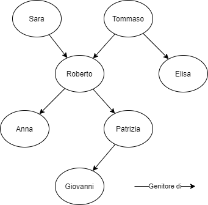

# Insiemi e Relazioni

## UNITA' 1: Insiemi e loro rappresentazione

### ESERCIZIO 1 - Rappresentazione per Elencazione

a) Rappresenta per elencazione, e con diagramma di Eulero-Venn, gli insiemi A, B e C formati rispettivamente dalle lettere delle parole «rododendro», «giglio», «azalea». 

b) Rappresenta per elencazione i seguenti insiemi:  

1. I naturali non maggiori di 8;  
2. I naturali dispari compresi fra 30 e 40;  
3. I multipli pari di 7 minori di 40;  
4. I divisori di 42;  
5. I divisori primi di 42:  
6. I giorni della settimana che iniziano per «b»;  
7. Le vocali della parola «farfalla»

c) Rappresenta per elencazione i seguenti insiemi:  
1. L’insieme A dei numeri del tipo $3n$, con n ∈ {0, 2, 4, 6};  
2. L’insieme B dei numeri del tipo $2n + 1$, con n ∈ {0, 1, 2, 3, 4};  
3. L’insieme C dei numeri del tipo $-2n$, con n ∈ {-2, -1, 0, 1, 2};  
4. L’insieme D dei numeri del tipo $\dfrac{3n + 1}{3}$, con n ∈ {-3, -2, -1, 1, 2, 3}.

#### Laboratorio

a) Risolvi il punto a) dell'esercizio prendendo ad esempio i comandi GEOGEBRA riportati di seguito:

​		$Unico(Suddividi(''rododendro'',\{''''\})))$ &#9166; 

b) Risolvi il punto c) dell'esercizio prendendo ad esempio i comandi GEOGEBRA riportati di seguito:

1. $Compatta(3\cdot n, n, \{0, 2, 4, 6\} )$ &#9166; 
2. $Compatta(2 \cdot n + 1, n, \{0, 1, 2, 3, 4\} )$ &#9166; 

### ESERCIZIO 2 - Rappresentazione mediante proprietà caratteristica

a) Rappresenta gli insiemi seguenti mediante una proprietà caratteristica dei loro elementi.  
1. $A = \{martedi, mercoledi\}$;  
2. $B = \{Nord, Sud, Est, Ovest\}$;  
3. $C = \{\alpha, \beta, \gamma\}$;  
4. $D = \{a, e, i, o, u\}$;  
5. $E = \{5, 7, 9, 11, 13\}$;  
6. $F = \{8, 9, 10, 11, 12, 13, 14, 15\}$;  
8. $G = \{12, 16, 20, 24, 28, 32\}$;  
9. I numeri interi pari minori o uguali a 16;  
10. I numeri naturali compresi fra 10 e 30;  
11. Gli interi negativi.

### ESERCIZIO 3 - Dalla proprietà caratteristica all'elencazione

a) Scrivi la rappresentazione per elencazione dei seguenti insiemi.  
1. $A = \{x: x \; \acute{e} \; una \; lettera \; della \; parola \; «avvocato»\}$;  
2. $B = \{x: x \; \acute{e} \; una \; vocale\}$;  
3. $C = \{x: x \; \acute{e} \; il \; nome \; di \; un \; mese \; che \; inizia \; con \; la \; lettera \; «g»\}$;  

b) Trova il numero degli elementi degli insiemi riportati di seguito.  

1. $A = \{x: x \; \acute{e} \; un \; pianeta \; del \; sistema \; solare \}$;  
2. $B = \{x: x \; \acute{e} \; una \; provincia \; del \; Lazio \}$;
5. $C = \{x: 2x - 5 = -x + 7 + 3x\}$.

#### Laboratorio

a) Risolvi il punto b.2 dell'esercizio con la sequenza di comandi GEOGEBRA riportata di seguito:

1. $l_B: \{''Roma'', ''Latina'', ''Rieti'', ''Viterbo'', ''Frosinone''\}$ &#9166; 
2. $ContaSe(true, l_B)$  &#9166;

b) Utilizzando le istruzioni GEOGEBRA del punto precedente, risolvi il punto a) dell'esercizio.

 

### ESERCIZIO 4 - I Sottoinsiemi

a) Considera i seguenti insiemi: $A = \{SERA\}$, $B = \{S, E, R, A\}$, $C = \{A, R, S, E\}$, $D = \{R, E, S, A\}$, $E = \{RESA\}$.  
1. Descrivi a parole i loro elementi  
2. Quali insiemi sono uguali tra loro?  

b) Scrivi tutti i sottoinsiemi dell’insieme $A = \{a, b, c\}$.

c) Scrivi tre parole le cui lettere formino tre insiemi $A$, $B$, $C$, tali che $A \subset B \subset C$.

d) Stabilisci se gli insiemi $A$, $B$, $C$ sono sottoinsiemi dell’insieme $D$:  

1. $A = \{x \in \mathbb{N}: x \; \acute{e} \; multiplo \; di \; 5\}$, $B = \{x \in  \mathbb{Z}: x \ge -1\}$, $C = \{5, 10, 15\}$, $D = \mathbb{N}$.  
2. $A = \{x: x \; \acute{e} \; una \; lettera \; di \; «diario»\}$, $B = \{x: x \; \acute{e} \; una \; lettera \; di \; «ardore»\}$, $C = \{x: x \; \acute{e} \; una \; lettera \; di \; «orda»\}$, $D = \{x: x \; \acute{e} \; una \; lettera \; di \; «radio»\}$.

#### Laboratorio

a) Risolvi il punto a) dell'esercizio prendendo esempio dalla sequenza di comandi GEOGEBRA riportata di seguito:

1. $Unico(\{''SERA''\}) == Unico(\{''S'',  ''E'', ''R'', ''A''\})$  &#9166;
2. $Unico(\{''S'', ''E'', ''R'', ''A''\}) == Unico(\{''A'', ''R'', ''S'', ''E''\})$  &#9166;
3. $Unico(\{''A'', ''R'', ''S'', ''E''\}) == Unico(\{''R'', ''E'', ''S'', ''A''\})$  &#9166;
4. $Unico(\{''R'', ''E'', ''S'', ''A''\}) == Unico(''RESA'')$  &#9166;

b) Risolvi il punto d.2) dell'esercizio prendendo esempio dalla sequenza di comandi GEOGEBRA riportata di seguito:

1. $l_A=Unico(Suddividi(''diario'',\{''''\})))$ &#9166;   $l_B=Unico(Suddividi(''ardore'',\{''''\})))$ &#9166;   
2. $l_C=Unico(Suddividi(''orda'',\{''''\}))$ &#9166;   $l_D=Unico(Suddividi(''radio'',\{''''\})))$ &#9166; 
3. $l_A \subseteq l_B$  &#9166; 
4. $l_A \subseteq l_D$  &#9166; 
5. $l_A \subset l_D$  &#9166; 

## UNITA' 2: Operazioni tra insiemi

### ESERCIZIO 5 - Intersezione ed Unione

a) Per ogni coppia di insiemi determina l’unione e l’intersezione, e rappresentale per elencazione e mediante un diagramma di Eulero-Venn:  
1. $A = \{x: x \; \acute{e} \; una \; lettera \; della \; parola \; «tegame»\}$, $B = \{x: x \; \acute{e} \; una \; lettera \; della \; parola \; «gomito»\}$.
2. $C = \{x: x \; \acute{e} \; una \; lettera \; della \; parola \; «attesa»\}$, $D = \{x: x \; \acute{e} \; una \; lettera \; della \; parola \; «paese»\}$.  

b) Per ciascuna coppia di insiemi $A$ e $B$ determina l'insieme $A \cap B$:  
1. A = {x: x è multiplo di 4} e B = {x: x è multiplo di 6}  
2. A = {x: x è divisore di 8} e B = {x: x è divisore di 12}  

c) Dati gli insiemi $A = \{0, 1, a\}$, $B = \{1, 2, a, b\}$ e $C = \{0, 2, 4\}$, calcola i risultati delle seguenti espressioni:  
1. $A \cap B \cap C$  
2. $A \cup (B \cup C )$

#### Laboratorio

a) Risolvi il punto a) dell'esercizio prendendo esempio dalla sequenza di comandi GEOGEBRA riportata di seguito:

1. $l_A=Unico(Suddividi(''tegame'',\{''''\})))$ &#9166;   $l_B=Unico(Suddividi(''gomito'',\{''''\})))$ &#9166;   
2. $l_C=Unico(Suddividi(''attesa'',\{''''\}))$ &#9166;   $l_D=Unico(Suddividi(''paese'',\{''''\})))$ &#9166; 
3. $Unione(l_A, l_B)$  &#9166; 
4. $Intersezione(l_A, l_B)$  &#9166;  

### ESERCIZIO 6 - Problemi su intersezione ed unione

a) Un’indagine di mercato compiuta su 90 famiglie ha evidenziato che 59 possiedono il robot da cucina, 80 hanno il forno a microonde o il robot da cucina e 24 possiedono entrambi gli elettrodomestici.  
Quante famiglie hanno solo il robot e quante solo il forno? Quante non possiedono nessuno di questi elettrodomestici? [R. 35; 21; 10]  

b) In una classe di 32 alunni, 18 giocano a calcio e 20 a pallavolo. Di essi, 16 praticano entrambi gli sport. Calcola quanti alunni non praticano ne’ il calcio ne’ la pallavolo.  

c) In un gruppo di 18 persone ciascuno porta almeno uno fra cappello, giacca e cravatta. Si sa che in 6 portano il cappello, in 9 la giacca e in 12 la cravatta. Due persone portano cappello e cravatta e nessuno porta cappello e giacca. Stabilisci quante persone hanno giacca e cravatta.  

d) In una sala sono presenti 62 persone, ognuna delle quali ha almeno una delle caratteristiche seguenti: essere europei o essere studenti. Si sa che gli studenti non europei sono 12, che gli inglesi non studenti sono 8, che gli studenti europei non inglesi sono 22 e che gli europei non inglesi né studenti sono tanti quanti gli studenti inglesi. Determina il numero degli inglesi.

### ESERCIZIO 7 - Differenza e Complemento

a) Dati A = {x: x è residente in Veneto} e B = {x: x è residente a Venezia}, descrivi a parole A - B e B - A.

b) Dati gli insiemi A, B, C, formati rispettivamente dalle lettere delle parole «colore», «sapore», «odore», determina la differenza fra tutte le possibili coppie di insiemi.

c) Determina A e B in modo che:

1. A U B = {a, b, c, d, e, f, g, h};
2. A U B = {e, g};
3. A - B = {a, d, h, b};
4. B - A = {c, f }.

Le informazioni fornite sono eccessive. Quante ne bastano?

d) Determina descrivendolo a parole, il complementare dei seguenti insiemi rispetto all’insieme U indicato.  

1. U = {x: x è una lettera dell’alfabeto}, A = {x: x è una vocale}.  
2. U = {x: x è un punto della superficie terrestre}, A = {x: x è un punto delle terre emerse}.

#### Laboratorio

a) Risolvi il punto b) dell'esercizio prendendo esempio dalla sequenza di comandi GEOGEBRA riportata di seguito:

1. $l_A=Unico(Suddividi(''colore'',\{''''\})))$ &#9166;   $l_B=Unico(Suddividi(''sapore'',\{''''\})))$ &#9166;   
2. $l_A \setminus l_B$  &#9166; 
3. $l_B \setminus l_A$  &#9166; 

### ESERCIZIO 8 - Prodotto Cartesiano

a) Dati gli insiemi A e B, rappresenta il prodotto A x B per elencazione e con un diagramma cartesiano nei casi seguenti.

1. $A = \{a, b\}$ e $B = \{4, 6\}$
2. $A = \{x ∈ N: 1 \lt x \;e \; x \le 4 \}$ e $B = \{x ∈ N: 5 \lt x \;e \; x \lt 10 \}$
3. $A = \{Milan, Inter, Sampdoria\}$ e $B = \{Roma, Lazio, Juventus\}$

b) Dati i seguenti prodotti cartesiani, scrivi gli elementi dell’insieme A e quelli dell’insieme B.

1. $A \times B = \{(r, t), (e, r), (r, e), (e, t), (r, r), (e, e)\}$
2. $B \times A =  \{(1, a), (2, a), (1, b), (2, b)\}$
3. $A \times B = \{(+, a), (+ , b), (+, c), (+ , a), (- , b),  (-, c)\}$

#### Laboratorio

a) Risolvi il punto a) dell'esercizio prendendo esempio dalla sequenza di comandi GEOGEBRA riportata di seguito (utilizza una singola lettera minuscola al posto dei nomi delle squadre):

1. $l_A=\{a, b\}$  &#9166;   $l_B=\{4, 6\}$  &#9166;
2. $Compatta(Compatta((h,k),h,l_A), k, l_B\})$ &#9166;   

## UNITA' 3: Le relazioni

### ESERCIZIO 9 - Le relazioni. Dalla proprietà caratteristica all'elencazione

a) Considera il disegno seguente che illustra i rapporti di parentela tra gli elementi di una famiglia.

Se $P = \{Sara, Tommaso, Roberto, Elisa, Anna, Patrizia, Giovanni\}$, elenca le coppie, elementi di  $P \times P$, con le proprietà definite di seguito:

1. R~1~: $\text{«x \'e madre di y»}$;
2. R~2~: $\text{«x \'e genitore di y»}$;;
3. R~3~: $\text{«x \'e  sorella di y»}$;
4. R~4~: $\text{«x \'e nipote di y»}$;;

b) Dati gli insiemi $A = \{1, 2, 3, 4, 5\}$ e $B = \{-1, 0, 1, 2\}$, scrivi i sottoinsiemi di $A \times B$ le cui coppie soddisfano le proprietà seguenti:

1. R~1~: $«x + y = 4»$;
2. R~2~: $«x = 2y»$;
3. R~3~: $«x \le y»$.

c) Considera l'insieme di persone $P$ del punto a) e l'insieme di città $C = \{Roma, Latina, Rieti, Viterbo, Frosinone\}$. I fatti seguenti indicano la città di abitazione di ciascuno:

f~1~: "Sara e Tommaso abitano a Roma";

f~2~: "Anna abita a Latina e Patrizia a Frosinone";

f~3~: "Elisa abita a Viterbo";

f~4~: "Giovanni abita a Frosinone".

Tenendo conto dei fatti precedenti, elenca gli elementi di:

1. $P \times C$ che soddisfano la proprietà R~1~(x, y): "x abita a y";
2. $P \times P$, che soddisfano R~2~(x,y): "x abita nella stessa città di y";
3. $I = \{x \in P: R_2(x,Roma)\}.$ 

#### Laboratorio

a) Risolvi il punto b) dell'esercizio prendendo esempio dalla sequenza di comandi GEOGEBRA riportata di seguito:

1. $l_A = \{1, 2, 3, 4, 5\}$  &#9166;   $l_B = \{-1, 0, 1, 2\}$  &#9166;
2. $l_C = Singola(Compatta(Compatta((h, k), h, l_A), k, l_B))$ &#9166;   
3. $TieniSe(x(A) + y(A) == 4, A, l_C)$   &#9166;

### ESERCIZIO 10 - Rappresentazione delle relazioni

a) Dati gli insiemi $A = \{x ∈ N:  x \lt 4 \}$ e $B = \{2, 4, 5\}$, rappresenta la relazione in $A \times B$, definita dalla proprietà caratteristica «La somma di x e y è dispari», in forma sagittale, cartesiana, tabellare, tabellare a doppia entrata.

b) Nell'esercizio 9.a  rappresenta le relazioni in forma sagittale, cartesiana, tabellare. A quale delle tre rappresentazioni corrisponde quella riportata in figura? 

b) Scrivi in forma sagittale, cartesiana e tabellare la relazione $R = \{(Franco;3), (Anna;6), (Luigi;8), (Ester;7), (Marco; 6)\}$, che rappresenta i voti di 5 alunni in un compito in classe di italiano. Quali sono gli insiemi di cui è composto il prodotto cartesiano di questa relazione? 

### ESERCIZIO 11 - Dall'elencazione alla proprietà caratteristica

a) Rappresenta le relazioni seguenti mediante una proprietà caratteristica dei loro elementi, dopo aver trovato gli insiemi del prodotto cartesiano su cui si basa la relazione.

1. $A = \{(lunedi, martedi), (mercoledi, giovedi), (venerdi, sabato)\}$;  
2. $B = \{(Nord, Sud), (Est, Ovest)\}$;  
3. $C = \{(0,0), (1, 2), (-1, -2), (2, 4), (-2, -4)\}$;  
