# Il Movimento: Velocità ed Accelerazione

## UNITA' 1: La Fisica

La prima domanda che ci si pone quando si inizia lo studio di una nuova disciplina come la fisica è: di cosa si occupa la fisica e quindi cosa studiano i fisici?

Possiamo dire che un fisico studia <u>la natura</u>, cioè tutto ciò che si manifesta nell’Universo. 
Alcuni fisici studiano la materia a diversi livelli di organizzazione: dai fisici nucleari ai fisici atomici, dai geofisici, che si occupano di pianeti, di atmosfera e di oceani, ai biofisici, che sono interessati alla materia viva, dalla sua origine alla struttura dell’intelligenza.
I fisici che studiano l’origine dell’Universo sono detti cosmologi, altri, gli astrofisici studiano lo spazio profondo, i fisici delle alte energie studiano le particelle più piccole che si conoscono, più piccole degli atomi.

Ciò che distingue un fisico da un altro scienziato, un geofisico da un geologo o un biofisico da un biologo non sta tanto nell’oggetto di studio, quanto nel <u>metodo</u>. Oggi i fisici applicano il loro metodo nei più svariati campi, forti dei quattro secoli di lavoro di chi li ha preceduti. La fisica poggia su una struttura molto solida, patrimonio dell’umanità, frutto di grandi menti creative, di uomini e donne che hanno dedicato la loro vita alla ricerca di una via scientifica alla conoscenza

### La Fisica nell'Antichità

Gli antenati dei fisici moderni sono gli antichi filosofi greci, che si interrogavano sulla natura, alla ricerca dei suoi <u>principi primi</u>, per spiegare l’infinita varietà del mondo. Diversamente da chi trovava risposte di tipo religioso o mitologico, i filosofi sostenevano che la razionalità del pensiero fosse lo strumento più importante per la conoscenza. Gli stessi greci furono anche i primi a riconoscere regolarità matematiche nei fenomeni naturali e a utilizzarle nell’arte e nella tecnica. Ma non basta la curiosità per ciò che accade o il rigore di un ragionamento a fare di un pensatore un fisico; così come non è sufficiente saper utilizzare correttamente numeri e forme geometriche per studiare scientificamente la natura. 

La fisica iniziò a distinguersi dalla filosofia e a delinearsi come scienza in senso moderno 
a partire da Galileo Galilei, vissuto tra il XVI e il XVII secolo. Egli elaborò e praticò un metodo importantissimo, nel quale l’**esperimento** prendeva il posto della <u>dimostrazione logica</u> nello studio dei fenomeni naturali e della <u>semplice osservazione</u>. A Galileo si deve la cosiddetta «prima rivoluzione scientifica» e la nascita della fisica come scienza, separata dalla filosofia e basata sull’utilizzo della matematica e dell’esperimento. 

Un fisico è uno scienziato che «studia la natura» in modo quantitativo  e rigoroso attraverso strumenti matematici ed esperimenti. 

la ricerca scientifica assomiglia moltissimo a un gioco, il cui obiettivo è scoprire le regole della natura. Queste sono nascoste dentro i fenomeni e sono scritte in linguaggio matematico, ma la loro più importante peculiarità, è che l’eccezione falsifica la regola.
Basta un solo fenomeno, osservato o sperimentato, in cui sia violata una certa regola perché questa perda di validità. E così, via via che si procede, il gioco si fa sempre più interessante. 

Oltre ai fisici anche i biologi, i chimici, i geologi sono scienziati che studiano la natura. Tutti sono interessati ai fenomeni naturali e tutti utilizzano come strumento di conoscenza l’esperimento rigoroso e quantitativo. 
Negli esperimenti delle scienze naturali c’è poco spazio per la soggettività e l’osservazione dei fenomeni dipende da fattori controllabili. Per esempio, la formazione di un embrione dall’incontro di due gameti non dipende dall’umore dello sperimentatore che la osserva o dalla sua religione o dal prodotto interno lordo del suo paese. 
Nella fisica, accanto a esperimenti quantitativi e osservazioni oggettive, c’è l’elaborazione e l’utilizzo di teorie espresse in termini matematici.

La grande differenza tra la fisica e le altre scienze naturali non sta nell’utilizzo degli esperimenti ma nell’elaborazione delle teorie. 

L’uso della matematica per la descrizione di ciò che accade in natura consente ai fisici di fare previsioni. Le leggi sono equazioni in cui compaiono grandezze fisiche: cambiando il loro valore si può riprodurre una realtà ipotetica, ancora prima di sperimentarla. Per esempio, la fisica permette di prevedere dove cadrà un proiettile che sia sparato con una certa velocità in una certa direzione, anche se non è mai stato fatto prima; mentre la chimica non permette di prevedere che cosa accadrà se due molecole si incontrano, a meno che non sia già stata osservata una precedente situazione dello stesso tipo. Non esiste una teoria delle reazioni chimiche e si conosce solo ciò che è già stato osservato: un chimico deve sapere davvero moltissime cose per fare il suo lavoro!

### Lo Studio del Moto

Il movimento naturale degli oggetti è il primo e principale fenomeno che si presenta agli studiosi della natura, come abbiamo visto, filosofi nell'antichità è fisici nei tempi più moderni, ed il più comune tra questi è la caduta a terra di un corpo lasciato libero nell'aria, detto "la caduta di un grave".

Perché cade un grave? Questa è la domanda che si sono posti gli antichi studiosi, il più importante tra tutti, Aristotele, che, sostenitore dell'osservazione dei fenomeni naturali, formulò la sua legge per cui gli oggetti simili alla terra (freddi e secchi) tendono verso il loro luogo naturale, cioè il basso (l'acqua, fredda e umida, tende verso il basso, l'aria, calda e umida, tende verso l'alto ed il fuoco, caldo e secco, tende verso l'alto).

Aristotele diceva poi che i corpi pesanti cadono più velocemente di quelli leggeri, con una velocità direttamente proporzionale al loro peso e inversamente proporzionale alla densità del mezzo, perché questo aveva osservato guardando la natura.

La fisica antica, riassunta e sistematizzata da Aristotele, era mossa dalla ricerca <u>delle cause e delle ragioni</u> dei fenomeni (il perché) e le spiegazioni che dava dei fenomeni furono più o meno soddisfacenti finché non si presentò il nuovo paradigma introdotto da Galileo Galilei che poneva la sua attenzione, da una parte alla descrizione del "come" quantitativamente si svolgevano i fenomeni, e dall'altra dell'isolamento, negli esperimenti di laboratorio, dei fenomeni stessi in modo da studiarli e comprenderli senza interferenze reciproche.

Facendo questo Galileo scoprì, con un esperimento al tempo semplice e sorprendente, che la velocità di caduta di un corpo non dipendeva dal suo peso e che le differenze osservate erano dovute alla resistenza dell'aria. Misurò poi la velocità di caduta, che aumenta man mano che passa il tempo, stabilendo le leggi della cinematica, ossia del movimento dei corpi.

 

## UNITA' 2: Il Movimento dei Corpi: La Posizione

### Moto Rettilineo

Studiare il movimento di un corpo significa mettere in relazione la posizione del corpo con il tempo che passa: se il tempo scorre e la posizione del corpo resta la stessa il corpo è fermo, se cambia si muove. Iniziamo ad esaminare il movimento dei corpi nel caso più semplice, in cui un corpo si muove in linea retta, il movimento di un gatto che cammina dritto dal punto $A$ al punto $B$ di un pavimento.

Il primo problema da affrontare è come individuare la posizione del gatto mentre cammina. Se vogliamo individuare la posizione del gatto nella stanza abbiamo bisogno di un riferimento cartesiano e di due coordinate, $x$ ed $y$, mentre se ci interessa la sola distanza del gatto dal punto $A$ del segmento, basta un numero: la sua distanza da $A$.

Vediamo prima il caso della sola distanza da $A$ e la misuriamo non dalla testa o dalla coda ma dal centro del gatto, (o meglio il baricentro). La sola misura della posizione non ci dice se il gatto è fermo o si sta muovendo: l’unico modo per saperlo è compiere diverse osservazioni nel tempo e vedere se la posizione cambia. Per studiare il moto, quindi, occorre un cronometro.

Finché il gatto resta fermo la sua posizione non cambia nel tempo: misure successive della sua posizione forniscono lo stesso risultato. 
Immaginiamo, invece che il gatto inizi a muoversi nell’istante in cui il nostro cronometro parte: in tal caso, facendo osservazioni in istanti di tempo diversi, vedremmo che il gatto occupa posizioni diverse. Indichiamo con $x_1$ la posizione rilevata nella prima osservazione, con $x_2$ quella della seconda osservazione e così via; ciascuna posizione viene indicata con un indice diverso, e si usano numeri progressivi crescenti, come nella figura.

Un corpo è in **movimento** quando occupa posizioni diverse in istanti di tempo diversi, cioè quando il suo baricentro si sposta nel tempo.

Una volta individuate le posizioni sulla retta cartesiana, è facile calcolare lo <u>spostamento</u>, cioè di quanto è cambiata la posizione. 

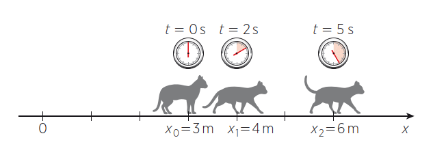

Nell’esempio in figura il gatto nei primi $2$ secondi si è spostato di un metro, dalla posizione $x_0 = 3\; m$ m alla posizione $x_1 = 4\; m$. Le <u>variazioni</u> di una quantità si indicano di solito con il simbolo $\Delta$, per cui 
$$
Δx_{01} = x_1 - x_0 = 4\;m - 3\; m = 1\; m
$$
(lo spostamento nei primi due secondi è uguale alla posizione all’istante $2\; s$ meno la posizione all’istante iniziale).

### Avanti ed Indietro nello spazio: distanza percorsa

Non c’è nessun motivo perché il gatto vada sempre nello stesso verso, da sinistra a destra: potrebbe anche tornare indietro. Ciò corrisponde a una situazione come quella rappresentata in figura

Di conseguenza lo spostamento totale su un percorso di andata e ritorno è nullo, anche se non è nulla la distanza percorsa
$$
\Delta x_{02} = x_2 - x_0 = 3 - 3 = 0
$$
Per tener conto di questo fatto introduciamo una nuova grandezza, che chiamiamo appunto **distanza percorsa** e che si ottiene sommando tutti gli spostamenti in valore assoluto, cioè considerandoli positivi. 

$$
\Delta s_{02} = |\Delta x_{01}| - |\Delta x_{12}| = 3 + 3 = 6
$$

### Istanti ed intervalli di tempo

Anche il tempo, come lo spazio, può essere rappresentato in maniera rigorosa mediante un sistema di riferimento cartesiano. Tale sistema è composto dall’unico asse del tempo $t$, per cui possiamo ragionare in maniera analoga al caso del moto rettilineo.
Così come nello spazio abbiamo le posizioni $x_0$, $x_1$, $x_2$ ecc., sull’asse del tempo abbiamo gli istanti $t_0$, $t_1$, $t_2$ ecc.

Ciascun istante così contrassegnato corrisponde a una lettura del cronometro ed è espresso in secondi nel Sistema Internazionale. Anche per il tempo si possono indicare le variazioni nello stesso modo: l’intervallo di tempo $\Delta t$ è definito come la differenza tra due istanti: 
$\Delta t_{01} = t_1 - t_0 = 2\; s - 0\; s = 2\; s$: l’intervallo di tempo tra gli istanti $t_0$ e $t_1$ è pari a $2$ secondi. Se stiamo osservando un fenomeno che si svolge tra questi due istanti di tempo, diciamo che la sua durata è $2\; s$, in altre parole, il tempo impiegato dal gatto per andare dalla posizione $x_0$ ad $x_1$ è $2$ secondi.

### Grafico Spazio-Tempo (Diagramma Orario)

Quando gli assi spaziale e temporale vengono usati insieme per definire un piano, il moto può essere descritto in modo molto compatto ed efficace attraverso una rappresentazione astratta detta grafico spazio-tempo. Per disegnarlo bisogna conoscere le posizioni del corpo nel tempo: gli istanti e le posizioni corrispondenti sono le coordinate dei punti della curva che rappresenta il moto.

Il grafico spazio-tempo di un moto rettilineo è l’insieme dei punti del piano che hanno come coordinate gli istanti e le posizioni corrispondenti.
Analizziamo nuovamente il moto del gatto e rappresentiamo le posizioni $x_0$, $x_1$, $x_2$ in un piano in cui l’asse $x$ sia verticale e l’asse $t$ orizzontale.

Per poter disegnare il grafico spazio-tempo del moto del gatto dovremmo conoscere anche ciò che accaduto tra i punti segnati, cioè dovremmo conoscere le posizioni del gatto istante per istante.

Conoscere il grafico spazio-tempo è importante, perché permette di ricavare tutte le informazioni sul moto che rappresenta. Per esempio, leggendo il grafico vediamo che all’istante $t^* = 3,5\; s$ il gatto si trova a una distanza di $5\; m$ dall’origine.

### Grafico Spazio-Tempo e Traiettorie

Traiettoria e grafico spazio-tempo sono due cose molto diverse. Un moto può essere rettilineo, ossia vere una traiettoria rettilinea, anche se il grafico spazio-tempo che lo rappresenta non è una retta. Il grafico spazio-tempo contiene infatti informazioni sul tempo, a differenza della traiettoria, che ci dà solo informazioni spaziali. Il fatto che il moto si svolga lungo una retta è espresso dal fatto che le posizioni si trovano su un unico asse. 

Nella vita di tutti i giorni è molto più comune avere a che fare con moti qualsiasi, di oggetti che spaziano liberamente in tutte le direzioni. Anche i treni, che non possono lasciare il loro binario, in realtà compiono curve, salite e discese, per cui il loro moto avviene in uno spazio tridimensionale. Tuttavia per studiare il moto di un treno non è necessario utilizzare tre assi cartesiani, ma si può fare un’approssimazione e trattarlo come se fosse rettilineo. 
Noi sappiamo su quale traiettoria si muoverà Il treno, infatti, il treno è <u>vincolato</u> a muoversi su un binario, e se immaginiamo di «stirare» questo binario fino a farlo sovrapporre a una retta possiamo utilizzare l’approssimazione di moto rettilineo. Un moto di questo tipo è detto <u>unidimensionale</u>, in quanto può essere descritto mediante un’unica coordinata spaziale. 
Si possono studiare come unidimensionali anche i moti dei veicoli lungo le strade o il moto di un corpo che lasciato cadere percorre una linea retta fino a terra, non perché sia vincolato ma perché sappiamo quale è la sua traiettoria.

Un moto unidimensionale può essere approssimato con un moto rettilineo, ossia un moto che avviene in una sola direzione (non un solo verso!), per i quali è sufficiente usare un solo asse: la posizione è individuata da un solo numero, la distanza dall’origine dell’asse

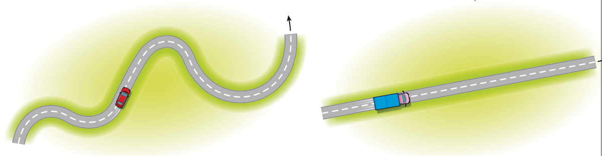

Per i moti che cambiano direzione nel tempo in modo libero, ossia dei quali non conosciamo la traiettoria ma che rimangono in uno stesso piano, ad esempio una formica che cammina su un pavimento, sono necessarie due coordinate per individuare la posizione dell'oggetto in movimento.

Se il corpo in movimento non è vincolato ad un piano ma si muove, sempre in modo libero, nello spazio, come un uccello o un aereo, sono necessarie tre coordinate per la sua posizione.

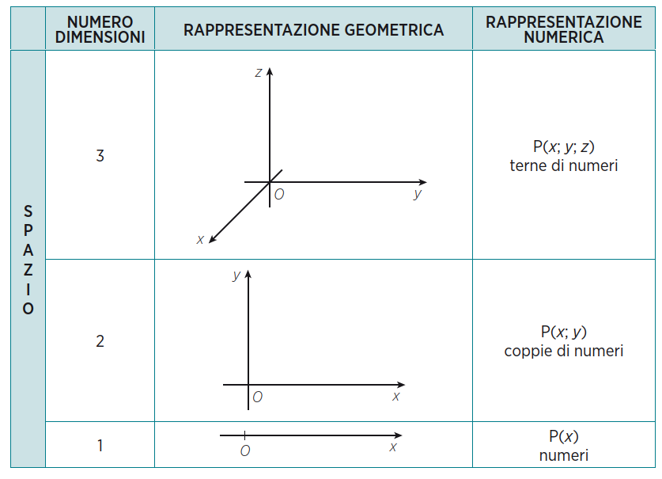

### ESERCIZIO 1.1

a) Lungo un’autostrada due automobili $A$ e $B$ procedono a velocità diverse lungo la stessa direzione. Alle $\text{13:14}$ l’automobile $A$ supera l’automobile $B$, all’altezza del kilometro $\text{124}$. Alle $\text{13:00}$ l’automobile $A$ si trovava al $\text{94}$-esimo kilometro, mentre l’automobile $B$ al $\text{97}$-esimo. Disegna sullo stesso piano cartesiano i grafici spazio-tempo di entrambe le automobili, usando colori diversi per ciascuna di esse.

b) Durante un esperimento didattico in cui si studia il moto di un carrello vengono raccolti i dati nella seguente tabella:
$$
\begin{array}{|c|c|}
\hline
\textbf{Istante} & \textbf{Posizione} \\ 	 
\textbf{(s)} & \textbf{(cm)} \\ 	 
\hline
0.0 & 4.2  \\
\hline
0.3 & 35.3  \\
\hline
0.6 & 66.4  \\
\hline
0.9 & 97.5  \\
\hline
1.2 & 128.6  \\
\hline
\end{array}
$$

- Disegna il grafico spazio-tempo;
- Calcola gli spostamenti ogni $0.3$ secondi.

### ESERCIZIO 1.2

a)  Un vettore di modulo pari a $7.0$ unità giace su un piano ed è orientato in modo da formare un angolo di $30^\circ$ con l’asse $x$. Disegnalo e calcola le sue componenti cartesiane.

b) Durante il moto di un corpo sul piano, le componenti cartesiane di tre vettori posizione negli istanti $t_1 = 0\; s$, $t_2 = 3,5\; s$, $t_3 = 6\; s$ sono (in metri): $\vec{s_1} =$ $\begin{pmatrix} 0 \\ 4 \end{pmatrix}$, $\vec{s_2} =$ $\begin{pmatrix} 6 \\ 4 \end{pmatrix}$, $\vec{s_3} =$ $\begin{pmatrix} 4.5 \\ 1 \end{pmatrix}$. Disegna i vettori posizione e spostamento del corpo e calcola il modulo del vettore spostamento complessivo.

c) Due alpinisti partono alle $\text{7:00}$ e raggiungono la base di una parete verticale percorrendo un pendio in salita lungo $500\; m$; successivamente scalano la parete, lunga $150\; m$. La salita termina alle $\text{11:15}$, a $400$ metri di quota sopra il livello di partenza.
- Rappresenta la situazione con un disegno dei vettori spostamento degli alpinisti. 
- Calcola l’angolo di inclinazione del pendio rispetto all’orizzontale.

## UNITA' 3: La Velocità

Per valutare il moto di un corpo è importante conoscere la sua posizione e l’istante di tempo corrispondente. Il concetto di velocità ci permette di confrontare distanze percorse e intervalli di tempo impiegati.
Analizziamo i grafici spazio-tempo relativi a due gatti che si spostano nello spazio lungo una retta

Il gatto del primo grafico in $5$ secondi si sposta tra i punti di coordinate $2\; m$ e $7\; m$, cioè:
$$
\Delta t_{01} = t_1 - t_0 = 5\; s - 0\; s = 5\; s \\
\Delta x_{01} = x_1 - x_0 = 7\; m - 2\; m = 5\; m
$$
Il secondo gatto compie lo stesso spostamento, ma impiega un tempo diverso:
$$
\Delta t_{01} = t_1 - t_0 = 10\; s - 0\; s = 10\; s \\
\Delta x_{01} = x_1 - x_0 = 7\; m - 2\; m = 5\; m
$$
cioè percorre $5$ metri in $10$ secondi. 
I moti dei due gatti sono entrambi rettilinei e si svolgono su un tratto lungo $5\; m$, ma hanno durate diverse.
Diciamo quindi che il primo gatto è stato più veloce del secondo perché ha impiegato <u>meno tempo a percorrere la stessa distanza</u>.

In fisica è necessario precisare che la velocità di cui si parla è una velocità media, cioè di una grandezza che si riferisce al moto nel suo insieme. Infatti non è detto che il secondo gatto non sia stato fermo per gran parte del tempo, per poi raggiungere la posizione finale con un balzo rapidissimo. 
Attraverso la rappresentazione grafica del moto osserviamo che la velocità media dipende soltanto dai punti iniziale e finale del moto e non da quello che accade tra essi. Ciò significa che possiamo ignorare la forma della curva e porre l’attenzione solo sul segmento che unisce i due punti.

Allo stesso modo possiamo dire che andrebbe più veloce il gatto che, in uno <u>stesso tempo percorre più distanza</u>: in pratica la velocità media misura la distanza percorsa in una unità di tempo, ossia:

> $\triangle$ La **velocità media** è uguale al rapporto tra lo spostamento che compie un corpo e il tempo che impiega a compierlo.
> $$
> v_m = \dfrac{\Delta x}{\Delta t}
> $$

Nel Sistema Internazionale lo spostamento si misura in metri e l’intervallo di tempo in secondi. Da queste unità di misura si ricava quella della velocità media: il metro al secondo.

Facciamo un secondo esempio. Immaginiamo una gara di corsa che si svolge lungo un tratto rettilineo tra un punto di partenza e uno di arrivo uguali per tutti. I partecipanti partono tutti insieme all’avvio del cronometro, ma impiegano tempi diversi a raggiungere il traguardo e perciò le loro velocità medie sono diverse.

Dato che l’atleta più veloce è quello che impiega meno tempo a raggiungere il traguardo, la velocità media maggiore corrisponde al segmento che ha una pendenza maggiore, cioè è quello che forma un angolo maggiore con l’asse del tempo. Analogamente, all’atleta più lento corrisponde un segmento con pendenza minore. Un atleta che rimanesse fermo alla partenza sarebbe rappresentato su un grafico da un segmento con pendenza nulla, cioè parallelo all’asse del tempo: questa rappresentazione corrisponde a una posizione che rimane costante allo scorrere del tempo.
Ecco dunque una relazione tra la velocità ed i grafici spazio-temporali:

>
> $\triangle$ La velocità media è data dalla pendenza del segmento che unisce i punti iniziale $A$ e finale $B$ del moto in un grafico spazio-tempo.
>

Sapendo che la pendenza è misurata dalla t<u>angente trigonometrica</u> dell'angolo che la retta, di cui il segmento fa parte, forma con l'asse orizzontale, possiamo dire che la velocità coincide con tale tangente, e quindi coincide anche con il <u>coefficiente angolare</u> della stessa retta nel piano spazio-tempo.

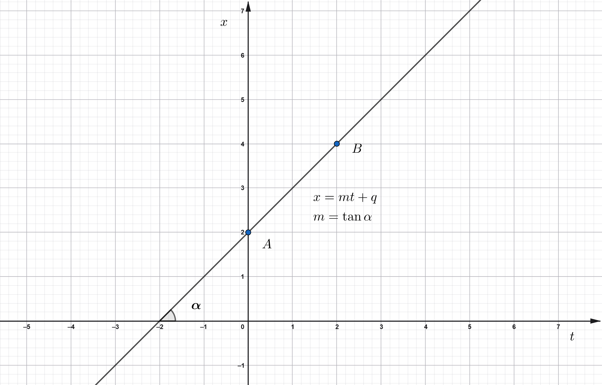

### La Distanza Percorsa

Dato che su un percorso chiuso lo spostamento è nullo (in quanto si ritorna nella stessa posizione), anche se la distanza percorsa non lo è, può essere utile definire la velocità media come rapporto tra spazio percorso e tempo impiegato a percorrerla:

$$
v_m = \dfrac{\Delta s}{\Delta t}
$$
dove $\Delta s$ è la somma degli spostamenti presi in valore assoluto:
$$
\Delta s = |\Delta x_{01}| + |\Delta x_{12}| + ...
$$

### Uso della Velocità Media e le unità del S.I.

Nella vita di tutti i giorni capita spesso di usare la formula della velocità media, per esempio quando viaggiamo: se impieghiamo $2\; h$ per andare da una città a un’altra che dista $200\; km$ dalla prima calcoliamo immediatamente che la nostra velocità (media) è di $100\; km/h$. E' semplice anche calcolare che, per percorrere $250\; km$ con una velocità media di $100\; km/h$ impiegheremmo $2.5\; h$, perché siamo abituati a fare i calcoli in $Km/h$.

Capita spesso di dover passare dalla velocità misurata in $Km/h$ alla stessa velocità misurata in $m/s$. Poiché $1\; Km = 1\,000 \; m$ e $1\; h = 3\,600\; s$ abbiamo

a) $1\; \dfrac{km}{h} = \dfrac{1\,000}{3\,600}\; \dfrac{m}{s}$;   dividendo per $1\,000$ la seconda frazione:

b) $1\; \dfrac{km}{h} = \dfrac{1}{3,6}\; \dfrac{m}{s}$   ed allora

c) $1\; \dfrac{m}{s} = 3,6\; \dfrac{km}{h}$   per cui:
$$
1\; m/s = 3.6\; Km/h
$$

Vediamo ora qualche esempio di calcolo con metri e secondi, unità di misura del Sistema Internazionale.

#### ESEMPIO 1

Quanto vale in $m/s$ la velocità di $120\; km/h$?

Da $1\; m/s = 3,6\; km/h$ abbiamo $\dfrac{1}{3.6}\; m/s = 1\; km/h$ e moltiplicando entrambi i membri per $120$:

a) $120 \cdot \dfrac{1}{3.6} m/s = 120\; Km/h$;

b) $33.33\; m/s = 120\; Km/h$.

La velocità è di $33.33\; Km/h$.    $\bullet$

#### ESEMPIO 2

Un ragazzo è uscito di casa alle $\text{15:30}$ e ha raggiunto la casa di un amico alle $\text{15:50}$. Se la velocità media lungo il tragitto è stata di $2.0\; m/s$, quanta strada ha percorso?

Abbiamo che $\Delta t = \text{15:50} - \text{15:30} = 20\; min = 1200\; s$. Dalla formula $v_m = \dfrac{\Delta s}{\Delta t}$, sostituendo i numeri alle lettere:
$$
20 = \dfrac{\Delta s}{1200} \\
\Delta s = 2 \cdot 1200 \longrightarrow 2400\; m
$$
Il ragazzo ha percorso $2.4\; Km$.    $\bullet$

### La Velocità Istantanea

La velocità media dà informazioni sul moto nel suo insieme, ma non dice nulla a proposito di ciò che accade <u>durante</u> il tragitto. In un una gara ciclistica, per esempio, due atleti che arrivano insieme al traguardo hanno la stessa velocità media sulla tappa, anche se ciascuno di essi potrebbe avere accelerato, rallentato o essersi fermato più volte in momenti e per periodi di tempo differenti dall’altro. Cioè, anche se le velocità medie sono le stesse, i due ciclisti potrebbero aver avuto, istante per istante, velocità diverse.

Come si calcola quindi la velocità in un determinato istante, cioè la velocità istantanea? 

Abbiamo definito l’istante come la coordinata di un punto sull’asse del tempo, mentre la velocità media contiene un intervallo, cioè una differenza tra istanti. In questo caso l’intervallo di tempo è zero perché consideriamo un solo istante. Bisogna forse utilizzare una formula diversa?
In realtà non serve un’altra formula, ma è necessario approfondire il ragionamento.

Per capire il concetto di velocità istantanea partiamo dal grafico spazio-tempo di un moto qualsiasi.

La velocità media tra gli istanti $t_1$ e $t_2$ è data dalla <u>pendenza</u> del segmento $P_1P_2$, cioè della retta cui il segmento appartiene. Immaginiamo ora di prendere $t_2$ sempre più vicino a $t_1$, fino a quando il segmento non si vede quasi più.

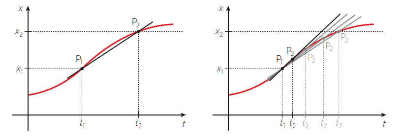

Gli istanti $t_1$ e $t_2$ sono vicinissimi, ma restano comunque due punti che individuano un intervallo di tempo $\Delta t$; quindi possiamo continuare a usare la formula della velocità media. Tuttavia, se si vuole definire una velocità istantanea, bisogna continuare a spostare $t_2$ verso $t_1$: i punti $P_1$ e $P_2$ saranno sempre più vicini e il segmento diventerà quasi un punto. Mentre $t_2$ si avvicina a $t_1$, anche $x_2$ si avvicina a $x_1$: $P_2$ si avvicina a $P_1$ e la retta diventa la tangente alla curva del grafico. 

La velocità istantanea in $t_1$ si ottiene quindi come limite della velocità media per $t_2$ che tende a $t_1$:
$$
\displaystyle \lim_{t_2 \to t_1} \dfrac{x_2 - x_1}{t_2 - t_1} = \displaystyle \lim_{t_2 \to t_1} \dfrac{\Delta x}{\Delta t} = v(t_1)
$$

Il limite è un numero finito e per comprenderlo bisogna tornare alla osservazione sulla <u>velocità come coefficiente angolare</u> della retta che unisce i punti $P_1$ e $P_2$ nel piano spazio-tempo; guardando la figura precedente si nota come le rette che uniscono i punti mentre $P_2$ tende a $P_1$ tendano tutte alla tangente del grafico del moto nel punto $(t_1, P_1)$, che avrà quindi come coefficiente angolare $v(t_1)$.
>
> $\triangle$ La **velocità istantanea** nel punto $(t, P(t))$ è uguale al coefficiente angolare della retta tangente al grafico del moto nel piano cartesiano spazio-tempo in quel punto.
>

### Il Moto Rettilineo Uniforme
In generale, in un <u>moto rettilineo qualsiasi</u> la velocità istantanea cambia nel tempo, come si vede confrontando tra loro le pendenze delle tangenti in diversi punti di un ipotetico grafico spazio-tempo.

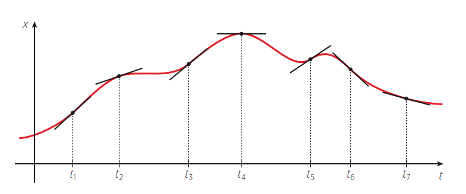

Se la velocità istantanea non cambia mai durante il moto, questo è detto <u>moto rettilineo uniforme</u> e corrisponde alla situazione del grafico seguente, in cui si vede che la pendenza delle tangenti in ogni istante coincide con la pendenza della retta che unisce gli estremi del moto. La velocità è, istante per istante, sempre uguale alla velocità media.

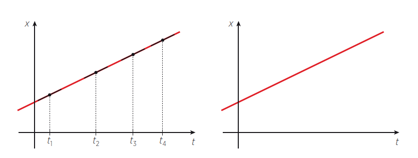

>
> $\triangle$ In un moto **rettilineo uniforme** la velocità istantanea coincide con la velocità media in ogni punto del moto.
>

Su qualsiasi intervallo si vada a calcolare la velocità media, questa ha sempre lo stesso valore, uguale al valore calcolato tra gli estremi. In altri termini, il rapporto tra due spostamenti qualsiasi durante un moto rettilineo uniforme è uguale al rapporto tra i due intervalli di tempo corrispondenti, cioè spazio percorso e tempo impiegato sono direttamente proporzionali.

>
> $\triangle$ Il **grafico di un moto rettilineo uniforme** nel piano spazio-tempo è una **retta**  la cui pendenza corrisponde alla velocità costante e intersezione di tale retta con l’asse dello spazio corrisponde alla posizione di partenza rispetto all’origine scelta. 
>

### Legge Oraria del Moto rettilineo uniforme

Galileo Galilei fu il primo a introdurre il tempo nello studio dei moti. In particolare si occupò dei corpi in caduta libera, che all’epoca si riteneva avvenissero a velocità costante e dipendente dal peso. Galileo iniziò a chiedersi che cosa accade, nel tempo, mentre il corpo cade, e riuscì a scoprire non solo che la velocità non dipende dal peso ma che non è nemmeno costante, perché aumenta seguendo una regola che vedremo più avanti. 

Un moto è noto quando si sa fornire istante per istante la posizione del corpo: come scoprì Galileo, alcuni moti possono essere ben descritti da una formula matematica, detta <u>legge oraria</u>.

>
> $\triangle$ La **legge oraria** di un moto è una regola che stabilisce come varia la <u>posizione</u> di un corpo al variare del <u>tempo</u>. 
>

Nel caso del moto rettilineo uniforme, la legge oraria si ricava a partire dalla formula della velocità media:
$$
v_m = \dfrac{\Delta x}{\Delta t}
$$

che sappiamo essere uguale alla velocità istantanea $v(t)$ costante durante il moto. Siccome siamo interessati a scrivere una formula che valga per tutti gli istanti, consideriamo lo spostamento tra l’istante iniziale $t_0$, che corrisponde alla posizione $x_0$, e un generico istante $t$ successivo, senza indice, che corrisponde alla generica posizione $x$.

Quindi scriviamo una formula della velocità media tra il punto iniziale del moto e un punto qualsiasi: 
$$
v_m = \dfrac{x - x_0}{t - t_0}
$$

Questa formula è vera per qualsiasi istante $t$ e posizione $x$ corrispondente, perché il moto è uniforme e la velocità media coincide con quella istantanea costante $v$ su tutto il moto.

Se vogliamo trovare la posizione $x$ del corpo al trascorrere del tempo, risolviamo l'equazione data dalla formula precedente, considerando $x$ come incognita (consideriamo $v_m = v$ e poniamo $t_0 = 0$):

a) $v = \dfrac{x - x_0}{t}$;    moltiplicando per $t$

b) $v \cdot t = x - x_0$    trasportando $-x_0$ a sinistra e scambiando l'ordine delle espressioni:
$$
x = v \cdot t + x_0
$$
Questa formula fornisce la posizione $x$ di un corpo che si muove a velocità costante lungo una retta, al variare del tempo $t$. Se conosciamo $x_0$ e $v$, basta che sostituiamo nella legge del moto l’istante di tempo che ci interessa e otteniamo la corrispondente posizione del corpo.

Una osservazione importante è che, dalla formula precedente, abbiamo $x - x_0 = v \cdot t$, cioè **lo spazio percorso è uguale all'area sotto al grafico della velocità** nell'intervallo $\Delta t$ , che essendo un rettangolo, si ottiene moltiplicando la base $\Delta t$ per l'altezza $v$.

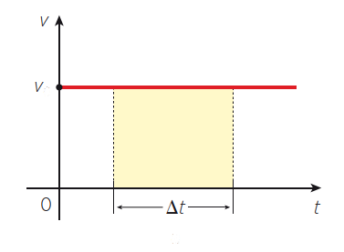

#### ESEMPIO 3

Un ciclista si muove di moto rettilineo uniforme con una velocità di $25\; km/h$. Se fa partire il cronometro quando si trova a $1.0\; km$ da casa sua, a quale distanza da questa si trova dopo $15\; min$?

Utilizzando le unità di misura del Sistema Internazionale abbiamo:
$$
v = 25\; Km/h = \dfrac{25}{3.6}\; m/s = 6.9\; m/s
$$
Dopo $15\; min$ il ciclista è a $7.2\; km$ da casa.     $\bullet$

#### ESEMPIO 4

Se la velocità è negativa, il grafico del moto nel piano spazio-tempo ha un’inclinazione negativa, in quanto il moto descritto avviene in verso opposto all’asse.

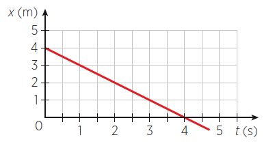

Calcolando la velocità tra i punti $(0; 4)$ e $(3; 1)$ avremo:
$$
v = \dfrac{x_2 - x_1}{t_2 - t_1} = \dfrac{1 - 4}{3 - 0} = -1\; m/s
$$
Velocità negative corrispondono a spostamenti negativi, in quanto gli intervalli di tempo sono sempre positivi.

Quale è la legge del moto?     $\bullet$

### Vettori Posizione e Vettori Spostamento

Consideriamo un moto in un piano, come ad esempio una moto che si muove in uno spazio aperto, e che fa una traiettoria come quella in figura.

Se chiamiamo $P$ il generico punto che individua la <u>posizione</u> del motociclista, la freccia che collega l’origine degli assi a tale punto rappresenta il <u>vettore posizione</u> $\vec{s}$ del motociclista nel piano.

Al passare del tempo, se il motociclista si muove, il punto $P$ fa una traiettoria ed il vettore posizione $\vec{s}$ si allunga, si accorcia, cambia orientazione: in una parola, varia. 

Come abbiamo già visto, lo «<u>spostamento</u>» è la variazione della posizione, e lo spostamento è dato dalla differenza tra due vettori posizione.  Se $\vec{s_1}$ ed $\vec{s_2}$ sono i vettori posizione negli istanti $t_1$ e $t_2$, tenendo presente la regola del parallelogramma e che la differenza tra due vettori è uguale alla somma tra l’uno e l’opposto dell’altro, si vede che:
$$
\Delta \vec{s} = \vec{s_2} - \vec{s_1}
$$
Lo spostamento $\Delta \vec{s}$ è un vettore diretto dal punto $P1$  al punto $P2$.

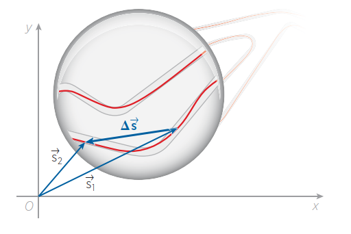

Il suo modulo è tanto maggiore quanto maggiore è stata la variazione di $\vec{s}$.

### Il Vettore Velocità

Estendiamo ora la definizione di velocità media del caso unidimensionale al caso vettoriale.

>
>$\triangle$ La **velocità vettoriale media** è un vettore che ha stessa direzione e stesso verso del vettore spostamento ed è  il rapporto tra lo spostamento vettoriale e l’intervallo di tempo:
>$$
>\vec{v} = \dfrac{\Delta s}{\Delta t}
>$$
>

Quando l’intervallo di tempo diventa infinitamente piccolo (nel modo già discusso nel caso unidimensionale) il vettore $\vec{v}$ diventa una velocità vettoriale <u>istantanea</u> e la sua direzione è quella della <u>tangente alla traiettoria</u>.

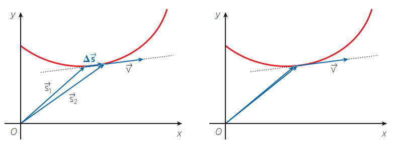

Tra velocità vettoriale e <u>velocità scalare</u> (ossia il modulo del vettore, per intenderci) può sorgere qualche confusione. Se diciamo, per esempio, che "una curva è percorsa a velocità costante", ci stiamo riferendo alla grandezza scalare, perché in una curva la direzione del vettore cambia istante per istante. Se invece vogliamo che sia <u>costante il vettore velocità</u>, allora dobbiamo necessariamente riferirci a <u>traiettorie rettilinee</u>. 

La velocità istantanea è ottenuta dalla velocità media mediante un passaggio al limite. La formula $\vec{v} = \dfrac{\Delta s}{\Delta t}$ è un rapporto tra due incrementi (rapporto incrementale): se scriviamo $t_2 = t_1 + \Delta t$ abbiamo che in ogni istante $t$ del moto $x = x(t) = x(t + \Delta t)$ ed allora la velocità istantanea è il limite del rapporto incrementale per $\Delta t \rightarrow 0$ :

$$
v(t) = \displaystyle \lim_{\Delta t \to 0} \dfrac{x(t + \Delta t) - x(t)}{\Delta t} = x'(t)
$$
Quindi possiamo dire che se la posizione del corpo in movimento $x(t)$ è espresso da una funzione, la velocità istantanea è la derivata di tale funzione rispetto al tempo. 

>
> $\triangle$ La **velocità istantanea** è la derivata del <u>vettore posizione</u> rispetto al tempo. 
> 

### ESERCIZIO 3.1

a) Nel 2009 l’atleta giamaicano Usain Bolt ha corso i $100$ metri piani in $9.58\; s$. Qual è stata la sua velocità media in $m/s$? Ed in $Km/h$?

b) Quanto tempo impiega una lumaca a percorrere $3,0\; m$ se la sua velocità media è di $0.05\; km/h$? 

### ESERCIZIO 3.2

a)  Quali elementi di questo grafico contengono le informazioni «il moto è rettilineo» e «il moto è uniforme»?

b) Scrivi la legge oraria del moto descritto dal seguente grafico spazio-tempo.

### ESERCIZIO 3.3

Secondo la teoria della deriva dei continenti di Wegener, l’Oceano Atlantico ha iniziato a formarsi con la divisione della Pangea e da allora è in continua espansione. Il Sud America e l’Africa si allontanano con una velocità di circa $6\; cm/anno$ e attualmente hanno una distanza media di $7\,000\; km$. 
- Supponendo costante la velocità di allontanamento stima quanto tempo fa i due continenti erano uniti.
- Perché parliamo di «stima»? 

### ESERCIZIO 3.4

a) Una moto parte da Napoli verso Roma nello stesso istante in cui un’altra moto parte da Roma verso Napoli. La moto da Napoli viaggia ad una velocità di $40 \;Km/h$ mentre l’altra a $20 \;Km/h$. Se la distanza tra le due città è di $150 \;Km$ quanto tempo impiegheranno I due mezzi per incontrarsi e quale distanza avranno percorso?  

b) Un viaggiatore impiega $12$ ore per un tragitto di andata e ritorno, con una velocità di $20 \;Km/h$ per l’andata e $30 \;Km/h$ per il ritorno. Trova la durata (in ore) del tragitto di andata e di quello del ritorno.  

c) Un postino che viaggia a $30 \;Km/h$ è in viaggio da $3$ ore. Un altro postino, inviato per raggiungerlo, viaggia a $50 \;Km/h$. Quanto impiegherà il secondo per raggiungere il primo? Quale distanza coprirà?  

## UNITA' 4: L'Accelerazione

Per illustrare cosa sia l'accelerazione vediamo alcuni esempi di fenomeni della vita quotidiana. Tutti noi sappiamo che se ci cade a terra il cellulare corriamo il rischio che si rompa. Se cade da una altezza di $20\; cm$ sicuramente resta intero, se cade da un metro e mezzo potrebbe rompersi, mentre se cade dalla finestra del secondo piano si rompe sicuramente.

Questo perché quando sbatte sul suolo cadendo da $20\; cm$ la sua velocità sarà bassa, mentre dal secondo piano è troppo alta perché possa resistere all'urto. Il cellulare infatti da quando comincia a cadere, aumenta la sua velocità verticale man mano che passa il tempo e, se si ferma a terra dopo $20\; cm$ urterà ad una bassa velocità, mentre se cade per qualche altra frazione di secondo, raggiungerà una velocità tale da andare in frantumi.

L'aumento (o variazione) della velocità nel tempo si chiama <u>accelerazione</u>.

Gli appassionati di motori sportivi sanno bene che tra i dati più indicativi sulle caratteristiche di un’automobile o di una motocicletta c’è proprio la sua accelerazione. Questa non viene espressa in forma esplicita, ma attraverso informazioni sul tempo impiegato da un certo veicolo a raggiungere la velocità di $100\; km/h$. «Da zero a cento in tot secondi» è un’espressione tipica delle riviste specializzate.
Intuitivamente ci rendiamo subito conto che l’auto che impiega meno tempo a raggiungere la velocità di $100\;  km/h$ è quella capace di un’accelerazione maggiore.

L'accelerazione è quindi la "velocità della velocità": misura quanto velocemente cambia la velocità rapportandola ad un intervallo di tempo, come è stato fatto per gli spostamenti.

Se riportiamo in un grafico cartesiano velocità-tempo i dati di un moto abbiamo che l'accelerazione (media) tra due istanti è data da $a_m = \dfrac{\Delta v}{\Delta t}$.   

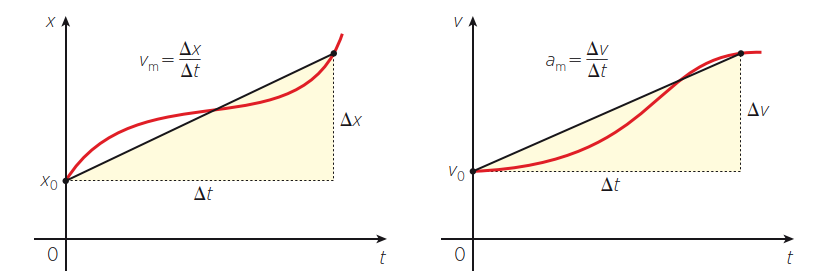

>
>$\triangle$ L’accelerazione media è uguale al rapporto tra la variazione di velocità e il tempo impiegato a compiere tale variazione. E' misurata dalla pendenza del segmento che unisce gli estremi del moto sul grafico velocità-tempo.
>$$
>a_m = \dfrac{\Delta v}{\Delta t}
>$$

L’unità di misura dell’accelerazione media è  il metro al secondo quadrato (o metro al secondo per secondo).

L’accelerazione è dunque una variazione di una variazione della posizione, e questa sua complicazione la rende difficile da usare nella vita di tutti i giorni. Infatti, anche se capita spesso di usare i verbi «accelerare» o «rallentare», non specifichiamo mai di quanto. Non siamo soliti quantificare l’accelerazione e infatti non abbiamo per essa un’unità di misura pratica come per la velocità abbiamo i kilometri orari.

### Il segno dell’accelerazione media

Dato che $\Delta t$ è sempre positivo, il segno dell’accelerazione media dipende da $\Delta v$, che può anche essere negativo o nullo. Se l’accelerazione è nulla la velocità è costante e il moto è uniforme. Se l’accelerazione è negativa significa che <u>la variazione di velocità è negativa</u>: questo accade o quando il corpo <u>rallenta</u> mentre procede nello stesso verso dell’asse dello spazio, oppure quando la velocità <u>aumenta in verso opposto</u>.

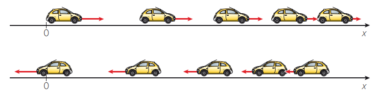

Se nell'esempio precedente l'automobile va verso sinistra ed accelera da $-3\; Km/h$ a $-7\; Km/h$ l'accelerazione sarà negativa perché $-7 -(-3) = -4$ ma sarà positiva se decelera verso sinistra, perché  $-3 -(-7) = +4$.

#### ESEMPIO 1

Un’auto sportiva impiega $4.3\; s$ a passare da $0$ a $100\; km/h$. Quanto vale la sua accelerazione media?

Applichiamo la formula $a_m = \dfrac{\Delta v}{\Delta t}$ dopo aver trasformato la velocità in metri al secondo: 
$$
\Delta v = 100; Km/h = \dfrac{100}{3,6} m/s = 27.8\; m/s
$$
sostituendo i dati alle lettere:

a) $a_m = \dfrac{\Delta v}{\Delta t}, \{\Delta v = 27.8, \Delta t = 4.3\}$;

b) $a_m = \dfrac{27.8}{4.3} \longrightarrow 6.47$.

#### ESEMPIO 2

Durante una frenata della durata di $4.0\; s$ un’auto ha un’accelerazione media di $-5.5\; m/s^2$. A quale velocità, in $km/h$, andava il veicolo prima di frenare?

Applichiamo la formula $a_m = \dfrac{\Delta v}{\Delta t}$ sostituendo i dati alle lettere:

a) $a_m = \dfrac{\Delta v}{\Delta t}, \{a_m = -5.5, \Delta t = 4.0\}$;

b) $-5.5 = \dfrac{\Delta v}{4}$;

c) $\Delta v = -5.5 \cdot 4 \longrightarrow -22\; m/s$.

Poiché $\Delta v = v_1 - v_0$ e la macchina si arresta cioè $v_1 = 0$, abbiamo che $-v_0 = -22$ cioè la velocità iniziale era di $22\; m/s$, che in $Km/h$ sono $22 \cdot \dfrac{3600}{1000} \longrightarrow 79.2\; Km/h$.

### Il Moto Uniformemente Accelerato

Analogamente alla velocità istantanea, si può definire un’accelerazione istantanea come un’accelerazione media tra due istanti infinitamente vicini tra loro, cioè che tendono ad avvicinarsi l’uno all’altro sempre di più, come abbiamo già visto. Questa corrisponde alla pendenza della tangente alla curva che rappresenta il moto sul grafico velocità-tempo.

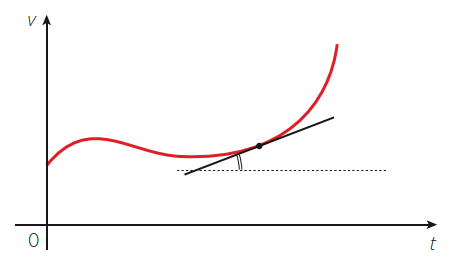

Quando l’accelerazione istantanea non cambia durante il moto, questo è detto moto uniformemente accelerato.

>
>$\triangle$ Un moto rettilineo è **uniformemente accelerato** quando si svolge con accelerazione costante.
>

Istante per istante l’accelerazione istantanea coincide con l’accelerazione media, e le variazioni di velocità risultano essere direttamente proporzionali ai tempi impiegati per compierle. In un moto rettilineo uniformemente accelerato la velocità varia di quantità uguali in tempi uguali. Il grafico velocità-tempo di un moto uniformemente accelerato è una retta la cui pendenza rappresenta l’accelerazione costante. Consideriamo le tre situazioni seguenti.

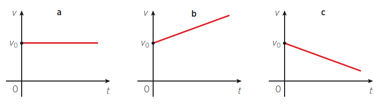

- caso a. Se il grafico della velocità è una retta orizzontale, la velocità non varia ed il moto è rettilineo uniforme;
- caso b. Se la velocità iniziale è $v_0$ e la pendenza della retta è positiva, la velocità aumenta con accelerazione costante;
- caso c. Se la velocità iniziale è $v_0$ e e la pendenza della retta è positiva, la velocità diminuisce con decelerazione costante.

### La Legge della Velocità

Se al posto della posizione consideriamo la velocità, ecco che in corrispondenza della legge oraria del moto rettilineo uniforme con velocità v (formula (3.5)):
$$
x = x_0 + vt
$$
abbiamo la legge della velocità istantanea nel moto uniformemente accelerato con accelerazione a:
$$
v = v_0 + at
$$
Con la legge della velocità nel moto uniformemente accelerato possiamo fare dei calcoli analoghi a quelli che si fanno con la legge oraria del moto rettilineo uniforme,

#### ESEMPIO 3

Un ciclista frena e dopo $2.5\; s$ raggiunge la velocità di $25\; km/h$, con un’accelerazione costante pari a $-1.4\; m/s^2$ (decelerazione). Qual era la sua velocità iniziale in $km/h$?

I dati sono: $v_1 = 25\; km/h = \dfrac{25}{3.6}\; m/s = 6.9\; m/s$, velocità finale;

$a = -1.4\; m/s^2$, decelerazione (accelerazione negativa);

$t_1 -t_0 = 2.5\; s$, durata della decelerazione.

L'incognita è la velocità iniziale $v_0$. Sostituendo i dati nella formula dell'accelerazione media:

a) $a = \dfrac{v_1 - v_0}{t_1 - t_0}, \{v_1 = 6.9, t_1 - t_0 = 2.5\}$;

b) $-1.4 = \dfrac{6.9 - v_0}{2.5}$;    moltiplicando per $2.5$

c) $-1.4 \cdot 2.5 = 6.9 - v_0$;

d) $v_0 = 6.9 + 3.5$;

e) $v_0 = 10.4; m/s = 10.4 \cdot 3.6\; Km/h \longrightarrow 37.44\; Km/h$

### La Legge Oraria del Moto Uniformemente Accelerato
Abbiamo visto molte delle caratteristiche del moto ad accelerazione costante ed è arrivato il momento di affrontare il problema principale: come varia nel tempo la posizione di un corpo in moto rettilineo uniformemente accelerato? 

Fu Galileo Galilei a porsi per primo questa domanda e a trovare la risposta mentre studiava i corpi in caduta sotto l’azione della gravità, anche se lui non sapeva ancora che i moti che stava studiando erano uniformemente accelerati.

Partiamo da una precedente osservazione: analizzando il grafico velocità-tempo del moto rettilineo uniforme abbiamo trovato che <u>lo spazio percorso è rappresentato dall’area del rettangolo</u> che ha per base la durata e per altezza la velocità costante del moto.

Estendiamo il risultato e diciamo che anche nel moto uniformemente accelerato, lo spazio percorso $\Delta x$ uguaglia l’area sottesa al grafico velocità-tempo. In tal caso si dovrà:

- sommare (o sottrarre) all’area del rettangolo di altezza pari alla velocità iniziale $v_0$ l’area del triangolo che ha per base la durata del moto e per altezza la differenza: $v_1 - v_0$ (o $v_0 - v_1$), oppure
- calcolare l'area del trapezio rettangolo come semi-somma delle basi $\dfrac{1}{2}(v_1 + v_0)$ per l'altezza $\Delta v$

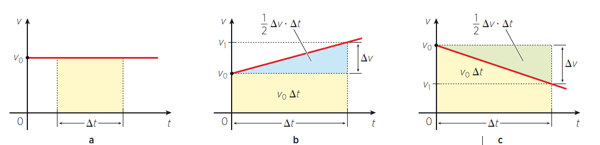

Ricordando che $v_1 - v_0 = a\Delta t$, nel primo casi avremo:

a) $x - x_0 = \dfrac{1}{2}(v_1 - v_0) \Delta t + v_0\Delta t$,     da cui:

b) $x - x_0 = \dfrac{1}{2}a \Delta t \cdot \Delta t  + v_0\Delta t$,     e quindi abbiamo la legge oraria del moto:
$$
x = \dfrac{1}{2}a {\Delta t}^2 + v_0\Delta t + x_0
$$
Nel secondo caso:

a) $x - x_0 = \dfrac{1}{2}(v_1 + v_0) \Delta t$,     da cui, sommando e sottraendo $\dfrac{1}{2}v_0 \Delta t$:

b) $x - x_0 = \dfrac{1}{2}v_1\Delta t + \dfrac{1}{2}v_0 \Delta t + \dfrac{1}{2}v_0 \Delta t - \dfrac{1}{2}v_0 \Delta t$,     da cui, raggruppando:

c) $x - x_0 = \dfrac{1}{2}(v_1 - v_0) \Delta t + v_0\Delta t$,     e sostituendo l'accelerazione:

a) $x - x_0 = \dfrac{1}{2}a {\Delta t}^2 + v_0\Delta t$,     che portando $x_0$ a destra fornisce la legge oraria del moto:
$$
x = \dfrac{1}{2}a {\Delta t}^2 + v_0\Delta t + x_0
$$

#### ESEMPIO 4

Un’automobile procede a $50\; km/h$ quando il conducente agisce sui freni con un’accelerazione di $-3.0\; m/s^2$. Quanto spazio percorre in $4.0\; s$?

Lo spazio percorso $\Delta x$ è dato dalla formula precedente, nella quale dobbiamo sostituire i dati numerici ai simboli, usando le unità del SI:

$v_0 =  50\; km/h$  = $\dfrac{50}{3.6}\;  m/s$ = $14\; m/s$;

$a = -3.0\; m/s^2$;

$\Delta t = 4.0\; s$.

Sostituendo i dati alle lettere nella legge oraria $\Delta x = \dfrac{1}{2}a {\Delta t}^2 + v_0\Delta t$ abbiamo:
$$
\Delta x = (14\; m/s) \cdot (4.0\; s) + 0.5(-3.0\; m/s^2) \cdot (4.0\; s)^2 = 32\; m
$$
Lo spazio percorso è di $32\; m$.    $\bullet$

#### ESEMPIO 5

Quanto tempo impiega un’auto a percorrere $150\; m$, partendo da ferma, con un’accelerazione costante a $3.5\; m/s^2$?

$\Delta x = 150\; m$;

$v_0 = 0$;

$a = 3.5\; m/s^2$;

Sostituendo i dati nella legge oraria $\Delta x = \dfrac{1}{2}a {\Delta t}^2 + v_0\Delta t$;  abbiamo:

a) $\Delta x = \dfrac{1}{2}a {\Delta t}^2 + v_0\Delta t$, $\{\Delta x = 150, v_0 = 0, a = 3.5\}$;

b) $150 = \dfrac{1}{2}3.5 {\Delta t}^2 + 0 \cdot t$,   semplificando si ottiene

c)  $150 =1.75 {\Delta t}^2$,    risolvendo l'equazione di secondo grado abbiamo:

$\Delta t = \sqrt{\dfrac{150}{1.75}} \approx \sqrt{85.714} \approx 9.26$      $\bullet$

Come si può facilmente vedere, il grafico nel piano cartesiano spazio-tempo $(t; x)$ della legge oraria del moto rettilineo uniformemente accelerato è una parabola.

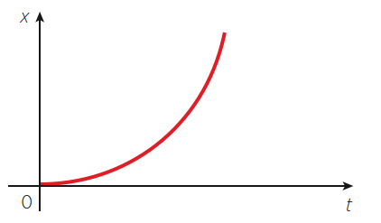

### La Caduta dei Gravi

La legge oraria del moto uniformemente accelerato è stata trovata sperimentalmente da Galileo Galilei nel caso particolare dei corpi in caduta libera per effetto dell’attrazione gravitazionale terrestre. Nel linguaggio della fisica un grave è un corpo soggetto alla forza di gravità che, nel caso dell’attrazione gravitazionale esercitata dalla Terra su un corpo, viene definita forza-peso.

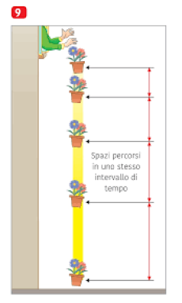

Galileo si accorse che un corpo, mentre cade, è soggetto a un’accelerazione in buona approssimazione costante, detta accelerazione di gravità, diretta verso il basso. Data la sua importanza, a questa accelerazione , che vale $9.8\; m/s^2$ è stato dato il nome "g":
$$
g = 9.8\; m/s^2
$$
Per scrivere la legge oraria di un oggetto che cade da una certa altezza dobbiamo ricordare che, se scegliamo come asse delle posizioni l’asse y, orientato verso l’alto, l’accelerazione risulta negativa perché il corpo si sposta verso l’origine e la sua velocità è negativa.

>
> $\triangle$ La **legge oraria** di un corpo che cade da un’altezza $y_0$ con velocità iniziale nulla è:
>$$
>y = y_0 - \dfrac{1}{2}gt^2
>$$
>

#### ESEMPIO 6

Quanto tempo impiega una mela a cadere dalla sommità di un albero alto $2.5\; m$?

Se poniamo l’origine dell’asse $y$ al livello del suolo, i dati del problema sono:

$y_0 = 2.5\; m$;

$y_1 = 0\; m$;

$g = 9.8\; m/s^2$.

Si tratta di un moto uniformemente accelerato con partenza da fermo, 
per cui nell’istante in cui la mela tocca il suolo si ha (sostituendo alle lettere i dati):

a) $y_1 = y_0 - \dfrac{1}{2}gt^2$, $\{y_0 = 2.5, y_1 = 0, g = 9.8\}$;

b) $0 = 2.5 - 0.5 \cdot 9.8 \cdot t^2$,

c) $0 = 2.5 - 4.9 \cdot t^2$,     e risolvendo l'equazione
$$
t = \sqrt{\dfrac{2.5}{4.9}} \approx \sqrt{0.51} \approx 0.71\; s
$$
La caduta dura circa $0.71$ secondi.       $\bullet$

### Il Vettore Accelerazione
L’accelerazione è una variazione della velocità nel tempo. L’<u>accelerazione vettoriale media</u> si definisce come il rapporto tra la variazione della velocità e l’intervallo di tempo in cui è avvenuta:

$$
a_m  = \dfrac{\Delta \vec{v}}{\Delta t}
$$
Poiché la velocità media è una grandezza vettoriale, lo è anche l'accelerazione.

Anche in questo caso definiamo il vettore <u>accelerazione istantanea</u> come l’accelerazione media su un intervallo di tempo infinitamente piccolo.
Per vedere come è diretta l<u>’accelerazione rispetto alla traiettoria</u> prendiamo due casi particolari:

- moto in cui la velocità non cambia direzione ma solo modulo (moto rettilineo non uniforme);
- moto in cui la velocità non cambia modulo ma solo direzione (moto curvilineo uniforme).

Se il moto è <u>rettilineo e non uniforme</u>, la freccia che rappresenta il vettore velocità si allunga o si accorcia lungo la traiettoria, ma la direzione non cambia: in tal caso l’accelerazione ha la stessa direzione del moto e il verso dipende dal fatto che il vettore velocità si stia allungando o accorciando lungo il senso di marcia.

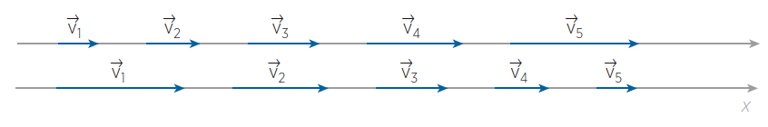

Se invece il moto è <u>curvilineo e uniforme</u>, la freccia che rappresenta il vettore velocità ha sempre la stessa lunghezza e cambia direzione istante per istante. In tal caso l’accelerazione è un vettore diretto verso il centro di curvatura della traiettoria, cioè perpendicolare al moto

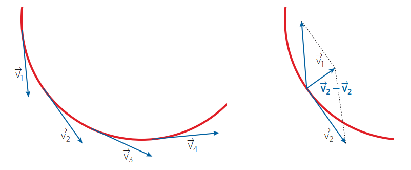

<!--Pag. 154-->

### ESERCIZIO 4.1

Una biglia inizialmente in moto da ovest a est lungo una retta a velocità costante di modulo $2.5\; m/s$ urta contro una parete e inverte il suo moto, mantenendo costante il modulo della velocità.

- Rappresenta graficamente la situazione.
- Quanto vale il modulo del vettore accelerazione?		$R: [5.6\; m/s]$

### ESERCIZIO 4.2

Su strada asciutta, la decelerazione media di un'auto in buone condizioni varia generalmente tra $7\; m/s^2$ e $9\; m/s^2$. Nelle frenate di emergenza con veicoli moderni dotati di sistemi ABS, il valore può raggiungere o superare leggermente $9.8\; m/s^2$.

Quanto durano le frenate con accelerazioni medie di $-7$, $-8$ e $-9.8\; m/s^2$ se la velocità iniziale è $130\; km/h$?

Quale è, nei vari casi, lo spazio di frenata?

### ESERCIZIO 4.3

a) Un cavallo da corsa raggiunge in $2.5$ secondi una velocità di $42\; km/h$ con un’accelerazione costante di $1.7 m/s^2$. 
Quale era la sua velocità iniziale?			$R: \left[7.4\; m/s^2\right]$

b) Un motociclista viaggia a $120\; km/h$ quando inizia a rallentare con accelerazione costante. In $3.5\; s$ la sua velocità è diventata $58\; km/h$. 
Scrivi la legge della velocità.

c) Un tuffatore professionista in gara si tuffa da un trampolino che si trova a un’altezza di $2.5\; m$ dal livello della superficie dell’acqua della piscina.
Considerando nulla la velocità iniziale e trascurabile la resistenza dell’aria, dopo quanto tempo che si è staccato dal trampolino tocca la superficie dell’acqua?			$R: \left[0.7\; s \right]$

### ESERCIZIO 4.4

Achille Piè Veloce e la tartaruga concorrono in una gara in cui devono percorrere $2.0\; km$. Il primo parte da fermo e accelera costantemente con un’accelerazione di $0.7\; m/s^2$, mentre la seconda procede con moto rettilineo uniforme.

Quale dovrebbe essere la velocità minima della tartaruga per battere Achille?

### ESERCIZIO 4.5

Per stimare la profondità di un pozzo misuriamo con un cronometro il tempo che passa tra l’istante in cui lasciamo cadere un sassolino e l’istante in cui percepiamo il rumore dell’impatto con l’acqua. Sappiamo infatti che il suono viaggia a velocità costante pari a circa $340\; m/s$ e che il moto del sassolino in fase di caduta è uniformemente accelerato. 

- Se tale intervallo di tempo è pari a $3.0\; s$, quanto si stima sia profondo il pozzo? 
- Si tratta di una stima per difetto o per eccesso? 

(Suggerimento: imponi l’uguaglianza tra le relazioni che legano lo spazio percorso al tempo impiegato nei due moti di caduta del sassolino e di risalita del suono.)			$R: \left[\approx 40\; m \right]$

<!--ESERCIZI pag. 134-->

## UNITA' 5: I Moti nel Piano

### Il Moto Dei Proiettili

In fisica è detto proiettile, in senso lato, qualsiasi oggetto che venga scagliato con una certa velocità iniziale e che sia soggetto all’attrazione gravitazionale terrestre. Per esempio, è un proiettile una biglia che, rotolando fino al bordo di un tavolo, lo superi cadendo per terra. Quanto più la velocità della biglia è elevata, tanto più lontano dal tavolo raggiunge il pavimento.

Galileo dimostrò che il moto risultante della biglia è la composizione di due moti: uno verticale uniformemente accelerato e uno orizzontale rettilineo uniforme. La biglia, infatti, continua a procedere nella direzione del piano del tavolo con velocità costante e, nello stesso tempo, viene attratta dalla Terra con un’accelerazione costante verso il basso: il risultato è un moto con traiettoria parabolica.

Di fatto il moto orizzontale e il moto verticale sono <u>indipendenti l’uno dall’altro</u>, cioè la biglia mantiene il suo moto rettilineo uniforme, indipendentemente dal fatto che inizi a cadere verso il pavimento.

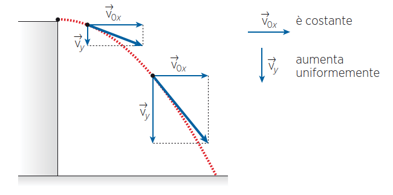

Tutte le informazioni sul moto della biglia si possono ricavare combinando le leggi orarie del moto rettilineo uniforme e uniformemente accelerato.

#### ESEMPIO 1

A quale distanza da un tavolo alto $0.90\; m$ cade la biglia se la sua velocità iniziale $\vec{v}_{0x}$, con direzione orizzontale, ha modulo pari a $4.5\; m/s$?

La «gittata», cioè la distanza percorsa dal proiettile prima di toccare il suolo, dipende dal modulo della velocità iniziale $v_0$ e dal tempo di caduta lungo la verticale secondo l'equazione seguente:
$$
\Delta x = v_{0x} \cdot \Delta t
$$

L’intervallo di tempo $\Delta t$ si ricava studiando il moto uniformemente accelerato con la relativa legge oraria, osservando che la velocità iniziale lungo la verticale è nulla: $y = y_0 - \dfrac{1}{2}g \cdot \Delta t^2$. Sostituendo i dati e sapendo che l'istante finale è quello in cui la biglia raggiunge l'altezza $y = 0$, abbiamo:

a) $y = y_0 - \dfrac{1}{2}g \cdot \Delta t^2$, $\{y_0 = 0.9, y = 0, g = 9.8\}$;

b) $0 = 0.9 - 4.9\Delta t^2$,     e risolvendo

c) $\Delta t = \sqrt{\dfrac{0.9}{4.9}} \approx \sqrt{0.184} \approx 0.428\; s$.

Sostituendo questo intervallo di tempo nella formula del moto uniforme si ottiene:

a) $\Delta x = v_{0x} \cdot \Delta t, \{v_{0x} = 4.5, \Delta t = 0.428\}$

b) $\Delta x = 4.5 \cdot 0.428 \approx 1.926\; m$      $\bullet$

### Se la Velocità Iniziale non è Orizzontale

Se la velocità con cui è scagliato un proiettile forma un certo angolo $\theta$ con l’orizzontale, il discorso non cambia molto: si tratta sempre di studiare 
separatamente due moti tra loro perpendicolari, uno orizzontale e uno verticale. La velocità iniziale stessa va dunque scomposta in due componenti $v_{0x}$ e $v_{0y}$.
Il moto orizzontale è rettilineo uniforme, per cui $v_x$ non cambia al passare del tempo, mentre $v_y$ segue la legge della velocità del moto uniformemente accelerato:
$$
v_x = v_{0x} \\
v_y = v_{0y} - gt
$$
Questo significa che $v_y$ diminuisce fino ad annullarsi, per poi ricominciare ad aumentare durante la caduta, esattamente come nel caso con velocità iniziale nulla. Dobbiamo semplicemente aggiungere un tratto ascendente al caso studiato precedentemente.

#### ESEMPIO 2

Calcola la quota massima che raggiunge un pallone calciato con 
velocità $v_0 = 20\; m/s$ formante un angolo di $30^{\circ}$ con il terreno. 
Quanto tempo impiega il pallone a raggiungere il suolo dal punto più alto?

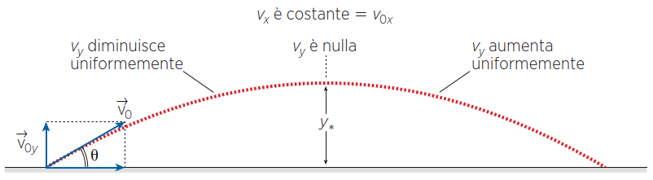

a) $v_{0x} = v_0 \cdot \cos \theta , \{v_0 = 20, \theta = 30^{\circ}\}$ $\longrightarrow$ $20 \cdot \dfrac{\sqrt 3}{2} \approx 17\; m/s$

b) $v_{0y} = v_0 \cdot \sin \theta , \{v_0 = 20, \theta = 30^{\circ}\}$ $\longrightarrow$ $20 \cdot \dfrac{1}{2} \approx 10\; m/s$

La quota massima raggiunta $y_*$ riguarda solo la componente verticale del moto ed è quella per la quale la velocità $v_y$ si annulla. Questo avviene nell’istante di tempo $t_*$ che si ricava dalla legge della velocità per il moto uniformemente accelerato:

<!--pag. 171-->

### Il Moto Circolare uniforme

Diciamo che un corpo, in un piano, ha un moto circolare uniforme quando si muove su una circonferenza a velocità fissa.

Più precisamente e parola per parola intendiamo che il corpo è in:

moto: perché il corpo cambia posizione nel tempo;

circolare: la traiettoria è una circonferenza;

uniforme: significa che il <u>modulo</u> della velocità è costante.

Attenzione: è necessario specificare che è costante il modulo della velocità, perché in realtà il vettore velocità cambia direzione istante per istante mentre il corpo si muove sulla circonferenza. Se fosse costante <u>il vettore</u> velocità, il moto sarebbe uniforme e rettilineo.

Anche nel moto circolare uniforme, come in quello rettilineo, lo spazio percorso è direttamente proporzionale al tempo impiegato a percorrerlo, ma in questo caso la sua rappresentazione grafica anziché essere un segmento è un arco di circonferenza. Lungo la circonferenza si possono definire posizioni, velocità e accelerazioni, usando la rappresentazione vettoriale, come visto

