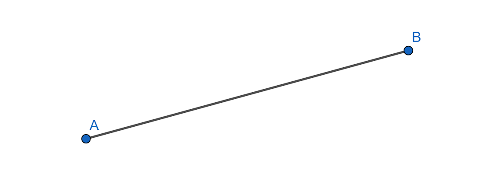
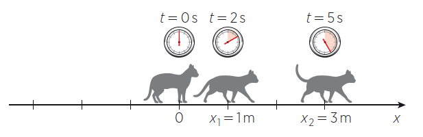
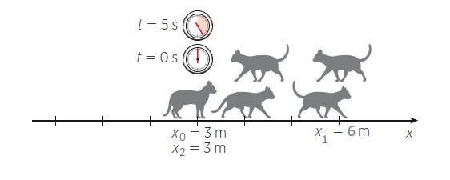
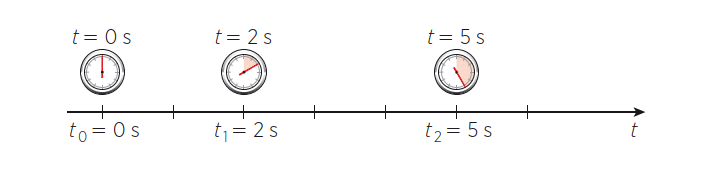
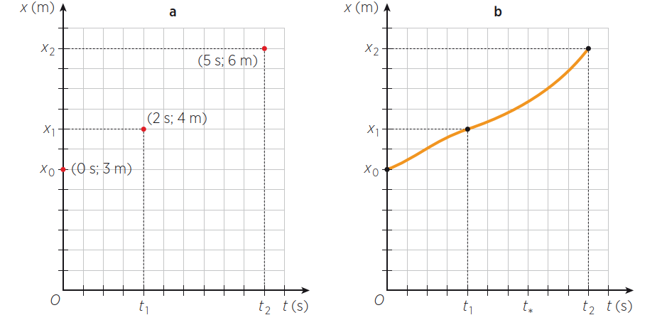
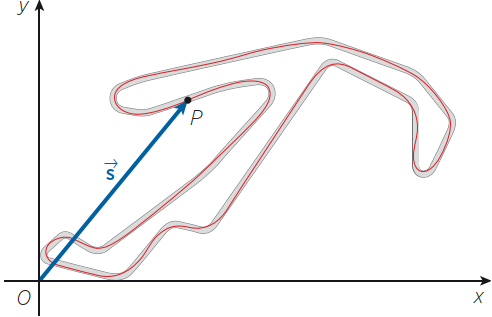
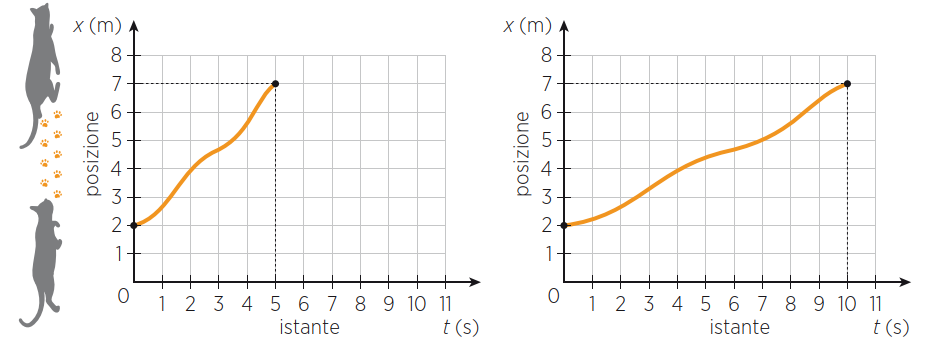
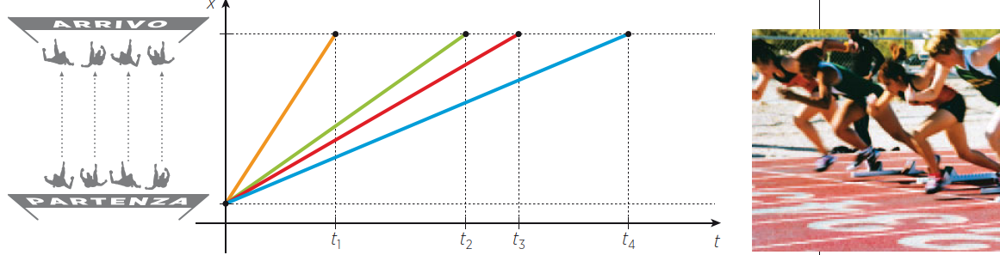
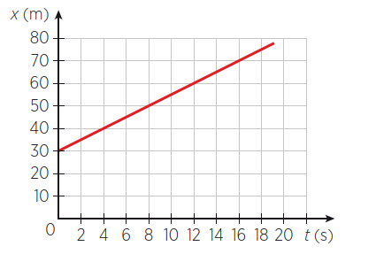

# Il Movimento: Velocità ed Accelerazione

## UNITA' 1: La Fisica

La prima domanda che ci si pone quando si inizia lo studio di una nuova disciplina come la fisica è: di cosa si occupa la fisica e quindi cosa studiano i fisici?

Possiamo dire che un fisico studia <u>la natura</u>, cioè tutto ciò che si manifesta nell’Universo. 
Alcuni fisici studiano la materia a diversi livelli di organizzazione: dai fisici nucleari ai fisici atomici, dai geofisici, che si occupano di pianeti, di atmosfera e di oceani, ai biofisici, che sono interessati alla materia viva, dalla sua origine alla struttura dell’intelligenza.
I fisici che studiano l’origine dell’Universo sono detti cosmologi, altri, gli astrofisici studiano lo spazio profondo, i fisici delle alte energie studiano le particelle più piccole che si conoscono, più piccole degli atomi.

Ciò che distingue un fisico da un altro scienziato, un geofisico da un geologo o un biofisico da un biologo non sta tanto nell’oggetto di studio, quanto nel <u>metodo</u>. Oggi i fisici applicano il loro metodo nei più svariati campi, forti dei quattro secoli di lavoro di chi li ha preceduti. La fisica poggia su una struttura molto solida, patrimonio dell’umanità, frutto di grandi menti creative, di uomini e donne che hanno dedicato la loro vita alla ricerca di una via scientifica alla conoscenza

Gli antenati dei fisici moderni sono gli antichi filosofi greci, che si interrogavano sulla natura, alla ricerca dei suoi <u>principi primi</u>, per spiegare l’infinita varietà del mondo. Diversamente da chi trovava risposte di tipo religioso o mitologico, i filosofi sostenevano che la razionalità del pensiero fosse lo strumento più importante per la conoscenza. Gli stessi greci furono anche i primi a riconoscere regolarità matematiche nei fenomeni naturali e a utilizzarle nell’arte e nella tecnica. Ma non basta la curiosità per ciò che accade o il rigore di un ragionamento a fare di un pensatore un fisico; così come non è sufficiente saper utilizzare correttamente numeri e forme geometriche per studiare scientificamente la natura. 

La fisica iniziò a distinguersi dalla filosofia e a delinearsi come scienza in senso moderno 
a partire da Galileo Galilei, vissuto tra il XVI e il XVII secolo. Egli elaborò e praticò un metodo importantissimo, nel quale l’**esperimento** prendeva il posto della <u>dimostrazione logica</u> nello studio dei fenomeni naturali e della <u>semplice osservazione</u>. A Galileo si deve la cosiddetta «prima rivoluzione scientifica» e la nascita della fisica come scienza, separata dalla filosofia e basata sull’utilizzo della matematica e dell’esperimento. 

Un fisico è uno scienziato che «studia la natura» in modo quantitativo  e rigoroso attraverso strumenti matematici ed esperimenti. 

la ricerca scientifica assomiglia moltissimo a un gioco, il cui obiettivo è scoprire le regole della natura. Queste sono nascoste dentro i fenomeni e sono scritte in linguaggio matematico, ma la loro più importante peculiarità, è che l’eccezione falsifica la regola.
Basta un solo fenomeno, osservato o sperimentato, in cui sia violata una certa regola perché questa perda di validità. E così, via via che si procede, il gioco si fa sempre più interessante. 

Oltre ai fisici anche i biologi, i chimici, i geologi sono scienziati che studiano la natura. Tutti sono interessati ai fenomeni naturali e tutti utilizzano come strumento di conoscenza l’esperimento rigoroso e quantitativo. 
Negli esperimenti delle scienze naturali c’è poco spazio per la soggettività e l’osservazione dei fenomeni dipende da fattori controllabili. Per esempio, la formazione di un embrione dall’incontro di due gameti non dipende dall’umore dello sperimentatore che la osserva o dalla sua religione o dal prodotto interno lordo del suo paese. 
Nella fisica, accanto a esperimenti quantitativi e osservazioni oggettive, c’è l’elaborazione e l’utilizzo di teorie espresse in termini matematici.

La grande differenza tra la fisica e le altre scienze naturali non sta nell’utilizzo degli esperimenti ma nell’elaborazione delle teorie. 

L’uso della matematica per la descrizione di ciò che accade in natura consente ai fisici di fare previsioni. Le leggi sono equazioni in cui compaiono grandezze fisiche: cambiando il loro valore si può riprodurre una realtà ipotetica, ancora prima di sperimentarla. Per esempio, la fisica permette di prevedere dove cadrà un proiettile che sia sparato con una certa velocità in una certa direzione, anche se non è mai stato fatto prima; mentre la chimica non permette di prevedere che cosa accadrà se due molecole si incontrano, a meno che non sia già stata osservata una precedente situazione dello stesso tipo. Non esiste una teoria delle reazioni chimiche e si conosce solo ciò che è già stato osservato: un chimico deve sapere davvero moltissime cose per fare il suo lavoro!

## UNITA' 2: Il Movimento dei Corpi: La Posizione

Il movimento naturale degli oggetti è il primo e principale fenomeno che si presenta agli studiosi della natura, come abbiamo visto, filosofi nell'antichità è fisici nei tempi più moderni, ed il più comune tra questi è la caduta a terra di un corpo lasciato libero nell'aria, detto "la caduta di un grave".

Perché cade un grave? Questa è la domanda che si sono posti gli antichi studiosi, il più importante tra tutti, Aristotele, che, sostenitore dell'osservazione dei fenomeni naturali, formulò la sua legge per cui gli oggetti simili alla terra (freddi e secchi) tendono verso il loro luogo naturale, cioè il basso (l'acqua, fredda e umida, tende verso il basso, l'aria, calda e umida, tende verso l'alto ed il fuoco, caldo e secco, tende verso l'alto).

Aristotele diceva poi che i corpi pesanti cadono più velocemente di quelli leggeri, con una velocità direttamente proporzionale al loro peso e inversamente proporzionale alla densità del mezzo, perché questo aveva osservato guardando la natura.

La fisica antica, riassunta e sistematizzata da Aristotele, era mossa dalla ricerca <u>delle cause e delle ragioni</u> dei fenomeni (il perché) e le spiegazioni che dava dei fenomeni furono più o meno soddisfacenti finché non si presentò il nuovo paradigma introdotto da Galileo Galilei che poneva la sua attenzione, da una parte alla descrizione del "come" quantitativamente si svolgevano i fenomeni, e dall'altra dell'isolamento, negli esperimenti di laboratorio, dei fenomeni stessi in modo da studiarli e comprenderli senza interferenze reciproche.

Facendo questo Galileo scoprì, con un esperimento al tempo semplice e sorprendente, che la velocità di caduta di un corpo non dipendeva dal suo peso e che le differenze osservate erano dovute alla resistenza dell'aria. Misurò poi la velocità di caduta, che aumenta man mano che passa il tempo, stabilendo le leggi della cinematica, ossia del movimento dei corpi.

### Moto Rettilineo

Studiare il movimento di un corpo significa mettere in relazione la posizione del corpo con il tempo che passa: se il tempo scorre e la posizione del corpo resta la stessa il corpo è fermo, se cambia si muove. Iniziamo ad esaminare il movimento dei corpi nel caso più semplice, in cui un corpo si muove in linea retta, il movimento di un gatto che cammina dritto dal punto $A$ al punto $B$ di un pavimento.

Il primo problema da affrontare è come individuare la posizione del gatto mentre cammina. Se vogliamo individuare la posizione del gatto nella stanza abbiamo bisogno di un riferimento cartesiano e di due coordinate, $x$ ed $y$, mentre se ci interessa la sola distanza del gatto dal punto $A$ del segmento, basta un numero: la sua distanza da $A$.

Vediamo prima il caso della sola distanza da $A$ e la misuriamo non dalla testa o dalla coda ma dal centro del gatto, (o meglio il baricentro). La sola misura della posizione non ci dice se il gatto è fermo o si sta muovendo: l’unico modo per saperlo è compiere diverse osservazioni nel tempo e vedere se la posizione cambia. Per studiare il moto, quindi, occorre un cronometro.

Finché il gatto resta fermo la sua posizione non cambia nel tempo: misure successive della sua posizione forniscono lo stesso risultato. 
Immaginiamo, invece che il gatto inizi a muoversi nell’istante in cui il nostro cronometro parte: in tal caso, facendo osservazioni in istanti di tempo diversi, vedremmo che il gatto occupa posizioni diverse. Indichiamo con $x_1$ la posizione rilevata nella prima osservazione, con $x_2$ quella della seconda osservazione e così via; ciascuna posizione viene indicata con un indice diverso, e si usano numeri progressivi crescenti, come nella figura.

Un corpo è in **movimento** quando occupa posizioni diverse in istanti di tempo diversi, cioè quando il suo baricentro si sposta nel tempo.

Una volta individuate le posizioni sulla retta cartesiana, è facile calcolare lo <u>spostamento</u>, cioè di quanto è cambiata la posizione. 

Nell’esempio in figura il gatto nei primi $2$ secondi si è spostato di un metro, dalla posizione $x_0 = 3\; m$ m alla posizione $x_1 = 4\; m$. Le <u>variazioni</u> di una quantità si indicano di solito con il simbolo $\Delta$, per cui 
$$
Δx_{01} = x_1 - x_0 = 4\;m - 3\; m = 1\; m
$$
(lo spostamento nei primi due secondi è uguale alla posizione all’istante $2\; s$ meno la posizione all’istante iniziale).

### Avanti ed Indietro nello spazio: distanza percorsa

Non c’è nessun motivo perché il gatto vada sempre nello stesso verso, da sinistra a destra: potrebbe anche tornare indietro. Ciò corrisponde a una situazione come quella rappresentata in figura

Di conseguenza lo spostamento totale su un percorso di andata e ritorno è nullo, anche se non è nulla la distanza percorsa
$$
\Delta x_{02} = x_2 - x_0 = 3 - 3 = 0
$$
Per tener conto di questo fatto introduciamo una nuova grandezza, che chiamiamo appunto **distanza percorsa** e che si ottiene sommando tutti gli spostamenti in valore assoluto, cioè considerandoli positivi. 

$$
\Delta s_{02} = |\Delta x_{01}| - |\Delta x_{12}| = 3 + 3 = 6
$$

### Istanti ed intervalli di tempo

Anche il tempo, come lo spazio, può essere rappresentato in maniera rigorosa mediante un sistema di riferimento cartesiano. Tale sistema è composto dall’unico asse del tempo $t$, per cui possiamo ragionare in maniera analoga al caso del moto rettilineo.
Così come nello spazio abbiamo le posizioni $x_0$, $x_1$, $x_2$ ecc., sull’asse del tempo abbiamo gli istanti $t_0$, $t_1$, $t_2$ ecc.

Ciascun istante così contrassegnato corrisponde a una lettura del cronometro ed è espresso in secondi nel Sistema Internazionale. Anche per il tempo si possono indicare le variazioni nello stesso modo: l’intervallo di tempo $\Delta t$ è definito come la differenza tra due istanti: 
$\Delta t_{01} = t_1 - t_0 = 2\; s - 0\; s = 2\; s$: l’intervallo di tempo tra gli istanti $t_0$ e $t_1$ è pari a $2$ secondi. Se stiamo osservando un fenomeno che si svolge tra questi due istanti di tempo, diciamo che la sua durata è $2\; s$, in altre parole, il tempo impiegato dal gatto per andare dalla posizione $x_0$ ad $x_1$ è $2$ secondi.

### Grafico Spazio-Tempo (Diagramma Orario)

Quando gli assi spaziale e temporale vengono usati insieme per definire un piano, il moto può essere descritto in modo molto compatto ed efficace attraverso una rappresentazione astratta detta grafico spazio-tempo. Per disegnarlo bisogna conoscere le posizioni del corpo nel tempo: gli istanti e le posizioni corrispondenti sono le coordinate dei punti della curva che rappresenta il moto.

Il grafico spazio-tempo di un moto rettilineo è l’insieme dei punti del piano che hanno come coordinate gli istanti e le posizioni corrispondenti.
Analizziamo nuovamente il moto del gatto e rappresentiamo le posizioni $x_0$, $x_1$, $x_2$ in un piano in cui l’asse $x$ sia verticale e l’asse $t$ orizzontale.

Per poter disegnare il grafico spazio-tempo del moto del gatto dovremmo conoscere anche ciò che accaduto tra i punti segnati, cioè dovremmo conoscere le posizioni del gatto istante per istante.

Conoscere il grafico spazio-tempo è importante, perché permette di ricavare tutte le informazioni sul moto che rappresenta. Per esempio, leggendo il grafico vediamo che all’istante $t^* = 3,5\; s$ il gatto si trova a una distanza di $5\; m$ dall’origine.

### Grafico Spazio-Tempo, Traiettorie e Moti Vincolati

Traiettoria e grafico spazio-tempo sono due cose molto diverse. Un moto può essere rettilineo, ossia vere una traiettoria rettilinea, anche se il grafico spazio-tempo che lo rappresenta non è una retta. Il grafico spazio-tempo contiene infatti informazioni sul tempo, a differenza della traiettoria, che ci dà solo informazioni spaziali. Il fatto che il moto si svolga lungo una retta è espresso dal fatto che le posizioni si trovano su un unico asse. 

Nella vita di tutti i giorni è molto più comune avere a che fare con moti qualsiasi, di oggetti che spaziano liberamente in tutte le direzioni. Anche i treni, che non possono lasciare il loro binario, in realtà compiono curve, salite e discese, per cui il loro moto avviene in uno spazio tridimensionale. Tuttavia per studiare il moto di un treno non è necessario utilizzare tre assi cartesiani, ma si può fare un’approssimazione e trattarlo come se fosse rettilineo. 
Noi sappiamo su quale traiettoria si muoverà Il treno, infatti, il treno è <u>vincolato</u> a muoversi su un binario, e se immaginiamo di «stirare» questo binario fino a farlo sovrapporre a una retta possiamo utilizzare l’approssimazione di moto rettilineo. Un moto di questo tipo è detto <u>unidimensionale</u>, in quanto può essere descritto mediante un’unica coordinata spaziale. 
Si possono studiare come unidimensionali anche i moti dei veicoli lungo le strade o il moto di un corpo che lasciato cadere percorre una linea retta fino a terra, non perché sia vincolato ma perché sappiamo quale è la sua traiettoria.

Un moto unidimensionale può essere approssimato con un moto rettilineo, ossia un moto che avviene in una sola direzione (non un solo verso!), per i quali è sufficiente usare un solo asse: la posizione è individuata da un solo numero, la distanza dall’origine dell’asse

Per i moti che cambiano direzione nel tempo in modo <u>autonomo</u>, ossia dei quali non conosciamo la traiettoria ma che rimangono in uno stesso piano, ad esempio una formica che cammina su un pavimento, sono necessarie due coordinate per individuare la posizione dell'oggetto in movimento.

Se il corpo in movimento non è vincolato ad un piano ma si muove, sempre in modo <u>autonomo</u>, nello spazio, come un uccello o un aereo, sono necessarie tre coordinate per la sua posizione.

### Vettori Posizione e Vettori Spostamento

Consideriamo un moto in un piano, come ad esempio una moto che si muove in uno spazio aperto, e che fa una traiettoria come quella in figura.

Se chiamiamo $P$ il generico punto che individua la <u>posizione</u> del motociclista, la freccia che collega l’origine degli assi a tale punto rappresenta il <u>vettore posizione</u> $\vec{s}$ del motociclista nel piano.

Al passare del tempo, se il motociclista si muove, il punto $P$ fa una traiettoria ed il vettore posizione $\vec{s}$ si allunga, si accorcia, cambia orientazione: in una parola, varia. 

Come abbiamo già visto, lo «<u>spostamento</u>» è la variazione della posizione, e lo spostamento è dato dalla differenza tra due vettori posizione.

Pag. 152

Come vedremo i vettori sono lo strumento fondamentale per analizzare i moti dei corpi in un piano.

### ESERCIZIO 1.1

a) Lungo un’autostrada due automobili $A$ e $B$ procedono a velocità diverse lungo la stessa direzione. Alle $\text{13:14}$ l’automobile $A$ supera l’automobile $B$, all’altezza del kilometro $\text{124}$. Alle $\text{13:00}$ l’automobile $A$ si trovava al $\text{94}$-esimo kilometro, mentre l’automobile $B$ al $\text{97}$-esimo. Disegna sullo stesso piano cartesiano i grafici spazio-tempo di entrambe le automobili, usando colori diversi per ciascuna di esse.

b) Durante un esperimento didattico in cui si studia il 
moto di un carrello vengono raccolti i dati nella seguente tabella:
$$
\begin{array}{|c|c|}
\hline
\textbf{Istante} & \textbf{Posizione} \\ 	 
\textbf{(s)} & \textbf{(cm)} \\ 	 
\hline
0.0 & 4.2  \\
\hline
0.3 & 35.3  \\
\hline
0.6 & 66.4  \\
\hline
0.9 & 97.5  \\
\hline
1.2 & 128.6  \\
\hline
\end{array}
$$

- Disegna il grafico spazio-tempo;
- Calcola gli spostamenti ogni $0.3$ secondi.

### ESERCIZIO 1.2

a)  Un vettore di modulo pari a $7.0$ unità giace su un piano ed è orientato in modo da formare un angolo di $30^\circ$ con l’asse $x$. Disegnalo e calcola le sue componenti cartesiane.

b) Durante il moto di un corpo sul piano, le componenti cartesiane di tre vettori posizione negli istanti $t_1 = 0\; s$, $t_2 = 3,5\; s$, $t_3 = 6\; s$ sono (in metri): $\vec{s_1} =$ $\begin{pmatrix} 0 \\ 4 \end{pmatrix}$, $\vec{s_2} =$ $\begin{pmatrix} 6 \\ 4 \end{pmatrix}$, $\vec{s_3} =$ $\begin{pmatrix} 4.5 \\ 1 \end{pmatrix}$. Disegna i vettori posizione e spostamento del corpo e calcola il modulo del vettore spostamento complessivo.

c) Due alpinisti partono alle $\text{7:00}$ e raggiungono la base di una parete verticale percorrendo un pendio in salita lungo $500\; m$; successivamente scalano la parete, lunga $150\; m$. La salita termina alle $\text{11:15}$, a $400$ metri di quota sopra il livello di partenza.
- Rappresenta la situazione con un disegno dei vettori spostamento degli alpinisti. 
- Calcola l’angolo di inclinazione del pendio rispetto all’orizzontale.

## UNITA' 3: La Velocità

Per valutare il moto di un corpo è importante conoscere la sua posizione e l’istante di tempo corrispondente. Il concetto di velocità ci permette di confrontare distanze percorse e intervalli di tempo impiegati.
Analizziamo i grafici spazio-tempo relativi a due gatti che si spostano nello spazio lungo una retta

Il gatto del primo grafico in $5$ secondi si sposta tra i punti di coordinate $2\; m$ e $7\; m$, cioè:
$$
\Delta t_{01} = t_1 - t_0 = 5\; s - 0\; s = 5\; s \\
\Delta x_{01} = x_1 - x_0 = 7\; m - 2\; m = 5\; m
$$
Il secondo gatto compie lo stesso spostamento, ma impiega un tempo diverso:
$$
\Delta t_{01} = t_1 - t_0 = 10\; s - 0\; s = 10\; s \\
\Delta x_{01} = x_1 - x_0 = 7\; m - 2\; m = 5\; m
$$
cioè percorre $5$ metri in $10$ secondi. 
I moti dei due gatti sono entrambi rettilinei e si svolgono su un tratto lungo $5\; m$, ma hanno durate diverse.
Diciamo quindi che il primo gatto è stato più veloce del secondo perché ha impiegato <u>meno tempo a percorrere la stessa distanza</u>.

In fisica è necessario precisare che la velocità di cui si parla è una velocità media, cioè di una grandezza che si riferisce al moto nel suo insieme. Infatti non è detto che il secondo gatto non sia stato fermo per gran parte del tempo, per poi raggiungere la posizione finale con un balzo rapidissimo. 
Attraverso la rappresentazione grafica del moto osserviamo che la velocità media dipende soltanto dai punti iniziale e finale del moto e non da quello che accade tra essi. Ciò significa che possiamo ignorare la forma della curva e porre l’attenzione solo sul segmento che unisce i due punti.

Allo stesso modo possiamo dire che andrebbe più veloce il gatto che, in uno <u>stesso tempo percorre più distanza</u>: in pratica la velocità media misura la distanza percorsa in una unità di tempo, ossia:

> $\triangle$ La **velocità media** è uguale al rapporto tra lo spostamento che compie un corpo e il tempo che impiega a compierlo.
> $$
> v_m = \dfrac{\Delta x}{\Delta t}
> $$

Nel Sistema Internazionale lo spostamento si misura in metri e l’intervallo di tempo in secondi. Da queste unità di misura si ricava quella della velocità media: il metro al secondo.

Facciamo un secondo esempio. Immaginiamo una gara di corsa che si svolge lungo un tratto rettilineo tra un punto di partenza e uno di arrivo uguali per tutti. I partecipanti partono tutti insieme all’avvio del cronometro, ma impiegano tempi diversi a raggiungere il traguardo e perciò le loro velocità medie sono diverse.

Dato che l’atleta più veloce è quello che impiega meno tempo a raggiungere il traguardo, la velocità media maggiore corrisponde al segmento che ha una pendenza maggiore, cioè è quello che forma un angolo maggiore con l’asse del tempo. Analogamente, all’atleta più lento corrisponde un segmento con pendenza minore. Un atleta che rimanesse fermo alla partenza sarebbe rappresentato su un grafico da un segmento con pendenza nulla, cioè parallelo all’asse del tempo: questa rappresentazione corrisponde a una posizione che rimane costante allo scorrere del tempo.
Ecco dunque una relazione tra la velocità ed i grafici spazio-temporali:

>
> $\triangle$ La velocità media è data dalla pendenza del segmento che unisce i punti iniziale $A$ e finale $B$ del moto in un grafico spazio-tempo.
>

Sapendo che la pendenza è misurata dalla t<u>angente trigonometrica</u> dell'angolo che la retta, di cui il segmento fa parte, forma con l'asse orizzontale, possiamo dire che la velocità coincide con tale tangente, e quindi coincide anche con il <u>coefficiente angolare</u> della stessa retta nel piano spazio-tempo.

### La Distanza Percorsa

Dato che su un percorso chiuso lo spostamento è nullo (in quanto si ritorna nella stessa posizione), anche se la distanza percorsa non lo è, può essere utile definire la velocità media come rapporto tra spazio percorso e tempo impiegato a percorrerla:

$$
v_m = \dfrac{\Delta s}{\Delta t}
$$
dove $\Delta s$ è la somma degli spostamenti presi in valore assoluto:
$$
\Delta s = |\Delta x_{01}| + |\Delta x_{12}| + ...
$$

### Uso della Velocità Media

Nella vita di tutti i giorni capita spesso di usare la formula (3.1) della velocità media, per esempio quando viaggiamo: se impieghiamo 2 h per andare da una città a un’altra che dista 200 km dalla prima calcoliamo immediatamente che la nostra velocità (media) è di 100 km/h. Non facciamo fatica nemmeno a ricavare che per percorrere 250 km con una velocità media di 100 km/h impiegheremmo 2,5 h. Sappiamo dunque usare con disinvoltura la formula, anche se con numeri tondi e familiari, come le velocità delle automobili e le distanze fra le città.

Ora si tratta di imparare a fare calcoli meno immediati e a usare le unità di misura del Sistema Internazionale.

#### ESEMPIO 1

Quanto vale in $m/s$ la velocità di $120\; km/h$?

Abbiamo che $1\; Km = 1000\; m$ e $1\; h = 3600\; s$ per cui sostituendo:
$$
120 \dfrac{Km}{h} = 120 \cdot \dfrac{1000}{3600}\dfrac{m}{s} \\
v = 120 \dfrac{10}{26} = 120 \dfrac{1}{3,6} \longrightarrow 33.33
$$
La velocità è di $33.33\; Km/h$.    $\bullet$

#### ESEMPIO 2

Un ragazzo è uscito di casa alle $\text{15:30}$ e ha raggiunto la casa di un 
amico alle $\text{15:50}$. Se la velocità media lungo il tragitto è stata di 
$2.0\; m/s$, quanta strada ha percorso?

Abbiamo che $\Delta t = \text{15:50} - \text{15:30} = 20\; min = 1200\; s$. Dalla formula $v_m = \dfrac{\Delta s}{\Delta t}$, sostituendo i numeri alle lettere:
$$
20 = \dfrac{\Delta s}{1200} \\
\Delta s = 2 \cdot 1200 \longrightarrow 2400\; m
$$
Il ragazzo ha percorso $2.4\; Km$.    $\bullet$

 

### ESERCIZIO 3.1

a) Nel 2009 l’atleta giamaicano Usain Bolt ha corso i $100$ metri piani in $9.58\; s$. Qual è stata la sua velocità media in $m/s$? Ed in $Km/h$?

b) Quanto tempo impiega una lumaca a percorrere $3,0\; m$ se la sua velocità media è di $0.05\; km/h$? 

### ESERCIZIO 3.2

a)  Quali elementi di questo grafico contengono le informazioni «il moto è rettilineo» e «il moto è uniforme»?

b) Scrivi la legge oraria del moto descritto dal seguente 
grafico spazio-tempo.

### ESERCIZIO 3.3

Secondo la teoria della deriva dei continenti di Wegener, l’Oceano Atlantico ha iniziato a formarsi con la divisione della Pangea e da allora è in continua espansione. Il Sud America e l’Africa si allontanano con una velocità di circa $6\; cm/anno$ e attualmente hanno una distanza media di $7000\; km$. 
- Supponendo costante la velocità di allontanamento stima quanto tempo fa i due continenti erano uniti.
- Perché parliamo di «stima»? 

### ESERCIZIO 3.4

a) Una moto parte da Napoli verso Roma nello stesso istante in cui un’altra moto parte da Roma verso Napoli. La moto da Napoli viaggia ad una velocità di $40 \;Km/h$ mentre l’altra a $20 \;Km/h$. Se la distanza tra le due città è di $150 \;Km$ quanto tempo impiegheranno I due mezzi per incontrarsi e quale distanza avranno percorso?  

b) Un viaggiatore impiega $12$ ore per un tragitto di andata e ritorno, con una velocità di $20 \;Km/h$ per l’andata e $30 \;Km/h$ per il ritorno. Trova la durata (in ore) del tragitto di andata e di quello del ritorno.  

c) Un postino che viaggia a $30 \;Km/h$ è in viaggio da $3$ ore. Un altro postino, inviato per raggiungerlo, viaggia a $50 \;Km/h$. Quanto impiegherà il secondo per raggiungere il primo? Quale distanza coprirà?  
