# Le Funzioni Goniometriche

## UNITA' 1: Angoli e loro misura

Gli angoli sono un concetto molto importante in matematica, in geometria, in fisica ed in tante altre discipline. Quella parte della matematica che si occupa della misura degli angoli e delle relative funzioni si chiama Goniometria. Per cominciare vediamo la definizione di Angolo.

Un angolo è la parte di piano individuata da due semirette a e b (dette lati) che hanno una origine comune V (detta vertice).

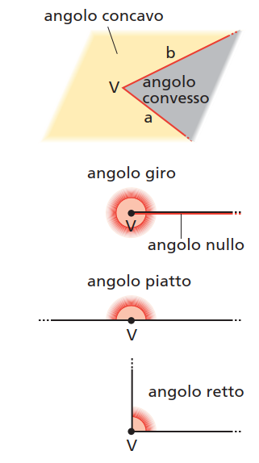

Le unità di misura più usate per misurare gli angoli sono il grado (sessagesimale) ed il radiante.

### La misura in gradi

Nel sistema cosiddetto "sessagesimale", l’unità di misura degli angoli è il grado (sessagesimale), definito come quell'angolo pari alla 360-esima parte dell’angolo giro.
Il grado sessagesimale viene indicato con un piccolo cerchio in alto a destra della misura:
$$
1^\circ = \dfrac{1}{360} \cdot \text{Angolo Giro}
$$
Il grado viene suddiviso a sua volta in $60$ primi, che vengono indicati con un apice: $1^\circ = 60'$.
Ogni primo viene suddiviso a sua volta in $60$ secondi, indicati con due apici: $1' = 60''$.

Dalla formula precedente risulta quindi che un angolo giro, in gradi, misura $360$.

### La misura in radianti

Gli angoli, oltre ad essere misurati in gradi, vengono misurati anche in radianti, cioè utilizzando un'altra unità di misura. Il radiante è l’angolo al centro di una circonferenza che sottende un arco di lunghezza uguale al raggio.

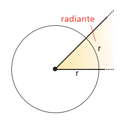

L'angolo sotteso da un arco lungo un raggio misura quindi un radiante. Quello sotteso da un arco lungo due raggi, due radianti, e quello sotteso da un arco lungo $2\pi$ raggi, $2\pi$ radianti. Ma un arco di $2\pi$ raggi è tutta la circonferenza, e l'angolo è l'angolo giro, per cui l'angolo giro, in radianti, misura $2\pi$, cioè 
$$
\text{Angolo Giro} = 2\pi\; \text{rad}
$$
Confrontando con la formula dei gradi abbiamo l'equivalenza di conversione tra gradi e radianti, cioè
$$
360 \cdot 1^\circ = 2\pi\; \text{rad}
$$

### Proporzionalità tra archi ed angoli

In una circonferenza la lunghezza $s$ di un arco e l'angolo $\omega$ sotteso sono due grandezze direttamente proporzionali, ossia il loro rapporto è costante. La costante di proporzionalità è uguale al rapporto tra tutta la circonferenza e l'angolo giro, quindi, misurando gli angoli in radianti:
$$
\dfrac{s}{\omega_{rad}} = \dfrac{2{\pi}r}{2\pi}
$$
 Semplificando abbiamo la formula
$$
s = {\omega_{rad}} \cdot r
$$

che ci dice come calcolare la lunghezza di un arco di circonferenza conoscendo l'angolo sotteso ed il raggio.

### Gli angoli orientati

La definizione di angolo già data, come parte di piano, non è adatta per descrivere tutte le situazioni in cui gli angoli vengono impiegati. Ad esempio, nell’avvitare o svitare una vite si descrive un angolo che può essere maggiore di un angolo giro.
È più utile quindi collegare il concetto di angolo a quello di **rotazione**, cioè al movimento che porta uno dei lati dell’angolo a sovrapporsi all’altro.
La rotazione è univoca solo quando ne viene specificato il verso, orario o antiorario e normalmente il senso adottato è quello antiorario.

Un angolo si dice **orientato** quando si è scelto uno dei due lati come lato di origine e un senso di rotazione. 
Un angolo orientato sarà **positivo** quando è descritto mediante una rotazione in senso antiorario, **negativo** quando la rotazione è in senso orario.

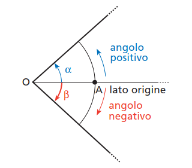

Un angolo orientato può anche essere maggiore di un angolo giro: poiché $750^\circ = 30^\circ + 2 \cdot 360^\circ$, l’angolo di $750^\circ$ si ottiene con la rotazione della 
semiretta $OA$ di due giri completi e di ulteriori $30^\circ$.

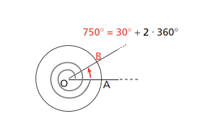

È possibile scrivere in forma sintetica un qualunque angolo $\alpha$, minore di un angolo giro, e tutti gli infiniti angoli orientati che da $\alpha$ differiscono di un multiplo dell’angolo giro nel seguente modo:
in gradi: $a + k \cdot 360^\circ$, con $k \in \mathbb{Z}$; in radianti: $a + 2k\pi$, con $k \in \mathbb{Z}$. 
Quando $k = 0$, otteniamo l’angolo $\alpha$.

Ad esempio, la scrittura $\dfrac{\pi}{4} + 2k\pi, \;\; k \in \mathbb{Z}$ equivale alla successione di angoli
$$
\dfrac{\pi}{4}, \; \dfrac{\pi}{4} + 2\pi, \; \dfrac{\pi}{4} - 2\pi, \; \dfrac{\pi}{4} + 4\pi, \; \dfrac{\pi}{4} - 4\pi, \; ...
$$

### La circonferenza goniometrica

Per **circonferenza goniometrica** intendiamo la circonferenza che in un piano cartesiano ha come centro l’origine $O$ degli assi ed il raggio di lunghezza $1$, ossia la circonferenza di equazione $x^2 + y^2 = 1$.

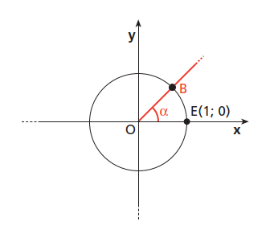

Utilizzando la circonferenza goniometrica, si possono rappresentare gli angoli orientati, prendendo come lato origine l’asse orizzontale delle $x$. In questo modo, ad ogni angolo corrisponde un punto di intersezione $B$ fra la circonferenza e il lato termine.

Ad esempio, gli angoli $\alpha_1 = \dfrac{\pi}{6}$, $\alpha_2 = \dfrac{5}{6}\pi$, $\alpha_3 = -\dfrac{\pi}{3}$ individuano sulla circonferenza i punti $B1$, $B2$ e $B3$.

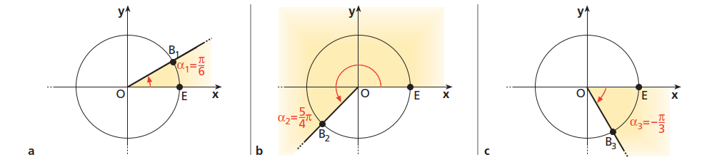

### ESERCIZIO 1.1 - Misure di angoli in gradi

a) Esprimi in gradi e decimali di grado le seguenti misure di angoli.

1. $0^\circ \; 59^{'} \; 59^{''}$;     $0^\circ \; 30^{'}$;     $1^\circ \; 59^{'} \; 30^{''}$;		$R: \left[1^\circ;\; 0,5^\circ;\; 1,99^\circ;\right]$
2. $2^\circ \; 40^{''}$;    $60^\circ \; 20^{'}$;    $92^\circ \; 20^{'} \; 36^{''}$.

b) Esprimi in gradi, primi e secondi le seguenti misure di angoli, espresse in forma decimale (arrotondando eventualmente i secondi).

1. $2,234^\circ$;    $22,52^\circ$;
2. $90,5^\circ$;    $90,05^\circ$.

### ESERCIZIO 1.2 - Gradi e radianti

a) Trasforma in radianti le misure dei seguenti angoli, espresse in gradi sessagesimali.

1. $15^\circ$;    $36^\circ$;    $210^\circ$;    $300^\circ$.		$R: \left[\dfrac{\pi}{12}; \dfrac{\pi}{5}; \dfrac{7}{6}\pi; \dfrac{5}{3}\pi\right]$
2. $121^\circ$;    $3^{''}$;    $200^\circ$;    $36^{''}$. 

b) Trasforma in gradi sessagesimali le misure dei seguenti angoli, espresse in radianti.

1. $\dfrac{2}{3}$;    $\dfrac{2}{3}\pi$;    $\dfrac{9}{5}\pi$;    $\dfrac{3}{2}\pi$;
2. $4\pi$;    $4$;    $\dfrac{5}{2}$;    $\dfrac{5}{2}\pi$.

### ESERCIZIO 1.3 - Problemi vari

a)  Calcola la misura, in gradi e in radianti, di un angolo al centro di una circonferenza il cui raggio è uguale a $5$ cm e che sottende un arco lungo $23$ cm.			$R: \left[263^\circ \; 33^{'} \; 38^{''};\; 4,6\right]$

b) Disegna sul cerchio goniometrico i seguenti angoli, misurati in radianti: $\dfrac{\pi}{4}$,  $\dfrac{3}{4}\pi$,  $\dfrac{11}{4}\pi$, $\dfrac{\pi}{8}$.

## Unità 2: Le funzioni seno e coseno

Consideriamo la circonferenza goniometrica, un angolo orientato $\alpha$ ed il punto della circonferenza associato ad $\alpha$ che chiamiamo $B$. Definiamo coseno e seno dell’angolo $\alpha$, e le indichiamo con $\sin \alpha$ e $\cos \alpha$, le funzioni che associano ad $\alpha$ rispettivamente, il valore dell’ascissa $x_B$ e quello dell’ordinata $y_B$ del punto $B$, ossia
$$
B=(x_B, y_B) \;\;\; \text{e} \;\;\; \sin \alpha = x_b, \;\; \cos \alpha = y_B
$$
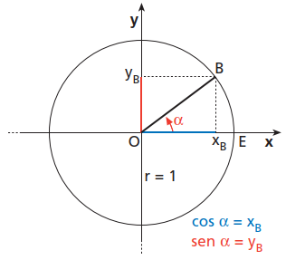

Seno e coseno di un angolo $\alpha$ sono funzioni che hanno come dominio $\mathbb{R}$, perché per ogni valore di $\alpha \in \mathbb{Z}$ esiste uno e un solo punto sulla circonferenza.

### Variazioni delle funzioni seno e coseno

Supponiamo che un punto $B$ percorra l’intera circonferenza goniometrica, a partire da $E$, in verso antiorario. 
Se $\alpha = \widehat{EOB}$, come variano $\sin \alpha$ e $\cos \alpha$ al variare della posizione di $B$? Basta osservare che cosa succede all’ascissa di $B$ (ossia il coseno) e alla sua ordinata (ossia il seno).

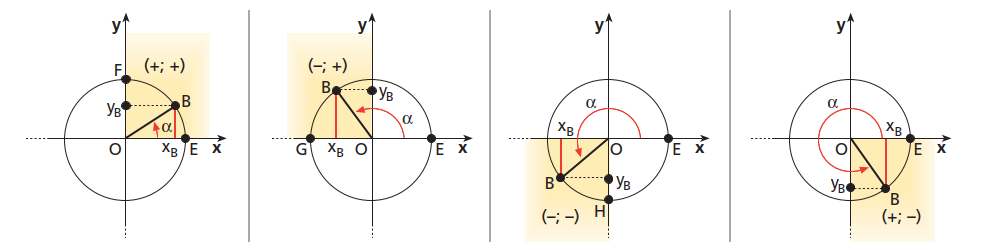

Qualunque sia la posizione di $B$ sulla circonferenza, la sua ordinata e la sua ascissa assumono sempre valori compresi fra $-1$ e $1$, quindi:
$-1 \le \sin \alpha \le 1$ e $-1 \le \cos \alpha \le 1$.
Il codominio delle funzioni seno e coseno è quindi $[-1; 1]$.

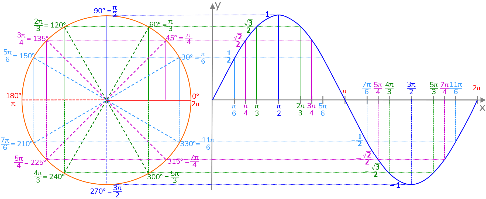

La tabella seguente riassume più chiaramente i valori delle funzioni seno e coseno su angoli notevoli.

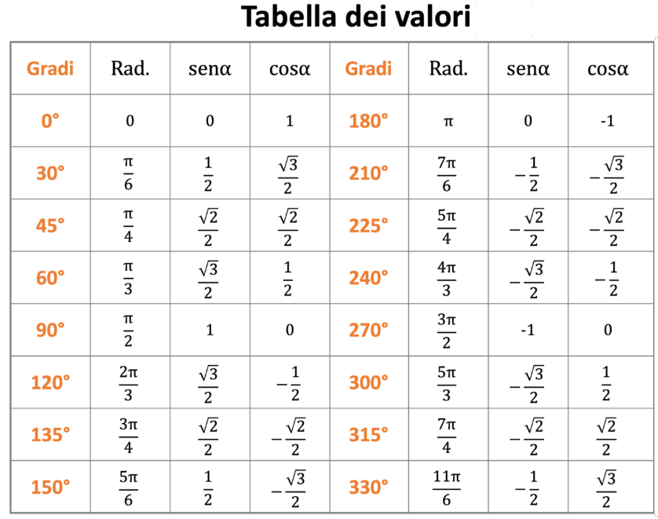

### I grafici delle funzioni seno e coseno

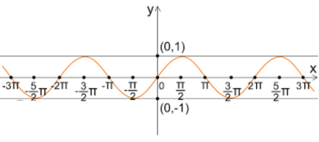

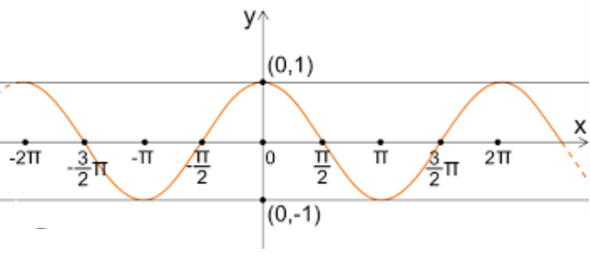

### Il periodo delle funzioni seno e coseno

Dopo aver percorso un giro completo, il punto $B$ sulla circonferenza goniometrica può ripetere lo stesso movimento altre volte e le funzioni seno e coseno assumono di nuovo gli stessi valori ottenuti al "primo giro":

$\sin \alpha = \sin (\alpha + 2\pi) = \sin (\alpha - 2\pi) = \sin (\alpha + 4\pi) = \sin (\alpha - 4\pi)  \; ...$  

$\cos \alpha = \cos (\alpha + 2\pi) = \cos (\alpha - 2\pi) = \cos (\alpha + 4\pi) = \cos (\alpha - 4\pi)  \; ...$ 

Le funzioni seno e coseno sono quindi periodiche di periodo $2\pi$. In modo sintetico si può scrivere:
$$
\sin (\alpha + 2k\pi) =\sin \alpha, \;\; k \in \mathbb{Z} \\

\cos (\alpha + 2k\pi) =\cos \alpha, \;\; k \in \mathbb{Z}
$$

### La relazione fondamentale della goniometria

Poiché il punto $B(\cos \alpha; \sin \alpha)$ appartiene alla circonferenza goniometrica, le sue 
coordinate soddisfano l’equazione $x^2 + y^2 = 1,$ che è conseguenza diretta dell'applicazione del teorema di pitagora al triangolo rettangolo $\triangle{AOB}$:

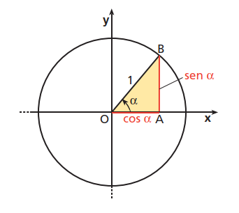

Da questa relazione è possibile ricavare $\sin \alpha$ conoscendo $\cos \alpha$ e viceversa. 
Infatti, se è noto $\cos \alpha$, si ha: 

$\sin \alpha = \pm \sqrt{1 - \cos^2 \alpha}$ . 
Viceversa, se si conosce $\sin \alpha$, si ha: $\cos \alpha = \pm  \sqrt{1 - \sin^2 \alpha}$ .

### ESERCIZIO 2.1 - Calcolo delle funzioni seno e coseno

a) Individua sulla circonferenza goniometrica i seguenti valori.

1. $\cos\left(-\dfrac{\pi}{3}\right)$;    $\sin\dfrac{5}{8}\pi$;    $\sin(-240^\circ)$, $\cos\dfrac{7}{4}\pi$;
2. $\sin300^\circ$;    $\cos 330^\circ$.

b)  Trova quale condizione deve soddisfare il parametro affinché sia verificata l’uguaglianza.

1. $\cos x = k-2$;		$R: \left[1 \le k \le 3\right]$
2. $4a \cos x = a + 1$;		$R: \left[a \le -\dfrac{1}{5} \or a \ge \dfrac{1}{3}\right]$
3. $(k-1)\sin x = k$.		$R: \left[k \le \dfrac{1}{2}\right]$

c) Calcola il valore della funzione indicata, utilizzando le informazioni fornite.

1. Calcolo di $\cos \alpha$ se $\sin \alpha = \dfrac{7}{25}$ e $0 \lt \alpha \lt \dfrac{\pi}{2}$;		$R: \left[\dfrac{24}{25}\right]$
2. Calcolo di $\sin \alpha$ se $\cos \alpha = -\dfrac{4}{5}$ e $\dfrac{\pi}{2} \lt \alpha \lt \pi$;

### ESERCIZIO 2.2 - Calcolo di espressioni goniometriche

a) Calcola il valore delle seguenti espressioni.

1. $\dfrac{1}{2} \cos 540^\circ + \dfrac{2}{3} \sin 720^\circ -\dfrac{1}{4} \sin 450^\circ + 6\sin (-270^\circ)  $;		$R: \left[\dfrac{21}{4}\right]$
2. $\cos 4\pi + 2\sin\left(-\dfrac{15}{2}\pi \right) + \dfrac{1}{3}\cos(-3\pi) + \sin\dfrac{9}{2}\pi  $.

b) Se $\alpha= \dfrac{\pi}{2}$ calcola il valore della seguente espressione:
$$
\dfrac{a \sin\alpha + b \cos\alpha}{\sin(-4\alpha) - a\cos\left(\alpha + \dfrac{\pi}{2}\right) - b\cos\left(\dfrac{7}{2}\pi + \alpha \right)} 
$$

### ESERCIZIO 2.3 - Grafico delle funzioni goniometriche

Disegna il grafico di $y = \sin x$ nell'intervallo $\left[-\dfrac{5}{2}\pi;\; \dfrac{7}{2}\pi\right]$ Trova i punti di intersezione della funzione con l’asse $x$ e calcola le ordinate dei punti di ascissa $x = -\dfrac{3}{2}\pi,\; x = -\pi,\; x = 0,\; x = \dfrac{\pi}{2},\; x = \dfrac{7}{2}\pi.$ Determina i valori di $x$ per cui $\sin x = -1$.

### ESERCIZIO 2.4 - Semplificazione di espressioni

Semplifica le seguenti espressioni:

a) $(a \sin \alpha - 2 \cos \alpha)^2 + (a \cos \alpha + 2 \sin \alpha)^2 - 4 + a^2 \sin \dfrac{5}{2}\pi$;		$R: \left[2 a^2\right]$

b) $4 - 4 \sin^2 \alpha + (cos \alpha - \sin \alpha)^2 + 2 \cos \alpha(\sin \alpha + \cos \alpha)$

## Unità 3: La funzione Tangente e le funzioni inverse

Consideriamo la circonferenza goniometrica, un angolo orientato $\alpha$ ed il punto della circonferenza associato ad $\alpha$ che chiamiamo $B$. Si definisce tangente di $\alpha$ la funzione che associa al $\alpha$ il rapporto fra l’ordinata e l’ascissa del punto $B$, quando esiste.
$$
\tan \alpha = \dfrac{y_B}{x_B}
$$
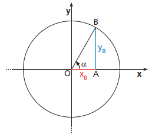

Il rapporto non esiste quando $x_B = 0$ ossia per $\alpha = \dfrac{\pi}{2} + k\pi, \;\; k \in \mathbb{Z}$. Il dominio della funzione tangente è quindi $\{\alpha \in \mathbb{R}: \alpha \ne \dfrac{\pi}{2} + k\pi, \;\; k \in \mathbb{Z} \}$.

Poiché $y_B = \sin \alpha$ e $x_B = \cos \alpha$ abbiamo la relazione fondamentale:
$$
\tan \alpha = \dfrac{\sin \alpha}{\cos \alpha}
$$

### Un altro modo di definire la tangente

Consideriamo la circonferenza goniometrica e la retta tangente ad essa nel punto $E$, origine degli archi.
Il prolungamento del lato $OB$ interseca la retta tangente nel punto $T$, come riportato in figura.
La tangente dell’angolo $\alpha$ può anche essere definita come il valore dell’ordinata del punto $T$, ossia:
$\tan \alpha = y_T$.

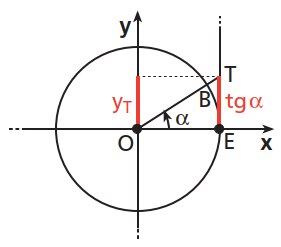

L'equivalenza della definizione deriva dal fatto che i triangoli $\triangle{TOE}$ e $\triangle{BOA}$ sono simili e quindi $\dfrac{BA}{OA} = \dfrac{TE}{OE}$, ma $OE = 1$ perché il cerchio è goniometrico ed ha raggio $1$, come si vede dall'immagine seguente.

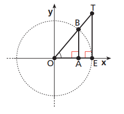

### Il grafico della funzione tangente

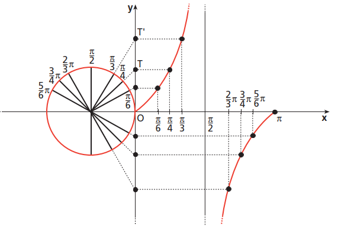

Analogamente a quanto fatto per le funzioni seno e coseno, tracciamo il grafico della funzione $y = tan\; x$ nell’intervallo $[0; \pi]$, riportando sull’asse $x$ i valori degli angoli e sull’asse $y$ le ordinate dei punti corrispondenti sulla retta tangente alla circonferenza goniometrica.

Il valore $\dfrac{\pi}{2}$ è critico perché se la $x$ vi si avvicina da sinistra (restando minore) il valore della $y$ tende a diventare sempre più grande ossia tende a $+\infty$, se si avvicina da destra (restando maggiore), il valore della funzione tende a $-\infty$.

La retta $x = \dfrac{\pi}{2}$ è quindi un asintoto verticale e la funzione ha periodo $\pi$, cioè, qualunque sia l'angolo $\alpha$:
$$
\tan \alpha = tan(\alpha + k\pi), \;\;  k \in \mathbb{Z}
$$
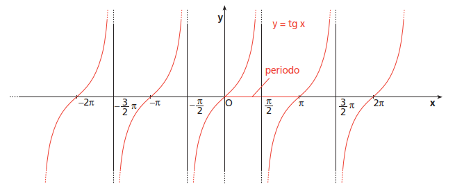

Analogamente a quanto fatto per il seno e coseno, possiamo riassumere nella tabella seguente i valori della tangente in alcuni angoli notevoli.

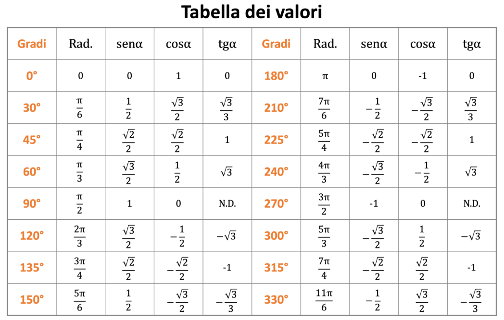

### Significato goniometrico del coefficiente angolare di una retta

Tracciamo la circonferenza goniometrica e la retta generica passante per l'origine di equazione $y = mx$, da cui $m = \dfrac{y}{x}$ per ogni punto della retta di coordinate $(x, y)$. 

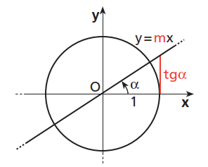

In particolare, se $x = 1$ ed $y = \tan \alpha$ abbiamo che 
$$
m = \dfrac{\tan \alpha}{1}= \tan \alpha
$$
*Il coefficiente angolare della retta è uguale alla tangente dell’angolo fra la retta e* *l’asse $x$*. Poiché dalla geometria analitica sappiamo che due rette sono parallele quando hanno lo stesso coefficiente angolare e che rette parallele formano angoli congruenti con l’asse $x$, possiamo dire che per tutte le rette nel piano, il coefficiente angolare è uguale alla tangente trigonometrica dell'angolo tra la retta e l'asse orizzontale.

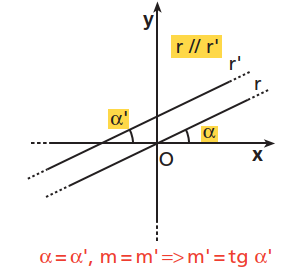

### Significato geometrico del coefficiente angolare di una retta

Come sappiamo dalla geometria analitica, il coefficiente angolare di una retta determina la ***pendenza*** della retta rispetto all'asse orizzontale delle ascisse.

Pensiamo alla retta come ad una strada su cui camminiamo, in salita come nel caso della figura di sotto. Mentre camminiamo dalla posizione $P_1$ a quella $P_2$, ci spostiamo contemporaneamente sia verso l'alto che verso destra. Lo spostamento verticale, verso l'alto, lo chiamiamo ***dislivello***, quello in orizzontale, verso destra, ***avanzamento***. 

Il dislivello è calcolato dalla differenza delle altezze dei due punti, cioè $y_2 - y_1$ e l'avanzamento (orizzontale) dalla differenza delle due posizioni $x_2 - x_1$.

La pendenza della strada si misura facendo il rapporto tra il dislivello e l'avanzamento cioè $\dfrac{y_2 - y_1}{x_2 - x_1}$ che è proprio l'espressione che ci dà il coefficiente angolare $m$ della retta:

$$
m = \dfrac{y_2 - y_1}{x_2 - x_1} \\
$$

Se una retta è meno pendente vuol dire che a parità di avanzamento orizzontale, il dislivello verticale che si avrà facendo la salita sarà inferiore, come si vede dalla figura seguente sulla retta rossa dove la pendenza è la metà di quella della retta nera.

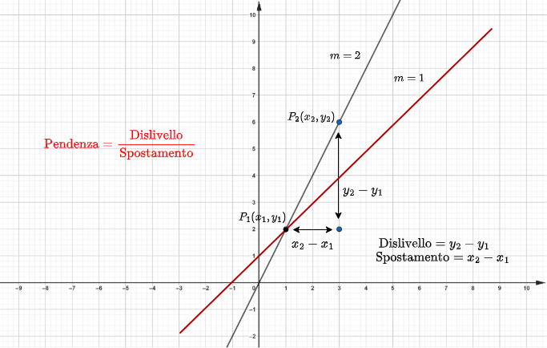

Presi due punti, poichè $x_2 - x_1$ è sempre positivo, se $y_2 - y_1$ è positivo, la retta è inclinata verso l'alto ed $m$ è positivo. Se invece $y_2 - y_1$ è negativo, la retta è inclinata verso il basso ed $m$ è negativo. Se è pari a zero la retta è orizzontale e conseguentemente $m$ è pari a zero.

### Le funzioni inverse di sin x e cos x

Una funzione è invertibile, ossia ammette la funzione inversa, solo se è biiettiva. 
La funzione $y = \sin x$ non è biiettiva perché non è iniettiva. Infatti, se consideriamo una retta $y = k$, parallela all’asse $x$, con $-1 \le k \le 1$, questa interseca il grafico 
della funzione seno in infiniti punti, quindi ogni valore del codominio $[- 1; 1]$ di $y = \sin x$ è immagine di infiniti valori del dominio $\R$.

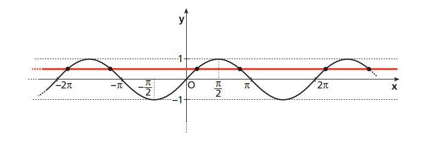

Se però restringiamo il dominio della funzione seno all’intervallo $\left[-\dfrac{\pi}{2}; \dfrac{\pi}{2}\right]$, la funzione $y = \sin x$ risulta biiettiva e dunque invertibile. 
La funzione inversa del seno si chiama arcoseno. Ha come dominio l'intervallo $[-1;1]$ e come codominio $\left[-\dfrac{\pi}{2}; \dfrac{\pi}{2}\right]$.

Il suo grafico è quello riportato in figura.

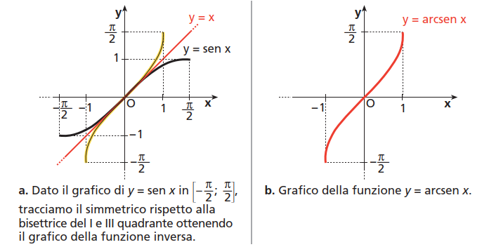

Le stesse considerazioni valgono per la definizione della funzione inversa del coseno e della tangente.

Il coseno è invertibile nell'intervallo $[0; \pi]$ per cui la funzione inversa del coseno si chiama arcocoseno ed ha come dominio l'intervallo $[-1;1]$ e come codominio $[0; \pi]$ .

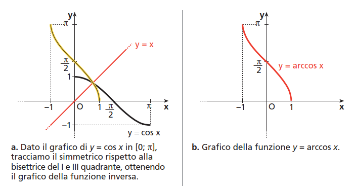

### La funzione inversa di tan x

Se consideriamo l'intervallo $\left(-\dfrac{\pi}{2}; \dfrac{\pi}{2}\right)$ come dominio, la funzione tangente è biunivoca e quindi invertibile.

La funzione inversa della tangente si chiama arcotangente; ha come dominio tutto l'asse reale e codominio l'intervallo $\left(-\dfrac{\pi}{2}; \dfrac{\pi}{2}\right)$. Il grafico è riportato nella figura seguente.

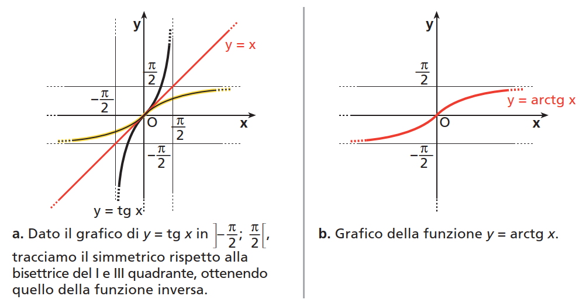

### ESERCIZIO 3.1 - Le funzioni inverse

a) Calcola il valore delle seguenti espressioni:

1. $\arccos \left(-\dfrac{\sqrt 2}{2}\right)$;    $\arcsin \dfrac{\sqrt 3}{2}$;
2. $\arctan (-1) + \arcsin \dfrac{1}{2} -\arctan \dfrac{\sqrt 3}{3}$;
3. $\tan \left(\arccos \dfrac{1}{2} \right)$.

b)  Risolvi le seguenti equazioni:

1. $4 \arctan x = \pi$;
2. $\arctan x = \arcsin \left(-\dfrac{1}{2}\right)$.

### ESERCIZIO 3.2 - Pendenza di una linea

a) Trova, in assoluto ed in percentuale, la pendenza della linea di equazione $3x + 4y = 12$.

b) Scrivi l'equazione della retta che passa per il punto $(0;-2)$ ed ha pendenza $\dfrac{1}{3}$.

c) Nella figura seguente la salita ha una pendenza del $17\%$. Se in un minuto l'autocarro percorre $500$ metri di strada, di quanti metri sarà salito?

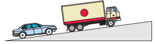

d) Un auto viaggia da Napoli a Roma percorrendo circa $250\; Km$ in $3$ ore e $10$ minuti con una velocità costante. Indicando con $t$ il tempo, misurato in ore, trascorso dall'inizio del viaggio e con $s$ lo spazio in $Km$ percorso:

1. scrivi la formula che calcola lo spazio $s$ percorso dopo $t$ ore; 
2. riporta in un piano cartesiano con il tempo sull'asse orizzontale e lo spazio su quello verticale, il grafico dell'equazione trovata. Quale è il significato fisico del coefficiente angolare della retta?

### ESERCIZIO 3.3 - Dominio di funzioni

a) Determina il dominio delle funzioni riportate di seguito.

1. $y = \arcsin (2x + 1)$;		$R: \left[[-1;0]\right]$
2. $y = \arctan \dfrac{1}{x}$.		$R: \left[(-\infty; 0) \cup (0; +\infty)\right]$

b) Determina il dominio delle funzioni riportate di seguito.

1. $y = \dfrac{1}{\arcsin \sqrt x}$;		$R: \left[(0;1]\right]$
2. $y = \arctan \dfrac{x + 1}{1 - x}$.		$R: \left[(-\infty; 0) \cup (0; +\infty)\right]$

## UNITA' 4: La Trigonometria

Finora ci siamo occupati di goniometria, ossia della misurazione degli angoli e delle funzioni associate a essi. Ora tratteremo la trigonometria, che studia le relazioni metriche fra i lati e gli angoli di un triangolo.

Disegniamo un triangolo rettangolo $\triangle ABC$, con l’angolo retto in $\widehat C$, come in figura, ed analizziamo le misure dei lati e degli angoli. Tracciamo la circonferenza goniometrica con centro $A$.

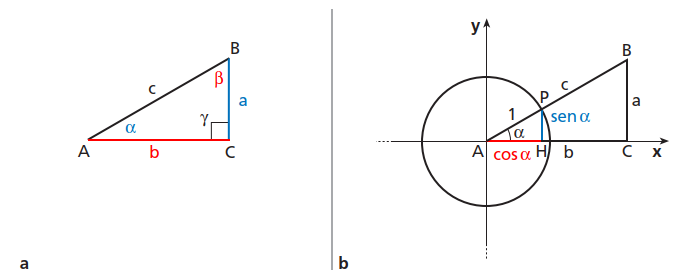

I triangoli $\triangle APH$ e $\triangle ABC$, rispettivamente più piccolo e più grande, sono simili in quanto sono rettangoli e hanno l’angolo acuto $\alpha$ in comune.
Possiamo quindi scrivere le proporzioni seguenti tra il cateto minore e l'ipotenusa e tra il cateto maggiore l'ipotenusa in entrambi i casi:  
$$
BC : AB = PH : AP \\

AC : AB = AH : AP
$$
Poiché $AP = 1$, $PH = \sin \alpha$ e $AH = \cos \alpha$, otteniamo: 
$$
BC = AB \cdot \sin \alpha,\;\; \text{ossia}\;\;  a = c \cdot \sin \alpha \\
AC = AB \cdot \cos \alpha,\;\; \text{ossia}\;\; b = c \cdot \cos \alpha.
$$

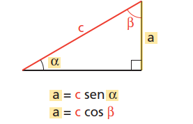

Enunciando il risultato a parole abbiamo:

In un triangolo rettangolo la misura di un cateto è uguale a quella dell’ipotenusa moltiplicata per il seno dell’angolo opposto al cateto o per il coseno dell’angolo (acuto) adiacente al cateto.
$$
\text{cateto = ipotenusa * seno dell’angolo opposto} \\
\text{cateto = ipotenusa * coseno dell’angolo acuto adiacente}
$$

Consideriamo nuovamente la figura b all'inizio dell'unità. Per la similitudine dei triangoli $\triangle APH$ e $\triangle ABC$, possiamo anche scrivere la proporzione $BC :   AC = PH :   AH$, da cui:
$$
\dfrac{BC}{AC} = \dfrac{\sin \alpha}{\cos \alpha} = \tan \alpha
$$
Scritta nella forma $a = b \cdot \tan \alpha$ ci dice che:

In un triangolo rettangolo la misura di un cateto è uguale a quella dell’altro cateto moltiplicata per la tangente dell’angolo opposto al primo cateto.
$$
\text{cateto = altro cateto * tangente dell’angolo opposto al primo cateto}
$$

### La Risoluzione dei Triangoli Rettangoli

Risolvere un triangolo rettangolo significa determinare le misure dei suoi lati e dei suoi angoli conoscendo almeno un lato e un altro dei suoi elementi (cioè, un angolo o un altro lato).

Esaminiamo quattro casi: due casi in cui si conoscono due lati e due casi in cui si conoscono un lato e un angolo.

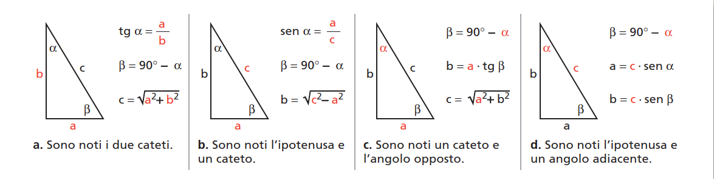

a) Sono noti i due cateti.

Conoscendo $a$ e $b$, vogliamo determinare $\alpha$, $\beta$ e $c$.

$\tan \alpha = \dfrac{a}{b}$,   $\alpha = \arctan \dfrac{a}{b}$,   $\beta = 90^\circ - \alpha$,   $c = \sqrt{a^2 + b^2}$ per il teorema di Pitagora.

b) Conoscendo $a$ e $c$, vogliamo determinare $\alpha$, $\beta$ e $b$.

$\sin \alpha = \dfrac{a}{c}$,   $\alpha = \arcsin \dfrac{a}{c}$,   $\beta = 90^\circ - \alpha$,   $b = \sqrt{c^2 - a^2}$ per il teorema di Pitagora.

c) Conoscendo $a$ e $\alpha$, vogliamo determinare $\beta$, $b$ e $c$.

 $\beta = 90^\circ - \alpha$,     $b = a \tan \beta$,   $\alpha = \arcsin \dfrac{a}{c}$,  ,   $c = \sqrt{a^2 - b^2}$.

d) Conoscendo $c$ ed $\alpha$, vogliamo determinare $\beta$, $a$ e $b$.

$\beta = 90^\circ - \alpha$,     $a = c \sin \alpha$,   $b = c \sin \beta$.

### Area di un Triangolo

L'area di un triangolo si può calcolare conoscendo due lati e l'angolo in essi compreso, ed è uguale alla metà del prodotto tra i due lati ed il seno dell'angolo compreso. Se indichiamo con $S$ l'area, $a$ e $b$ i due lati ed $\alpha$ l'angolo compreso abbiamo:
$$
S = \dfrac{1}{2}bc\sin \alpha
$$
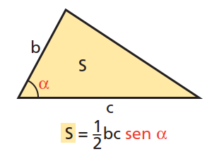

Per dimostrarlo facciamo i due casi di $\alpha$ acuto ed ottuso.

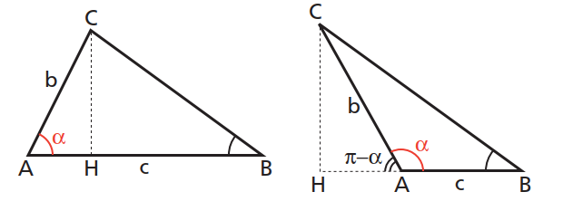

Nel primo caso l'altezza $\overline{CH} = b\sin \alpha$ e nel secondo $\overline{CH} = b\sin (\pi - \alpha) = b \sin \alpha$. In entrambi i casi l'area $S$ è data da base per altezza diviso $2$, ossia $S = \dfrac{1}{2} \cdot \overline{AB} \cdot \overline{CH}$ che è la formula cercata.

### ESERCIZIO 4.1 - Risoluzione di Triangoli Rettangoli

Considera il triangolo $\triangle ABC$ seguente, rettangolo in $A$.

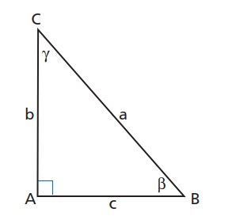

a) Risolvilo conoscendo gli elementi indicati di sotto:

1. un cateto è lungo $10\; cm$ e l’ipotenusa $26\; cm$;
2. i due cateti sono lunghi $30\; cm$ e $40\; cm$;
3. $b = 15$;    $\gamma = 30^\circ$;
4. $a = 48$;    $b = 24$;
5. $c = 10$;    $\gamma = 60^\circ$.

b) Risolvilo conoscendo gli elementi indicati di sotto:

1. $b = 12$;    $\beta = \dfrac{\pi}{3}$;
2. $a = 40$;    $\gamma = 60^\circ$;
3. $b = 14$;    $\gamma = \arccos \dfrac{2}{3}$.

### ESERCIZIO 4.2 - Risoluzione di Triangoli

a) Considera il triangolo $\triangle ABC$ seguente. Determina i lati e gli angoli incogniti avendo gli elementi indicati. 

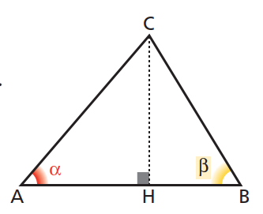

1. $\alpha = 30^\circ$;    $\beta = 45^\circ$;    $\overline{CH} = 12$;		$R: \left[24;\; 12\sqrt{2};\; 12(\sqrt{3} + 1);\; 105^\circ\right]$
2. $\overline{CH} = 8$;    $\overline{AH} = 6$;    $\beta = 30^\circ$;		$R: \left[2(3 + 4\sqrt{3});\; 16;\; 10;\; \arcsin \dfrac{4}{5};\; \arcsin \dfrac{3 + 4\sqrt{3}}{10}\right]$

b) In un triangolo rettangolo un cateto è lungo $10\; cm$ e l’angolo opposto a esso è di $40\; cm$. Trova il perimetro del 
triangolo		$R: [37,47\; cm]$

c) Nel triangolo rettangolo $\triangle ABC$ la lunghezza dell’ipotenusa $BC$ è $41\; cm$ e la tangente dell’angolo $\hat B$ è $\dfrac{40}{9}$. Determina il perimetro e l’area del triangolo.		$R: [90\; cm;\; 180\; cm^2]$

## UNITA' 5: Le Funzioni Goniometriche e le Trasformazioni Geometriche

