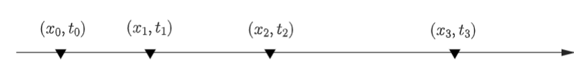
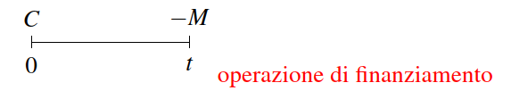
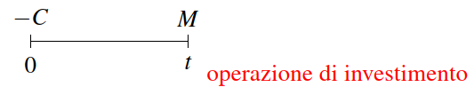

# Matematica Finanziaria: Regimi Finanziari

## UNITA' 1: Concetti fondamentali e regime dell'interesse semplice

La Matematica finanziaria è quella branca della matematica
applicata che ha per oggetto lo studio delle ***operazioni finanziarie***, ovvero delle operazioni di scambio di importi monetari tra due o più soggetti (creditori e debitori) in date diverse.

Le operazioni finanziarie di cui parliamo di definiscono "certe", ossia non dipendenti da alcun evento aleatorio che possa modificare o influenzare l'esito finale previsto e concordato fra i due attori dell'operazione, sia nel valore delle somme pattuite che nei tempi. (Nella realtà nessuna operazione che riguardi il futuro è certa: qui si vuole dire che i calcoli che si fanno in matematica finanziaria non tengono conto di eventi imprevisti, come invece succede in altre discipline).

Le operazioni finanziarie avvengono all'interno di ***contratti finanziari***, ossia accordi tra due o più parti per
scambiarsi degli importi monetari in determinate date. Esempi di contratti finanziari sono:

- Un cittadino investe i propri risparmi (creditore) in un deposito
  bancario cedendoli quindi alla banca (debitore) e posticipandone
  la disponibilità ad una data futura;
- Un cittadino stipula un contratto di mutuo immobiliare
  (debitore) ottenendo un finanziamento da una banca (creditore) e quindi
  anticipando la disponibilità di denaro;
- Un’impresa ottiene un prestito (debitore) da una banca (creditore) per finanziare un progetto produttivo.;
- Un cittadino compra un BOT (creditore) emesso dallo Stato
  Italiano (debitore) che da il diritto di restituzione della somma con interessi.
- Contratto di assicurazione in caso morte vita intera:
  verrà pagato ai beneficiari un importo di 100.000 Euro alla morte
  dell’assicurato. Non rientra nella matematica finanziaria in quanto in questo contratto è noto l’importo, ma non la data.

Un contratto finanziario genera un’operazione finanziaria, cioè
un’operazione di scambio di importi ciascuno caratterizzato da
una propria data di esigibilità (scadenza) e valuta di
denominazione. Una operazione finanziaria viene rappresentata con un grafico dove sono indicate con $x_i$ le somme scambiate e con $t_i$ le date (scadenzario).

Parliamo di ***operazione finanziaria elementare*** quando sono
coinvolte soltanto due date: $(x_0, t_0)$ e $(x_1, t_1)$ e solitamente gli importi sono uno positivo ed uno negativo corrispondente ad una operazione di finanziamento o investimento.

Il problema che ci poniamo è quali relazioni ci siano tra $M$, $C$ e $t$, la durata dell'operazione finanziaria. Essendo queste regolate da un contratto tra le parti, per calcolarle si potrebbe usare qualunque tipo di regola; tuttavia esistono delle regole, o schemi, standard, che vanno
sotto il nome di ***regimi finanziari*** che vengono solitamente applicate.

La differenza $M-C$ è detta ***interesse*** ed indicata da $I$, cioè:
$$
M-C = I
$$
 $I$​ è detto "prezzo del tempo" e si
tratta cioè di un compenso per la rinuncia alla disponibilità di denaro.

La quantità $M = C +I$ si chiama ***montante***, mentre $C$ è il ***capitale
iniziale***. Se si parte dal capitale iniziale C, aggiungendo
l’interesse si ottiene il montante.

### ESERCIZIO 1.1 - Interesse semplice: montante

Calcola l’interesse semplice e il montante dei seguenti capitali (in euro) impiegati alle condizioni indicate: 

a) 500 per 1 anno al tasso del 12% annuo;

b) 1.200 per 8 mesi al tasso dell’11% annuo;

c) 400 per 4 mesi e 20 giorni al tasso del 9% annuo;

d) 1.500 per 8 mesi al tasso del 3% bimestrale;

e) 600 per 7 mesi al tasso del 2,50% trimestrale;

f) 845 per 4 mesi e 15 giorni al tasso del 6% semestrale.

### ESERCIZIO 1.2 - Interesse semplice: capitale
a) Determina i capitali che, nel regime dell’interesse semplice, hanno prodotto i seguenti montanti alle condizioni indicate:  

1. 890 in 9 mesi al tasso del 15% annuo  
2. 504 in 150 giorni al tasso del 12% annuo  
3. 861,42 in 102 giorni al tasso del 3% quadrimestrale

b) Calcola quale capitale impiegato al tasso annuo del 10% da in 8 mesi l’interesse semplice di 34 euro.  

c) Calcola quale capitale impiegato al tasso annuo del 9% da in 3 mesi e 10 giorni un interesse semplice di 115 euro.

d) Il capitale di 6.000 euro ha prodotto l’interesse semplice di 480 euro. Calcola i tassi annui se la durata dell’impiego e stata di:

1. un anno;
2. 10 mesi; 
3. 8 mesi;
4. 4 mesi 

### ESERCIZIO 1.3 - Interesse semplice: durata

a) Calcola in quanto tempo il capitale di 3.300 euro, impiegato al tasso annuo del 10%, ha prodotto il montante di 3.547 euro  

b) Per quanto tempo e necessario lasciare depositato il capitale di 540 euro, al tasso del 4% trimestrale, per poter ritirare il montante di 600 euro? 

### ESERCIZIO 1.4 - Interesse semplice: sconto

a) Una cambiale del valore nominale di 510 euro viene scontata, in regime di capitalizzazione semplice, 3 mesi prima della scadenza, al tasso dell’8% annuo. Calcolare la somma scontata e lo sconto. 

b) Con il pagamento di 840 euro si salda anticipatamente un debito del valore nominale di 863 euro fruendo dello sconto razionale, al tasso dell’8,50% annuo. Determinare il tempo di anticipazione.

c) Un debito viene saldato prima della scadenza, fruendo dello sconto razionale al tasso del 16%. Calcolare la scadenza del debito se la somma scontata è pari ai 9/10 del valore nominale. 

d) Un commerciante per 1'acquisto di una merce deve fare tre pagamenti uguali, di 300 euro ciascuno, scadenti il primo oggi, il secondo fra 2 mesi, il terzo fra 6 mesi. Pagando tutto oggi può fruire dello sconto razionale al tasso del 9% annuo. Calcolare il valore complessivo da pagare oggi.

## UNITA' 2: Regime dell'interesse composto

### ESERCIZIO 2.1 - Interesse composto: montante I

Calcolare il montante ad interesse composto dei seguenti capitali con la calcolatrice e con l’interpolazione:

a) 500 euro per 10 anni al tasso dell’8,10% annuo;

b) 1.800 euro per 6 anni al tasso del 12,15% annuo;

c) 800 euro per 5 anni al tasso del 3,10% semestrale;

d) 1.000 euro per 10 anni al tasso del 5,30% quadrimestrale;

e) 600 euro per 5 anni e 6 mesi al tasso del 3,50% bimestrale;

f) 438 euro per 10 anni e 9 mesi al tasso del 4,16% trimestrale.

### ESERCIZIO 2.2 - Interesse composto: montante II
a) II capitale di L. 6.000.000 è impiegato ad interesse composto al tasso annuo del 14% per 5 anni. Il montante viene subito reinvestito per altri 4 anni al tasso annuo dell’11%.  
1. Quale montante si può ritirirare? 
2. Quale montante si sarebbe ritirato se per i primi 4anni il tasso fosse stato dell’11% e per i successivi 5 fosse stato del 14%? 

b) Una persona prende in prestito 20.000 euro al tasso annuo del12% e le investe al tasso annuo del 15%. Quanto guadagna se l'impiego e di 5 anni?

### ESERCIZIO 2.3 - Interesse composto: valore attuale I

Calcola il valore attuale con interesse composto dei seguenti capitali alle condizioni indicate:

a) 1.200 euro per 5 anni al tasso del 7% annuo;

b) 800 euro per 10 anni al tasso del 12% annuo;

c) 665 euro per 4 anni e 6 mesi al tasso del 3% trimestrale;

d) 3.012 euro per 2 anni e 5 mesi al tasso dell’1,50% mensile.

### ESERCIZIO 2.4 - Interesse composto: valore attuale II
a) Scontiamo una cambiale del valore di 20.000 euro scadente fra 5 anni con sconto composto al tasso del 12%. Investiamo subito la somma riscossa al lasso del 16%. Quale guadagno realizzeremo fra 5 anni?

b) Per l’acquisto di un alloggio sono richiesti i seguenti pagamenti: L. 30.000.000 alla stipulazione del contralto e tre somme di euro 10.000 ciascuna scadenti fra 2, 4 e 6 anni. Se si vuole pagare tutto subito si applica lo sconto composto al tasso annuo del 9%. Quale somma complessivamente si deve pagare alla stipulazione del contratto per acquistare l’alloggio in contanti? 

