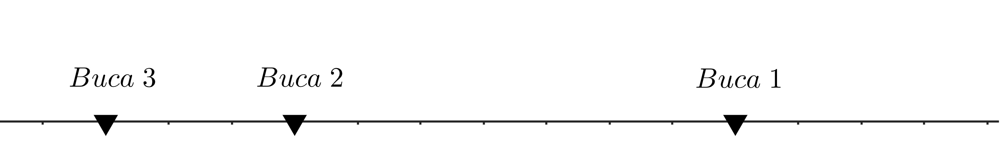
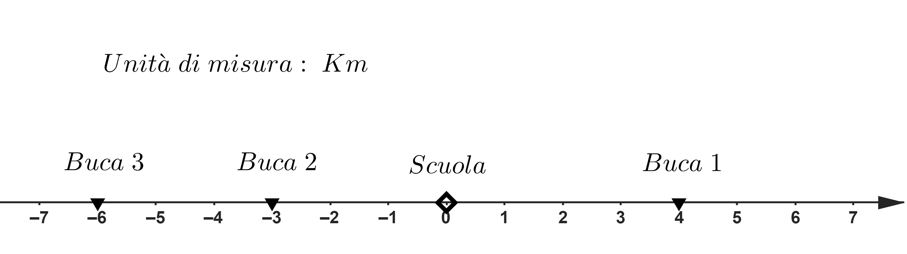
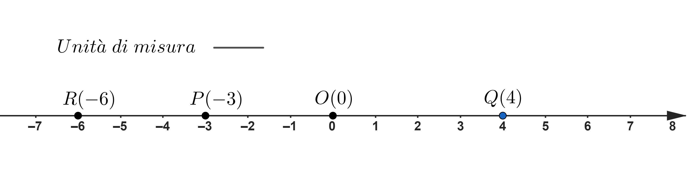

# Numeri interi e coordinate dei punti

## UNITA' 1: Concetto di numeri con segno e punti su una retta

Un numero intero, o relativo, è un numero costituito di due parti: la prima parte è un numero naturale e la seconda è un segno "$+$" o "$-$"  che lo precede a sinistra, ad esempio $+5$, $-5$, $+134$, $-21$.  

In una espressione con i numeri interi, ogni numero ha un segno, ed ogni segno ha un numero. A volte compaiono numeri non preceduti da segno; in tal caso i numeri si intendono positivi.

E' molto utile mettere in corrispondenza I numeri interi con alcuni punti di una retta. Consideriamo una retta orizzontale e fissiamo un punto particolare, che chiameremo ***origine*** $O$, un segmento come ***unità di misura*** delle distanze ed un ***verso***, a destra, come in figura. 

Questo disegno ci da un ***sistema di riferimento*** (ad una dimensione) per indicare la ***posizione*** di ogni punto che dista un multiplo dell'unità di misura dall'origine.

#### ESEMPIO

Consideriamo il problema seguente. Su una strada dritta ci sono delle buche ed una squadra di operai su un piccolo camion deve riparare il manto stradale, come nella figura seguente.

Come indicare alla squadra dove si trovano le buche se non abbiamo nessun punto di riferimento?

Se scegliamo nella città un punto di riferimento come una scuola o un edificio che la squadra conosce (diventa la nostra ***origine***) e misuriamo le distanze in $Km$, introduciamo nella città un sistema di riferimento e la posizione delle buche sarà indicata da dei numeri interi, che misureranno la distanza dall'origine, positiva se a destra e negativa se a sinistra.

Potremo quindi dire alla squadra che la buca 2 si trova a $3 \;Km$ a sinistra del punto di riferimento preso come origine, ossia ha coordinata $-3$ e così via.

In generale un sistema di riferimento su una retta consente di dare una posizione ai punti. Nella figura sono indicati 3 punti, $R$, $P$ e $Q$ e tra parentesi la loro posizione mediante la loro coordinata.

Il punto $Q$ ha come coordinata $4$ perché è a quattro unità a destra dell'origine $O$, il punto $R$ ha coordinata $-6$ perché è a $6$ unità a sinistra dell'origine e così via.

La posizione dei punti è indicata da un numero relativo dove il "numero" è la distanza del punto dall'origine ed il segno indica se il  punto è a destra (segno positivo) o a sinistra (negativo) dall'origine. Questo numero si chiama ***coordinata del punto*** su una ***retta orientata***.

### Esercizio 1 - Numeri interi e punti su una retta

a) Disegna su una retta orientata orizzontale i punti $A, B, C, D, E, F, G$ ciascuno nella posizione indicata dalla coordinata corrispondente: $+3, -5, +4, -2, 0, +1, -4$. 

b) Disegna su una retta orientata ***verticale*** i punti $P, Q, R, S, T, U$ ciascuno nella posizione indicata dalla coordinata corrispondente: $0, -2, 2, 3, 4, -4$. Fai uno spostamento a partire dallo zero verso l'alto se il numero è positivo e verso il basso se è negativo. Alla fine dello spostamento disegna il punto.

### ESERCIZIO 2 - Ordinamento dei numeri interi

Scrivi in ordine:

a) crescente i numeri $-6, +9, -1, +7, -2, -4;$ 

b) decrescente i numeri $+8, -3, 0, -5, +4, -11.$  

#### Laboratorio GEOGEBRA

Risolvi i punti a) e b) dell'esercizio con le istruzioni GEOGEBRA seguenti (calcolatrice ALGEBRA):

1. $Ordina(\{-6,9,-1,7,-2,-4\})$&#9166;
2. $l = Ordina(\{+8, -3, 0, -5, +4, -11\})$&#9166;
3. $Inverti(l)$&#9166;

## UNITA' 2: Opposto, valore assoluto e relazioni

L'**opposto** di un numero intero è un secondo numero intero che ha lo stesso numero naturale del primo ma segno diverso, ad esempio $-13 \xrightarrow{\text{opposto}} 13$,    $5 \xrightarrow{\text{opposto}} -5$,    $-240 \xrightarrow{\text{opposto}} 240$.

Il **valore assoluto** di un numero intero è un secondo numero intero sempre positivo, corrispondente al numero naturale del primo (si dice anche che il valore assoluto di un numero è il numero "senza il segno"). 

Detto in altro modo, se il numero è positivo, il suo valore assoluto è uguale al numero, se il numero è negativo è uguale all'opposto del numero, ad esempio $-13 \xrightarrow{\text{v.a.}} 13$,    $5 \xrightarrow{\text{v.a.}} +5$,    $-240 \xrightarrow{\text{v.a.}} 240$. Il valore assoluto di un numero si indica con il simbolo $|\phantom{-}|$, ad esempio $|-3| \longrightarrow 3$, $|5| \longrightarrow +5$.

La scrittura $3 \gt 5$ afferma una **relazione** tra due numeri, precisamente che il numero 3 è maggiore del numero 5 ed è chiaramente falsa. Si dice che il suo "***valore di verità***" è "Falso" e si scrive che $3 \gt 5 \longrightarrow{} False $ . Invece $4 = 2 + 2$ afferma una cosa vera e si scrive che $4 = 2 + 2 \longrightarrow True$ , dove $True$ sta per "Vero". Analogamente "$\lt$" è il simbolo di "minore", $3 \lt 5$ afferma che il numero 3 è minore del numero 5, è chiaramente vera, e simbolicamente scriviamo che $3 \lt 5 \longrightarrow True$ . Osserviamo che $3 \lt 3 \longrightarrow False$ .

I simboli "$\le$" e "$\ge$" significano "minore o uguale" e "maggiore o uguale", per cui $3 \le 5 \longrightarrow True$  e  $3 \le 3 \longrightarrow True$ .

### ESERCIZIO 3 - Valore assoluto ed opposto 

a) Calcola valore assoluto ed opposto dei seguenti numeri e di tutti disegna i punti corrispondenti su una retta orientata orizzontale.

$-4$;      $+9$;      $+7$;      $7\cdot 4$;      $0$.

### ESERCIZIO 4: Uguaglianze e disuguaglianze

a) Controlla la verità delle seguenti relazioni:

1. $-1 > 0;$     $-7 < -3;$      $0 \le 0;$      $1 = 1 + 0;$      $5-4 \ge 1+3-4;$
2. $2+3=11-5;$      $3^{2}-2\text{·}3-1=\left(3-2\right)^{2};$

## UNITA' 3: Somma tra numeri interi

Nel "mondo" dei numeri interi, i simboli "$+$" e "$-$" che troviamo nelle espressioni non indicano operazioni ma segni dei numeri. La somma e la sottrazione si realizzano con un'unica operazione: la "**somma algebrica**" che non si scrive ma è sempre presente, tra due numeri in sequenza, dopo l'ultima cifra di un numero ed il segno del numero successivo.

#### ESEMPIO

L'espressione $3-2$ nel "mondo" dei numeri naturali contiene due numeri, $3$ e $2$ ed una operazione, la sottrazione. Nel mondo dei numeri interi contiene due numeri, $3$ e $-2$ in sequenza, uno dopo l'altro; in mezzo a loro vi è una operazione chiamata somma algebrica (a destra del $3$ ed a sinistra del "$-$") nella posizione indicata dalla freccia:  $3\overset{\downarrow}{\phantom{|}} -2$ , come negli esempi seguenti:

- $-123\overset{\downarrow}{\phantom{|}}-23$;
- $1\overset{\downarrow}{\phantom{|}}-2 \overset{\downarrow}{\phantom{|}} + 3 \overset{\downarrow}{\phantom{|}} -4$.

L'operazione di somma algebrica si esegue facendo una sequenza di spostamenti di un punto ideale, uno per ogni numero della somma. Il risultato della somma $3-2$ si ottiene spostando il punto ideale dallo $0$ di $3$ unità a destra fino alla posizione $+3$ e da qui verso sinistra di $2$ unità raggiungendo la posizione $1$, che è il risultato della somma algebrica.

Lo stesso risultato si ottiene con $-2+3$ (due unità a sinistra e tre a destra) e la somma algebrica è sempre posizionata dove indica la freccia $-2\overset{\downarrow}{\phantom{|}} +3$ e come si vede, a differenza della sottrazione, la somma algebrica è commutativa.

 

### ESERCIZIO 5 - Somme algebriche

a) Una lumaca cammina lungo una linea dritta verso destra per 7 cm, poi si gira e cammina verso sinistra per 2 cm, poi si gira e cammina verso destra per 5 cm, poi ancora una volta si gira e cammina per 12 cm verso destra.

Indicando con un numero positivo ogni spostamento verso destra e con uno negativo gli spostamenti verso sinistra calcolare:

1. lo spostamento totale della lumaca dal punto di partenza;
2. la distanza totale percorsa dalla lumaca.

 

b) Per ciascuna delle seguenti coppie di numeri tra parentesi scrivi la somma algebrica e calcola il risultato.

1. $(+2, +8);$   $(+5, -8);$   $(-5, +8);$   $(-5, -8);$
2. $(0, +2);$   $(-2, 0);$   $(+4, -4);$   $(-4, +4);$

c) Trova quanti numeri interi e quante operazioni contiene ciascuna delle espressioni seguenti e calcola il valore di ciascuna dei esse.

1. $+5-9;$    $-2+6;$    $12-19+6;$     $-5-9-10;$  
1. $1 + 2 + 3 - 3 - 2 - 1 - 0;$     $+1 - 1 + 1 - 1 + 1;$     $1 - 2 + 3 - 4 + 5 - 6$.

### ESERCIZIO 6 - Problemi con i numeri interi I

Scrivi le espressioni (**NON il solo risultato!**) che, utilizzando i dati contenuti nel testo, forniscono le soluzioni ai problemi seguenti e calcolane il valore. 

a) Ho ottenuto un prestito di 75 euro senza interessi. Dopo un certo tempo ho restituito al creditore 37,50 euro, poi ho preso in prestito altri 42,50 euro. Oggi, dopo aver restituito altri 25 euro, qual è la mia situazione (saldo) con il creditore, considerando positivamente i crediti e negativamente i debiti?

b) Una azienda ha realizzato negli anni i profitti riportati in figura:

1. Quale è stato il profitto totale dell'ultimo quinquennio?
2. Quale è stato il calo di profitto tra il 2018 ed il 2019, tra il 2019 ed il 2020 e tra il 2020 ed il 2021?
3. Quale è stato l'anno peggiore e quale il migliore?

c) Un palo è piantato nel fondo di un fiume. Tre metri di palo sono nel terreno, 10 metri sono nell'acqua e 2 metri sono nell'aria, fuori dall'acqua. Se consideriamo il livello dell'acqua come altezza zero, al di sotto altezze negative ed al di sopra altezze positive, indica a che altezza sono i due capi del palo. 

d) In un campionato di calcio si ha la situazione di classifica seguente:

$$
\begin{array}{l|c}
		\textbf{SQUADRA} & \textbf{PUNTI} \\
        \hline        
        Inter & 45 		\\
        Juventus & 41 	\\
        Roma & 40  		\\
        Atalanta & 33  	\\
        Napoli & 29 	\\
        Fiorentina & 25 \\
        \end{array}
$$
Indicando con un numero positivo il distacco tra una squadra e le inseguitrici e con un numero negativo il distacco con le precedenti in classifica, scrivi i distacchi dell'Atalanta e della Juventus. Quale è il nuovo distacco dell'Atalanta dalla Juventus se la prima dimezza il distacco esistente? 

e) Giocando a carte con tre avversari, effettuo due partite che terminano nel modo seguente:
1. vincita di 40 punti con il primo giocatore; perdita di 170 punti con il secondo giocatore; vincita di 10 punti con il terzo giocatore;
2. vincita di 60 punti con ciascun giocatore.

Quanti punti ho alla fine delle partite?

## UNITA' 4: Prodotto e quoziente tra numeri interi

### ESERCIZIO 7 - Prodotti e quozienti

a) Calcola i seguenti prodotti e quozienti (quanti numeri ed operazioni contiene ciascuna espressione?):

1. $-5\text{·}(-8);$   $-5(-8);$   $-(5);$   $-(5)8;$   $5 \cdot (-8);$   $+(5) \cdot 8;$

2. $+4\cdot 8 \cdot (-2);$   $-(-12) \cdot (-5);$   

3. $(+15):(+3);\enspace (+15):(-3);$ 

4. $(-8):(+8);$   $0:(-5);$    $-(2):2$.

b) Per ciascuna delle seguenti coppie di numeri tra parentesi scrivi il prodotto e calcola il risultato

1. $(2, 8);$   $(+5, 8);$   $(5, -8);$   $(-5, -8);$
2. $(-2, 0);$   $(0, -2);$   $(+4, -4);$   $(-4, +4);$

c) La lumaca dell'esercizio 4.a si muove di 5 cm verso sinistra, poi si gira e si muove del doppio della distanza iniziale verso destra, quindi si gira e si muove del triplo della distanza iniziale ancora verso sinistra. Calcolare lo spostamento della lumaca prima di ogni cambiamento di direzione e scrivere l'espressione che ci dà lo spostamento totale.

## UNITA' 5: Espressioni tra numeri interi

### ESERCIZIO 8 - Espressioni con le quattro operazioni

a) Calcola il valore delle espressioni seguenti. 

1.  $-7-5\cdot2+16$.		[$R. -1$];

2.  $-7-5\cdot2+16:8-5+6-18:3$.		[$R. -20$];

### ESERCIZIO 9 - Espressioni con parentesi

a) Calcola il valore delle espressioni seguenti. 

1.  $(-15):3-6+18:(-6)-(+7 \cdot 3-10)+7\cdot2$.		[$R. -11$];

2.  $[3 \cdot (2-4)-5] \cdot (-2)-[15+3 \cdot (-4)-(-6+2)]+5$.		[$R. +20$];  

b) Individua quanti e quali numeri interi ed operazioni contiene ciascuna delle espressioni seguenti e calcola il valore di ciascuna dei esse.

1.  $5[10-2\text{·}(3\text{·}7-5\text{·}4)]\text{·}8.$

2.  $80+[(4+3\text{·}5):(3+2\text{·}8)].$  

3.  $-(+5)-(-(-1))$.  

c) Calcola il valore delle seguenti espressioni.

1. $\left\{ 5[10-2\text{·}(3\text{·}7-5\text{·}4)]\text{·}8\right\} :80+[(4+3\text{·}5):(3+2\text{·}8)]. \enspace\enspace\enspace [R. 5];$  
2. $\left\{ [(10-6)^{2}+3\text{·}10]:(6:3)\right\} +4+3^{2}-(2^{4}-1). \enspace\enspace\enspace\enspace\enspace\enspace\enspace [R. 21];$  
3. $\left\{ -(+5)-[-(-1)]\right\} -\left\{ [-(+5)]-[-(-7)]\right\} -\left\{ -[-(-3)]-[-(-6)]\right\}. \enspace\enspace\enspace    [R. 15];$  

d) Alcune delle espressioni seguenti hanno delle coppie di parentesi "inutili". Riscrivi le espressioni senza le parentesi "inutili" e di tutte calcola il valore.

1. $4+(3-2)+1;$    $-1(2-3)+5(-6);$    $(2-3)-1-6\cdot 5;$
2. $(+4)+(+5-9);$    $[+15-(+7+3-2)]+[-15-(-6+7-1)]$.

e) Scrivi tre espressioni ciascuna contenente tre numeri, due operazioni ed una coppia di parentesi NON inutili.

#### Laboratorio GEOGEBRA

a) Per risolvere l'esercizio applica il metodo seguente. 

1. Calcola il valore dell'espressione del testo con GEOGEBRA;
2. Scrivi la stessa espressione senza le parentesi che pensi siano inutili;
3. Calcola il valore con GEOGEBRA della nuova espressione. Se è lo stesso di quella originale le parentesi sono "inutili", altrimenti no.

### ESERCIZIO 10 - Rappresentazione delle espressioni

a) Scrivi le espressioni relative ai seguenti diagrammi ad albero:

1.    

   

   

   

   

2.    

   

   

   

   

3.    

   

   

   

b) Scrivi i diagrammi ad albero relativi alle espressioni seguenti:

1) $-4(-3)^2-(-2);$
2) $67-5[-1+(2-8)^2];$  
4) $ (-20+3(-5)):(21-(-4)^2).$

#### Esempio di SOLUZIONE

b.2) 

### ESERCIZIO 11 - Dalle parole alle espressioni I

Traduci in espressioni le seguenti frasi e calcolane il valore.  

a) Sottrai 7 al prodotto di 2 per 3;

b) Scrivi la differenza tra 15 ed il prodotto di 7 per 2;

c) Aggiungi 10 al rapporto tra 16 e -2;

d) Moltiplica per -3 la differenza tra 4 e il prodotto di 2 per 3;

e) Scrivi il rapporto tra 15 e la somma tra 2 e 3;

f) Sottrai alla somma di 7 e del prodotto di 2 per 3 la differenza tra 15 e il prodotto di 7 per 2, aggiungi poi al
risultato il quoziente di 16 per -2;

g) Moltiplica per -3 la differenza tra 4 e il prodotto di 2 per 3, sottrai poi al risultato il risultato della divisione tra 15 e la somma tra 2 e 3.

#### Esempio di SOLUZIONE

a) $2 \cdot 3 - 7;$      b) $15 - 7 \cdot 2;$      c) $16 : (-2) + 10;$

## UNITA' 6: Coordinate di punti nel piano

Nell'unità 1 abbiamo visto come, se il nostro mondo è limitato agli spostamenti su una retta, con un solo numero sia possibile indicare la posizione di un punto (che ha una distanza intera dall'origine). Ora ci chiediamo come sia possibile fare la stessa cosa se dobbiamo indicare la posizione dei punti su un piano, che ha due dimensioni.

Se in un piano disegnamo due rette perpendicolari, indicando su ciascuna retta la posizione dei numeri interi a partire dal punto di incrocio, che diciamo ***origine degli assi***, come fatto nell'unità 1, abbiamo la figura seguente, detta ***sistema di riferimento cartesiano nel piano***.

#### ESEMPIO

Consideriamo il problema seguente. In una città ci sono delle buche sulle strade ed una squadra di operai su un piccolo camion deve riparare il manto stradale. Per semplicità facciamo finta che le strade della città siano tutte dritte, alcune orizzontali ed alcune verticali, come a Manhattan, e che le buche siano negli incroci, come nella figura seguente.

Come indicare alla squadra dove si trovano le buche se non abbiamo nessun un punto di riferimento?

Se scegliamo nella città un punto di riferimento come una scuola o un edificio che la squadra conosce (diventa la nostra origine) e misuriamo le distanze in $Km$, introduciamo nella città un sistema di riferimento e la posizione delle buche sarà indicata da dei numeri interi, che misureranno la distanza dall'origine (in $Km$), come nella figura seguente.

Potremo quindi dire alla squadra che la buca 2 si trova a $6 \;Km$ a destra della scuola ed a $4 Km$ sopra la scuola, ossia ha coordinate $(6, 4)$ mentre la buca 1 è a $2 \; Km$ a sinistra della scuola ed a $6 \; Km$ in basso, cioè le coordinate sono $(-2, -6)$ e così via.

Come si vede, a differenza dell'Unità 1, se i punti di cui vogliamo indicare la posizione non sono vincolati a stare su una retta ma possono stare su un piano, per trovare la loro posizione servono due numeri, e sono i numeri che si trovano immaginando che un oggetto che so muove partendo dall'origine raggiunga la posizione del punto con due movimenti: il primo in orizzontale ed il secondo in verticale. Con il primo movimento il mezzo arriva sotto (o sopra!) il punto e con il secondo, in verticale, lo raggiunge.

Se ad esempio il mezzo deve raggiungere la buca 1 partendo dall'origine degli assi, si muoverà di $2$ unità a sinistra $6$ unità in basso, per cui la posizione della buca 1 avrà come coordinate i due numero $-2$ e $-6$ che si scrivono tra parentesi tonde separate da una virgola: $(4, 2)$. Questi due numeri costituiscono una coppia detta ***coppia di coordinate***: la prima coordinata della coppia viene chiamata ***ascissa*** e la seconda ***ordinata***.

I segni delle coordinate, a seconda che la posizione si trovi a destra. sinistra, alto o basso rispetto all'origine, sono riportati nella tabella che segue.
$$
\begin{array}{c|c}
		\textbf{Direzione} & \textbf{Segno}\\
        \hline        
        Destra & + 		\\
        Sinistra & - 	\\
        Alto & + \\ 
        Basso & - \\ 
        \end{array}
$$

### ESERCIZIO 12 - Posizionamento di punti su un piano cartesiano

a) Posiziona quattro punti su un piano di riferimento cartesiano in corrispondenza delle coordinate $(1,1), (-1,1), (-1,-1), (1,-1)$.

b) Posiziona tre punti su un piano di riferimento cartesiano in corrispondenza delle coordinate $(-1,0), (1,0), (0,1)$.

c) Posiziona sei punti su un piano di riferimento cartesiano in corrispondenza delle coordinate $(-3,-1), (-1, -1), (0,-1), (1,-1), (2,-1), (3,-1)$.

#### SOLUZIONI

        

d) La tabella seguente riporta le temperature misurate in una città alle otto del mattino nei primi 10 giorni del mese di Dicembre del 2022.
$$
\begin{array}{c|r}
\text{Giorno} & \text{Gradi} \\
\hline
1 & 5 \phantom{-}  \\
\hline
2 & 7 \phantom{-}  \\
\hline
3 & 9 \phantom{-}  \\
\hline
4 & 4  \phantom{-} \\
\hline
5 & 0  \phantom{-} \\
\hline
6 & -1 \phantom{-} \\
\hline
7 & -3 \phantom{-} \\
\hline
8 & 1  \phantom{-} \\
\hline
9 & 1  \phantom{-} \\
\hline
10 & -2 \phantom{-} \\
\hline
\end{array}
$$
Considera i due numeri di ogni colonna una coppia di coordinate (es. $(1,5), (2,7)$) e posiziona in un piano cartesiano un punto in loro corrispondenza.

#### SOLUZIONE

#### Laboratorio GEOGEBRA

a) Risolvi il punto a) dell'esercizio con le istruzioni GEOGEBRA: 

1. $(1,1)$  &#9166; 
2. $(-1,1)$  &#9166; 
3. $(-1,-1)$  &#9166; 
4. $(1, -1)$ &#9166; .

b) Risolvi il punto d) dell'esercizio visualizzando una tabella; inserisci nella prima colonna della tabella GEOGEBRA (colonna "x") i dati del Giorno e nella seconda colonna (la "y") i gradi di temperatura. 

### ESERCIZIO 13 - Dai punti alle coppie di coordinate

a) Scrivi le coppie di numeri interi  (coordinate) che individuano i punti in figura.

b) Scrivi il sottoinsieme delle coppie precedenti che hanno entrambi i numeri negativi.

#### Laboratorio GEOGEBRA

a) Risolvi il punto b) dell'esercizio precedente con l'istruzione GEOGEBRA: 

$H=(-3,-3)$ &#9166; .

### ESERCIZIO 14 - Espressioni con le potenze

a) Individua quanti e quali numeri interi ed operazioni contiene ciascuna delle espressioni seguenti e calcola il valore di ciascuna dei esse.

1. $\left[\left(2^{4}+2^{3}\right):\left(8^{2}:4^{2}\right)\right].$  

2. $\left[\left(2^{4}+2^{3}\right):\left(8^{2}:4^{2}\right)\right]+\left[3^{2}\cdot2^{2}:\left(6^{3}:6^{2}\right)\right]. \enspace\enspace\enspace [R. 12];$  

3. $\left\{ \left[\left(-6\right)^{3}\cdot\left(-3\right)^{3}\right]:18^{2}\right\} :\left(-18\right)\text{·}\left(-2\right). \enspace\enspace\enspace [R. 2];$  

b) Calcola il valore delle seguenti espressioni.

1. $\left\{ 2^{4}:\left[3^{2}\cdot2^{2}-3\left(3^{3}:3\right)-2^{4}:2^{3}+2^{2}-3\right]+3\right\} ^{2}.     \enspace\enspace\enspace [R. +25];$  
2. $-4(-3)^2-(-2);\enspace 40:(-4)5;\enspace  -2^2-(-2)^2;\enspace  -15+3(-4+7\cdot 2);$
3. $67-5[-1+(2-8)^2];\enspace (-20+3(-5)):(21-(-4)^2).$

## UNITA' 7: Sostituzioni con i numeri interi

In matematica oltre alle espressioni con sole operazioni e numeri (espressioni numeriche) si usano anche espressioni in cui compaiono delle lettere, come ad esempio $a+1$, $b^2$,  $2 \cdot c + 1$, dette ***espressioni letterali***. Le operazioni nelle espressioni letterali  non possono essere eseguite tutte fino a quando alle lettere non si sostituiscono dei numeri, ossia non si operi una "***sostituzione***".

La sostituzione è una operazione che consiste nel rimpiazzamento delle lettere con dei numeri, come nell'esempio seguente, dove cosa sostituire è indicato in parentesi graffe:

 $2 \cdot c + 1, \{c = -4\} \longrightarrow 2 \cdot (-4) + 1 \longrightarrow -7$.

La sostituzione va fatta limitatamente alla <u>sola lettera</u> interessata, tutte le volte che la lettera compare nell'espressione, facendo attenzione a non alterare la sequenza di operazioni presenti nell'espressione. Per evitare ciò la sostituzione di un numero che ha il segno va fatta con il numero racchiuso tra parentesi tonde. 

 $2 \cdot x + x^2, \{x = +2\} \longrightarrow 2 \cdot (+2) + (+2)^2 \longrightarrow 4+(4) \longrightarrow 4 + 4 \longrightarrow 8$.

 $2 \cdot x - y^2, \{x = -2, y = -3\} \longrightarrow 2 \cdot (-2) - (-3)^2 \longrightarrow -4 - (9) \longrightarrow -4-9 \longrightarrow -13$.

Si può evitare di racchiudere il numero tra parentesi solo se si sta sostituendo un numero positivo e lo si sostituisce senza il segno "$+$", come nell'esempio seguente.

 $2 \cdot x + x^2, \{x = 2\} \longrightarrow 2 \cdot 2 + 2^2 \longrightarrow 4 + 4 \longrightarrow 8$.

### ESERCIZIO 15 - Sostituzioni di una e di due lettere

a) Scrivi le espressioni numeriche ottenute sostituendo alle lettere i numeri indicati tra parentesi graffe e poi calcola il loro valore.

1. $x^2,\ \{x=2\};$     $x^2,\ \{x=-2\};$     $-x^2,\ \{x=2\};$     $-x^2,\ \{x=-2\};$
2. $-2x + x^2 + 1,\ \{x=2\}$;     $-2x + x^2 + 1,\ \{x=-2\}$.

b) Scrivi le espressioni numeriche ottenute sostituendo alle lettere i numeri indicati tra parentesi e poi calcola il loro valore (ogni sostituzione riguarda due lettere).

1. $3-a^{3}-2b^{2}+a^{2}\text{·}(a-b),\ \{a=2,\ b=-2\}$  
2. $3ab-5a^{2}+3a-1,\ \{a=-2,\ b=-8\}$  
3. $(a+b)(a-b)+ab-a^{2},\ \{a=6,\ b=-3\}$  
4. $(x^{2}+a)x-a(x-1):(x+1)+4a,\ \{x=1,a=-9\}$

C) Scrivere gli alberi relativi alle espressioni numeriche dei punti a.1 ed a.2.

#### Laboratorio GEOGEBRA

Risolvi il punto a.2) dell'esercizio con le istruzioni GEOGEBRA seguenti (calcolatrice CAS):

1. $l = 3a\cdot b - 5a^2+3a-1$&#9166;
2. $Sostituisci(l,\{a = -2, b = -8\})$&#9166;

### ESERCIZIO 16 - Sequenze di sostituzioni e tabelle

a) Scrivi le espressioni numeriche ottenute sostituendo alla lettera presente uno alla volta i numeri indicati tra le parentesi graffe e calcola il loro valore.

1. $2 \cdot a ,\,\,\ a \in \{-5, 5\};$
2. $a^2 ,\,\,\ a \in \{0, 1, -1, 2, -2\};$
3. $2 \cdot a + 1,\,\,\ a \in \{0, 1, -1, 2, -2\};$

#### Esempio di SOLUZIONE

Sostituzione del punto a.2: $\{0^2, 1^2, (-1)^2,2^2, (-2)^2\} \rightarrow 	\{0,1, 1, 4, 4\}$

b) Organizza le sostituzioni seguenti in tabelle, mettendo nella prima colonna i numeri da sostituire e nella seconda il valore dall'espressione sostituita.

1. $a^2 ,\,\,\ a \in \{0, 1, -1, 2, -2\};$
2. $-a + 1,\,\,\ a \in \{0, 1, -1, 2, -2\};$
3. $-2a - 1,\,\,\ a \in \{0, 1, -1, 2, -2\};$

#### Esempio di SOLUZIONE

Sostituzioni del punto a.1) 
$$
\begin{array}{r|c}
a & a^2\\
\hline
0 & 0  \\
1 & 1  \\
-1 & 1  \\
2 & 4  \\
-2 & 4  \\
\end{array}
$$

#### Laboratorio GEOGEBRA

a) Risolvi i punti a.1) e a.2) con le istruzioni GEOGEBRA seguenti (calcolatrice **GRAFICI**):

1. $Compatta(2 \cdot a,a,\{-5, 5\});$
2. $Compatta(-a +1,a,\{0,1,-1,2,-2\});$

b) Risolvi i punti b.1) e b.2) con le istruzioni GEOGEBRA seguenti (calcolatrice **CAS**):

1. Inserisci l'espressione letterale, dagli un nome e la lettera da sostituire con l'istruzione seguente:

   $f(a) := a^2;$&#9166;

2. Seleziona "Tabella" e nella prima colonna inserisci i valori $0, 1, -1, 2, -2$;

3. Seleziona "Algebra" e dal menu di inserimento seleziona la voce "Tabella di Valori";

4. Nella tabella compaiono i numeri da sostituire ed i valori dell'espressione.

### ESERCIZIO 17 - Dalle parole alle espressioni II

Traduci in espressioni le seguenti frasi indicando con la lettera ‘$x$’ il numero generico citato; calcola poi il loro valore, sostituendo alla lettera il numero assegnato.

a) Aggiungi ad un numero il suo triplo [$x=1$];

b) Sottrai da un numero la sua metà [$x=6$];

c) Moltiplica un numero per 4 e sottrai la sua terza parte sommata a 22 [$x=9$];

d) Moltiplica un numero per 4, sottrai al prodotto un suo terzo e somma al risultato 12 [$x=-9$];

e) Somma alla metà di un numero la sua quinta parte e sottrai il numero stesso diminuito di 6 [$x=-20$];

f) Scrivi il doppio di un numero diminuito di uno sommato al triplo dello stesso numero al quadrato [$x=0$];

g) Scrivi due numeri consecutivi [$x=3$]. 

#### Esempio di SOLUZIONE

a) $x + 3 \cdot x;$      b) $x - x : 2;$      c) $4 \cdot x - (x : 3 + 22);$

### ESERCIZIO 18 - Ricerca di sostituzioni

a) Per ciascuna delle uguaglianze seguenti trova una coppia di numeri che sostituita ordinatamente alle lettere a e b rendono l'uguaglianza vera.

1. $a+b=5;$
2. $a-b=5;$
3. $a+b=2;$

b) Per ciascuna delle uguaglianze seguenti trova tre coppie di numeri che sostituite ordinatamente alle lettere a e b rendono l'uguaglianza vera.

1. $a+b=0;$
2. $b=a+1;$
3. $a=-b+2$.

### ESERCIZIO 19 - Dalle parole alle espressioni III

Essendo $a$ e $b$ due numeri interi, traduci in espressioni le seguenti frasi e calcola il valore delle espressioni sostituendo alle lettere i numeri assegnati.

a) Sottrai $b$ al triplo di $a$,  [$a = 3, b = 2$];

b) Aggiungi il quadruplo di $b$ alla differenza tra il triplo di $a$ e $b$ , [$a = 3, b = 2$];

c) Dividi la somma di sette volte $a$ e il cubo di $b$ per la somma di $a$ e $b$,  [$a = 3, b = 3$];

d) Moltiplica la somma del quadruplo di $a$ e del triplo di $b$ per la somma del doppio di $a$ e del triplo di $b$,  [$a = 3, b = 2$].

#### Esempio di SOLUZIONE

a) $3\cdot a - b;$

b) $3 \cdot a - b + 4 \cdot b;$

c) $(7 \cdot a + b^3) : (a + b);$

### ESERCIZIO 20 - Problemi con i numeri interi II

a) Un investitore ha comprato il lunedì 800 azioni ad un prezzo di 19 euro ciascuna. Durante la settimana c'è stato un giorno un cui il prezzo è salito di 2 euro ma durante tutti gli altri è sceso di un euro. Quale è il valore delle azioni il venerdì? Di quanto è variato il prezzo dall'inizio?

b) Alle 6 del pomeriggio la temperatura era di 5 gradi. Per le successive 4 ore la temperatura è scesa di 3 gradi l'ora. Che temperatura c'era alle 10 di sera?

c) Un abbonato paga per un contratto telefonico 20 euro al mese. Se una rata non è pagata entro la scadenza (15 del mese successivo), dovrà versare un interesse di mora di 2 euro per ogni mese di ritardo nel pagamento della rata. Calcola il debito/credito accumulato il 16 di ogni mese nei casi elencati di seguito e riportalo (con segno negativo se debito, positivo se credito) in una tabella di 3 colonne con, in ogni riga, la data del sedici del mese, il numero di sequenza del mese del pagamento e l'importo, come nell'esempio seguente.

#### Esempio

L'abbonato non paga per due mesi consecutivi e poi salda tutto il debito entro il la scadenza del terzo mese 
$$
\begin{array}{c|c|c}
        Data & Mese & Debito \\
        \hline
        16/02 & 1 & -22  \\
        16/03 & 2 & -46  \\
        16/04 & 3 &   0  \\
        \end{array}
$$

1. L'abbonato non paga per 3 mesi, poi salda il debito entro la scadenza del quarto mese;
2. L'abbonato non paga per 3 mesi, poi salda il debito e contemporaneamente paga un mese in anticipo entro la scadenza del quarto mese;
3. L'abbonato non paga per 3 mesi, poi salda le prime 2 rate entro il quarto mese, paga regolarmente per altri 3 mesi e quindi salda il debito entro la scadenza dell'ottavo mese;
4. L'abbonato non paga nulla fino ad accumulare un debito vicino ai 200 euro. In questo caso quante righe ha la tabella?

## UNITA' 8: Potenze con i numeri interi

### ESERCIZIO 21 - Calcolo di potenze

a) Calcolare le seguenti potenze di numeri interi.

1. $(-2)^3,$    $(-2)^4,$    $(+2)^5,$    $(-1)^4,$    $(-5)^0;$
2. $-1^7,$    $-1^6,$    $(-1)^6,$    $(-1)^7$.

b) Calcola il valore delle seguenti espressioni, applicando le proprietà delle potenze.

1. $(-6)^9:(-6)^3,$    $(-2)^2\cdot(-2)\cdot(-2)^4,$    $[(-6)^3]^2:(6)^5;$
2. $[(-5)^4\cdot(4)^4] : (-20)^3$,     $[(2)^3\cdot(5)^3]^2:(-10)^3$.

### ESERCIZIO 22 - Proprietà delle potenze

a) Semplifica le espressioni seguenti applicando le proprietà delle potenze e calcola il loro valore.

1. $(6^{3}:6\text{·}6^{2})^{2};$    $(2^{3})^{4}:4^{4};$    $(4\text{·}3^{2})^{3};$     [Suggerimento: sostituisci $4$ con $2^2$];
2. $(6^{3}:6\text{·}6^{2})^{2}:(4\text{·}3^{2})^{3};$    $[(2^{3})^{4}:4^{4}+2^{0}\text{·}2^{2}];$

b) Semplifica le espressioni seguenti applicando le proprietà delle potenze e calcola il loro valore.

1. $(6^{3}:6\text{·}6^{2})^{2}:(4\text{·}3^{2})^{3}-[(2^{3})^{4}:4^{4}+2^{0}\text{·}2^{2}]+3^{3}:3;$
2. $\left\{ [(2^{4}-7\text{·}3+2)^{6}:(-3)^{2}]^{3}:(3)^{6}\right\} :[13-(16+6)]^{2}-4^{3}+7.$