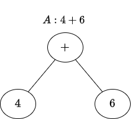
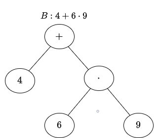
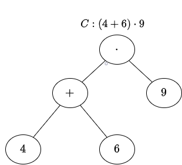
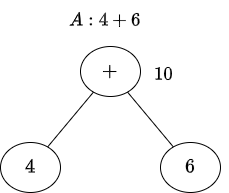
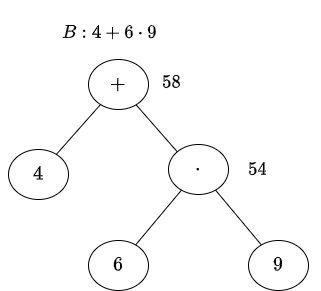
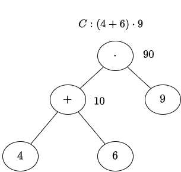
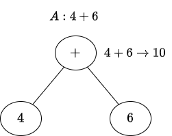
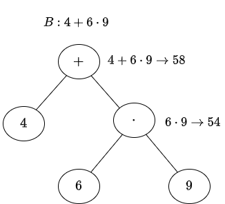
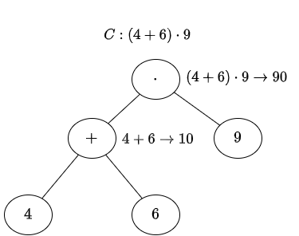

# Numeri naturali, multipli e divisori

## UNITA' 1: Numeri naturali, operazioni ed espressioni

I numeri naturali sono $0$, $1$, $2$, $3$, ... e così via (si ottengono sommando uno in più al precedente). Sono i numeri che servono a contare gli oggetti nella vita quotidiana. Sui numeri naturali è possibile fare delle **operazioni**: si possono infatti sommare, sottrarre, moltiplicare e dividere secondo le regole note.

#### Le Operazioni

Sommiamo due numeri quando vogliamo contare gli elementi di due gruppi distinti di oggetti che si uniscono: ad esempio uno studente ha tre libri, un altro ne ha <u>altri</u> quattro ed insieme hanno $3 + 4 \longrightarrow 7$ libri.

Sottraiamo due numeri quando contiamo, in un gruppo di oggetti, quelli che non fanno parte di un certo sottoinsieme: ad esempio uno studente ha 7 libri, <u>di cui</u> 2 sono senza alcune pagine: i libri interi sono $7 - 2 \longrightarrow 5$. Poiché un sottoinsieme di un gruppo di oggetti ha un numero di elementi sempre minore (o al più uguale) a quello del gruppo, non è possibile sottrarre un numero più grande da un numero più piccolo, ossia non è possibile calcolare $2 - 7$. 

Moltiplichiamo due numeri naturali quando vogliamo contare quanti sono gli oggetti in totale se sono organizzati in gruppi tutti con lo stesso numero di elementi: abbiamo 5 studenti, ognuno dei quali porta 9 libri (ossia abbiamo 5 gruppi di libri, ciascuno dei quali ha 9 libri): il numero totale dei libri è $9 \cdot 5 \longrightarrow 45$, ossia uniamo 5 gruppi di 9 libri ciascuno.

La divisione è l'operazione inversa della moltiplicazione: ci serve quando dobbiamo sapere quanti oggetti ha ciascun gruppo sapendo quanti sono gli oggetti in totale e quanti gruppi ci sono. Facciamo un esempio con 12 caramelle (totale degli oggetti) da dividere in parti uguali tra 3 bambini (3 gruppi di caramelle): ogni bambino avrà 4 caramelle. ottenuto facendo $12 : 3$.

Con la divisione possiamo sapere anche quanti sono i gruppi, se conosciamo il totale degli oggetti e quanti oggetti ha ogni gruppo: se abbiamo 12 caramelle da dividere per un certo numero di bambini ed ognuno di loro avrà 3 caramelle, quanti sono i bambini? Sono 4. C'è anche un famoso esempio di questo tipo che dice: per contare il numero delle sue pecore un pastore sdraiato conta il numero delle gambe che vede e poi divide per 4; se le gambe sono 100 le pecore sono $100 : 4 \longrightarrow 25$.  

Negli esempi visti, ad esempio $3 + 4$, compaiono due numeri ed una operazione, per cui ognuno dei due numeri è coinvolto in una sola operazione. Oltre a far parte di queste, i numeri naturali possono far parte di espressioni più complesse in cui compaiono due operazioni, come $12 \cdot 3 + 4$; in questo caso il numero $3$ fa parte sia di una moltiplicazione che di una somma. 

#### Le espressioni

Le **espressioni** sono sequenze di numeri ed operazioni alternate (tra due numeri c'è sempre una operazione). L'esecuzione ordinata delle operazioni di una espressione produce un unico numero detto "valore" o "risultato" dell'espressione. L'ordine di esecuzione delle operazioni è da sinistra verso destra ed una operazione è eseguibile solo se i due numeri sono disponibili, ossia non fanno parte di una operazione successiva che ha priorità maggiore, nel qual caso si passa a quest'ultima. 

#### ESEMPIO

Nell'espressione $8 · 12 + 5$ la prima operazione che si incontra è il prodotto ed il $12$ è condiviso con la somma. Quando c'è un numero condiviso tra moltiplicazione e somma, il numero è ***conteso*** tra le due operazioni e deve essere usato nella moltiplicazione (che ha priorità nell'uso del numero). Il $12$ sarà impiegato nel prodotto che quindi sarà la prima operazione da eseguire. La sequenza sarà allora:  $8 \cdot^{(1)} 12 +^{(2)} 5 \longrightarrow 96 +^{(1)} 5 \longrightarrow 101$.

Nell'espressione $5 + 8 · 12$ la prima operazione che si incontra è la somma e l'$8$ è conteso tra la somma e la moltiplicazione. Poiché la moltiplicazione ha la priorità nell'uso del numero, l'$8$ dovrà essere impiegato nel prodotto. La somma quindi non può essere eseguita per prima (manca il secondo numero), e verrà eseguito il prodotto; la somma opererà sul risultato. 

La sequenza delle operazioni sarà allora:   $5 +^{(2)} 8 ·^{(1)} 12 \longrightarrow 5 +^{(1)} 96 \longrightarrow 101$.

#### Uso delle parentesi e priorità

Le parentesi servono ad alterare la priorità di esecuzione delle operazioni imponendo che i numeri dentro una coppia di parentesi siano utilizzati ***prioritariamente*** nelle operazioni contenute all'interno delle parentesi.

Nell'espressione $8 · (12 + 5)$, analoga alla precedente ma con presenza di parentesi, la prima operazione che si incontra, da sinistra verso destra è il prodotto (in generale anche come priorità il prodotto deve essere eseguito prima della somma), ma il $12$ è dentro la coppia di parentesi e le parentesi impongono che i numeri dentro le parentesi debbano essere usati nelle operazioni anch'esse dentro le parentesi, se presenti (il prodotto è fuori dalla parentesi ed il $12$ è dentro insieme alla somma). La prima operazione che è possibile eseguire è quindi la somma. La sequenza delle operazioni da eseguire sarà:  $8 \cdot^{(2)} (12 +^{(1)} 5) \longrightarrow 8 \cdot^{(1)} (17) \longrightarrow 136$.

Ricapitolando, in caso di numeri contesi tra due operazioni abbiamo che tra prodotti e divisioni da un lato e somme e sottrazioni dall'altro, vincono i prodotti e le divisioni, mentre se c'è una sequenza di prodotti e divisioni oppure una sequenza di somme e sottrazioni si esegue sempre quella che viene prima leggendo da sinistra a destra e le successive si applicano al risultato della precedente.

#### ESEMPI I

a) $8 \cdot^{(1)} 12 : ^{(2)} 3 \longrightarrow$

​		$96 :^{(1)} 3 \longrightarrow 32$.

b) $12 :^{(1)} 3 \cdot ^{(2)} 8 \longrightarrow$

​		$ 4 :^{(1)} 8 \longrightarrow 32$.

c) $12 - ^{(1)} 8 + ^{(2)} 1 \longrightarrow$

​		$ 4 +^{(1)} 1 \longrightarrow 5$.

d) $8 - ^{(2)} 12 : ^{(1)} 3 \longrightarrow$

​		$ 8 -^{(1)} 4 \longrightarrow 4$.

#### ESEMPI II

a) $8 :^{(1)} 4 : ^{(2)} 2 \longrightarrow 2 :^{(1)} 2 \longrightarrow 1$.

b) $4 \cdot^{(1)} 3 :^{(2)} 3 : 2 \longrightarrow$

​		$ 12 :^{(1)} 3 :^{(2)} 2 \longrightarrow$

​			$ 4 :^{(1)} 2 \longrightarrow 2$.

c) $16 -^{(1)} 8 -^{(2)} 4 -^{(3)} 2 -^{(4)} 1\longrightarrow$

​		$8 -^{(1)} 4 -^{(2)} 2 -^{(3)} 1 \longrightarrow$

​			$4 -^{(1)} 2 -^{(2)} 1 \longrightarrow$

​				$2 - 1 \longrightarrow 1$.

#### Quante operazioni in un passaggio?

L'esecuzione delle operazioni in una espressione è organizzata in passaggi. In ogni passaggio eseguiamo le operazioni da sinistra verso destra man mano che è possibile farle, tenendo conto delle priorità e delle parentesi.

Per evitare di complicare i calcoli e facilitare l'individuazione di eventuali errori alla fine del procedimento è **opportuno**:

1. evitare di utilizzare il risultato di un calcolo come numero di un altro calcolo nello stesso passaggio;
2. eseguire più di una operazione in uno stesso passaggio a meno che la seconda operazione non sia all'interno di una parentesi rispetto alla prima.

#### ESEMPIO

**NON** fare il calcolo seguente

a) $8 - ^{(2)} 12 : ^{(1)} 3 + 2$

b) $4 + 2$

c) $6$

che riutilizza il risultato di $12:3$ nella differenza con $8$ (passaggio da a) a b)),  ma il seguente:

a) $8 - ^{(2)} 12 : ^{(1)} 3 + 2$

b) $8 - 4 + 2$

c) $4 + 2$

d) $6$

### ESERCIZIO 1.1 - Operazioni ed Espressioni (I)

a) Calcola il valore delle seguenti espressioni.

1. $6 - 3;$    $6 : 3;$    $6 + 3;$     $6 · 3;$

2. $15 + 10 + 3;$    $8 + 5 + 2 + 4;$    $17 - 9 - 1 - 1;$

3. $8 · 12 + 5;$     $5 + 8 · 12;$

4. $6 − 10 : 2 + 3;$

5. $15 + 30 : 3 : 2 + 1;$

6. $16 : 4 · 8$  

b) Individua i numeri, le operazioni di ciascuna delle espressioni seguenti ed il loro ordine di esecuzione e calcolane il valore.

1. $4 + 6·9;$
2. $(4 + 6)·9;$
3. $4 + (6·9);$
4. $10 - 2 · 3 + 4 · 5;$
5. $15 + 20 : 4 − 2;$
6. $15 + 20 : (4 − 2)$;    $(15 − 10) · 3 + 2;$
7. $8·(12 : 6 − 2) + 1$;    $6 − (15 : (2 + 3))$;

8. $((2·4 + 7) + (2 + 8 : 2)·5) − (6 + 2)·5;$        $[R. 5];$
9. $4 + 3·(15 : (3 + 1·2) − 1);$            $[R. 10];$

#### Laboratorio GEOGEBRA

Inserisci le espressioni in GEOGEBRA e calcola il risultato. Ricordare che in GEOGEBRA la divisione si indica con la linea orizzontale (frazione). 

### ESERCIZIO 1.2 - Dalle parole ai numeri (I)

Traduci in espressioni le seguenti frasi e calcolane il valore.

a) Dividi 15 per la differenza tra 9 e 4 e poi somma 2;      [R. $15 : (9 - 4) + 2 \longrightarrow 5$ ].

b) Moltiplica per 7 la differenza tra 10 e 8 e sottrai al risultato 14;

c) Sottrai 3 al risultato della divisione di 12 per la differenza tra 5 ed 1.

### ESERCIZIO 1.3 - Dai numeri alle parole

Scrivi a parole le seguenti espressioni:  

a) $12 − 6 : 3;$

b) $(15 − 10) · 3 + 2;$

c) $8·(12 : 6 − 2) + 1;$

d) $6 − (15 : (2 + 3))$.

## UNITA' 2: Divisori e multipli

Abbiamo già visto come non sia sempre possibile dividere un (primo) numero per un altro (secondo) numero. Quando ciò accade si dice che il secondo numero è un **divisore** del primo ed il primo è un **multiplo** del secondo. Un multiplo di un numero è quello che sta nella tabellina del numero: $8$ è multiplo di $2$ e di $4$ perché sta nella tabellina del $2$ e del $4$; $36$ è multiplo di $3$, di $6$, di $9$, di $12$ e così via. Un altro esempio è il seguente: $100 : 4 \longrightarrow 25$, per cui $4$ è un divisore di $100$ e $100$ è un multiplo di $4$. Poiché $100 : 10 \longrightarrow 10$, anche $10$ è un divisore di $100$. 

### ESERCIZIO 2.1 - Divisori e multipli

a) Scrivi tutti i divisori di ciascuno dei numeri 6, 15, 18, 21, 24, 25;

b) Scrivi i primi 4 multipli dei numeri 25, 40, 33, 6;

c) Scrivi i multipli minori di 100 dei numeri 25, 40, 33, 6;

d) Scrivi i multipli minori di 60 (compreso) dei numeri 6, 8, 10, 12, 15 e 16;   

e) Scrivi il primo multiplo comune ai numeri 6 e 8, 10 e 12, 15 e 16;

f) Scrivi i multipli minori di 100 comuni ai numeri 6 e 8, 10 e 12;

g) Scrivi tutti i divisori comuni ai numeri 18 e 24.

#### Laboratorio GEOGEBRA

a) Risolvi il punto a) dell'esercizio con le istruzioni GEOGEBRA seguenti (calcolatrice CAS):

1. $ListaDivisori(6)$&#9166;
2. $ListaDivisori(15)$&#9166;
3. $ListaDivisori(18)$&#9166;

b) Risolvi il punto b) dell'esercizio con le istruzioni GEOGEBRA seguenti (calcolatrice CAS):

1. $Successione(25k, \; k, \; 1, \; 4)$&#9166; 
2. $Successione(40k, \; k, \; 1, \; 4)$&#9166; 
3. $Successione(33k, \; k, \; 1, \; 4)$&#9166; 
4. $Successione(6k, \; k, \; 1, \; 4)$&#9166; 

c) Scrivi i multipli minori di 100 dei numeri 25, 40 con le istruzioni GEOGEBRA seguenti (calcolatrice CAS):

1. $a=floor(\dfrac{100}{25}))$&#9166;    		// Parte intera della divisione tra 100 e 25 

​       $Successione(25k, \; k, \; 1, \; a)$&#9166;	// Lista dei multipli

2. $b=floor(\dfrac{100}{40}))$&#9166;

   $Successione(40k, \; k, \; 1, \; b)$&#9166;

## UNITA' 3: Dalle parole ai numeri

### ESERCIZIO 3.1 - Dalle parole ai numeri (II)

Scrivi le espressioni  (NON il solo risultato!) che, utilizzando i dati contenuti nel testo, forniscono le soluzioni ai problemi seguenti e calcolane il valore.  

a) Anna riceve dalla madre 8 euro e va ad acquistare 2 scatole di colori del costo di 3 euro l'una. Al ritorno si ferma dalla nonna che le regala 5 euro. Con quanto denaro arriva a casa Anna? $[R. \,\, 8 - 2 \cdot 3 + 5$,  $7 \,\, \texteuro]$  

b) Roberta vuole offrire delle pizzette a degli amici. Ne ha già due ed al forno ne compra quattro volte tante. All'uscita del forno ne mangia una. Quante sono le pizzette rimaste? Se raggiunti i suoi due amici, divide le pizzette rimaste in parti uguali tra loro tre, quante ne toccano ciascuno? $[R. \,\, 2 + 2 \cdot 4 - 1, \,\, (2 + 2 \cdot 4 - 1):3, \,\, 3]$.  

c) Una cuoca possiede 4 sacchetti di farina del peso di 1 kg ciascuno. Deve fare 7 dolci: nei primi 3 occorrono 350 g di farina per ciascuno e negli altri, 600 g di farina per ciascuno. Quanta farina consuma la cuoca? Quanta farina rimane? $[R. \,\, 350 \cdot 3 + 600 \cdot 4 \,g \,\, , 4000 - (350 \cdot 3 + 600 \cdot 4) \,g \,\, ,550 \, g]$  

d) Se una azienda produce 600 unità di prodotto ad un costo medio di 76 euro ciascuna e le vende ad un prezzo di 99 euro l'una, quale è il suo profitto?  

e) In uno stabilimento tessile, in una settimana (6 giorni lavorativi), si producono 26.304 m di tela. La tela viene suddivisa in pezze da 32 m ciascuna. Quante pezze vengono prodotte giornalmente?  

f) Un idraulico ha un costo fisso a chiamata di 40 euro ed un ulteriore costo di 35 euro l'ora. Se fa un intervento che dura 4 ore, quanto pagherà il cliente?

g) Una famiglia sta imbottigliando della conserva di pomodoro. I barattoli sono tutti uguali ed hanno una capienza 750 grammi. Quanti barattoli serviranno per 18 Kg di conserva?

h) Un corridore amatoriale percorre 18 Km in un'ora. Quanti Km percorre in 10 minuti?   

## UNITA' 4: La struttura delle espressioni

Le espressioni si possono rappresentare anche graficamente con dei diagrammi, detti "diagrammi ad albero" dell'espressione. Vediamo alcuni esempi.

I cerchi si chiamano "nodi" e le frecce "archi". I nodi più in basso che contengono numeri si chiamano "foglie" mentre il nodo più alto si chiama radice.

Gli alberi indicano come calcolare una espressione. Il calcolo comincia dal basso: la prima operazione che si può eseguire è quella che ha entrambi i numeri scritti nei nodi. Il risultato è scritto nel nodo superiore che diventa disponibile per la successiva operazione.

Alla fine, la radice contiene il risultato dell'espressione.

Per costruire l'espressione a partire dall'albero, scrivi vicino ad ogni operazione l'espressione senza fare il calcolo come nell'esempio seguente.

### ESERCIZIO 4.1 - Dai diagrammi ad albero alle espressioni
a) Calcola il valore delle espressioni rappresentate dagli alberi riportati di seguito;

b) Scrivi le espressioni che corrispondono ai diagrammi.

1. 

2. 

3. 

### ESERCIZIO 4.2 - Dalle espressioni ai diagrammi ad albero

Rappresenta con diagrammi ad albero le seguenti espressioni:  

a) $4 + 6·9;$

b) $(4 + 6)·9;$

c) $15 + 20 : 4 − 2;$

d) $15 + 20 : (4 − 2);$

e) $((27 + 2) - 4 : (3 + 1)) - 20 ;$

f) $4 + 3 \cdot (15 : (3 + 1 \cdot 2) - 1)  $.

#### Esempio di SOLUZIONE

L'albero viene costruito a partire dall'operazione eseguita per prima. Vediamo l'esempio d). 

## UNITA' 5: Sostituzioni dei numeri alle lettere

Nelle espressioni possono comparire, oltre ai numeri, anche le lettere. Ma cosa significa fare operazioni con le lettere?

Ovviamente non è possibile fare delle operazioni con le lettere ed infatti una lettera in una espressione si usa per indicare la posizione di un numero che, quando dobbiamo calcolare l'espressione, deve essere sostituito alla lettera.

#### ESEMPIO

L'espressione $a+1$ non la possiamo "calcolare" finché non sostituiamo alla lettera $a$ un numero, ad esempio $3$ oppure $0$, cosicché $a + 1$ diventa $3 + 1$ che a sua volta diventa 4. Analogamente  con $0$,  $a + 1$ diventa $0 + 1 \longrightarrow 1$.

------

Usare le lettere al posto dei numeri è utile se vogliamo indicare quali operazioni fare per calcolare qualcosa. Ad esempio, l'area di tutti i rettangoli si calcola moltiplicando la lunghezza della loro base per quella della loro altezza. Se indichiamo con la lettera $b$ la lunghezza della base di un rettangolo e con $h$ la lunghezza dell'altezza dello stesso rettangolo, possiamo dire che, qualunque siano queste lunghezze, l'area sarà calcolata da $b \cdot h$.

Se dobbiamo calcolare l'area di un rettangolo con $b = 12$ ed $h = 5$, sostituiamo i numeri alle lettere nella espressione ed otteniamo $b \cdot h, \; \{b = 12, h = 5\} \longrightarrow 12 \cdot 5 \longrightarrow 60$.

### ESERCIZIO 5.1 - Sostituzioni

Scrivi le espressioni numeriche ottenute sostituendo alle lettere i numeri indicati tra parentesi graffe e poi calcola il loro valore.
a) $5 \cdot x, \enspace \{x = 50\};$  

b) $2 \cdot y, \enspace \{y = 32\};$

c) $a − b, \enspace \{a = 10, b = 7\};$

d) $a^{2} − b^{2}, \enspace \{a = 1, b = 1\};$     $a^{2} − b^{2}, \enspace \{a = 3, b = 2\};$

e) $2 \cdot a \cdot (b + 1) - 6ab , \enspace \{a = 3, b = 0\};$

f ) $(2 \cdot a \cdot b)^{3}, \enspace \{a = 2, b = 3\}$.

#### Laboratorio GEOGEBRA

a) Risolvi i punti a) e b) dell'esercizio con le istruzioni GEOGEBRA seguenti (calcolatrice CAS):

1. $Sostituisci(5 \cdot x,\; {x = 50})$&#9166;
2. $Sostituisci(2 \cdot y, \; {y = 32})$&#9166;

b) Risolvi il punto c) dell'esercizio con le istruzioni GEOGEBRA seguenti (calcolatrice CAS):

1. $Sostituisci(a-b,\; \{a = 10, b=7\})$&#9166;

## UNITA' 6: Le Potenze

In matematica è molto frequente utilizzare espressioni in cui sono presenti solo moltiplicazioni di un numero per se stesso come ad esempio $ 2 \cdot 2 \cdot 2 \longrightarrow 8$ oppure $3 \cdot 3 \cdot 3 \cdot 3 \longrightarrow 81$. A queste moltiplicazioni che si ripetono è stato dato il nome di potenze.

Un **<u>potenza</u>** è quindi una operazione che consiste in una moltiplicazione di un numero per se stesso. Gli esempi precedenti si scrivono $ 2 \cdot 2 \cdot 2 \longrightarrow 2^3$ e $3 \cdot 3 \cdot 3 \cdot 3 \longrightarrow 3^4$. Il numero che viene moltiplicato si chiama **<u>base</u>** ed il numero delle volte che viene moltiplicato si chiama **<u>esponente</u>** e si scrive in piccolo in alto a destra della base. 
$$
base \rightarrow 3^{4 \leftarrow esponente}
$$
La potenza è quindi una operazione, come la somma, la sottrazione etc., che non ha un simbolo proprio ma sta tra la base e l'esponente e da come il risultato il prodotto della base per se stessa tante volte quante indicate dall'esponente.

La potenza, quando condivide la base o l'esponente insieme ad altre operazioni un una espressione, ha priorità massima di calcolo. Vediamo alcuni esempi:

1. $5 + 2^3 \longrightarrow 5 + 8 \longrightarrow 13$;  	prima si calcola la potenza e poi la somma.
2. $5 \cdot 2^3 \longrightarrow 5 \cdot 8 \longrightarrow 40$;  	prima si calcola la potenza e poi la moltiplicazione.
3. $5 \cdot 2^3 : 4 \longrightarrow 5 \cdot 8 : 4 \longrightarrow 40 : 4 \longrightarrow 10$;
4. $5 \cdot 2^{9:3} \longrightarrow 5 \cdot 2^3 \longrightarrow 5 \cdot 8 \longrightarrow 40$; 

### ESERCIZIO 6.1 - Calcolo di Potenze

a) Calcola le seguenti potenze ed espressioni.

1. $3^2$;    $5^3$;    $10^4$;    $1^5$
2. $55 \cdot 2^3 - 4$;    $5 + 10^3 : 4 - 25$;    $(5 + 10)^3 : 5 - 5^2$.

b) Un numero è in notazione scientifica quando è scritto come prodotto di un numero compreso tra 1 (incluso) e 10 e una potenza di 10. Ad esempio 900 si scrive $9\cdot 10^2$. 

1. Scrivi ciascuno dei numeri che seguono in notazione scientifica: $80, 2000000, 5, 6000, 3000000000;$
2. Scrivi ciascuno dei numeri che seguono come numero naturale:  $9\cdot 10^4$, $0\cdot 10^2$, $1\cdot 10^8$, $9\cdot 10^0$, $10\cdot 10^1;$
3. Calcola il valore delle seguenti espressioni in notazione scientifica: $2 \cdot 10^2 \cdot 2 \cdot 10^3; 3 \cdot 10^1 \cdot 2 \cdot 10^3; 8 \cdot 10^9 : (2 \cdot 10^3).$

c) Quali delle uguaglianze seguenti sono vere? Quali false?  

1. $6^{2} · 6^{4}=6^{8}; \enspace$  
2. $5^{3} + 5^{4} = 5^{7};$
3. $(10^{2})^{3} = 1.000.000;$.

### ESERCIZIO 6.2 - Espressioni con le Potenze

a) Individua i numeri e le operazioni di ciascuna delle espressioni seguenti. Analizza il loro ordine di esecuzione e calcola il valore dell'espressione.

1. $((4 + 3^{2} − 1) : 2^{2} + 45 : 3^{2} ) : 2^{2} + (21·3) : 9 + 1^{2}$;          $[R. 10];$
2. $(((3^{2} + 11) : 2^{2} )^{2} : 5 − 1) · 2^{3} − (7^2 : (2·3 + 1) + 2^{3} + 10^{0} )$           $[R. 16]$;
3. $(((10 - 6)^{2} + 3·10) : (6 : 3)) + 4 + 3^{2} - (2^{4} - 1)$;           $[R. 21]$;
4. $((2^{4} + 2^{3}) : (8^{2} : 4^{2})) +(3^{2} · 2^{2} : (6^{3} : 6^{2}))$;                $[R. 12]$  

#### Laboratorio GEOGEBRA

Inserisci in GEOGEBRA le espressioni del punto a) e dell'esercizio e calcola il risultato. 

## UNITA' 7: Insiemi e loro rappresentazione

Un ***insieme*** è qualcosa di cui tutti abbiamo un'idea e precisamente è un gruppo di oggetti, concreti o astratti (come lettere dell'alfabeto, numeri, etc.); gli oggetti che formano l'insieme sono detti ***elementi*** dell'insieme.

Vediamo due modi per descrivere (o ***rappresentare***) un insieme:

1. graficamente, mediante un diagramma (detto "di Venn");
2. elencando gli elementi (per elencazione).

Rappresentare un insieme in modo grafico significa disegnare un cerchio o ellisse (che rappresenta l'insieme) con all'interno gli elementi rappresentati con dei punti ed il loro nome (univoco) o dal nome soltanto.

#### ESEMPIO

L'insieme delle vocali, che chiameremo $V$, è rappresentato graficamente dalla figura seguente.

Rappresentare un insieme per elencazione significa scrivere la sequenza degli elementi identificati dai loro nomi univoci (in un insieme ***non ci possono essere due elementi uguali***) separati da virgola e racchiusi tra parentesi graffe.

#### ESEMPIO

Per rappresentare per elencazione l'insieme delle vocali scriviamo $\{ a, e, i, o, u\}$. Se vogliamo dare il nome $V$ all'insieme (di solito i nomi degli insiemi sono maiuscoli) scriviamo $V = \{ a, e, i, o, u\}$.

### ESERCIZIO 7.1 - Rappresentazione per Elencazione.

a) Rappresenta per elencazione, e con diagramma di Eulero-Venn, gli insiemi $A$, $B$ e $C$ formati rispettivamente dalle lettere delle parole «rododendro», «giglio», «azalea».

b) Rappresenta per elencazione i seguenti insiemi:  

1. I naturali non maggiori di 8;  
2. I naturali dispari compresi fra 30 e 40;  
3. I multipli pari di 7 minori di 40;  
4. I divisori di 42;  
5. I divisori dispari di 42:  
6. I giorni della settimana che iniziano per «b»;  
7. Le vocali della parola «farfalla»

## UNITA' 2: Divisori, multipli, MCM e MCD

Abbiamo già visto come non sia sempre possibile dividere un (primo) numero per un altro (secondo) numero. Quando ciò accade si dice che il secondo numero è un **divisore** del primo ed il primo è un **multiplo** del secondo.

Un multiplo di un numero è un altro numero che sta nella tabellina del primo numero: $8$ è multiplo di $2$ e di $4$ perché sta nella tabellina del $2$ e del $4$; $36$ è multiplo di $3$, di $6$, di $9$, di $12$ e così via. Un altro esempio è il seguente: $100 : 4 \longrightarrow 25$, per cui $4$ è un divisore di $100$ e $100$ è un multiplo di $4$. Poiché $100 : 10 \longrightarrow 10$, anche $10$ è un divisore di $100$. 

Un numero che non si può dividere per nessun altro numero se non per se stesso e per uno, ossia non ha divisori, si dice **primo**. Esempi di numeri primi sono $2$, $3$, $17$, $29$ etc.

Se prendiamo due numeri e troviamo i loro divisori potrebbe essere che ci siano dei numeri divisori di entrambi: questi si chiamano ***divisori comuni***; la stessa cosa si può dire dei multipli di due numeri: se ci sono numeri che sono multipli di entrambi, questi si chiamano ***multipli comuni***.

#### ESEMPIO

Consideriamo i due numeri $12$ e $8$. I divisori di $12$ sono $\{1,2,3,4,6,12\}$ e quelli di $8$ sono $\{1,2, 4, 8\}$. I divisori comuni sono $\{1, 2, 4\}$. $1$ è sempre divisore di qualunque numero, così come il numero stesso.

I multipli di $12$ sono infiniti: $\{12, 24, 36, 48, 60, 72,...\}$; anche quelli di $8$: $\{8, 16, 24, 32, 40, 48, 56, 64, 72, ...\}$. I multipli comuni sono anch'essi infiniti e sono tutti i multipli di $24$: $\{24, 48, 72, ...\}$.

------

Il più grande dei divisori comuni di due numeri si chiama ***Massimo Comune Divisore*** dei due numeri, mentre il più piccolo dei multipli comuni si chiama ***minimo comune multiplo*** e si scrivono $MCD(8,12) \longrightarrow 24$ e $MCM(8,12) \longrightarrow 72$.

### ESERCIZIO 2.1 - Divisori e multipli

a) Scrivi tutti i divisori di ciascuno dei numeri 6, 15, 18, 21, 24, 25;

b) Scrivi i primi 4 multipli dei numeri 25, 40, 33, 6;

c) Scrivi i multipli minori di 100 dei numeri 25, 40, 33, 6;

d) Scrivi i multipli minori di 60 (compreso) dei numeri 6, 8, 10, 12, 15 e 16;   

e) Scrivi il primo multiplo comune ai numeri 6 e 8, 10 e 12, 15 e 16;

f) Scrivi i multipli minori di 100 comuni ai numeri 6 e 8, 10 e 12;

g) Scrivi tutti i divisori comuni ai numeri 18 e 24.

#### Laboratorio GEOGEBRA

a) Risolvi il punto a) dell'esercizio con le istruzioni GEOGEBRA seguenti (calcolatrice CAS):

1. $ListaDivisori(6)$&#9166;
2. $ListaDivisori(15)$&#9166;
3. $ListaDivisori(18)$&#9166;

b) Risolvi il punto b) dell'esercizio con le istruzioni GEOGEBRA seguenti (calcolatrice CAS):

1. $Successione(25k, \; k, \; 1, \; 4)$&#9166; 
2. $Successione(40k, \; k, \; 1, \; 4)$&#9166; 
3. $Successione(33k, \; k, \; 1, \; 4)$&#9166; 
4. $Successione(6k, \; k, \; 1, \; 4)$&#9166; 

c) Scrivi i multipli minori di 100 dei numeri 25, 40 con le istruzioni GEOGEBRA seguenti (calcolatrice CAS):

1. $a=floor(\dfrac{100}{25}))$&#9166;    		// Parte intera della divisione tra 100 e 25 

​       $Successione(25k, \; k, \; 1, \; a)$&#9166;	// Lista dei multipli

2. $b=floor(\dfrac{100}{40}))$&#9166;

   $Successione(40k, \; k, \; 1, \; b)$

## UNITA' 8: MCM e MCD mediante scomposizioni

Se un numero ha un divisore, il numero si può scrivere come prodotto di due numeri, uno dei quali è il divisore; diciamo che il numero si **scompone** in un prodotto di numeri o fattori.

Se prendiamo il numero $12$, vediamo che $4$ è un divisore, perché $12 : 4 \longrightarrow 3$ e quindi $12 = 3 \cdot 4$, per cui $12$ si scompone nel prodotto di $4 \cdot 3$. Poiché i numeri che fanno parte di una moltiplicazione si chiamano ***fattori***, si dice che se un numero si scompone in fattori, si ***fattorizza***.

Siccome è utile avere una scomposizione di un numero in fattori tutti primi, cerchiamo una scomposizione in cui i fattori siano primi continuando a scomporli. Nella scomposizione di $12$ continuiamo a dividere $4$ per $2$ ed otteniamo $4 = 2 \cdot 2$, per cui $12 = 3 \cdot 2 \cdot 2$. Adesso tutti i fattori di $12$ sono numeri primi e possiamo dire di avere scomposto $12$ in numeri primi (usando le potenze possiamo scrivere $12 = 2^2 \cdot 3$), in particolare in ***potenze di numeri primi***.

Facendo la stessa cosa con $8$ abbiamo $8 = 2^3$ e confrontando le due scomposizioni, vediamo che i numeri $2$ e $2^2$ sono fattori comuni sia a $12$ che ad $8$, mentre il fattore $3$ è solo di $12$, così come come il fattore $2^3$ è solo di $8$. 

Se consideriamo come fattori le potenze di numeri primi, abbiamo allora un metodo alternativo a quello visto nell'unità precedente per calcolare MCM e MCD di due numeri, una regola che dice che:

- Il Minimo Comune Multiplo di due numeri è uguale al prodotto di tutti i loro fattori (potenze di numeri primi), comuni e non comuni, quelli comuni presi con il massimo esponente;
- Il Massimo Comune Divisore di due numeri è uguale al prodotto dei soli fattori comuni (potenze di numeri primi) presi con il minimo esponente.

Abbiamo allora che il $MCM$ di $8$ e $12$ è $24$ ed il $MCD$ di $8$ e $12$ è $4$ perché

- $MCM(8,12) \longrightarrow 3 \cdot 2^3 \longrightarrow 24$,
- $MCD(8,12) \longrightarrow 2^2 \longrightarrow 4$.

### ESERCIZIO 8.1 - Scomposizione in numeri primi

a) Scomponi in potenze di fattori primi i numeri 25, 40, 33, 6;

b) Le seguenti scomposizioni non sono in fattori primi. Modificale in modo che ogni fattore sia primo e scrivi la
scomposizione in potenze di numeri primi.

1. $2 \cdot 6 \cdot 8;$     $3 \cdot 6 \cdot 9;$     $3 \cdot 33 \cdot 21;$    $26 \cdot 22 \cdot 34;$
2. $15^3 \cdot 3^2;$    $13^2 \cdot 26$.

#### Laboratorio GEOGEBRA
a) Risolvi il punto a) dell'esercizio con le istruzioni GEOGEBRA seguenti (calcolatrice CAS):

1. $Fattorizza(25)$&#9166;
2. $Fattorizza(40)$&#9166;
3. $Fattorizza(33)$&#9166;
4. $Fattorizza(6)$&#9166;

### ESERCIZIO 8.2 - Minimo Comune Multiplo e Massimo Comune Divisore

a) Trova il Minimo Comune Multiplo (m.c.m) ed il Massimo Comune Divisore (M.C.D. o massimo fattore comune) delle coppie $(6, 8)$, $(15, 10)$, $(24, 25)$ applicando la definizione;

b) Risolvi l'esercizio precedente attraverso la scomposizione in fattori primi.

#### Laboratorio GEOGEBRA

a) Calcola MCD ed MCM del punto a) dell'esercizio con le istruzioni GEOGEBRA seguenti (calcolatrice CAS):

1. $MCM(6,8)$&#9166;;     $MCD(6,8)$&#9166;

2. $MCM(15,10)$&#9166;;     $MCD(15,10)$&#9166;

3. $MCM(24,25)$&#9166;;      $MCD(24,25)$&#9166;

### ESERCIZIO 8.3 - Evidenza del Fattore Comune

a) Scrivi le seguenti somme di due numeri come prodotto, mettendo in evidenza il loro M.C.D. ed applicando la proprietà distributiva della moltiplicazione rispetto alla somma

1. $15 + 10 = MCD\cdot(? + ?);$        $[R. \,\, 5(3+2)]$.  
2. $6 + 8 = MCD \cdot (? + ?);$        $[R. \,\, 2(3+4)]$.  
3. $350 + 252 = ?(?+?)$.

b) Scrivi le seguenti somme e differenze di numeri come prodotto, analogamente all'esercizio precedente.

1. $2 + 4 + 6;$     $15 - 10;$
2. $6 - 4 - 2;$     $220 - 110 - 50 + 30$.

#### Esempio di SOLUZIONE

a.1) Per scrivere la soluzione seguire i passi riportati:

1. calcolare il $MCD(15, 10) \Rightarrow 5;$
2. dividere i numeri per il $MCD$:  $15:5 \Rightarrow 3$ e $10:5 \Rightarrow 2;$
3. scrivere $15 + 10 = 5(3 + 2)$.
