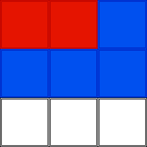
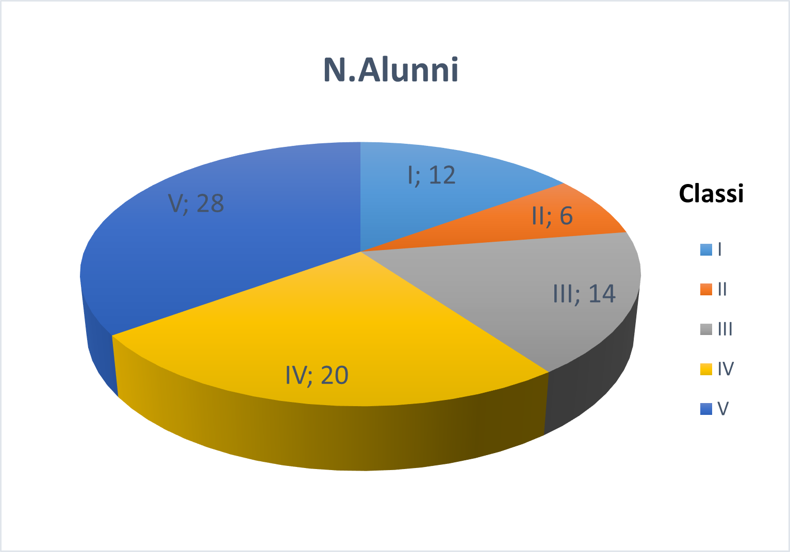

# Numeri Razionali, percentuali ed equivalenze

## UNITA' 1: Il Concetto e l'uso delle Frazioni

### ESERCIZIO 1 - Il Concetto di Frazione e di Divisione

a) Rispondi alle seguenti domande scrivendo le frazioni richieste.

1. Che frazione di figura rappresentano i quadrati rossi, quelli blu e quelli non colorati?

2. Quanti colori vedi nella figura? Per ciascun colore scrivi la frazione di figura di quel colore.

b) Scrivi sia con numeri che con lettere le frazioni uguali alle espressioni seguenti (es. per "tre volte un quarto" scrivi $\frac{3}{4}$ e "tre quarti"):

1. Tre volte un quarto; il triplo di un quarto; la quarta parte (di uno); due volte un quarto;
2. Un centesimo; il doppio di un centesimo; cinque volte due centesimi; due centesimi per cinque;
3. Venticinque centesimi; due volte venticinque centesimi; la metà di cinquanta centesimi; quattro volte venticinque centesimi.
4. Il doppio di un quinto; due volte un quinto; due su cinque; la quinta parte di due; due diviso cinque;
5. Sessanta quindicesimi; la quindicesima parte di sessanta; sessanta diviso trenta; la sessantesima parte di trenta.

c) Rispondi alle seguenti domande scrivendo la frazione richiesta. 

1. Quanti quarti d'ora ci sono in 45 minuti? Da quante ore sto aspettando un treno se lo aspetto da 45 minuti?  Perché?
2.  Quanti euro costa un giocattolo se lo pago con 5 monete da mezzo euro?  E quanti centesimi?
3. Per ognuna delle seguenti figure, quale frazione di ora è trascorsa?  

4. Considerando il carburante indicato nella figura seguente, quale è la frazione di serbatoio piena, quale quella vuota?  

5. Nella figura seguente sono riportati il numero degli alunni iscritti al Corso Serale nell'anno scolastico 2015-2016. Individua la frazione degli iscritti di ciascuna classe rispetto al totale.

6. Franca compra in pasticceria 2 fette di una crostata tagliata in 12 fette uguali. Il peso delle due fette è di 220 grammi. Quanto pesa tutta la crostata?   

7. Se parcheggio un'auto dove ogni tre quarti d'ora devo azzerare il disco orario, quante volte dovrò azzerare il disco se la macchina resta parcheggiata 3 ore? Se una "sosta" misura 45 minuti, a quante "soste" corrisponde una fermata di 4 ore?

8. Scrivi in forma simbolica ognuna delle frasi seguenti (utilizza "$\longrightarrow$" per "fa" e non scrivere le unità di misura). Ad esempio scrivi "Mezzo euro più settanta centesimi fa un euro e venti (centesimi)" come $\dfrac{1}{2} + \dfrac{70}{100} \longrightarrow 1 + \dfrac{20}{100}$ .

   - tre quarti d'ora meno un quarto d'ora fa mezz'ora
   - mezz'ora più tre quarti d'ora fa un'ora e un quarto
   - venti centesimi più trenta centesimi fa mezzo euro
   - cinque volte venti centesimi fanno un'euro
   - tre euro meno cinquanta centesimi fanno due euro e mezzo

### ESERCIZIO 2 - Problemi con le frazioni (I)

a) La ricetta di un dolce prevede l'uso di mezza tazza di farina. Di questa, tre quarti va impastata con le uova e la parte rimanente aggiunta in seguito. Quanta parte della tazza va aggiunta in seguito?  

b) Quanti minuti dura un viaggio di tre quarti d'ora? Quale è l'espressione per ottenere il risultato?  

c) La metà degli alunni di una classe sono assenti ed un terzo dei rimanenti non hanno fatto i compiti. Quale è la frazione della classe che ha svolto i compiti regolarmente?  

Se la classe è formata da 24 alunni, quanti sono quelli che non hanno svolto i compiti?

d) Gli ingredienti della ricetta "Pici cacio e pepe" per 4 persone sono i seguenti:

- Spaghetti 320 g
- Pecorino romano stagionatura media, da grattugiare 200 g
- Pepe nero in grani 5 g

Come cambiano le quantità, in rapporto alle persone, se le persone sono 3? Quale frazione delle quantità originarie deve essere utilizzata? [Suggerimento: calcola il numero di grammi a persona].

### ESERCIZIO 3 - Ordinamento delle frazioni

Scrivi in ordine crescente le seguenti frazioni.  

a) $\dfrac{3}{2},\dfrac{4}{8},\dfrac{8}{3},\dfrac{7}{7},\dfrac{15}{4};$   

b) $-\dfrac{1}{3},\dfrac{11}{6},-\dfrac{9}{8},+\dfrac{2}{3},-\dfrac{6}{5},+\dfrac{4}{3}.$  

## UNITA' 2: Frazioni equivalenti e prodotti di frazioni

### ESERCIZIO 4 - Frazioni equivalenti e riduzione ai minimi termini

a) Utilizzando la definizione, stabilisci se le seguenti coppie di frazioni sono fra loro equivalenti ed individua quali frazioni sono maggiori di 1.  

$[\dfrac{4}{5},\dfrac{8}{10}]$;     $[\dfrac{6}{2},\dfrac{10}{4}]$;     $[\dfrac{0}{15},\dfrac{2}{30}]$;     $[\dfrac{1}{8},\dfrac{2}{9}]$;     $[\dfrac{0}{20},\dfrac{0}{40}]$;  

b) Riduci ai minimi termini le frazioni del punto a). 

#### Esempio di Soluzione

Passi da seguire per trovare la soluzione per la seconda frazione della prima coppia del punto b).

1. Calcola il $MCD$ dei due numeri $8$ e $10$:   $MCD({8,10}) \Rightarrow 2$;
2. Dividi numeratore e denominatore per il $MCD$:    $8:2 \Rightarrow 4, \;10:2 \Rightarrow 5$;
3. La soluzione è $\dfrac{4}{5}$.

### ESERCIZIO 5 - Prodotto di frazioni (I)

Calcola i seguenti prodotti di frazioni.  

a) $\dfrac{1}{2}\cdot4$;     $\dfrac{5}{3}\cdot9$;     $\dfrac{3}{2}\cdot10$.  

b) $\dfrac{3}{8}\cdot\dfrac{12}{15}$;     $\dfrac{7}{10}\cdot\dfrac{20}{21}$.   

### ESERCIZIO 6 - Prodotto di frazioni (II)

Calcola le seguenti quantità dopo aver scritto l'espressione che la rappresenta.  

a) i cinque dodicesimi di 9; i cinque dodicesimi di 60; i tre quarti del doppio di 20;  

b) la metà di un decimo; i due terzi di 60; i tre quarti del doppio di 20;  

c) un quinto dei due terzi di 9; la metà della metà di 20; il doppio di cinque quinti della metà di 30;  

## UNITA' 3: Somma di frazioni

### ESERCIZIO 7 - Il minimo comune denominatore

Riduci le frazioni di ognuno dei seguenti gruppi al minimo comune denominatore.  

a) $[\dfrac{7}{2},\dfrac{3}{5}]$;     $[\dfrac{1}{2},\dfrac{3}{5}]$;     $[\dfrac{1}{6},\dfrac{1}{2}]$;     $[\dfrac{3}{8},\dfrac{1}{4}]$;  

b) $[\dfrac{7}{15},\dfrac{1}{30},\dfrac{3}{10}]$;     $[\dfrac{4}{6},\dfrac{9}{10},\dfrac{11}{30}]$;     $[\dfrac{3}{7},2,\dfrac{31}{49}]$.  

#### Esempio di Soluzione

Passi da seguire per trovare la soluzione per la prima coppia di frazioni del punto b).

1. Calcola il $MCM$ dei due numeri $2$ e $5$:   $MCM({2,5}) \Rightarrow 10$: questo sarà il nuovo denominatore di entrambe le frazioni;
2. Per avere il numeratore della prima frazione dividi l'$mcm$ per $2$ e moltiplica il risultato per $7$: $(10:2) \cdot 7 \Rightarrow 35$;
3. Per avere il numeratore della seconda frazione dividi l'$mcm$ per $5$ e moltiplica il risultato per $3$: $(10:5) \cdot 3 \Rightarrow 6$;
4. Le nuove frazioni sono: $[\dfrac{35}{10},\dfrac{6}{10}]$.

### ESERCIZIO 8 - Somma algebrica di frazioni

Calcola le seguenti somme algebriche.

a) $\dfrac{1}{2}+\dfrac{3}{2}$;     $\dfrac{4}{5}+\dfrac{6}{5}-\dfrac{20}{5}$;      $\dfrac{2}{3}-\dfrac{5}{3}+\dfrac{2}{3}+\dfrac{5}{3}$;   

b) $\dfrac{1}{2}-\dfrac{3}{5}$;     $\dfrac{1}{5}+\dfrac{2}{3}$;     $\dfrac{1}{6}-\dfrac{1}{2}$;  

c) $\dfrac{2}{3}-\dfrac{3}{2}$;     $\dfrac{4}{5}+5$;     $-5-\dfrac{7}{8}$;     $2-\dfrac{1}{4}$;     $2+\dfrac{1}{4}$;     $\dfrac{2}{3}+\dfrac{1}{8}-1$;   

d) $-\dfrac{8}{3}+5-\dfrac{2}{5}$;     $12-\dfrac{1}{3}-\dfrac{1}{9}$.

### ESERCIZIO 9 - Espressioni con somme di frazioni

a) Individua quante e quali frazioni ed operazioni contiene ciascuna delle espressioni seguenti e calcola il valore di ciascuna dei esse.

1. $3-\dfrac{1}{2}+\left(\dfrac{3}{4}+\left(\dfrac{1}{5}-\dfrac{6}{10}\right)\right)-1$; 				  $[R. \dfrac{37}{20}]$  
2. $\dfrac{1}{10}-\dfrac{3}{5}+\left(\dfrac{2}{5}-\left(6-7-\dfrac{2}{10}\right)\right)-\left(\dfrac{6}{5}+3\right);$         $[R.-1]$  

b) Calcola il valore delle seguenti espressioni.  

1. $-\left(1+2\right)-\left(\dfrac{1}{12}+\dfrac{1}{2}\right)+\left(\dfrac{5}{2}+\dfrac{4}{3}\right)-\left(\dfrac{1}{6}+\left(-\dfrac{5}{4}-\dfrac{1}{3}\right)-1\right);$
2. $7-\left(\left(3+\dfrac{1}{5}-\dfrac{3}{4}-2\right)-\left(\dfrac{2}{5}-6+\dfrac{3}{4}-\dfrac{1}{2}\right)\right)+\dfrac{6}{5}-\left(\dfrac{7}{20}+\dfrac{1}{20}\right).$     $[R. 2]$  

## UNITA' 4: Espressioni con le frazioni

### ESERCIZIO 10 - Espressioni con le quattro operazioni tra frazioni

a) Calcola il valore delle seguenti espressioni.

1. $\left(\dfrac{2}{5}-\dfrac{2}{3}\right)\cdot\left(\dfrac{1}{2}-\dfrac{4}{3}\right)$;    $[R. \dfrac{2}{9}]$  
2. $\dfrac{2}{5}\cdot\left(-\dfrac{15}{4}\right)\cdot\left(-\dfrac{2}{3}\right)$;    $[R. 1]$  
3. $\left(\dfrac{2}{3}+1\right)\cdot\left(2-\dfrac{1}{5}\right);$     $[R. 3]$  
4. $\dfrac{2}{4}:\dfrac{1}{2}$;
5. $\dfrac{4}{5}:\left(-\dfrac{12}{25}\right)$;
6. $\dfrac{2}{5}:4$;
7. $\left(-1\right):\left(-5\right)$.   

b) Individua quante e quali frazioni ed operazioni contiene ciascuna delle espressioni seguenti e calcola il valore di ciascuna dei esse.

1. $9\left(-\dfrac{1}{15}\right)\left(-10\right)\left(-\dfrac{7}{6}\right)$;     $[R. -7]$
2. $\left(\left(-\dfrac{7}{5}\right)\left(-\dfrac{10}{21}\right)+\dfrac{11}{3}\left(-\dfrac{9}{2}\right)\right):\left(-\dfrac{19}{9}\right).$     $[R.\dfrac{15}{2}]$

### ESERCIZIO 11 - Dalle parole alle espressioni (I)

Scrivi le espressioni relative alle seguenti frasi e calcolane il risultato.  

a) Aggiungi 1/5 alla somma di 1/2 e 1/3; Aggiungi 2/3 alla somma di 5/6 e 1; Somma 5 al risultato della somma tra 5/6 e 8/3;  

b) Sottrai 1/2 dalla somma di 3 e 1/4; Aggiungi 1 alla somma di 1/5 e -1; Togli da 1/3 la somma di -2/3 e 1/3; 

c) Raddoppia il prodotto fra 4/7 e 7/2; Scrivi il Triplo del prodotto fra 5/6 e 3/10; Aggiungi 1/4 a tre volte il quoziente di 3/2 e 9/4;  

 

### ESERCIZIO 12 - Dalle parole alle espressioni (II)

Indicando con $x$ un numero qualsiasi, scrivi le espressioni relative alle frasi seguenti.  

a) Il doppio di $x$; il quadruplo di $x$; tre quarti di $x$; un terzo di $x$;  

b) La terza parte di $x$; il cubo di $x$; il reciproco di $x$; il triplo di $x$;  

c) La metà di $x$; il quadrato di $x$; l’opposto di $x$; l’opposto del reciproco (o l’antireciproco) di $x$.  

### ESERCIZIO 13 - Rappresentazione delle espressioni

a) Scrivi le espressioni relative ai seguenti diagrammi ad albero:

1.    

   

   

   

   

2.    

   

   

   

   

3.    

   

   

   

b) Scrivi i diagrammi ad albero relativi alle espressioni seguenti, considerando le frazioni presenti come foglie dell'albero.:

1) $\left(\dfrac{2}{5}-\dfrac{2}{3}\right)\cdot\left(\dfrac{1}{2}-\dfrac{4}{3}\right);$

2) $9\left(-\dfrac{1}{15}\right)\left(-10\right)\left(-\dfrac{7}{6}\right);$

3) $\:\left[\left(-\dfrac{7}{5}\right)\left(-\dfrac{10}{21}\right)+\dfrac{11}{3}\left(-\dfrac{9}{2}\right)\right]:\left(-\dfrac{19}{9}\right).$

### ESERCIZIO 14 - Problemi con le frazioni (II)

Per ciascuno dei seguenti problemi:

1) individua le quantità di cui si parla nel testo specificando un loro nome significativo, la loro unità di misura ed il valore;

2) risolvi il problema rispondendo alla domanda.

a) Paolo deve acquistare uno scooter che costa € 2760, ma possiede solo i 2/3 della somma. Quanto manca per effettuare la spesa?     [R. € 920]  

b) Ogni giro di stadio è i due quinti di un chilometro. Quanti giri di stadio deve compiere un corridore per completare un allenamento di 20 Km?     [R. 50]  

c) Un negozio di bricolage acquista un grande quantitativo di chiodi da vendere in confezioni di 9/16 di Kg. Quante confezioni di chiodi si otterranno da 2.871 Kg di chiodi?     [R. 5104]  

d) In un centro commerciale Andrea acquista un set di valigie che sono in sconto. Se risparmia €123 e lo sconto è uguale ai 5/90 del prezzo iniziale, quanto costavano le valigie?     [R. € 2.214]  

e) Un camion può trasportare con sicurezza carichi fino ad una tonnellata. Sarebbe in grado di trasportare mezza tonnellata di sabbia, un terzo di ghiaia, ed un quinto di cemento in un solo viaggio?      [R. No]  

f) Su un cartone di latte da 500 ml c’è scritto: «Latte parzialmente scremato. Grasso max 1,8%». Quanti ml di grasso contiene il cartone di latte? Se un bicchiere medio contiene 200 ml di latte, quanti ml di grasso contiene?     [R.9 ml; 3,6 ml]  

g) Un libro oggi costa € 12,50. Se il suo prezzo viene aumentato del 3%, quanto costerà dopo l’aumento?     [R. € 12,88]

## UNITA' 5: Sostituzioni

### ESERCIZIO 15 - Sostituzioni (I)

a) Scrivi le espressioni numeriche ottenute sostituendo alle lettere i numeri indicati tra parentesi graffe e poi calcola il loro valore (la frazione deve essere sostituita tra parentesi tonda).

1. $x^2,\ \{x=\dfrac{1}{2}\}$;     $x^2,\ \{x=-\dfrac{1}{2}\}$;     $-x^2,\ \{x=\dfrac{1}{2}\}$;     $-x^2,\ \{x=-\dfrac{1}{2}\}$;
2. $-2x + x^2 + 1,\ \{x=\dfrac{2}{5}\}$;
3. $(1 - y)y + 3,\ \{y=-\dfrac{5}{2}\}$;
4. $(1 - y)y + 3,\ \{y=\dfrac{1}{2}\}$;     $(1 - y)y + 3,\ \{y=-\dfrac{1}{2}\}$;     $(1 - y)y + 3,\ [y=\dfrac{0}{2}]$;     $(1 - y)y + 3,\ \{y=\dfrac{4}{2}\}$;  

#### Laboratorio GEOGEBRA

Risolvi i punti a) e b) dell'esercizio con le istruzioni GEOGEBRA seguenti (calcolatrice CAS):

1. $Sostituisci(-2 x+x^2+1,{x = \dfrac{2}{5}})$&#9166;

2. $Sostituisci((1 - y) \cdot y + 3,{y = -\dfrac{2}{5}})$

### ESERCIZIO 16 - Dalle parole alle espressioni (III)

Traduci in espressioni le seguenti frasi e calcola poi il loro valore, sostituendo alle lettere i dati assegnati.  

a) Sottrai dal doppio di a la terza parte di b. [a=1, b=$\dfrac{2}{3}$]  

b) Moltiplica la somma del doppio di a e della terza parte di b per due. [a=1, b=$\dfrac{2}{3}$]  

c) Somma il quadruplo del quadrato di a con il doppio di c. [a=1, b=$\dfrac{2}{3}$]  

d) Moltiplica la somma del doppio di a e della terza parte di b per la differenza tra il doppio di a e la terza parte di b.  `[`a=1, b=$\dfrac{2}{3}$] [R. $\dfrac{15}{4}$]

e) Sottrai $\dfrac{1}{8}$ di a ai $\dfrac{4}{5}$ di c, dividi poi il risultato per i $\dfrac{3}{8}$ del quadrato di b. [a=3, b=$-\dfrac{1}{5}$, c=$\dfrac{1}{16}$].     [R. $-\dfrac{65}{3}$]  

f) Moltiplica la somma del doppio di a e della terza parte di b per la differenza tra il doppio di a e la terza parte di b, sottrai poi al risultato la somma del quadruplo del quadrato di a e del doppio di c. `[`a=1, b=$\dfrac{2}{3}$, c=-2 ][R. $\dfrac{15}{4}$]

g) Moltiplica la differenza tra i 2/5 di a e la metà di b per il doppio di c, somma poi al risultato il quoziente tra 1/4 di a e la differenza tra il doppio di b e 1. [a=$\dfrac{5}{3}$, b=2, c=$\dfrac{3}{4}$].     [R. $-\dfrac{15}{36}$]

### ESERCIZIO 17 - Sostituzioni (II)

a) Scrivi le espressioni numeriche ottenute sostituendo alle lettere i numeri indicati tra parentesi e poi calcola il loro valore.

1. $a-\left(b+c\right),\left\{a=\dfrac{1}{2},b=\dfrac{2}{3},c=\dfrac{1}{4}\right\}$;
2. $a+\left(-b\right)-c^2,\left\{a=\dfrac{5}{9},b=\dfrac{1}{18},c=-\dfrac{2}{3}\right\}$;
3. $\left(\dfrac{1}{a}\cdot b\right):\left(-c\right),\left\{a=2,b=\dfrac{4}{5},c=\dfrac{1}{5}\right\}$;
4. $\dfrac{x+y}{x-y}+\left(\dfrac{x-y}{x+y}\right)^{2},\left\{x=-\dfrac{1}{2},y=-\dfrac{1}{2}\right\}$.

b) Organizza le sequenze di sostituzioni seguenti in tabelle, mettendo nella prima colonna i numeri da sostituire e nella seconda il valore dell'espressione sostituita.

1. $a + \dfrac{1}{2} ,\,\,\ a \in \{0, 1, -1, 2, -2\};$
2. $-\dfrac{1}{2}a + 1,\,\,\ a \in \{0, 1, -1, 2, -2\};$
3. $-2a - 1,\,\,\ a \in \{0, 1, -1, 2, -2\};$

#### Esempio di SOLUZIONE

Sostituzioni del punto b.1) 
$$
\begin{array}{r|r}
a & a + \dfrac{1}{2} \\
\hline
0 & \dfrac{1}{2} \phantom{-l} \\
1 & \dfrac{3}{2} \phantom{-l} \\
-1 & -\dfrac{1}{2} \phantom{-l} \\
2 & \dfrac{5}{2} \phantom{-l} \\
-2 & -\dfrac{3}{2} \phantom{-l} \\
\end{array}
$$

c) Disegna su di un piano cartesiano cinque punti; considera come coordinate dei punti i due numeri delle righe della tabella dell'esercizio b.1.

#### Laboratorio GEOGEBRA

Inserisci le coppie di punti nella calcolatrice GRAFICI.

## UNITA' 6: Potenze con le frazioni

### ESERCIZIO 18 - Potenze con le frazioni

a) Calcola il valore delle seguenti potenze.

1) $\left(\dfrac{3}{4}\right)^{2}$;    $\left(\dfrac{2}{3}\right)^{4}$;     $\left(\dfrac{1}{2}\right)^{5}$;     $\left(\dfrac{3}{2}\right)^{0}.$
2) $\dfrac{3}{4}^{2}$;     $\dfrac{2}{3}^{4}$;     $\dfrac{1}{2^{5}}$;     $\dfrac{3^{0}}{2^{0}}$.
3) $\left(-\dfrac{3}{4}\right)^{2}$;    $\left(-\dfrac{2}{3}\right)^{4}$;     $\left(-\dfrac{1}{2}\right)^{5}$;     $\left(-\dfrac{3}{2}\right)^{0}$.

2. $\left(1-\dfrac{1}{2}\right)^{2}$;     $\left(2-\dfrac{5}{4}\right)^{0}$;     $\left(\dfrac{3}{2}-\dfrac{6}{4}\right)^{2}$.

a) Calcola il valore delle seguenti espressioni applicando le proprietà delle potenze

1. $\left[\left(-\dfrac{1}{4}\right)^3:\left(-\dfrac{1}{4}\right)\right]^2$;     $\left[\left(\dfrac{2}{15}\right)^3\cdot\left(\dfrac{3}{2}\right)^3\right]^2\cdot5^6$;     $ \left[\left(-\dfrac{1}{2}\right)^3\cdot\left(-\dfrac{2}{7}\right)^3\right]:\left(\dfrac{5}{7}\right)^3$.

### ESERCIZIO 19 - Espressioni con le frazioni

a)  Individua quante e quali frazioni ed operazioni contiene ciascuna delle espressioni seguenti e calcola il valore di ciascuna dei esse.

1. $\left(\dfrac{1}{2}+\dfrac{2}{3}+\dfrac{3}{4}\right)^{2}:\left(1-\dfrac{2}{3}+\dfrac{1}{4}-\dfrac{1}{6}\right)^{2};$     $[R. \left(\dfrac{23}{5}\right)^2]$
2. $\left[\dfrac{9}{2}+\dfrac{3}{8}-\left(\dfrac{3}{2}\right)^{2}\right]:\left(1+\dfrac{1}{2}\right)^{3}; $     $[R. \dfrac{7}{9}]$

b)  Calcola il valore delle seguenti espressioni contenenti potenze.

1. $\dfrac{29}{25}:\left\{ \left[\dfrac{1}{2}+\left(1+\dfrac{1}{5}\right)^{2}\left(1-\dfrac{1}{6}\right)-\left(\dfrac{1}{2}\right)^{2}\right]^{2}\left(1+\dfrac{3}{5}\right)^{2}\right\};$     $[R.  \dfrac{25}{116}]$
2. $\left\{ \left[\dfrac{23}{12}:\left(\dfrac{5}{4}-\dfrac{2}{3}\right)\right]:\left(\dfrac{11}{20}+\dfrac{7}{4}\right)\right\} ^{2}\text{·}\left[\left(\dfrac{10}{7}\right)^{2}\text{·}\left(\dfrac{10}{7}\right)\right]^{0}:\left(\dfrac{10}{7}\right)^{2};$    $ [R. 1]$

### ESERCIZIO 20 - Proprietà delle potenze

Calcola, applicando le proprietà delle potenze, il valore delle seguenti espressioni.

a) $\left[\left(-\dfrac{1}{4}\right)^{3}:\left(-\dfrac{1}{4}\right)\right]^{2};$   $[R. \dfrac{1}{256}]$

b) $\left(-\dfrac{1}{5}\right)^{10}:\left(-\dfrac{1}{5}\right)^{6}\text{·}10^{4};$     $[R. 16]$

c) $\left[-\left(\dfrac{1}{25}\right)^{2}\cdot\left(\dfrac{1}{25}\right)^{3}\right]\text{·}\left(\dfrac{25}{3}\right)^{5};$   $[R. \dfrac{1}{243}]$

d) $\left[\left(\dfrac{4}{3}\right)^{2}\right]^{3}\text{·}\left(\dfrac{3}{2}\right)^{6}\text{·}\left(-\dfrac{1}{2}\right)^{6};$     $[R. 1]$

## UNITA' 7: Numeri decimali e percentuali

### ESERCIZIO 21 - Numeri decimali e frazioni

a) Scrivi le seguenti frazioni in forma decimale (arrotonda alla terza cifra decimale):  $\enspace \dfrac{1}{2};\enspace \dfrac{1}{3};\enspace -\dfrac{1}{1000};\enspace \dfrac{7}{12};\enspace -\dfrac{1}{99};\enspace \dfrac{1}{2};\enspace -\dfrac{16}{33};\enspace \dfrac{24}{13};\enspace -\dfrac{34}{11}.$

b) Scrivi i seguenti numeri decimali in frazioni: 

$\enspace 0.5;\enspace 0.005;\enspace 4.458;\enspace 1000.1;\enspace 10.5;\enspace 9.69.$ 

### ESERCIZIO 22 - Le percentuali

a) Trasforma in percentuale i numeri seguenti: $2$;   $0,02$;   $-1,465$;   $5$;   $0$.

b) Trasforma in numeri decimali le percentuali seguenti: $2\%$;   $0,02\%$;   $-30\%$;   $350\%$;   $1000\%$;   $0,0002\%$.

c) Scrivi le seguenti frazioni in percentuali (approssimando):

$\enspace \dfrac{1}{2}$;     $\dfrac{1}{3}$;     $\dfrac{1}{1000}$;     $\dfrac{7}{12}$;     $\dfrac{1}{99}$;     $\dfrac{1}{2}$;     $\dfrac{16}{33}$;     $\dfrac{24}{13}$;      $\dfrac{34}{11}$.

d) Nell'esercizio 1, punto a.1, che percentuale di quadrati ha il colore rosso? ed il colore bianco?

### ESERCIZIO 23 - Problemi con le percentuali

a) Calcola la percentuale nei casi seguenti.

1. In borsa una azienda vede in tre mesi il proprio titolo passare da 13,5 a 16 euro per azione. Di quanto è salito il titolo in percentuale? [R. 18,52%];
2. Una automobile incrementa la sua velocità da 80 Km/h a 100 Km/h. Di che percentuale è salita la velocità?
3. Se durante i saldi di fine stagione spendo 35 euro comprando una maglia che ne costava 60, che sconto ho avuto? ed in percentuale sul prezzo?
4. Per fare la parmigiana di melanzane per 6 persone bisogna utilizzare due bocconcini e mezzo di mozzarella. Che percentuale di un bocconcino è questa dose? Che percentuale di bocconcino bisogna calcolare per ogni persona?

b) Calcola le quantità assolute richieste nei casi seguenti.

1. Su una maglietta si calcola il 30% di sconto. Se il prezzo è di 50 euro, quale sarà lo sconto? Quale il prezzo scontato?
2. Se il fatturato di una azienda, da un anno all'altro, cala del 40%, di quanto sarà calato se il primo anno era di 12 milioni di euro? Quale sarà il nuovo valore?
3. Quanti kilogrammi di burro si possono ricavare da 125 Kg di latte, sapendo che il latte contiene panna per circa l’11% del suo peso e che la panna produce burro per il 27% del suo peso .      [R. 3.7125 kg] 

c) Considerando che Il grafico in figura riporta il fatturato di una azienda negli anni, rispondi alle domande seguenti.

1. Quale è l'incremento, in percentuale, del fatturato del 2021 sul 2020? Quale quello del 2022 sull'anno precedente? E quello del 2020 sul 2019?
2. che percentuale di fatturato, sul totale del quadriennio 2019 - 2022, è stata realizzata nel 2022? e nel 2020?
3. Nel 2023 si prevede un calo del 22% rispetto all'anno precedente. Quale sarà il fatturato del 2023?

d) Una squadra perde due partite su tre. Quante partite perde in percentuale sul totale? Se gioca 27 partite, quante ne vince?

e) Un paziente deve prendere, al giorno, una pillola di un medicinale in questo modo: deve dividerla in tre parti e prenderne una parte la mattina, una a mezzogiorno ed una la sera. Che percentuale di pillola viene assunta ogni volta? A mezzogiorno del quarto giorno quante pillole avrà preso in tutto dall'inizio? 

f) Due persone ereditano 25.000 euro. Una delle due ha diritto al 25% dell’eredità. A quale percentuale ha diritto la seconda persona? Qual è la somma ricevuta da ciascuna?     [R. 75%; € 6250 euro; € 18 750]

g) Un supermercato applica uno sconto del 20% sul prezzo di una marca di passata di pomodori. Quanti barattoli di passata devo comperare per averne uno "gratis"? 

### ESERCIZIO 24 - Potenze con esponente negativo

a) Semplifica le seguenti espressioni usando la definizione di esponente negativo

1. $12^{-2}$;     $11^{-2}$;     $(-4)^{-1}$;     $(-8)^{-2}$;     $ 3\cdot 4^{-1} + 2\cdot 4^{-2}$

2. $\dfrac{1}{5^{-3}}$;     $\dfrac{1}{3^{-3}}$;     $\dfrac{2^{-4}}{3^{-1}}$;     $\dfrac{7^{-2}}{2^{-3}}$ .

b) Scrivi i numeri seguenti in notazione decimale

1. $0.51\cdot 10^{-3}$;     $0.07\cdot 10^3$;     $2.37\cdot 10^{-4}$;     $ 0.012\cdot 10^4$.

## UNITA' 8: Equivalenze

### ESERCIZIO 25 - Equivalenze (I)

a) Quanti secondi ci sono in due ore e mezzo? Quanto pesano due etti e mezzo di salame in Kg ?

b) A quanti minuti corrispondono 10 ore? A quante ore corrispondono 10 minuti ?

c) Una moneta da 1 centesimo pesa 2,30 grammi. Quanto peserebbero cinque euro e mezzo in centesimi? 

d) Un periodo di un anno 5 mesi e 22 giorni quanto dura in mesi? ed in trimestri?

e) A quante ore corrispondono x minuti ?

### ESERCIZIO 26 - Equivalenze (II)

Esegui le seguenti operazioni facendo prima le equivalenze.

a) 7 Km + 14 m + 12 dam = ............ dam &emsp;  [R. 713,4]  

b) 15 dm + 70 cm - 100 mm = ............ m  &emsp;  [R. 2,1]  

c) 27 dam + 3 200 cm + 2 hm = ............ m  &emsp;  [R. 502]  

d) 0,5 dam + 5 m + 6 cm + 1,6 m = ............ dm  &emsp;  [R. 116,6]  

### ESERCIZIO 27 - Equivalenze (III)

a) Rispondi alle domande seguenti considerando che al cambio valute un euro equivale ad 1,20 dollari ed un dollaro viene scambiato con 6,57 yuan cinesi:

1. Quanti dollari posso avere scambiando 10 euro? Quanti yuan con 10 dollari?

2. 100 dollari a quanti euro equivalgono? ed a quanti yuan?

3. Quanti euro occorrono per comprare un'automobile cinese da 210.000 yuan?

4. Quanto costerebbe in Italia una Tesla Model S che negli USA costa 70.000 dollari? 

b) I pellerossa americani non usavano monete ma barattavano tra di loro gli oggetti che producevano. Una pelle di bisonte valeva 7 coltelli da caccia, una collana valeva 2 coperte ed una coperta 2 coltelli.

1. Quanti coltelli da caccia sono necessari per comprare due coperte?
2. Quante coperte posso comprare con due pelli di bisonte?
3. Una pelle di bisonte tagliata a metà vale il 30% in meno che se la pelle è intera. Mezza pelle di bisonte vale almeno mezza collana?  