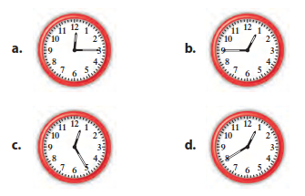
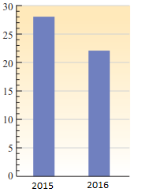

# Esercizi sui Numeri Razionali

### ESERCIZIO 1 - Il Concetto di Frazione

Rispondi alle seguenti domande scrivendo la frazione richiesta. 

a) Da quante ore sto aspettando un treno se lo aspetto da 45 minuti?  

b) Quanti euro costa un giocattolo se lo pago con 5 monete da mezzo euro?  

c) Per ognuna delle seguenti figure, quale frazione di ora è trascorsa?  

d) Considerando il carburante indicato nella figura seguente, quale è la frazione di serbatoio piena, quale quella vuota?  

e) Nella figura seguente sono riportati il numero dei nuovi iscritti al Corso Serale nel biennio 2015-2016.  

Individua la frazione dei nuovi iscritti di ciascun anno rispetto al totale.

### ESERCIZIO 2 - Frazioni equivalenti

Utilizzando la definizione, stabilisci se le seguenti coppie di frazioni sono fra loro equivalenti ed individua quali frazioni sono maggiori di 1.  

$[\dfrac{4}{5},\dfrac{8}{10}];\:[\dfrac{6}{2},\dfrac{10}{4}];\:[\dfrac{0}{15},\dfrac{2}{30}];\:[\dfrac{1}{8},\dfrac{2}{9}];\:[\dfrac{0}{20},\dfrac{0}{40}];$  

[Verifica con Maxima. is($\dfrac{4}{5},\dfrac{8}{10}$)] 

### ESERCIZIO 3 - Prodotto di frazioni (I)

Calcola i seguenti prodotti di frazioni.  

a) $\dfrac{1}{2}\cdot4;\:\dfrac{5}{3}\cdot9;\:\dfrac{3}{2}\cdot10;$  

b) $\dfrac{3}{8}\cdot\dfrac{12}{15};\:\dfrac{7}{10}\cdot\dfrac{20}{21};$   

### ESERCIZIO 4 - Problemi con le frazioni (I)

a) La ricetta di un dolce prevede l'uso di mezza tazza di farina. Di questa, tre quarti va impastata con le uova e la parte rimanente aggiunta in seguito. Quanta parte della tazza va aggiunta in seguito?  

b) Quanti minuti dura un viaggio di tre quarti d'ora? Quale è l'espressione per ottenere il risultato?  

c) La metà degli alunni di una classe sono assenti ed un terzo dei rimanenti non hanno fatto i compiti. Quale è la frazione della classe che ha svolto i compiti regolarmente?  

Se la classe è formata da 24 alunni, quanti sono quelli che non hanno svolto i compiti?

### ESERCIZIO 5 - Prodotto di frazioni (II)

Calcola le seguenti quantità dopo aver scritto l'espressione che la rappresenta.  

a) i cinque dodicesimi di 9; i cinque dodicesimi di 60; i tre quarti del doppio di 20;  

b) la metà di un decimo; i due terzi di 60; i tre quarti del doppio di 20;  

c) un quinto dei due terzi di 9; la metà della metà di 20; il doppio di cinque quinti della metà di 30;  

### ESERCIZIO 6 - Prodotto di frazioni (III)

Scrivi a parole le espressioni contenute nei punti a) e b) del'esercizio 3.

### ESERCIZIO 7 - Il minimo comune denominatore

Riduci le frazioni di ognuno dei seguenti gruppi al minimo comune denominatore.  

a) $[\dfrac{7}{2},\dfrac{3}{5}];\:[\dfrac{1}{2},\dfrac{3}{5}];\:[\dfrac{1}{6},\dfrac{1}{2}];\:[\dfrac{3}{8},\dfrac{1}{4}];$  

b) $[\dfrac{7}{15},\dfrac{1}{30},\dfrac{3}{10}];\:[\dfrac{4}{6},\dfrac{9}{10},\dfrac{11}{30}];\:[\dfrac{3}{7},2,\dfrac{31}{49}];$  

[Verifica con Maxima. lnum: map(num, [$\dfrac{7}{2},\dfrac{3}{5}$]); lden: map(denom,[$\dfrac{7}{2},\dfrac{3}{5}$]); mcm: lcm(lden);  l: makelist(mcm/x,x,lden);  

La lista dei nuovi numeratori è allora  makelist(lnum[i]*l[i], i, 2) ]

### ESERCIZIO 8 - Ordinamento delle frazioni

Scrivi in ordine crescente le seguenti frazioni.  

a) $\dfrac{3}{2},\dfrac{4}{8},\dfrac{8}{3},\dfrac{7}{7},\dfrac{15}{4};$   

b) $-\dfrac{1}{3},\dfrac{11}{6},-\dfrac{9}{8},+\dfrac{2}{3},-\dfrac{6}{5},+\dfrac{4}{3}.$  

[Verifica con Maxima. sort([$\dfrac{3}{2},\dfrac{4}{8},\dfrac{8}{3},\dfrac{7}{7},\dfrac{15}{4}$]"<")

### ESERCIZIO 9 - Somma algebrica di frazioni

Calcola le seguenti somme algebriche.

a) $\dfrac{1}{2}+\dfrac{3}{2};\:,\dfrac{4}{5}+\dfrac{6}{5}-\dfrac{20}{5};\:-\dfrac{2}{3}-\dfrac{5}{3}+\dfrac{2}{3}+\dfrac{5}{3};$   

b) $\dfrac{1}{2}-\dfrac{3}{5};\:,\dfrac{1}{5}+\dfrac{2}{3};\:\dfrac{1}{6}-\dfrac{1}{2};$  

c) $\dfrac{2}{3}-\dfrac{3}{2};\:\dfrac{4}{5}+5;\:-5-\dfrac{7}{8};\:2-\dfrac{1}{4};\:2+\dfrac{1}{4};\:2-\dfrac{1}{4}\:,\dfrac{2}{3}+\dfrac{1}{8}-1;$   

d) $-\dfrac{8}{3}+5-\dfrac{2}{5};\:12-\dfrac{1}{3}-\dfrac{1}{9}.$

### ESERCIZIO 10 - Espressioni con somme di frazioni

Calcola il valore delle seguenti espressioni, eseguendo, in ciascun passaggio, solo operazioni indipendenti tra di loro.  

a) $3-\dfrac{1}{2}+\left[\dfrac{3}{4}+\left(\dfrac{1}{5}-\dfrac{6}{10}\right)\right]-1;\:,\dfrac{1}{10}-\dfrac{3}{5}+\left[\dfrac{2}{5}-\left(6-7-\dfrac{2}{10}\right)\right]-\left(\dfrac{6}{5}+3\right);$    $[R. \dfrac{37}{20};-1]$  

b) $-\left(1+2\right)-\left(\dfrac{1}{12}+\dfrac{1}{2}\right)+\left(\dfrac{5}{2}+\dfrac{4}{3}\right)-\left[\dfrac{1}{6}+\left(-\dfrac{5}{4}-\dfrac{1}{3}\right)-1\right];$     $[R. 0]$  

c) $7-\left[\left(3+\dfrac{1}{5}-\dfrac{3}{4}-2\right)-\left(\dfrac{2}{5}-6+\dfrac{3}{4}-\dfrac{1}{2}\right)\right]+\dfrac{6}{5}-\left(\dfrac{7}{20}+\dfrac{1}{20}\right).$     $[R. 2]$  

[Verifica con Maxima. Inserisci le espressioni e calcola il risultato] 

### ESERCIZIO 11 - Espressioni con le quattro operazioni tra frazioni

Calcola il valore delle seguenti espressioni.

a) $\left(\dfrac{2}{5}-\dfrac{2}{3}\right)\cdot\left(\dfrac{1}{2}-\dfrac{4}{3}\right);\:\dfrac{2}{5}\cdot\left(-\dfrac{15}{4}\right)\cdot\left(-\dfrac{2}{3}\right);\:\left(\dfrac{2}{3}+1\right)\cdot\left(2-\dfrac{1}{5}\right);$     $[R. \dfrac{2}{9};-\dfrac{9}{2};3]$  

b) $\dfrac{2}{4}:\dfrac{1}{2};\:\dfrac{4}{5}:\left(-\dfrac{12}{25}\right);\:\dfrac{2}{5}:4;\:\left(-1\right):\left(-5\right);$   

c) $\left(3-\dfrac{3}{11}\right):\left(\dfrac{3}{2}-\dfrac{4}{11}\right);\:\left(+7\right):\left(+3\right)\cdot\left(-5\right);\:\left(+7\right):\left[\left(+3\right)\cdot\left(-5\right)\right].$     $[R. \dfrac{12}{5};-\dfrac{35}{3};-\dfrac{7}{15}]$  

Calcola il valore delle seguenti espressioni, eseguendo, in ciascun passaggio, solo operazioni indipendenti tra di loro.  

d) $9\left(-\dfrac{1}{15}\right)\left(-10\right)\left(-\dfrac{7}{6}\right);\:\left[\left(-\dfrac{7}{5}\right)\left(-\dfrac{10}{21}\right)+\dfrac{11}{3}\left(-\dfrac{9}{2}\right)\right]:\left(-\dfrac{19}{9}\right).$     $[R. -7;\dfrac{15}{2}]$

### ESERCIZIO 12 - Dalle parole alle espressioni (I)

Scrivi le espressioni relative alle seguenti frasi e calcolane il risultato.  

a) Aggiungi 1/5 alla somma di 1/2 e 1/3; Aggiungi 2/3 alla somma di 5/6 e 1; Somma 5 al risultato della somma tra 5/6 e 8/3;  

b) Sottrai 1/2 dalla somma di 3 e 1/4; Aggiungi 1 alla somma di 1/5 e -1; Togli da 1/3 la somma di -2/3 e 1/3; 

 c) Raddoppia il prodotto fra 4/7 e 7/2; Scrivi il Triplo del prodotto fra 5/6 e 3/10; Aggiungi 1/4 a tre volte il quoziente di 3/2 e 9/4;  

### ESERCIZIO 13 - Dalle parole alle espressioni (II)

Indicando con x un numero qualsiasi, scrivi le espressioni relative alle frasi seguenti.  

a) Il precedente di x; il successivo di x; il doppio di x; il quadruplo di x;  

b) La terza parte di x; il cubo di x; il reciproco di x; il triplo di x;  

c) La metà di x; il quadrato di x; l’opposto di x; l’opposto del reciproco o l’antireciproco di x.  

### ESERCIZIO 14 - Problemi con le frazioni (II)

Risolvi i seguenti problemi.

a) Paolo deve acquistare uno scooter che costa € 2760, ma possiede solo i 2/3 della somma. Quanto manca per effettuare la spesa?     [R. € 920]  

b) Ogni giro di stadio è i due quinti di un chilometro. Quanti giri di stadio deve compiere un corridore per completare un allenamento di 20 Km?     [R. 50]  

c) Un negozio di bricolage acquista un grande quantitativo di chodi da vendere in confezioni di 9/16 di Kg. Quante confezioni di chiodi si otterranno da 2.871 Kg di chiodi?     [R. 5104]  

d) In un centro commerciale Andrea acquista un set di valigie che sono in sconto. Se risparmia €123 e lo sconto è uguale ai 5/90 del prezzo iniziale, quanto costavano le valigie?     [R. € 2.214]  

e) Un camion può trasportare con sicurezza carichi fino ad una tonnellata. Sarebbe in grado di trasportare mezza tonnellata di sabbia, un terzo di ghiaia, ed un quinto di cemento in un solo viaggio?      [R. No]  

f) Su un cartone di latte da 500 ml c’è scritto: «Latte parzialmente scremato. Grasso max 1,8%». Quanti ml di grasso contiene il cartone di latte? Se un bicchiere medio contiene 200 ml di latte, quanti ml di grasso contiene?     [R.9 ml; 3,6 ml]  

g) Un libro oggi costa € 12,50. Se il suo prezzo viene aumentato del 3%, quanto costerà dopo l’aumento?     [R. € 12,88]

### ESERCIZIO 15 - Dalle parole alle espressioni (III)

Traduci in espressioni le seguenti frasi e calcola poi il loro valore, sostituendo alle lettere i dati assegnati.  

a) Sottrai dal doppio di a la terza parte di b. [a=1, b=$\dfrac{2}{3}$]  

b) Moltiplica la somma del doppio di a e della terza parte di b per due. [a=1, b=$\dfrac{2}{3}$]  

c) Somma il quadruplo del quadrato di a con il doppio di c. [a=1, b=$\dfrac{2}{3}$]  

d) Moltiplica la somma del doppio di a e della terza parte di b per la differenza tra il doppio di a e la terza parte di b.  `[`a=1, b=$\dfrac{2}{3}$] [R. $\dfrac{15}{4}$]

e) Sottrai 1/8 di a ai 4/5 di c, dividi poi il risultato per i 3/8 del quadrato di b. [a=3, b=$-\dfrac{1}{5}$,c=$\dfrac{1}{16}$].     [R. $-\dfrac{65}{3}$]  

f) Moltiplica la somma del doppio di a e della terza parte di b per la differenza tra il doppio di a e la terza parte di b, sottrai poi al risultato la somma del quadruplo del quadrato di a e del doppio di c. `[`a=1,b=$\dfrac{2}{3}$,c=-2 ][R. $\dfrac{15}{4}$]

g) Moltiplica la differenza tra i 2/5 di a e la metà di b per il doppio di c, somma poi al risultato il quoziente tra 1/4 di a e la differenza tra il doppio di b e 1. [a=$\dfrac{5}{3}$,b=2,c=$\dfrac{3}{4}$].     [R. $-\dfrac{15}{36}$]

[Verifica con Maxima. simp: false; e1: 2*a+b/3; e2: e1, a=1, b=2/3; e2, simp ].

### ESERCIZIO 16 - Dalle parole alle espressioni (IV)

Scrivi le espressioni relative alle seguenti frasi.

a) Dati i numeri a e b, moltiplica la somma dei loro opposti per la somma dei due numeri e sottrai il doppio del prodotto dei due numeri;

b) Dati i numeri a e b, al quadrato della loro somma togli il doppio del prodotto fra la loro somma e la loro differenza;

c) Al quadrato della somma del cubo di un numero x e del suo doppio togli il cubo della somma del quadrato del numero e 4/3.

### ESERCIZIO 17 - Dalle espressioni alle parole

Scrivi a parole le seguenti espressioni.

a) $\dfrac{1}{3}-\left(-\dfrac{2}{3}+\dfrac{1}{3}\right);$

b) $\left(-\dfrac{2}{3}+\dfrac{1}{3}\right)\cdot\dfrac{1}{3}-1;$

c) $\dfrac{a}{2}-\left(\dfrac{1}{3}-a\right);$

d) $\dfrac{1}{3}\dfrac{a}{2}-\left(-\dfrac{1}{3}-a\right).$

### ESERCIZIO 18 - Potenze con le frazioni

Calcola il valore delle seguenti potenze.

a) $\left(\dfrac{3}{4}\right)^{2},\left(\dfrac{2}{3}\right)^{4},\left(\dfrac{1}{2}\right)^{5},\left(\dfrac{3}{2}\right)^{0};$

b) $\left(1-\dfrac{1}{2}\right)^{2},\left(2-\dfrac{5}{4}\right)^{0},\left(\dfrac{3}{2}-\dfrac{6}{4}\right)^{2}.$

### ESERCIZIO 19 - Espressioni con le frazioni

Calcola il valore delle seguenti espressioni contenenti potenze.

a) $\left(\dfrac{1}{2}+\dfrac{2}{3}+\dfrac{3}{4}\right)^{2}:\left(1-\dfrac{2}{3}+\dfrac{1}{4}-\dfrac{1}{6}\right)^{2};$     $[R. \dfrac{12}{5}]$

b) $\left[\dfrac{9}{2}+\dfrac{3}{8}-\left(\dfrac{3}{2}\right)^{2}\right]:\left(1+\dfrac{1}{2}\right)^{3}; $     $[R. 7]$
​            

c) $\dfrac{2}{5}:\left\{ \left[\dfrac{1}{2}+\left(1+\dfrac{1}{5}\right)^{2}\left(1-\dfrac{1}{6}\right)-\left(\dfrac{1}{2}\right)^{2}\right]^{2}\left(1+\dfrac{3}{5}\right)^{2}\right\};$     $[R.  \dfrac{1}{10}]$

d) $\left\{ \left[\dfrac{23}{12}:\left(\dfrac{5}{4}-\dfrac{2}{3}\right)\right]:\left(\dfrac{11}{20}+\dfrac{7}{4}\right)\right\} ^{2}\text{·}\left[\left(\dfrac{10}{7}\right)^{2}\text{·}\left(\dfrac{10}{7}\right)\right]^{0}:\left(\dfrac{10}{7}\right)^{2};$    $ [R. 1]$

### ESERCIZIO 20 - Problemi con percentuali

a) Due persone ereditano 25.000 euro. Una delle due ha diritto al 25% dell’eredità.

A quale percentuale ha diritto la seconda persona? Qual è la somma ricevuta da ciascuna?     [R. 75%; € 6250 euro; € 18 750]

b) Un libro oggi costa € 12,50. Se il suo prezzo viene aumentato del 3%, quanto costerà dopo l’aumento?     [R. € 12,88]

c) Sapendo che il latte contiene panna per circa l’11% del suo peso e che la panna produce burro per il 27% del suo peso, calcola quanti kilogrammi di burro si possono ricavare da 125 kilogrammi di latte.      [R. 3.7125 kg] 

### ESERCIZIO 21 - Equivalenze I

a) Quanti secondi ci sono in due ore e mezzo? Quanto pesano due etti e mezzo di salame in Kg ?

b) A quanti minuti corrispondono 10 ore? A quante ore corrispondono 10 minuti ?

c) Una moneta da 1 centesimo pesa 2,30 grammi. Quanto peserebbero cinque euro e mezzo in centesimi? 

d) Un periodo di un anno 5 mesi e 22 giorni quanto dura in mesi? ed in trimestri?

c) A quante ore corrispondono x minuti ?

### ESERCIZIO 22 - Equivalenze II

Esegui le seguenti operazioni facendo prima le equivalenze.

a) 7 Km + 14 m + 12 dam = ............ dam &emsp;  [R. 713,4]  

b) 15 dm + 70 cm - 100 mm = ............ m  &emsp;  [R. 2,1]  

c) 27 dam + 3 200 cm + 2 hm = ............ m  &emsp;  [R. 502]  

d) 0,5 dam + 5 m + 6 cm + 1,6 m = ............ dm  &emsp;  [R. 116,6]  

### ESERCIZIO 23 - Proprietà delle potenze

Calcola, applicando le proprietà delle potenze, il valore delle seguenti espressioni.

a) $\left[\left(-\dfrac{1}{4}\right)^{3}:\left(-\dfrac{1}{4}\right)\right]^{2};$   $[R. \dfrac{1}{256}]$

b) $\left(-\dfrac{1}{5}\right)^{10}:\left(-\dfrac{1}{5}\right)^{6}\text{·}10^{4};$     $[R. 16]$

c) $\left[-\left(\dfrac{1}{25}\right)^{2}\cdot\left(\dfrac{1}{25}\right)^{3}\right]\text{·}\left(\dfrac{25}{3}\right)^{5};$   $[R. \dfrac{1}{243}]$

d) $\left[\left(\dfrac{4}{3}\right)^{2}\right]^{3}\text{·}\left(\dfrac{3}{2}\right)^{6}\text{·}\left(-\dfrac{1}{2}\right)^{6};$     $[R. 1]$

### ESERCIZIO 24 - Sostituzioni e valore delle espressioni

Di ognuna delle seguenti espressioni stabilisci se è intera o frazionaria e calcolane il valore dopo aver sostituito i numeri alle variabili.

a)  $a-\left(b+c\right),\left[a=\dfrac{1}{2},b=\dfrac{2}{3},c=\dfrac{1}{4}\right]$;$a-\left(b-c\right),\left[a=\dfrac{2}{3},b=\dfrac{1}{6},c=\dfrac{2}{9}\right]$;$a+\left(-b\right)-c,\left[a=\dfrac{5}{9},b=\dfrac{1}{18},c=-\dfrac{2}{3}\right]$

b) $\left(\dfrac{1}{a}\cdot b\right):\left(-c\right),\left[a=2,b=\dfrac{4}{5},c=\dfrac{1}{5}\right]$;$\left(a+b\right)^{2}\left(-a-b\right)^{2},\left[a=-\dfrac{2}{3},b=1\right]$;$\dfrac{x+y}{x-y}+\left(\dfrac{x-y}{x+y}\right)^{2},\left[x=-\dfrac{1}{2},y=-\dfrac{1}{2}\right]$
