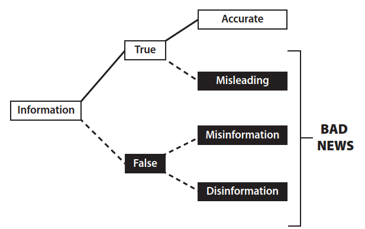

## UNITA' 2: Analisi e valutazione delle fonti informative

Abbiamo detto che il pensiero critico consiste nell'utilizzo della razionalità nelle comunicazioni per una migliore comprensione della verità o dell'utilità di ciò che ascoltiamo, leggiamo o diciamo.

L'accertamento della verità delle informazioni che utilizziamo nei nostri dibattiti a sostegno delle discussioni è quindi un tema fondamentale del pensiero critico. Nelle nostre discussioni non possiamo infatti prescindere dal citare notizie, eventi, in generale delle <u>evidenze</u> su cui si basano le nostre ulteriori considerazioni. Il reperimento di queste evidenze passa attraverso i documenti, i filmati e le fotografie degli eventi eccetera, ed il canale più utilizzato da tutti attualmente è internet.

Perché è importante impegnarsi a cercare ed utilizzare <u>le informazioni migliori</u> presenti in Internet? Vale la pena spiegare i motivi.

- Circolano molte credenze false o inesatte. Siamo tutti convinti della veridicità di un'infinità di cose che non abbiamo mai realmente verificato.
- Migliaia e migliaia di persone diligenti, nel corso della storia e nelle diverse culture, si sono impegnate a fondo per esplorare e scoprire la verità. È arrogante pensare di poter ignorare tutto ciò. Bisogna mostrare rispetto per gli altri e si può utilizzare il lavoro altrui, svilupparlo e contribuire ad esso.
- Appoggiarsi alle conoscenze consolidate è un modo fondamentale per accrescere la credibilità e la forza persuasiva delle proprie argomentazioni perché si può dimostrare di non essere soli nelle proprie opinioni.

### Informazioni accurate, fuorvianti, false (misinformation) e disinformazione

Una <u>Informazione</u> è qualsiasi comunicazione che sia letteralmente vera, ossia che corrisponda alla realtà del mondo. Se ti dico che Albany è la capitale di New York, ti ho fornito un'informazione. Se leggi che l'economia cinese era una delle più grandi al mondo nel 2025, questa è un'informazione. Se un podcaster ti dice che, in media, gli uomini sono più forti delle donne, sei stato informato. In ogni caso, il contenuto dell'informazione corrisponde alla realtà. In altre parole, il contenuto è vero.

Per comprendere la crisi dell'informazione, è però importante osservare che non tutte le cose vere sono ugualmente <u>utili</u> per la formazione di una visione del mondo reale.

Dobbiamo quindi fare una distinzione tra le informazioni che rendono la nostra visione del mondo più accurata e quelle che la rendono meno accurata. Chiameremo "informazioni accurate" le informazioni che migliorano la nostra visione del mondo, ossia ci aiutano a vedere il mondo così com'è realmente. 

> 
> $\triangle$ Una  **informazione accurata** è una informazione vera ed utile, che migliora la nostra visione del mondo ossia che ci aiuta a vedere il mondo così com'è.
> 

Le informazioni che peggiorano la nostra visione del mondo reale le chiameremo "**informazioni fuorvianti**": anche se vere, non dovremmo crederci senza un pizzico di scetticismo o senza confrontarle con altre informazioni.

#### ESEMPIO 1

I bambini a volte sono maestri nel dire cose "vere" ed ingannevoli allo stesso tempo. Se chiedete loro se hanno pulito la loro stanza potreste sentirvi rispondere: "Sì, abbiamo pulito la nostra stanza". Ma se andate a controllare, potreste trovare un disastro e quando chiedete spiegazioni potreste ricevere una risposta del tipo: "Ma non abbiamo mentito. Abbiamo pulito la nostra stanza prima. Non ci hai chiesto se l'avessimo pulita oggi".    $\bullet$

Viene chiamato "**effetto selezione**" l'informazione fuorviante generata da fatti che vengono riportati e fatti che vengono omessi. Nell'ecosistema dell'informazione, giornalisti, influencer e podcaster devono decidere quali storie raccontare e quali ignorare. Queste selezioni possono essere fatte in modo da migliorare la visione d'insieme del mondo o da distorcere la prospettiva in una direzione o nell'altra. Ecco un semplice esempio. 

#### ESEMPIO 2

La maggior parte degli americani muore per malattie, con le malattie cardiache e il cancro come cause principali. Ma quasi tutti i notiziari che parlano di decessi si concentrano sulla violenza, con omicidio, terrorismo e suicidio tra le cause più comuni. Dal punto di vista di un giornalista, questo ha senso. C'è un vecchio detto: "Un cane morde un uomo, chi se ne importa? Un uomo morde un cane, questa sì che è una notizia!".

Ma dal punto di vista del lettore, notizie di questo tipo sono fuorvianti (anche quando vere). Il rapporto tra notizie di morti violente e morti non violente dà l'impressione che ogni città d'America sia un luogo violento, dove la maggior parte degli americani muore per mano di altri. Questo non è vero, anche quando le notizie riportate sono tutte accurate. Quindi, anche se potrebbe essere vero che c'è stato un omicidio in una città, concentrarsi selettivamente sugli omicidi giorno dopo giorno può indurre a pensare che quella città sia più violenta di quanto non sia in realtà.    $\bullet$

L'effetto di selezione non è sempre innocuo come mettere in evidenza storie interessanti. Può essere usato come una lente politica per offrire ai lettori una visione fuorviante del mondo. Ad esempio, se si vuole dare ai lettori l'impressione che gli immigrati siano pericolosi, è necessario selezionare e riportare i crimini commessi dagli immigrati tralasciando le notizie sui crimini commessi dai cittadini. Poiché gli immigrati commettono effettivamente crimini, la notizia sarà vera ma fuorviante. Oppure, se si vuole dare ai lettori l'impressione che la presenza delle armi tra i cittadini sia un problema, è necessario selezionare e riportare le notizie sulle sparatorie di massa ed evitare accuratamente di parlare dei casi in cui le armi vengono utilizzate per la difesa personale. Ciò che è vero per le notizie è vero anche per altre questioni di guerra culturale, dall'istruzione alla storia.

Un altro effetto che porta ad una distorsione è l'**effetto cornice** (Framing effect).

Si verifica quando una notizia di cronaca enfatizza alcuni aspetti della storia rispetto ad altri o dice al lettore come dovrebbe pensare e sentirsi riguardo all'incidente riportato, <u>accostando</u> l'evento ad una teoria o interpretazione per esaltarla o denigrarla. Ad esempio, se un articolo di cronaca su un violento temporale o un uragano menziona il fatto che il cambiamento climatico probabilmente renderà questi eventi estremi più comuni, sta generando un effetto cornice. Oppure, quando un podcaster che parla di negligenza medica menziona che un particolare medico è stato assunto tramite un programma di prevenzione sta mettendo in pratica un effetto cornice per denigrare il programma nei confronti del pubblico  (inquadrando l'evento da una cornice). In entrambi i casi, il reportage evidenzia alcuni aspetti della storia e minimizza altri al fine di dare al lettore un'impressione generale di un certo tipo.

Un'affermazione è falsa quando non corrisponde alla realtà dei fatti. Quando si crede a qualcosa di falso, la visione del mondo è, almeno in parte, imprecisa.

Intendiamo per "misinformation" o informazione falsa, un contenuto falso diffuso da qualcuno che lo crede vero.
La misinformation deriva da un errore: chi scrive o condivide la notizia pensa che sia vera, ma in realtà non lo è.
La misinformation può provenire da molte fonti; a volte proviene da persone semplicemente ingenue. Quando una zia un po' stravagante pubblica su Facebook un post in cui afferma che i vaccini causano l'autismo, probabilmente ci crede davvero: questo è un caso di falsa informazione.

Casi analoghi sono quelli di molte persone che credono davvero a ciò che dicono sugli alieni, sui politici, sulle mode della medicina alternativa o sulle teorie del complotto. Quando queste affermazioni sono false, rientrano nella categoria della misinformation.

Se la misinformation è un contenuto falso diffuso per errore, la disinformazione è un contenuto falso diffuso intenzionalmente. In altre parole, la disinformazione è una menzogna, la menzogna di chi scrive o condivide una notizia che sa che è falsa, ma lo fa comunque, o perché non gli importa della verità (come un bugiardo) o perché sta cercando di confondere o ingannare. L'esempio classico è quello del politico che mente per nascondere la verità. Afferma di non aver votato per aumentare le tasse, ma i fatti dimostrano il contrario.

>
> $\triangle$ Si ha **disinformazione** quando un contenuto falso viene diffuso intenzionalmente (chi lo diffonde sà che è falso). 
>

Il nostro ambiente informativo è saturo di disinformazione. Ogni volta che un'azienda inganna consapevolmente gli enti regolatori o i clienti con affermazioni false, si tratta di disinformazione. Ad esempio, quando un'azienda produttrice di tabacco afferma che fumare non aumenta il rischio di sviluppare il cancro, si tratta di disinformazione, dato che sa il contrario da decenni. Oppure quando un'azienda di combustibili fossili nega che il cambiamento climatico sia causato (in parte) dall'inquinamento umano, si tratta di disinformazione. 

I governi sono impegnati nel gioco della disinformazione da secoli nella forma della <u>propaganda</u>.

>
> $\triangle$  La **propaganda** è qualsiasi materiale fuorviante o palesemente falso, diffuso da governi, aziende o altri soggetti al fine di manipolare intenzionalmente una popolazione. Sebbene assuma molte forme diverse, una delle più importanti è la disinformazione vera e propria.
> 

 Se la guerra non sta andando bene e il governo, consapevolmente, comunica ai cittadini il contrario: si tratta di disinformazione. Quando un troll online inventa una storia per incitare gli avversari politici, si sta impegnando in una campagna di disinformazione.

Una forma particolarmente comune di disinformazione è la fake news. La fake news si verifica quando le persone pubblicano o condividono informazioni che sanno essere false, spacciandole per fonti di notizie legittime.

>
> $\triangle$  Una **Fake News** è una notizia falsa, mascherata da notizia vera e diffusa intenzionalmente.
>

Ad esempio, quando il Partito Comunista Cinese diffonde disinformazione sui social media con il nome di CNN, si tratta di fake news. Oppure, quando un attivista politico crea un sito web che sembra quello di una rispettabile testata giornalistica locale, ma che in realtà è solo una copertura per pubblicare disinformazione, si tratta di fake news. Mentre i politici tendono a considerare le fake news come qualsiasi notizia che non gradiscono, è meglio considerarle come un sottoinsieme della disinformazione: notizie false o contraffatte mascherate da notizie vere.

### Il Ruolo dei Media Tradizionali (Broadcasting) 

I mass media raramente forniscono un modello per distinguere le fonti affidabili da quelle inaffidabili. Hanno diverse cattive abitudini che a loro volta trasmettono altre cattive abitudini. Spesso si macchiano di un <u>falso equilibrio</u>, fornendo una fonte per ciascuna parte, trascurando il diverso peso effettivo delle fonti.

Puntano sul contrasto ed il conflitto per creare ascolto e quindi preferiscono l'estremo e lo spettacolo alla analisi attenta per estrarre la verità. Per questa tendenza è stato coniato un termine specifico: **infotainment**, unione di "information" ed "entertainment". «informazione» e «divertimento, intrattenimento»: un tipo di produzione, in special modo televisiva, in cui la componente giornalistica viene alternata o fusa con lo spettacolo e il varietà: la forma è quella del salotto in cui giornalisti, politici e personaggi dello spettacolo parlano di attualità dando le loro opinioni e giudizi.

Raramente i media tradizionali dedicano tempo ad esaminare le prove o a valutare dati contraddittori. Hanno una scarsa capacità di attenzione, che, unita al ciclo di notizie 24 ore su 24, genera una frenetica tendenza a trarre conclusioni immediate ed a ripeterle all'infinito.

Il fenomeno per cui <u>ripetere più volte un'informazione</u> la fa percepire come vera è un meccanismo psicologico ben noto, spesso sfruttato dai media tradizionali (giornali, TV, radio) e dalla pubblicità per influenzare l'opinione pubblica. Questo principio è conosciuto in psicologia come **"effetto illusorio della verità"**.  La ripetizione rende l'informazione più "familiare". Il cervello umano tende a confondere la familiarità con la verità; pertanto, ciò che è stato già sentito o letto viene elaborato più facilmente e, di conseguenza, accettato più facilmente come corretto. 
Questo meccanismo funziona soprattutto con i media tradizionali che godono spesso di un'autorità riconosciuta. Quando una notizia viene ripetuta su diverse piattaforme (TG, giornali, programmi di approfondimento), il pubblico tende a considerarla credibile, anche se si tratta di disinformazione o fake news.
Spesso associata alla propaganda o a strategie di marketing, questa tecnica mira a trasformare una menzogna in una verità percepita, ignorando il dibattito critico e puntando sulla "fabbrica del consenso" attraverso l'esposizione costante a determinati messaggi. 

### I Nuovi Media: Internet

Internet ha rivoluzionato il nostro modo di comunicare ed ha fornito un numero incalcolabile di nuove possibilità sia alla nostra vita privata che al mondo degli affari rispetto tra cui l'archiviazione e la immediata messa a disposizione di dati transazionali, istituzionali, educativi e scientifici indispensabili.

Internet ha però anche un enorme potenziale di diffusione della disinformazione. Le notizie che fornisce devono essere valutate con ancora maggiore cautela rispetto alle informazioni provenienti dalla stampa, dalla radio o dalla televisione.
Esistono fondamentalmente due tipi di fonti di informazione su Internet. La prima
è costituita da fonti commerciali e istituzionali; la seconda, siti individuali e di gruppo sul World Wide Web. 

La prima categoria include fonti ufficiali come database, istituzioni governative ed educative, nonché i servizi online offerti dai principali organi di informazione.

La seconda categoria include tutto il resto che si può trovare sul web: un incredibile assortimento di informazioni buone e meno buone, intrattenimento di qualità molto variabile, consigli utili, pubblicità, offerte allettanti, offerte fraudolente e vere e proprie menzogne e truffe.

Chiunque può dire qualsiasi cosa su Internet ed Internet è pieno di fonti di notizie false, il che non sorprende se si considera quanto poco costi pubblicare qualcosa sul web. Come ha affermato Eric Schmidt, Presidente esecutivo di Google dal 2001 al 2015 e di Alphabet dal 2015 al 2017 "Internet è una cloaca di disinformazione".

### Cosa Fare?

Detto tutto ciò, cosa possiamo fare per per informarci attraverso Internet senza cadere preda della disinformazione?

Non ci sono metodi che <u>assicurano</u> di filtrare le notizie vere da quelle false; il massimo che si può fare è adottare degli accorgimenti per abbassare la probabilità di essere manipolati o ingannati e tutti questi accorgimenti convergono sul principio della **verifica delle informazioni**.

Alcuni modi per verificare se una informazione su Internet, ad esempio un post sui social media, è autentico e affidabile sono:

1. **Identità**: Chi ha pubblicato il post? Ha fornito il suo vero nome? Cosa sai di lui con certezza?
2. **Rete**: Chi lo segue? Cosa ti dicono le dimensioni e il tipo di follower? È rilevante?
3. **Motivazione**: Qual era lo scopo di questo post? Cosa cerca di convincerti a credere o a fare?
4. **Responsabilità**: Proviene da un esperto riconosciuto? Cosa ha da perdere se il contenuto non è vero?
5. **Interessi personali**: In che modo questo post potrebbe avvantaggiare chi lo ha pubblicato (o la sua reputazione, i suoi follower, i suoi affari, i suoi interessi personali)?
6. **Coerenza**: I dettagli sono coerenti internamente, ad esempio per quanto riguarda l'ora del giorno, il luogo, l'abbigliamento o sono coerenti tra post correlati tra loro?
7. **Testimone oculare**: La persona è presente all'evento o nel luogo indicato?
8. **Conferma**: Il contenuto può essere verificato tramite altre fonti?
9. **Recenza**: C'è stato tempo sufficiente perché altri verificassero e confermassero il contenuto?
10. **Storico**: Conosci la fonte? Si è dimostrata affidabile in passato?

### ESERCIZIO 2.1

Per ciascuna delle notizie seguenti scegli la migliore tra le risposte proposte.

a) “SCOPERTO UN CIMITERO ALIENO SPAZIALE! Gli scienziati che hanno trovato un cimitero extraterrestre nell'Africa centrale affermano che ha almeno 500 anni!
'Ci devono essere 200 corpi sepolti lì e nessuno di loro è umano',
ha detto ai giornalisti il dottor Hugo Schild, antropologo svizzero."

Qual è la reazione appropriata a questo articolo del Weekly World News?

1. Probabilmente è vero.
2. È quasi certamente vero.
3. Abbiamo davvero bisogno di maggiori informazioni per poter esprimere un giudizio.
4. Nessuna delle precedenti.

b) In un giorno del Ringraziamento, un'immagine, che secondo alcuni somigliava alla Vergine Maria, fu osservata su una parete della chiesa di San Domenico a Colfax, in California. 
Un fisico, incaricato di indagare, affermò che l'immagine era stata causata dalla luce del sole che filtrava attraverso una vetrata e si rifletteva su un lampadario pendente dal soffitto montato da poco. Altri, invece, dissero che si trattava di un miracolo. 

Quale spiegazione è più plausibile?

1. Quella del fisico;
2. Quella degli altri;
3. Sono necessarie ulteriori informazioni prima di poter stabilire quale spiegazione sia più plausibile.

### ESERCIZIO 2.2

a) Un possessore di carta di credito, il Sig. Roberts, riceve la seguente telefonata.

VOCE AL TELEFONO: Salve, signor Roberts, qui HSBC. Ha recentemente effettuato un acquisto con carta di credito di 347 dollari da Macy's a New York?

SIG. ROBERTS: No, non l'ho fatto...

VOCE AL TELEFONO: Lo immaginavamo, signor Roberts. Mi dispiace informarla che è molto probabile che la sua carta di credito sia stata compromessa e venga utilizzata da terzi. Tuttavia, siamo pronti a bloccare la carta e a inviarle immediatamente un'altra, senza alcun costo aggiuntivo.

SIG. ROBERTS: Va bene, immagino.

VOCE AL TELEFONO: Vorrei sottolineare che subirà un disagio minimo e non dovrà sostenere alcuna spesa. Ora, per l'autorizzazione, solo per essere certi di chiamare la persona giusta, signor Roberts, la prego di indicare il numero della sua carta di credito e la data di scadenza.

Cosa dovrebbe fare il signor Roberts, in quanto pensatore critico?

b) ANCHORAGE, Alaska (AP) – Legata ai suoi figli gemelli per sicurezza, Joni Phelps ha raggiunto la cima del Monte McKinley. Il National Park Service afferma che Phelps, 54 anni, è apparentemente la prima donna non vedente ad aver scalato la vetta di 6.192 metri.

Questa notizia è:

1. probabilmente vera;
2. probabilmente falsa;
3. troppo vaga; sono necessarie ulteriori informazioni prima di poter esprimere un giudizio.

c) Hai letto recensioni entusiastiche di "The Life Plan", un libro che promette di rallentare l'invecchiamento, aumentare la forza, migliorare la vita sessuale e così via attraverso la dieta, l'esercizio fisico e la terapia ormonale. Un lettore del libro può aspettarsi di ottenere i risultati descritti? Ci sono delle precauzioni da prendere prima di iniziare un programma del genere?

