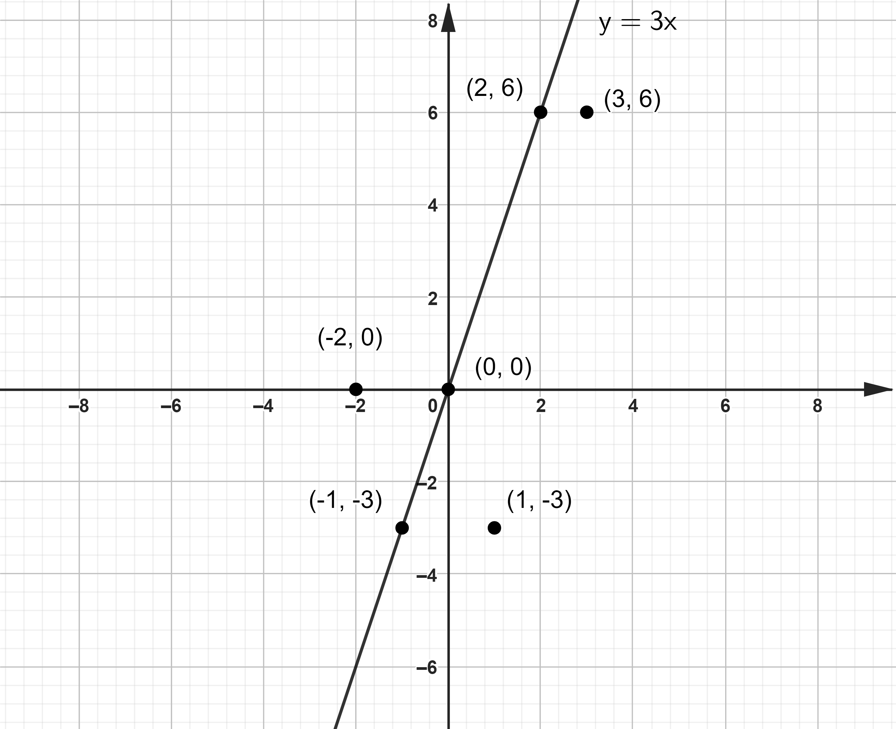
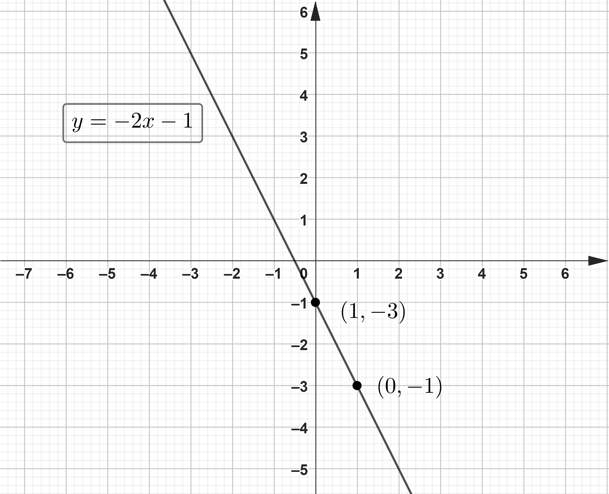
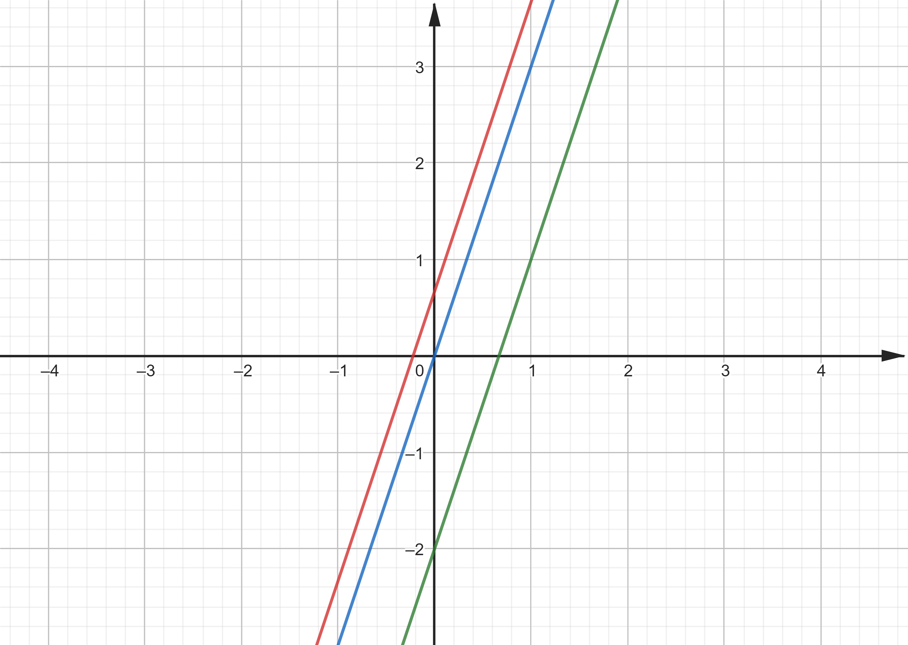
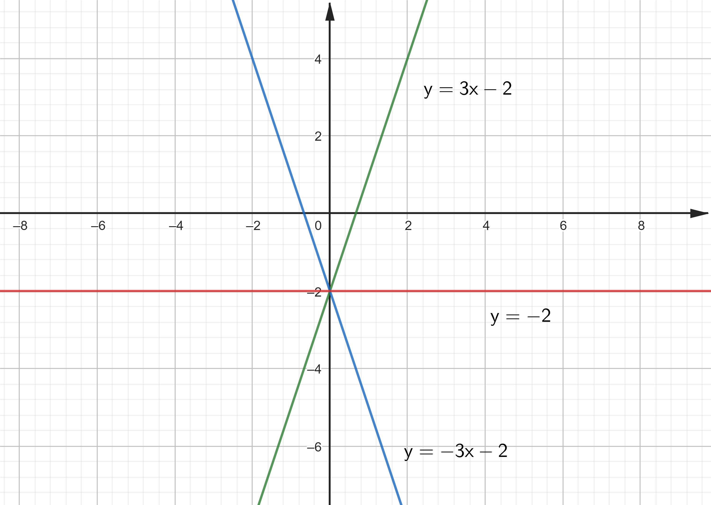
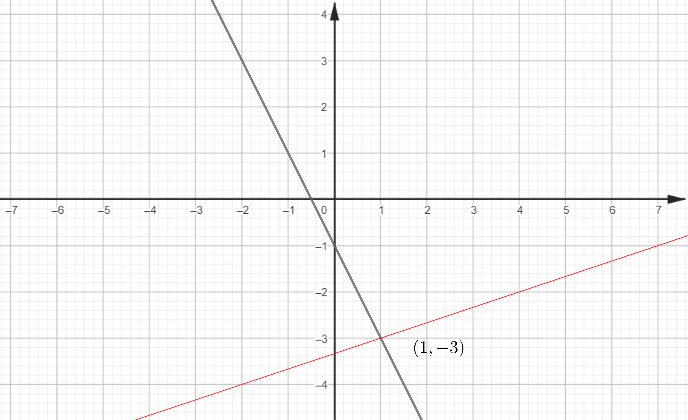
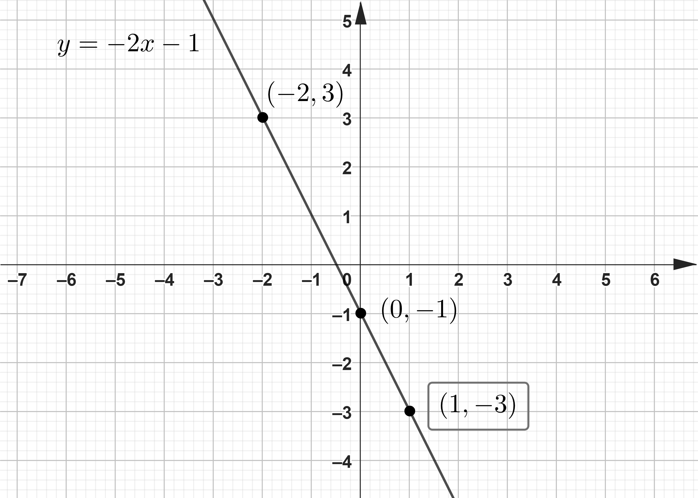

# Piano Cartesiano e Retta

## UNITA' 1: Piano cartesiano ed equazioni con due incognite

Un ***piano cartesiano*** è costituito da un piano sul quale sono state disegnate due rette perpendicolari, su ciascuna delle quali è possibile indicare le posizioni dei numeri a partire dallo 0, in modo che ad ogni punto sia associabile una coppia di numeri e viceversa ad ogni coppia di numeri (coordinate) corrisponda un punto.

 

Una equazione con due incognite, come ad esempio $x + y = 5$ è una relazione tra due numeri, il numero $x$ ed il numero $y$ che può immediatamente essere "letta" come una proprietà dei punti del piano: ci saranno punti che soddisfano l'equazione, se le loro coordinate sostituite alle incognite dell'equazione la rendono vera (ossia sono soluzione) e punti che non la soddisfano. Le coppie di numeri che rendono vera l'equazione, ossia le sue soluzioni, individuano un sottoinsieme dei punti del piano cartesiano definito dall'equazione.

#### ESEMPIO

Data l'equazione $y = 3x$, la tabella seguente presenta un campione di sei punti di cui tre sono soluzione e tre non lo sono.
$$
\textbf{Sostituzioni} \\
\begin{array}{|c|c|}
\hline
\mathbf{(x, y)} & \mathbf{y = 3x} \\
\hline 
(0, 0) & 0 = 3 \cdot 0 \longrightarrow True \\
\hline 
(1, -3) & -3 = 3 \cdot 1 \longrightarrow False \\
\hline 
(-1, -3) & -3 = 3 \cdot (-1) \longrightarrow True \\
\hline 
(2, 6) & 6 = 3 \cdot 2 \longrightarrow True \\
\hline 
(-2, 0) & 0 = 3 \cdot (-2) \longrightarrow False \\
\hline 
(3, 6) & 6 = 3 \cdot 3 \longrightarrow False \\
\hline\end{array}
$$

Se posizioniamo tutti e sei punti sul piano, verifichiamo che le soluzioni di ogni equazione di I grado con due incognite corrispondono a punti allineati (retta) e viceversa che ogni retta è un sottoinsieme di punti del piano cartesiano individuato da una equazione di I grado con due incognite. $ \bullet$

Il sottoinsieme dei punti del piano le cui coordinate sono soluzioni dell'equazione di I grado si chiama "grafico dell'equazione" e poiché il grafico è geometricamente una retta, si chiama **grafico della retta**.

### ESERCIZIO 1.1 - Punti allineati

Disegna la retta che passa per ciascuno dei seguenti insiemi di punti allineati. Descrivi a parole le caratteristiche di ciascuna retta.  

a) $A = \{(-5;3), (1; 3), (6; 3)\};$

b) $B = \{(0; 0), (0; -4)\};$

c) $D = \{(-4; 4), (-2; 2), (3; -3)\}$.

#### Laboratorio GEOGEBRA

a) Risolvi il punto b) dell'esercizio con l'istruzione GEOGEBRA: $Retta((0,0),(0,-4))$.

b) Risolvi il punto c) con la sequenza di istruzioni seguente: 

1. $P1 = (-4,4)$ &#9166;   
2. $P2 = (-2,2)$ &#9166;   
3. $Retta(P1, P2)$ &#9166;   

### ESERCIZIO 1.2 - Campione di punti

a) Ciascuno degli insiemi riportati di seguito rappresenta le soluzioni della rispettiva equazione (una retta). Per ognuno, trova un campione di 3 punti che vi appartiene e riporta i punti su di un piano cartesiano.

1. $A = \{(x, y): y = 3x\};$

2. $B = \{(x, y): y = x + 1\};$

3. $C = \{(x, y): x + y = 1\}$.

b) Trova tre punti di ciascuno degli insiemi seguenti.

1. $A = \{(x, y): y = -1 + 0 \cdot x\};$
2. $B = \{(x, y): x = -1 + 0 \cdot y\}$.

#### Laboratorio GEOGEBRA

a) Risolvi il punto dell'esercizio a.2) seguendo le indicazioni riportate in ciascun passo. 

Passo 1: Inserisci l'equazione dell'esercizio, mediante l'istruzione $f: y=x+1$&#9166; (oppure digita l'equazione e dal menu contestuale scegli "Aggiungi etichetta");

Passo 2: Crea una tabella, inserendo nella colonna delle $x$ i 5 valori $0,1,-1, 2, -2;$

Passo3: Nella vista "algebra", dal menu contestuale all'istruzione del passo 1, scegli "Tabella di valori";

Passo 4: Verrà riempita una nuova colonna $f(x)$ della tabella con i valori della $y$ calcolati e quindi posizionati i punti $(x, y)$ sul piano cartesiano.

## UNITA' 2: Dall'equazione alla retta

Una retta geometrica è un insieme di punti allineati. In un piano cartesiano, i punti di una retta hanno le coordinate che sono soluzioni di una equazione della forma che segue:
$$
y = mx+q
$$
detta ***equazione (generica) della retta in forma esplicita***. Le lettere $m$ e $q$ rappresentano due numeri qualsiasi per cui quelle che seguono sono tutte equazioni di rette.

#### ESEMPI

Individuiamo $m$ e $q$ nelle equazioni che seguono:

1. $y = 3x -5$,    $m = 3$ e $q = -5$;
2. $y = -\dfrac{5}{4}x$,    $m = -\dfrac{5}{4}$ e $q = 0$;
3. $y = \dfrac{2}{3},$    $m = 0$ e $q = \dfrac{2}{3}$.

Sono due i primi problemi che ci si presentano quando si parla di rette ed equazioni:

1. Data una equazione di I grado, disegnare nel piano la retta geometrica associata;
2. Data una retta geometrica (cioè le coordinate di due punti su cui passa la retta) scrivere l'equazione associata, in forma esplicita.

Risolviamo il primo problema. 

Per disegnare in un piano cartesiano la retta geometrica corrispondente ad una equazione in forma esplicita basta trovare due soluzioni sostituendo all'incognita $x$ due numeri in successione e calcolando il corrispondente valore della $y$.

#### ESEMPIO

Data l'equazione $y = -2x -1$ diamo ad $x$ i valori $0$ ed $1$ e calcoliamo la corrispondente $y$:

a) $y = -2x -1, \{x = 0\} \longrightarrow y = -2 \cdot (0) -1 \longrightarrow y = -1$;

b) $y = -2x -1, \{x = 1\} \longrightarrow y = -2 \cdot (1) -1 \longrightarrow y = -3$.

Organizzando i punti in tabella:
$$
y = -2x -1 \\
\begin{array}{c|c}
x & y \\
\hline 
0 & -1 \\
1 & -3 \\
\end{array}
$$
Abbiamo il risultato seguente. $ \bullet$

#### ESEMPIO

Scriviamo in forma esplicita l'equazione $-2y + 3 = 4x$.

a)  $-2y + 3 = 4x$;

b)  $-2y = 4x - 3$;

c)  $-\dfrac{1}{2} \cdot (-2y) = -\dfrac{1}{2} \cdot (4x - 3)$;

d) $y = -2x + \dfrac{3}{2}$. $ \bullet$

### ESERCIZIO 2.1 - Dalla retta generica alle rette specifiche

Considerata l'equazione della retta generica in forma esplicita $y = mx+q$, scrivi nei casi riportati di seguito le equazioni specifiche dopo aver sostituito i parametri con i numeri

1. $m=1, \; q=1;$       $m=-1, \;  q=0;$       $m=0, \; q=-2;$
2. $m=\dfrac{1}{2}, \; q=2;$       $m=-\dfrac{3}{4}, \; q= -5;$        $m=-\dfrac{2}{5}, \; q= -\dfrac{1}{3}$.

### ESERCIZIO 2.2 - Retta in forma esplicita

Scrivi in forma esplicita le seguenti equazioni. Quanto valgono $m$ e $q$ in ciascun caso?

a) $y - \dfrac{1}{2}x = 5$,   $y +\dfrac{-1}{3}x - 4 = 0$  

b) $y - x +2 = 0$,   $y - 4 = x + 9$  

#### Laboratorio GEOGEBRA

a) Risolvi il punto a.2.1 dell'esercizio con la sequenza di istruzioni GEOGEBRA riportata di seguito.

1. $eq1: y=m x+q$  &#9166;   
2. $Sostituisci(eq1,\{m=-1,q=\dfrac{1}{2}\})$ &#9166;   

b) Risolvi il punto c.2) dell'esercizio con la sequenza di istruzioni GEOGEBRA riportata di seguito.

1. $Risolvi(y-x+2=0,y)$ &#9166;   
2. $Risolvi(y-4=x+9,y)$  &#9166;

### ESERCIZIO 2.3 - Grafico della retta

a) Disegna le due rette rappresentate dalle seguenti equazioni trovando almeno due punti per i quali passa ciascuna di esse.

1. $y = -2x$,   $y = 3x + 1;$

2. $y = \dfrac{1}{2}x$,   $y = \dfrac{-1}{3}x - \dfrac{2}{3};$

b) Disegna le due rette rappresentate dalle seguenti equazioni trovando due punti per i quali passa ciascuna di esse di cui uno è l'intersezione della retta con l'asse orizzontale

1. $y = \dfrac{11}{8}x$,   $y = 11 x$  
2. $y = -3x + 5$,   $y = 11 x - 3$.

#### Laboratorio GEOGEBRA

a) Risolvi il punto a) dell'esercizio seguendo le indicazioni riportate in ciascun passo. 

Passo 1: Inserisci l'istruzione $f: y=-2x$&#9166; (oppure digita l'equazione e dal menu contestuale scegli "Aggiungi etichetta");

Passo 2: Crea una tabella, inserendo nella colonna delle $x$ i valori $0,1,-1;$

Passo 3: Nella vista "algebra", dal menu contestuale all'istruzione del passo 1, scegli "Tabella di valori";

Passo 4: Verrà riempita una nuova colonna $f(x)$ della tabella con i valori $0, 2, -2$ e posizionati i punti sul piano cartesiano.

Passo 6: Ripeti i passi 1 e 3 per la seconda equazione.

b) Risolvi il punto b) dell'esercizio con l'istruzione GEOGEBRA: $\{y = \dfrac{1}{2}x, y = \dfrac{-1}{3}x\}$ &#9166; .

## UNITA' 4: Dalla retta all'equazione

Le lettere $m$ e $q$ nell'equazione della retta generica indicano due numeri molto importanti che si chiamano rispettivamente ***coefficiente angolare*** ed ***intercetta all'asse delle $\mathbf{y}$***. Ricorda che per poter parlare di coefficiente angolare ed intercetta all'asse delle $y$, l'equazione deve essere nella forma $y = \text{numero} \cdot x + \text{numero}$.

L'equazione $y = mx + q$ si chiama ***generica*** perché avendo solo lettere, non indica nessuna retta del piano. Poiché le rette hanno equazioni esplicite tutte della stessa forma, l'unica cosa che le distingue sono i valori delle lettere $m$ e $q$ e ogni volta che sostituiamo ad $m$ e $q$ due numeri, otteniamo una retta specifica che è possibile disegnare nel piano.

Per avere la retta specifica che passa per due punti di cui abbiamo le coordinate, diciamo $(x_1, y_1)$ e $(x_2, y_2)$, i numeri $m$ e $q$ si calcolano con le formule seguenti. :
$$
\left\{  
\begin{array}{l} 
m = \dfrac{y_2 - y_1}{x_2 - x_1} \\  
q = y_2 - m \cdot x_2 \\   
\end{array} 
\right.
$$

#### ESEMPIO

Se abbiamo i punti $P_1 = (0,0)$ e $P_2 = (2,1)$, e $x_1=0, y_1=0, x_2=2, y_2=1$, sostituendo nelle formule precedenti:
$$
\left\{  
\begin{array}{l} 
m = \dfrac{1 - 0}{2 - 0} =\dfrac{1}{2} \\  
q = 1 - \dfrac{1}{2} 2 = 0 \\   
\end{array} 
\right.
$$

Per cui l'equazione della a retta cercata è $y = \dfrac{1}{2}x$.  $ \bullet$

### ESERCIZIO 4.1 - Coefficiente angolare di una retta

Calcola il coefficiente angolare delle rette passanti per ciascuna delle seguenti coppie di punti  
a) $\{(4, -5), (2, 3)\};$ 

b) $\{(-3, 1), (-1, -2)\};$

c) $\{(4, \dfrac{1}{2}), (\dfrac{2}{3}, -2)\}$.  

#### Laboratorio GEOGEBRA

a) Risolvi il punto a.1) dell'esercizio con l'istruzione GEOGEBRA: $m = \dfrac{-2 - 1}{-1 - \dfrac{1}{2}}$ &#9166; .

### ESERCIZIO 4.2 - Equazione della retta passante per due punti

a) Scrivi l'equazione della retta passante per i punti A e B dati nei casi seguenti.  

1. $A(\dfrac{1}{2}, 1)$,    $B(-1,-2);$  
2. $A(-2, 0),$     $B(-2, 10);$   
3. $A(1,-1),$     $B(-\dfrac{1}{2}, \dfrac{1}{2});$    

b) Scrivi l'equazione della retta che compare in ciascuna delle figure seguenti. 

  

#### Laboratorio GEOGEBRA

a) Risolvi il punto a.2) dell'esercizio con l'istruzione GEOGEBRA: $Retta((4,-5),(2,3))$.

b) Risolvi il punto a.3) dell'esercizio con la sequenza di istruzioni:

1. $A = (-2,0)$ &#9166;   
2. $B = (-\dfrac{1}{2},\dfrac{1}{2})$ &#9166;   
3. $Retta(A, B)$ &#9166;   

b) Scrivi la sequenza di istruzioni GEOGEBRA per disegnare le rette rappresentate nella figura del punto b) dell'esercizio.  

## UNITA' 5: Significato geometrico di m e q

Se la retta non è nella forma indicata, il primo passo per individuare $m$ e $q$ è quello di metterla nella forma desiderata, detta ***forma esplicita***. Per fare questo bisogna risolvere l'equazione della retta data rispetto alla $y$, come se $y$ fosse l'unica incognita. Bisogna poi scrivere la soluzione come "$\text{monomio in x} + \text{numero}$" e prendere come $m$ la parte numerica del monomio e come $q$ il numero rimanente.

Il numero $q$ si chiama "intercetta all'asse delle $y$" perché è l'altezza del punto di intersezione della retta con l'asse delle $y$. Le coordinate complete del punto di intersezione della retta con l'asse delle $y$ sono $(0,q)$.

#### ESEMPIO

Se proviamo a disegnare (anche con GEOGEBRA) le tre rette seguenti, che hanno tutte lo stesso coefficiente angolare ma diversi $q$, vedremo il grafico seguente:

1. $y = 3x -2$,    $m = 3$ e $q = -2$;
2. $y = 3x$,    $m = 3$ e $q = 0$;
3. $y = 3x + \dfrac{2}{3},$    $m = 0$ e $q = \dfrac{2}{3}$.

L'altezza dei punti di intersezione corrisponde a $(0,q)$ dove $q$ è parametro di ogni retta. $ \bullet$

Il coefficiente angolare determina l'angolo di inclinazione della retta rispetto all'asse orizzontale. Se $m$ è positivo la retta è inclinata verso l'alto; se è negativo è inclinata verso il basso e se è pari a zero la retta è orizzontale.

#### ESEMPIO

Osserviamo il grafico seguente dove sono disegnate le rette riportate di sotto.

1. $y = 3x -2$,    $m = 3$ e $q = -2$;
2. $y = -3x -2$,    $m = -3$ e $q = -2$;
3. $y = 0x -2$,    $m = 0$ e $q = -2$.

Poiché l'inclinazione di una retta sull'asse orizzontale dipende dal suo coefficiente angolare, abbiamo che tutte le retta che hanno lo stesso coefficiente angolare hanno la stessa inclinazione, per cui sono tutte parallele. Questo lo si vede anche dalla prima figura. In pratica la condizione di parallelismo di due rette è: "due rette sono parallele se e solo se le loro equazioni in forma esplicita hanno lo stesso coefficiente angolare". $ \bullet$

Oltre a ciò possiamo dire che "due retta sono perpendicolari se e solo se il coefficiente angolare dell'una è l'opposto del reciproco di quello dell'altra: se il coefficiente angolare della prima è $m_1$ e quello della seconda è $m_2$, la condizione è: $m_1 = -\dfrac{1}{m_2}$

### ESERCIZIO 5.1 - Rette parallele e perpendicolari

a) Date le equazioni delle rette seguenti, stabilisci quali sono parallele e quali perpendicolari

1. $y = 3x - 2;$   $-x + y -4=0;$   $y = \dfrac{2}{3}x;$   $x - y - 5=0;$   $2x+6y-1=0$.
2. $y = x + \dfrac{1}{3};$   $y = \dfrac{1}{3}x;$   $y = \dfrac{2}{3}x;$   $y = \dfrac{1}{3}x + \dfrac{1}{3};$   $y=+\dfrac{1}{3}$.

b) Scrivi le equazioni di due rette parallele alla retta di equazione $2y +  5 =  0$ e di due parallele alla retta di
equazione $4x  - 3 = 0$.

c) Stabilisci se la retta che passa per i punti $A(2;  7)$ e $B( 1; 5)$ è parallela alla retta di equazione $y = -4x$.

d) Per ciascuna retta, scrivi l’equazione della parallela e della perpendicolare a essa e passanti per il punto $A$.

1. $y = \dfrac{1}{3}x;$   $A(1; 1)$.
2. $y + 3x + 2 = 0;$   $A(0; -2)$.
3. $y - \dfrac{1}{2}x = 5;$   $A(-1; -1)$.

#### Laboratorio GEOGEBRA

a) Risolvi il punto d.1 dell'esercizio dell'esercizio con la sequenza di istruzioni GEOGEBRA riportata di seguito: 

1. $Retta((1,1),y = \dfrac{1}{3}x)$ &#9166;
2. $Perpendicoare((1,1),y = \dfrac{1}{3}x)$ &#9166;

## UNITA' 6: Intersezione di due rette

Due rette in un piano cartesiano, non parallele ne coincidenti, geometricamente si intersecano in un punto. Dal punto di vista delle equazioni, la coppia di coordinate del punto di intersezione è soluzione di entrambe le equazioni delle rette, ossia è soluzione del loro sistema. Se ne deduce che, avendo due equazioni di due rette, per trovare le coordinate del punto di intersezione delle rette bisogna risolvere il sistema di due equazioni in due incognite. 

#### ESEMPIO

Consideriamo le due rette che fanno parte del sistema seguente.

$$\left\{  
\begin{array}{c} 
2x+y=-1 \\  
x-3y=10\\   
\end{array} 
\right.$$

La soluzione del sistema è data dalla coppia $(1,-3)$, come si ricava da GEOGEBRA con l'istruzione $Risolvi(\{2x+y=-1,x-3y=10\}, \{x,y\})$. 

Il loro grafico è il seguente.

Come si vede la soluzione del sistema coincide con le coordinate del punto di intersezione delle due rette. $ \bullet$

Anche gli assi cartesiani sono rette ed hanno la loro equazione associata. L'equazione associata all'asse orizzontale, l'asse delle $x$, è $y=0$ mentre quella associata all'asse verticale (delle $y$) è $x=0$: come si può verificare facilmente, le coordinate di tutti i punti posizionati sull'asse verticale, ad esempio $(0, -3)$ oppure $(0, 5)$, sono soluzione dell'equazione $x + 0 \cdot y = 0 \longrightarrow x=0$ e tutti quelli posizionati sull'asse orizzontale, esempio $(-5, 0)$ oppure $(1,0)$ sono soluzione di $y + 0 \cdot x = 0 \longrightarrow y=0$.

Se quindi si vuole risolvere l'importante problema di individuare le coordinate dei punti di intersezione di una retta, ad esempio $y -3x = 1$ con gli assi coordinati bisogna risolvere i due sistemi:
$$
\left\{  
\begin{array}{c} 
y -3x = 1  \\  
y =0			\\   
\end{array} 
\right.
$$

$$
\left\{  
\begin{array}{c} 
y -3x = 1 \\  
x=0			\\   
\end{array} 
\right.
$$

che hanno come soluzione rispettivamente $(-\dfrac{1}{3}, 0)$ e $(0, 1)$.

### ESERCIZIO 6.1 - Sistemi di equazioni lineari e piano cartesiano

Dati i sistemi seguenti, per ciascuno di essi disegna le due rette, controlla se la coppia fornita è il loro punto di intersezione e, nel caso non lo fosse, trovalo. 

a)  $$ (3,1) \enspace \enspace \left\{  
\begin{array}{l} 
5x-3y=12 \\  
x-2y=1 \\   
\end{array} 
\right.$$

b)  $$ (5,-2) \enspace \left\{  
\begin{array}{l} 
3x+2y=-1 \\  
6x-9y=2 \\   
\end{array} 
\right.$$

c)  $$ (9,2) \enspace \enspace \left\{  
\begin{array}{l} 
x+3y=-1 \\  
x-y=7 \\  
\end{array} 
\right.$$

#### Laboratorio GEOGEBRA

a) Risolvi il punto b) dell'esercizio con la sequenza di istruzioni GEOGEBRA riportata di seguito: 

1. $eq1: 3x+2y=-1$ &#9166;
2. $eq2: 6x-9y=2$ &#9166; 
3. $Sostituisci(eq1, \{x=5, y=-2\})$ &#9166;    (L'uguaglianza è falsa quindi cerchiamo la soluzione con il comando $Risolvi$)
4. $Risolvi(\{eq1,eq2\}, \{x, y\})$  &#9166;

### ESERCIZIO 6.2 - Intersezione con gli assi e parallelismo

a) Trova i punti di intersezione con gli assi delle rette riportate di seguito

1. $y - \dfrac{1}{2}x = 5$;
2. $ y +\dfrac{-1}{3}x - 4 = 0$;  
3. $x+3y=-1$;
4. $x-y=7$.

b) Scrivi l'equazione di una retta di coefficiente $-1$ e passante per il punto $(0; 3)$.

c) Scrivi l'equazione di una retta parallela a quella di equazione $y - \dfrac{1}{2}x = 5$ e passante per il punto (-1; -1).

d) Individua per quali intervalli i polinomi seguenti sono positivi o negativi:

1. $\dfrac{1}{2}x;$   $\dfrac{-1}{3}x - 4$ ;   $11;$
2. $\dfrac{11}{8}(x-16);$   $-2x + 11$.

#### Laboratorio GEOGEBRA

a) Risolvi il punto a.1) dell'esercizio con la sequenza di istruzioni GEOGEBRA riportata di seguito:

1. $eq1: y - \dfrac{1}{2}x = 5$  &#9166;   
2. $Risolvi(\{eq1, x=0\},\{x, y\})$  &#9166;   
3. $Risolvi(\{eq1, y=0\},\{x, y\})$  &#9166;   

b) Risolvi il punto b) dell'esercizio con la sequenza di istruzioni GEOGEBRA riportata di seguito: 

1. $m := -1$ &#9166;    $x_0:=0$ &#9166;    $y_0:=3$  &#9166;
2. $y-y_0 = m(x-x_0)$ &#9166; 

c) Risolvi il punto c) dell'esercizio con l'istruzione GEOGEBRA: $Retta((-1,-1),y - \dfrac{1}{2}x = 5)$.

### ESERCIZIO 6.3 - Pendenza di una linea

a) Trova, in assoluto ed in percentuale, la pendenza della linea di equazione $3x + 4y = 12$.

b) Scrivi l'equazione della retta che passa per il punto $(0;-2)$ ed ha pendenza $\dfrac{1}{3}$.

c) Nella figura seguente la salita ha una pendenza del 17%. Se in un minuto l'autocarro percorre 500 metri in orizzontale, di quanti metri sarà salito in verticale?

d) Un auto viaggia da Napoli a Roma percorrendo circa 250 Km in 3 ore e 10 minuti con una velocità costante. Indicando con t il tempo in ore trascorso dall'inizio del viaggio e con s lo spazio in Km percorso:

1. scrivi la formula che calcola lo spazio s percorso dopo t ore 
2. riporta in un piano cartesiano con il tempo sull'asse orizzontale e lo spazio su quello verticale, il grafico dell'equazione trovata. Quale è il significato fisico del coefficiente angolare?

## UNITA' 7: Intervalli di positività e negatività

Un problema importante che ci si pone quando abbiamo l'equazione di una retta è quello di individuare tutte le ascisse (la $x$) dei punti della retta che stanno nel semipiano positivo. Questo insieme è un intervallo detto **intervallo di positività**; determinarlo significa individuarne gli estremi.

#### ESEMPIO

Consideriamo la figura seguente che riporta il grafico della retta $y = -2x -1$..

Il punto della retta $(1,-3)$ non sta nel semipiano positivo, quindi $1$, l'ascissa del punto, non è nell'intervallo di positività della retta; la stessa cosa si può dire di $(0,-1)$: $0$ non è nell'intervallo di positività della retta. Invece $(-2, 3)$ è nel semipiano positivo, quindi $-2$ è nell'intervallo di positività della retta.

Sempre in riferimento alla figura, poiché la retta interseca l'asse orizzontale nel punto $(-\dfrac{1}{2},0)$ possiamo dire che l'intervallo di positività della retta $y = -2x -1$ è formato da tutte le $x$ minori di $-\dfrac{1}{2}$, ossia è l'intervallo $(-\infty, -\dfrac{1}{2})$ dell'asse delle $x$ (orizzontale). $ \bullet$

Per trovare l'intervallo di positività di una retta avendo la sua equazione (in forma esplicita) è quindi necessario disegnare il grafico della retta, controllare se la retta è inclinata verso l'alto o il basso, quindi trovare il punto di intersezione $(x_0, 0)$ con l'asse delle $x$: se l'inclinazione è verso l'alto l'intervallo di positività sarà $(x_0,+\infty)$ mentre se è inclinata verso il basso sarà $(-\infty, x_0)$.

Se la retta non interseca l'asse delle $x$, il suo grafico sarà o tutto nel semipiano positivo o tutto in quello negativo. Nel primo caso l'intervallo di positività sarà $(-\infty, +\infty)$, mentre nel secondo sarà l'insieme vuoto $(0,0)$ 

### ESERCIZIO 7.1 - Intervallo di Positività

Per ciascuna delle rette seguenti, disegna il grafico e trova l'intervallo di positività.

a) $y = x -1$;

b) $y + 2x = 1$;

c) $y = -3$​;

c) $y = 1$.
