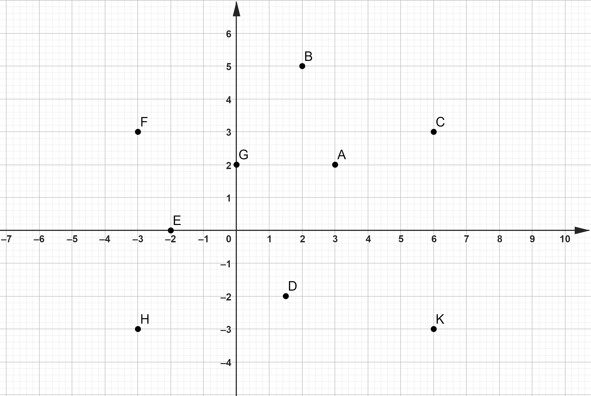
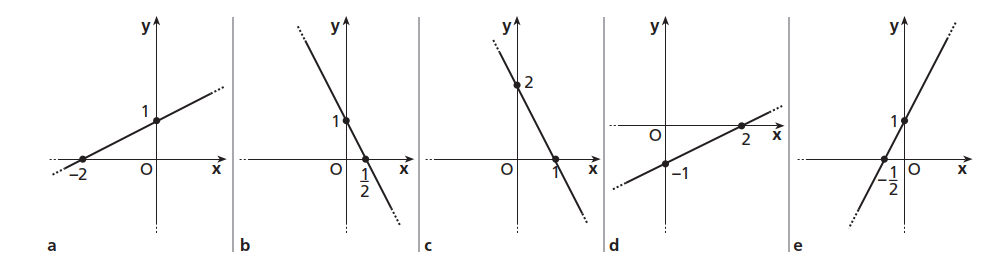
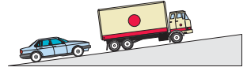

# Piano Cartesiano e Retta

### ESERCIZIO 1 - Posizione dei Punti

Posiziona i punti degli insiemi seguenti su di un piano cartesiano  

a) $Q = \{(1;1), (-1;1), (-1;-1), (1;-1)\}$;

b) $T = \{(-1;0), (1;0), (0;1)\}$;

c) $R = \{(-3;-1), (-1; -1), (0;-1), (1;-1), (2;-1), (3;-1)\}$.

#### Laboratorio GEOGEBRA

a) Risolvi il punto c) dell'esercizio con l'istruzione GEOGEBRA: $l=\{(-3,-1),(-1,-1),(0,-1), (1,-1), (2,-1), (3,-1)\}$ &#9166; .

### ESERCIZIO 2 - Coordinate dei punti

Scrivi l'insieme delle coppie di coordinate relative ai punti in figura

### ESERCIZIO 3 - Punti allineati

Disegna la retta che passa per ciascuno dei seguenti insiemi di punti allineati. Descrivi a parole le caratteristiche di ciascuna retta.  

a) $A = \{(-5;3), (1; 3), (6; 3)\}$;

b) $B = \{(0; 0), (0; -4)\}$;

c) $D = \{(-4; 4), (-2; 2), (3; -3)\}$.

#### Laboratorio GEOGEBRA

a) Risolvi il punto b) dell'esercizio con l'istruzione GEOGEBRA: $Retta((0,0),(0,-4))$.

### ESERCIZIO 4 - Campione di punti

Per ciascuno degli insiemi riportati di seguito trova un campione di 4 punti che vi appartiene e riporta i punti su di un piano cartesiano.  
a) $A = \{(x; y): y = -1\}$;

b) $B = {(x; y): x = 3}$;

c) $C = \{(x; y): y = -x\}$;

d) $D = \{(x; y): y = x + 1\}$;

e) $E = \{(x; y): x + y = 1\}$.

### ESERCIZIO 5 - Grafico della retta

Disegna le rette rappresentate dalle seguenti equazioni:  
a) $y = \dfrac{1}{2}x$,   $y = \dfrac{-1}{3}x$;

b) $y = \dfrac{-1}{3}x$,   $y = 3x$;

c) $y = \dfrac{11}{8}x$,   $y = 11 x$  

#### Laboratorio GEOGEBRA

a) Risolvi il punto b) dell'esercizio con l'istruzione GEOGEBRA: $\{y=-\dfrac{1}{3}x,y=x\}$ &#9166; .

### ESERCIZIO 6 - Coefficiente angolare di una retta

Calcola il coefficiente angolare delle rette passanti per ciascuna delle seguenti coppie di punti  
a) $\{(4; -5), (2; 3)\}$; 

b) $\{(-3; 1), (-1; -2)\}$;

c) $\{(4; 1/2), (2/3; -2)\}$.  

#### Laboratorio GEOGEBRA

a) Risolvi il punto a.1) dell'esercizio con l'istruzione GEOGEBRA: $m = \dfrac{-2 - 1}{-1 - \dfrac{1}{2}}$ &#9166; .

### ESERCIZIO 7 - Equazione della retta passante per due punti

a) Scrivi l'equazione della retta passante per i punti A e B dati.  

1. $A(1/2; 1),\enspace B(-1;-2)$;  
2. $A(-2; 0),\enspace B(-2; 10)$;   
3. $A(1;-1),\enspace B(-1/2;1/2)$;    

b) Scrivi l'equazione della retta che compare in ciascuna delle figure seguenti. 

  

#### Laboratorio GEOGEBRA

a) Risolvi il punto a.2) dell'esercizio con l'istruzione GEOGEBRA: $Retta((4,-5),(2,3))$.

b) Scrivi la sequenza di istruzioni GEOGEBRA per disegnare le rette rappresentate nella figura del punto b) dell'esercizio.  

### ESERCIZIO 8 - Forma implicita ed esplicita

a) Scrivi in forma implicita le seguenti equazioni di rette

1. $y = \dfrac{1}{2}x$,   $y = \dfrac{-1}{3}x - 4$  
2. $y = \dfrac{11}{8}x$,   $y = 11$  

b) Scrivi in forma esplicita le seguenti equazioni

1. $y - \dfrac{1}{2}x = 5$,   $y +\dfrac{-1}{3}x - 4 = 0$  
2. $y - x +2 = 0$,   $y - 4 = x + 9$  

#### Laboratorio GEOGEBRA

a) Risolvi il punto b.2) dell'esercizio con la sequenza di istruzioni GEOGEBRA riportata di seguito:

1. $Risolvi(y-x+2=0,\{y\})$ &#9166;   
2. $Risolvi(y-4=x+9,\{y\})$  &#9166;

### ESERCIZIO 9 - Interpretazione geometrica dei sistemi

Dati i sistemi seguenti, per ciascuno di essi disegna le due rette, controlla se la coppia fornita è il loro punto di intersezione e, nel caso non lo fosse, trovalo. 

a)  $$ (3;1) \enspace \enspace \left\{  
\begin{array}{c} 
5x-3y=12 \\  
x-2y=1 \\   
\end{array} 
\right.$$

b)  $$ (5;-2) \enspace \left\{  
\begin{array}{c} 
3x+2y=-1 \\  
6x-9y=2 \\   
\end{array} 
\right.$$

c)  $$ (9;2) \enspace \enspace \left\{  
\begin{array}{c} 
x+3y=-1 \\  
x-y=7 \\  
\end{array} 
\right.$$

#### Laboratorio GEOGEBRA

a) Risolvi il punto b) dell'esercizio con la sequenza di istruzioni GEOGEBRA riportata di seguito: 

1. $ l = \{ 3x+2y=-1, 6x-9y=2\}$ &#9166; 
2. $Risolvi(l, \{x, y\})$  &#9166;

### ESERCIZIO 10 - Problemi sulla retta

a) Trova i punti di intersezione con gli assi delle rette riportate di seguito

1. $y - \dfrac{1}{2}x = 5; \> y +\dfrac{-1}{3}x - 4 = 0$  
2. $x+3y=-1; \> x-y=7$;

b) Scrivi l'equazione di una retta di coefficiente $-1$ e passante per il punto $(0; 3)$.
c) Scrivi l'equazione di una retta parallela a quella di equazione $y - \dfrac{1}{2}x = 5$ e passante per il punto (-1; -1).

#### Laboratorio GEOGEBRA

a) Risolvi il punto b) dell'esercizio con la sequenza di istruzioni GEOGEBRA riportata di seguito: 

1. $m := -1$ &#9166;    $x_0:=0$ &#9166;    $y_0:=3$  &#9166;
2. $y-y_0 = m(x-x_0)$ &#9166; 

b) Risolvi il punto c) dell'esercizio con l'istruzione GEOGEBRA: $Retta((-1,-1),y - \dfrac{1}{2}x = 5)$.

### ESERCIZIO 11: Rette parallele e perpendicolari

a) Date le equazioni delle rette seguenti, stabilisci quali sono parallele e quali perpendicolari

1. $y = 3x - 2$;   $-x + y -4=0$;   $y = \dfrac{2}{3}x$;   $x - y - 5=0$;   $2x+6y-1=0$.
2. $y = x + \dfrac{1}{3}$;   $y = \dfrac{1}{3}x$;   $y = \dfrac{2}{3}x$;   $y = \dfrac{1}{3}x + \dfrac{1}{3}$;   $y=+\dfrac{1}{3}$.

b) Scrivi le equazioni di due rette parallele alla retta di equazione $2y +  5 =  0$ e di due parallele alla retta di
equazione $4x  - 3 = 0$.

c) Stabilisci se la retta che passa per i punti $A(2;  7)$ e $B( 1; 5)$ è parallela alla retta di equazione $y = -4x$.

d) Per ciascuna retta, scrivi l’equazione della parallela e della perpendicolare a essa e passanti per il punto $A$.

1. $y = \dfrac{1}{3}x$;   $A(1; 1)$.
2. $y + 3x + 2 = 0$;   $A(0; -2)$.
3. $y - \dfrac{1}{2}x = 5$;   $A(-1; -1)$.

#### Laboratorio GEOGEBRA

a) Risolvi il punto d.1 dell'esercizio con l'istruzione GEOGEBRA: $Retta((1,1),y = \dfrac{1}{3}x)$.

### ESERCIZIO 12 - Pendenza di una linea

a) Trova, in assoluto ed in percentuale, la pendenza della linea di equazione $3x + 4y = 12$.

b) Scrivi l'equazione della retta che passa per il punto $(0;-2)$ ed ha pendenza $\dfrac{1}{3}$.

c) Nella figura seguente la salita ha una pendenza del 17%. Se in un minuto l'autocarro percorre 500 metri in orizzontale, di quanti metri sarà salito in verticale?

d) Un auto viaggia da Napoli a Roma percorrendo circa 250 Km in 3 ore e 10 minuti con una velocità costante. Indicando con t il tempo in ore trascorso dall'inizio del viaggio e con s lo spazio in Km percorso:

1. scrivi la formula che calcola lo spazio s percorso dopo t ore 
2. riporta in un piano cartesiano con il tempo sull'asse orizzontale e lo spazio su quello verticale, il grafico dell'equazione trovata. Quale è il significato fisico del coefficiente angolare?

