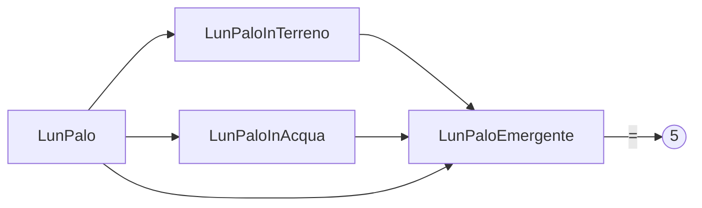

# Problemi di I grado

## UNITA' 1: Problemi ed equazioni

In questo capitolo vedremo una serie di problemi che si possono risolvere con una equazione di I grado. Vediamo subito un esempio.

#### ESEMPIO 1

Maria ha 50 anni ed ha il doppio degli anni di sua figlia. Quanti anni ha la figlia di Maria?

La soluzione di questo problema è semplice, ma vediamo alcune sue caratteristiche. La prima cosa da notare è <u>cosa ci chiede di trovare</u>, ossia quale è la **quantità richiesta**, soluzione dell'esercizio, in questo caso gli anni della figlia di Maria.

Per calcolare tale quantità ci vengono fornite certe informazioni; la prima è una "**condizione**" che deve essere soddisfatta dalla quantità richiesta: $50$ è il doppio degli anni della figlia di Maria.

Considerata la condizione, l'obiettivo può essere $10$? No, perché il doppio di $10$ non è $50$ e quindi non soddisfa la condizione (non <u>rende la condizione vera</u>). Può essere $30$? Nemmeno, perché neanche il doppio di $30$ è $50$. Può solo essere $25$ ossia la metà di $50$​, che sarà l'età della figlia di Maria.

Se indichiamo con "$x$" la quantità richiesta, la traduzione in simboli della condizione è:
$$
50 = 2 \cdot x
$$
Questa è una equazione (detta "equazione risolutiva del problema"), che sarà vera quando $x=\dfrac{50}{2} \longrightarrow 25$. Come si vede la soluzione dell'equazione è la quantità richiesta che stavamo cercando, cioè la soluzione del problema. $ \bullet$

Questo è un caso particolarmente semplice perché la condizione è direttamente contenuta nel testo. In altri problemi bisogna far ricorso a conoscenze pregresse. Vediamo un secondo esempio.

#### ESEMPIO 2

Una azienda ha avuto, nell'anno appena trascorso, un fatturato di $2.100.000$ euro ed un utile pari al $20\%$ del fatturato. Quali sono stati i costi?

La quantità richiesta è data dai costi annui, ma per risolvere questo problema è necessario individuare una condizione che determini il valore della quantità richiesta. Tale condizione (che "condiziona" i nostri costi) è la formula che lega ricavi (fatturato), utile e costi in un periodo:
$$
Utile = Ricavi - Costi
$$
Indicando con $x$ i costi, abbiamo che la soluzione del problema è data dalla soluzione dell'equazione seguente:
$$
2.100.000 \cdot 20\%= 2.100.000 - x
$$
cioè $x = 2.100.000 - 420.000 \longrightarrow 1.680.000$ euro. $ \bullet$

#### ESEMPIO 3

In una industria ci sono operai ed impiegati; gli operai superano di $1000$ unità il numero degli impiegati; sapendo che gli operai sono il quintuplo degli impiegati, calcola il numero degli impiegati e degli operai.

Stavolta le quantità richieste sembrano due, numero degli impiegati e numero degli operai, ma in realtà queste quantità non sono "indipendenti", cioè se ne conosciamo una l'altra la troviamo facilmente, perché se gli impiegati sono $100$, gli operai sono $1.000 + 100 = 1.100$,  se gli impiegati sono $600$ gli operai sono $1.000 + 600 = 1.600$ e così via. 

Possiamo dire quindi che se gli impiegati sono $x$, l'espressione (letterale) che ci consente di calcolare il numero degli operai è $1000 + x$, in cui si vede chiaramente che il numero degli operai "dipende" dal numero degli impiegati.

La condizione cui devono sottostare il numero degli operai e degli impiegati è che, qualunque siano i numeri, "gli operai sono il quintuplo degli impiegati". Tradotto in simboli abbiamo:
$$
1000 + x = 5 \cdot x
$$
Questa equazione ha soluzione $x = \dfrac{1000}{4} \longrightarrow 250$. $ \bullet$​

### ESERCIZIO 1.1 - Primi problemi

a) Risolvi i problemi seguenti impostando una equazione.

1. Trova un numero che aumentato di 5 è uguale alla propria metà.
2. Maria ed Antonio, se mettono insieme i loro risparmi, possiedono 64 euro. Antonio ha 12 euro in più di Maria. Quanti euro ha  Maria? 
3. Un padre ha il doppio dell'età del figlio. Sapendo che il padre ha 32 anni più del figlio, calcola l'età di entrambi. [Sugg. Se il padre ha il doppio dell'età del figlio, la differenza tra l'età del padre e quella del figlio è uguale all'età del figlio.]
4. Con 20 kg di frutta si confeziona della marmellata. Aggiungendo lo zucchero e facendo bollire si ottiene 1 kg di marmellata ogni 2 kg di frutta. Si sistema la marmellata ottenuta in barattoli che contengono 5 hg di marmellata ognuno. Quanti barattoli sono necessari?
5. La somma di quattro numeri è di 190; il secondo supera di 13 il primo, il terzo supera di 14 il secondo, il quarto supera di 15 il terzo. Calcola i quattro numeri.

b) Risolvi i problemi seguenti a.2), a.3) ed a.4) senza usare le equazioni.

### ESERCIZIO 1.2 - Problemi sui numeri

Risolvi i problemi seguenti.

a) Quale è il numero che addizionato alla sua metà ed alla sua terza parte da 33?

b) Trova due numeri sapendo che la loro somma è 18 e che la differenza tra il maggiore ed il minore è 10.

c) Trova due numeri sapendo che la loro somma è 18 ed il loro rapporto è 8.

### ESERCIZIO 1.3 - Problemi su sconti e percentuali

Risolvi i problemi seguenti.

a) Un vecchio video game è stato ribassato da 48 a 18€. Quale è la percentuale di sconto?  

b) Un oggetto è costato 120 euro; poiché si era ottenuto uno sconto del 25%, qual era il costo iniziale dell’oggetto?  

c) Un supermarket propone una offerta del tipo “prendi 3 e paghi 2” su di un certo tipo di pasta, così che ogni tre pacchi acquistati di pasta ne paga due. Quale è la percentuale di sconto per i clienti che usufruiscono di questa promozione?  Se un altro supermarket fa uno sconto del 40%, quale dei due è più conveniente?

d) Maria vende un immobile al prezzo di € 84 000, superiore del 5% rispetto al prezzo che aveva pagato per acquistarlo. Quanto era costato l’immobile?

## UNITA' 2: Un metodo per risolvere i problemi

Vediamo ora un metodo per affrontare i problemi di I grado.

La prima cosa da fare è leggere attentamente il problema, tante volte quante sono necessarie, per capire cosa dice, ossia quale situazione descrive, e cosa ci chiede.

Bisogna individuare:
1. Quali sono le caratteristiche quantitative (o **quantità**) degli oggetti o degli insiemi di cui si parla nel problema, sia quale è la quantità richiesta, che tutte le altre;
2. Di quali quantità si conosce anche la misura (detta anche valore o **dato**) e di quali no;
2. Quali sono le dipendenze tra le quantità. 

Analizzando la domanda che viene posta, la prima cosa da fare è individuare la quantità richiesta, distinguendo tra il suo concetto ("Quantità di ...qualcosa") e la sua misura ("Valore della quantità"), che è un numero e dipende dall'unità di misura.
Le parole chiave per determinare quale quantità sconosciuta ti viene chiesto di trovare sono "quanti", "quanto", "cos'è", "trova", "quanto tempo".

#### ESEMPIO 1

- **Quanti giornali** ha venduto?  La quantità è il "Numero di Copie Vendute"
- **Quanti soldi** erano rimasti?  La quantità è l'"Importo Monetario";
- **Trova** le **dimensioni** del rettangolo  Si parla di due quantità, la "Lunghezza della Base" e la "Lunghezza dell'Altezza";
- **Quali** sono le **lunghezze** delle due barre?  Si parla di due quantità, entrambe "Lunghezza di Barra";
- **Quanto tempo** impiegherà Franco a **risparmiare 200 euro**?  Si parla di due quantità: la "Durata periodo di risparmio" e l'"Importo Risparmiato". Dell'importo risparmiato conosciamo anche la misura, $200$ euro, della durata no;
-  **Determinare l'aumento percentuale** del prezzo unitario. Una quantità: "Percentuale di aumento del prezzo".

Come si vede, le somme di denaro vengono indicate come "importi", i periodi di tempo come "durate", poi abbiamo le lunghezze, i pesi ed altre misure. Più particolari sono le percentuali, indicate come "percentuali", che sono dei rapporti. $ \bullet$

#### ESEMPIO 2

- Quali quantità sono presenti nella frase seguente? 

​	"Nel suo testamento, una donna ha lasciato 20.000 euro a suo marito e 12.000 euro a suo figlio"

La prima è l'"Importo Eredità del Marito" e la sua misura è 20.000 euro, la seconda è l'"Importo Eredità Figlio" che misura 12.000 euro.

- Di quali quantità si parla nella frase seguente?

  "Una trave di cemento è i due terzi del camion che la trasporta"

Si parla di tre quantità, che potremmo definire: "Lunghezza della Trave", "Lunghezza del Camion", "Rapporto Lunghezze Trave-Camion"; di queste conosciamo la misura (o il valore) solo della terza, e le quantità non sono indipendenti l'una dall'altra, ma la Lunghezza della Trave è uguale alla Lunghezza del Camion per due terzi. $ \bullet$

Per analizzare le dipendenze si possono utilizzare dei diagrammi che riportano le due quantità ed una freccia che entra nella quantità che dipende da quella da cui esce la freccia.

#### ESEMPIO 3

"Una trave di cemento è i due terzi del camion che la trasporta"

Abbiamo che $LunCamion = \dfrac{2}{3} \cdot LunTrave$.

"Un terzo di un palo è conficcato nel terreno ed un quarto è immerso nell’acqua."

Qui abbiamo tre quantità, la lunghezza del palo, che chiameremo $LunPalo$, quella della parte nel terreno, $LunPaloInTerreno$ e quella della parte nell'acqua, $LunPaloInAcqua$. Le ultime due dipendono dalla prima:

Se $LunPalo$ lo chiamiamo $x$, la dipendenza è indicata con con l'espressione $LunPaloInTerreno: \dfrac{1}{3}x$ e $LunPaloInAcqua: \dfrac{1}{4}x$. $ \bullet$

L'ultimo passo è quello della traduzione della condizione da testo in simboli matematici. La condizione può essere una uguaglianza di una quantità, scritta come espressione letterale in $x$, con un numero o con un'altra quantità.

ESEMPIO 4

 "Un terzo di un palo è conficcato nel terreno ed un quarto è immerso nell’acqua. Determina la lunghezza del palo sapendo che la parte che emerge è lunga 5 metri."

Riprendendo l'ESEMPIO 3, l'ultimo pezzo del palo, la parte che emerge, che chiamiamo $LunPaloEmergente$ da una parte è uguale a tutto il palo meno la parte in acqua e la parte in terra, cioè $x - \dfrac{1}{4}x - \dfrac{1}{3}x$ e dall'altra è uguale a $5$ metri. Quindi abbiamo l'equazione:
$$
x - \dfrac{1}{4}x - \dfrac{1}{3}x = 5
$$
che ha soluzione $12$. Il grafico delle dipendenze è il seguente.

### ESERCIZIO 2.4 - Problemi sui rapporti

Per ciascuno dei seguenti problemi:

1) individua le quantità di cui si parla nel testo specificando un loro nome significativo, la loro unità di misura ed il valore;

2) individua le dipendenze tra le quantità ed i vincoli che le determinano;

4) risolvi il problema rispondendo alla domanda.

a) Nel suo testamento, una donna ha lasciato 20.000 euro a suo marito e 12.000 euro a suo figlio. Dopo la sua morte, le sue proprietà erano di sole 16.400 euro. Se la legge divide la proprietà in rapporto al lascito testamentario, quanto dovrebbero avere il marito ed il figlio?  &emsp;  [R. 10.250 e 6.150 euro]  

b) L’altezza di un armadio sta all’altezza del soffitto come 7 sta a 10. Calcola l’altezza dell’armadio e la lunghezza della parete che rimane scoperta:
1. se il soffitto è alto 3 metri [R. 210 cm; 90 cm];  
2. se l'armadio è alto 140 cm;
3. se il soffitto è alto h cm.  

c)  Un terzo di un palo è conficcato nel terreno ed un quarto è immerso nell’acqua. Determina la sua lunghezza sapendo che la parte che emerge è lunga 5 metri. &emsp;  [R. 12]  

d)  Una cassa contiene 140 palline tra nere e bianche. Togliendo 1/3 di quelle nere e 2/5 di quelle bianche si porta il numero delle palline nere ad essere doppio di quello delle palline bianche. Quante erano inizialmente le palline dei due colori? &emsp;  [R. 90 e 50]   

e)  Una somma di 1750 euro deve essere divisa tra due persone in proporzione di 3 su 4. Quanto deve ricevere ciascuno?

## UNITA' 3: Problemi sulle età

### ESERCIZIO 3.1 - Problemi sulla rappresentazione dell'età I
Rappresenta l’età indicata sulla base dell’età attuale.

a) Tra 10 anni se adesso ha $x$ anni;  &emsp;  [R. $x + 10$]  

b) 10 anni fa se adesso ha $x$ anni;  &emsp;  [R. $x-10$]  

c) Tra $y$ anni se l’età attuale è 40 anni;  &emsp; ; [R. $x+40$]  

d) $y$ anni fa se attualmente ha 40 anni;  &emsp;  [R. $40-y$]   

e) $y$ anni fa se ora ha $p$ anni.  &emsp;  [R. $p-y$].

### ESERCIZIO 3.2 - Problemi sulla rappresentazione dell'età II
Trova l’età di una persona (in anni) in ciascuna delle seguenti situazioni.

a) Tra 5 anni se aveva 20 anni 10 anni fa.  

b) Tra $y$ anni se aveva 30 anni 5 anni fa.  

c) 5 anni fa se avrà venti anni tra $y$ anni.

### ESERCIZIO 3.3 - Problemi sull'età
Risolvi i seguenti problemi.

a) Luca ha 53 anni e sua figlia ne ha 21. Fra quanti anni l’età di Luca sarà i 5/3 dell’età di sua figlia?  

b) La differenza fra l’età di Paolo e quella di Marco è di 15 anni. Quanti anni ha Paolo, sapendo che Marco ne ha il doppio?  

c) Tre sorelle hanno una età complessiva pari a 75 anni. La maggiore delle tre ha una età pari ai tre mezzi dell’età della minore delle tre. La sorella di mezzo ha cinque anni in meno della sorella maggiore. Quanti anni ha la sorella maggiore?

## UNITA' 4: Problemi sulla produttività del lavoro

La produttività (di periodo) di una unità produttiva è data dal rapporto tra la quantità $q$ di beni/servizi prodotti dall'unità e la durata $t$ del periodo di produzione: $\pi = \dfrac{q}{t}$; la produttività $\Pi$ di un insieme di $n$ unità è data dalla somma delle singole produttività. Se le produttività delle unità sono tutte uguali: $\Pi = n\pi$ ossia $\Pi = \dfrac{nq}{t}$

### ESERCIZIO 4.1 - Problemi sul lavoro I
Per ciascuno dei seguenti problemi:

1) individua le quantità di cui si parla nel testo specificando un loro nome significativo, la loro unità di misura ed il valore;

2) individua le dipendenze tra le quantità ed i vincoli che le determinano;

3) risolvi il problema rispondendo alla domanda.

a) Giacomo dipinge una parete in 3 ore. Giovanni fa lo stesso lavoro in 5 ore. Quanto impiegherebbero se lavorassero insieme?  

b) Lavorando insieme, la stampante A e la stampante B finirebbero il compito in 24 minuti. La stampante A da sola finirebbe la stampa in 60 minuti. Quante pagine dovrebbero essere stampate se la stampante B stampa 5 pagine al minuto in più rispetto ad A?  

c) In $a$ giorni 16 operai costruiscono un prefabbricato; in quanti giorni farebbero lo stesso lavoro 12 operai? [R. $\dfrac{4}{3} a$]  

d) Sei operaie confezionano 120 paia di guanti in 20 giorni. Quanti giorni occorrono a 3 operaie per confezionare 30 paia di guanti dello stesso tipo? [R. 10].

### ESERCIZIO 4.2 - Problemi sul lavoro II
Risolvi i seguenti problemi.

a) In una fabbrica ci sono 2 macchine, la prima produce 10 pezzi all’ora, la seconda 7 pezzi all’ora.
Le due macchine hanno prodotto in tutto 191 pezzi lavorando complessivamente 23 ore. Determina il numero dei pezzi prodotti dall’una e dall’altra macchina.  

b) I dipendenti di una azienda ricevono uno stipendio medio mensile di € 1300. Poiché l’azienda aumenta la produzione, vengono assunti nuovi dipendenti pari al 14% del personale e viene concesso un aumento di stipendio del 4% a tutti. Se mensilmente l’azienda spende ora 231.192 euro, quanti erano inizialmente i dipendenti? [R. 150]

## UNITA' 5: Problemi su moto e velocità

### ESERCIZIO 5.1 - Problemi sul moto e sulla velocità
Risolvi i seguenti problemi.

a) Due aerei decollano dallo stesso aeroporto nello stesso istante e volano in direzioni opposte. La velocità dell’aereo più veloce è di 100 Km/h superiore a quella del più lento. Dopo 5 ore di volo i due distano 2000 Km. Trova la velocità di ciascun aereo.  

b) Una moto parte da Napoli verso Roma nello stesso istante in cui un’altra moto parte da Roma verso Napoli. La moto da Napoli viaggia ad una velocità di 40 Km/h mentre l’altra a 20 Km/h. Se la distanza tra le due città è di 150 Km quanto tempo impiegheranno I due mezzi per incontrarsi e quale distanza avranno percorso?  

c) Un viaggiatore impiega 12 ore per un tragitto di andata e ritorno, con una velocità di 20 Km/h per l’andata e 30 Km/h per il ritorno. Trova la durata (in ore) del tragitto di andata e di quello del ritorno.  

d) Un postino che viaggia a 30 Km/h è in viaggio da 3 ore. Un altro postino, inviato per raggiungerlo, viaggia a 50 Km/h. Quanto impiegherà il secondo per raggiungere il primo? Quale distanza coprirà?  

e) Una cisterna viene riempita da un primo rubinetto in 5 ore. In quante ore viene riempita da un secondo rubinetto se i due rubinetti, aperti insieme, la riempiono in 4 ore? (Indica con $x$ il numero di ore richiesto e determina la percentuale di cisterna che ogni rubinetto riesce a riempire ogni ora). [R. 20 ore]

## UNITA' 6: Problemi su interesse ed investimenti

### ESERCIZIO 6.1 - Problemi su interesse ed investimenti I
Scrivi l’espressione che rappresenta l’interesse maturato in un anno da ogni capitale e semplifica.

a) 2000€ al 5%; &emsp; [R. 100€]     

b) (C + 200)€  al 6%;   &emsp;   [R. 12€ + 0,06C€]  

c) C€ al 5% più 2C€ al 5%; &emsp;   [R. (3/20)C€]  

d) C€ al 3% e (2C — 400)€ al 6%; &emsp;  

e) C€ al 7%, 2C€ al 5% e  0.07C al 3%; 

&emsp;

### ESERCIZIO 6.2 - Problemi su interesse ed investimenti II
Risolvi i seguenti problemi.

a) Il signor Wong ha investito due somme di denaro che stanno tra di loro nel rapporto di 5 a 3. La prima somma è stata investita al tasso del 4% e la seconda al tasso del 2%. L’interesse annuale della prima eccede quello della seconda di 112 euro. Quali sono stati i due investimenti? [R. 16.800, 28-000]  

b) La signora Mueller ha investito una somma complessiva di 4000 euro. Su di una parte ha guadagnato il 4% mentre sulla rimanente ha perso il 3%. Sommando guadagni e perdite il suo reddito dell’anno è stato di 55 euro. Trova l’ammontare dei due capitali. [R. 2500, 1500]  

c) Il signor Black ha investito 3000 euro al tasso del 3% e 1000 euro al tasso del 4%. Quanto deve investire al tasso del 6% in modo che il suo ricavato annuo sia del 5% dell’intero investimento?

## UNITA' 7: Problemi su monete e miscele

### ESERCIZIO 7.1 - Problemi sulle monete
Trova il valore complessivo di monete e francobolli nei casi seguenti:

a) 3 centesimi e 5 pezzi da 10 centesimi (in centesimi);  

b) 3 centesimi e 5 pezzi da 10 centesimi (in euro);  

c) q monete da 25 centesimi 7 centesimi (in centesimi).

### ESERCIZIO 7.2 - Problemi sulle miscele I
Scrivi l’espressione del valore totale della merce in centesimi e semplifica (ricorda di trasformare tutte le grandezze nella stessa unità di misura).

a) $n$ Kg di caffè del costo di ¢ 90 l’etto e $n + 3$ Kg di caffè del costo di € 1,05 il Kg;  

b) 3 Kg di te al costo di € 1,50 l’etto ed $n$ Kg al costo di € 1,75 al Kg;  

c) $n$ francobolli del costo di ¢ 35 ciascuno e $20 – n$ francobolli del costo di ¢ 50 l’uno;  

d) $x$ dozzine di matite del valore di ¢ 20 l’una e 3 dozzine a ¢ 60 la dozzina.

### ESERCIZIO 7.3 - Problemi sulle miscele II
Risolvi i seguenti problemi.

a) Un venditore di caffè ha creato una miscela di due caffè del valore rispettivamente di 0,23 e 1,20 euro al Kg.  
La miscela di 30 Kg ha un valore di 1,02 euro al Kg. Quanti Kg di ciascun caffè ha utilizzato?  

b) In una fattoria vi sono tra maiali e galline 45 animali. Quanti sono i maiali e quante le galline sapendo che la somma complessiva delle zampe è 116? [R. 32 galline e 13 maiali]

### ESERCIZIO 7.4 - Problemi vari
Per ciascuno dei seguenti problemi:

1) individua le quantità di cui si parla nel testo specificando un loro nome significativo, la loro unità di misura ed il valore;

2) individua le dipendenze tra le quantità ed i vincoli che le determinano;

3) risolvi il problema rispondendo alla domanda.

a) Un mattone pesa un chilo più mezzo mattone: quanto pesa il mattone?  

b) Una botte contiene 80 litri di vino che vengono versati in 44 bottiglie, parte da 2 litri e parte da 1 litro e mezzo. Quante sono le bottiglie da 1 litro e mezzo e quante quelle da 2 litri? [R. 16 e 28]  

c) Un treno parte completo dalla stazione A; alla stazione B scendono 42 passeggeri e ne salgono 1/24 di quelli rimasti; nella successiva stazione C scendono 75 passeggeri e ne salgono 3/5 di quelli rimasti più altri 2. Sapendo che alla partenza da C il treno e di nuovo completo, determina quanti passeggeri stanno sul treno. [R. 282]  

d) Per l’ingresso a uno spettacolo, ogni adulto paga 5 euro in più rispetto a un bambino. Determina il prezzo del biglietto ridotto sapendo che 20 bambini e 30 adulti pagano 15 euro di meno di quello che pagano 40 bambini e 15 adulti. [R. 18 euro]

e) Una azienda ha acquistato degli omaggi per i suoi clienti, in totale 500, spendendo in tutto 4500 euro. Per chi è cliente da più di un anno si è speso in media 10 euro, per chi da meno di un anno 5 euro. Quanti sono i soggetti clienti da più di un anno?