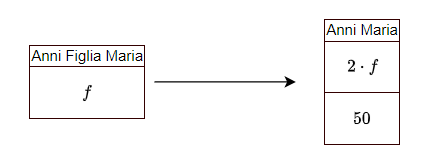
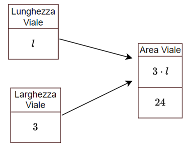
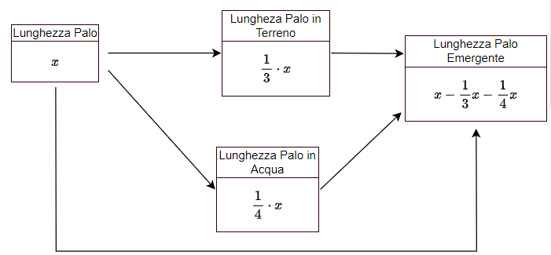

# Problemi di I grado

## UNITA' 1: Problemi ed equazioni: quantità e misure

In questo capitolo vedremo una serie di problemi che si possono risolvere con una equazione di I grado. Vediamo subito un esempio.

#### ESEMPIO 1

Maria ha 50 anni ed ha il doppio degli anni di sua figlia. Quanti anni ha la figlia di Maria?

Questo problema si può risolvere senza fare calcoli particolari, ma analizziamo cosa ci chiede e cosa dobbiamo fare per trovarlo. La prima cosa da individuare è <u>cosa ci chiede di trovare</u>, ossia quale è la **quantità richiesta** soluzione dell'esercizio, in questo caso l'<u>età della figlia di Maria</u>. 

Oltre a questa vediamo che si parla di un'altra quantità, diversa dalla prima, l'<u>età di Maria</u>. 

Tra gli anni della figlia e quelli di Maria c'è una relazione: l'età di Maria è il doppio di quella della figlia (e quelli della figlia è la metà di quella di Maria). Noi non sappiamo quanti anni ha Maria, o la figlia, ma questo fatto ci dice che **una delle due quantità si calcola conoscendo l'altra** ossia che se la figlia ha $20$ anni, Maria ne ha $40$ e se Maria ne ha $60$, la figlia ne avrà $30$: le due quantità sono vincolate ad essere così.

Decidiamo di chiamare gli anni della figlia con una lettera, detta "incognita", diciamo $x$. Allora gli anni di Maria saranno calcolati dall'espressione $2 \cdot x$.

Per completare il ragionamento osserviamo che il problema parla di un altro **fatto**, ci dà un'altra **informazione** che non abbiamo ancora utilizzato: "Maria ha 50 anni". Questo secondo fatto obbliga l'età di Maria ad essere uguale ad un numero specifico: è un vincolo, una **condizione** sull'età di Maria e di conseguenza su quella della figlia. Possono infatti, gli anni della figlia essere uguali a $10$? No, perché il doppio di $10$ non è $50$ (la condizione non è resa vera); possono essere $30$? Nemmeno, perché neanche il doppio di $30$ è $50$. Possono solo essere $25$ ossia la metà di $50$, unico numero possibile per l'età della figlia di Maria.

La traduzione in simboli della condizione è:
$$
50 = 2 \cdot x
$$
Questa è l'"equazione risolutiva del problema", che sarà vera quando $x=\dfrac{50}{2} \longrightarrow 25$. $ \bullet$

Il metodo per risolvere questi problemi si articola in quattro passi:

**PASSO 1: Individuazione delle Quantità**

**PASSO 2: Analisi delle Dipendenze**

**PASSO 3: Individuazione dell'Incognita e Propagazione**

**PASSO 4: Individuazione della Condizione ed Equazione Risolutiva**

Il primo passo è l'individuazione delle quantità nel testo del problema. Dopo aver letto attentamente il problema, tante volte quante sono necessarie per capire cosa dice, ossia quale situazione descrive e cosa ci chiede, bisogna individuare:

1. Quali sono le **quantità** di cui si parla nel testo del problema, sia la quantità richiesta, che tutte le altre;
2. Di quali quantità si conosce anche la **misura** (detta anche **valore noto** o **dato**) e di quali no.

Una quantità non è solo un "numero": la quantità è un concetto, una proprietà quantitativa di qualcosa, come ad esempio l'età di una persona, la lunghezza di una strada, il peso di una porzione di prosciutto, oppure l'importo di un pagamento, l'ammontare di un debito, il prezzo di un prodotto etc.

Il numero che è associato alla quantità è la sua misura, presa utilizzando una **unità di misura**: ad esempio la lunghezza della strada è $60 \;Km$, il peso di una persona è $72 \; Kg$ il prezzo di un oggetto è $\text{\euro} \; 25$; la misura dipende dall'unità con cui misuriamo e può essere **nota**, perché è contenuta nel testo del problema, oppure no.

Alle quantità deve essere dato un nome preciso ed appropriato.

#### ESEMPIO 2

- Nella domanda "**Quanti anni** ha la figlia di Maria?", la quantità richiesta è il "Età (misurata in anni) della figlia di Maria";
- Nella domanda "**Quanti soldi** erano rimasti?", la quantità richiesta è l'"Importo Monetario Rimasto" (misurato in euro);
- Nella domanda "**Quante palline** sono rimaste nella scatola?", la quantità richiesta è la "numerosità" (il numero) di un insieme di oggetti e l'unità di misura è l'"unità" di oggetti coinvolti (unità di palline, unità di oggetti o altro). Le stesse considerazioni vanno fatte per domande come "**Quanti giornali** ha venduto?", "**Quante persone** sono a bordo della macchina ...".
- In "**Trova le dimensioni** del rettangolo", si parla di due quantità, la "Lunghezza della Base" e la "Lunghezza dell'Altezza";
- In "**Quanto tempo** impiegherà Franco a **risparmiare 200 euro**?", si parla di due quantità: "Durata Periodo del Risparmio" e "Importo Risparmiato". Dell'Importo Risparmiato conosciamo anche la misura, $200$ euro, della durata no.
- Nella frase "**Solo i due terzi** della strada erano asfaltati ..." la quantità che vale "due terzi", e che può essere definita "Rapporto tra lunghezza del tratto asfaltato e tutta la strada", è un numero che non ha una unità di misura: è un fattore moltiplicativo di una lunghezza per avere la misura di un'altra lunghezza. I valori che non hanno unità di misura si dicono "**puri**".
- In "**Trova il numero** che diviso per due da 115" si parla di tre quantità che potremmo indicare come il numero richiesto, il numero divisore ed il numero risultato. Nessuno dei tre numeri citati misura una grandezza fisica (come una lunghezza, un peso, una durata o altro), oppure di una grandezza economica (importo monetario, giorni di lavoro etc.), ne una numerosità, ma sono rappresentativi solo di se stessi in quanto numeri interi o razionali. Come nel caso precedente non c'è una unità di misura ed i tre numeri si dicono puri. $ \bullet$

Nella scelta del nome delle quantità, è opportuno utilizzare termini che precisano la loro natura, ossia indicare le somme di denaro come "importi", i periodi di tempo come "durate", le lunghezze come "distanze" o "lunghezze" etc. I pesi, le lunghezze, gli importi, si chiamano **grandezze** (fisiche, economiche etc.), mentre nelle situazioni specifiche indicate nei problemi le chiamiamo **quantità**. 

#### ESEMPIO 3

- Quali quantità sono presenti nella frase seguente? 

​	"Nel suo testamento, una donna ha lasciato 20.000 euro a suo marito e 12.000 euro a suo figlio"

La prima è "Importo Eredità del Marito"; è una quantità monetaria e la sua misura è 20.000 euro. La seconda è "Importo Eredità Figlio" che misura 12.000 euro. Entrambe sono note.

- Di quali quantità si parla nella frase seguente?

  "Una trave di cemento è i due terzi del camion che la trasporta"

Si parla di tre quantità, che potremmo definire: "Lunghezza della Trave", "Lunghezza del Camion", "Rapporto Lunghezze Trave-Camion"; di queste conosciamo la misura (o il valore) solo della terza, e le quantità non sono indipendenti l'una dall'altra, ma la Lunghezza della Trave è uguale alla Lunghezza del Camion per due terzi. $ \bullet$

### ESERCIZIO 1.1 - Quantità e loro misure

a) Quante quantità riesci ad individuare nelle descrizioni seguenti? Scrivi un elenco e dai alle quantità un nome appropriato.

1. Un palo è conficcato nel terreno per un terzo della sua lunghezza e per un quarto è immerso nell’acqua di un fiume. Il fiume è profondo $3 \; m$.
2. Una cassa contiene 140 palline tra nere e bianche. Togliamo $\dfrac{1}{3}$ di quelle nere e $\dfrac{2}{5}$ di quelle bianche e mettiamole in una cesta.
3. Tre sorelle hanno una età complessiva pari a $75$​ anni. La maggiore delle tre ha una età pari ai tre mezzi dell’età della minore delle tre.
4. Due aerei decollano dallo stesso aeroporto nello stesso istante e volano in direzioni opposte. La velocità dell’aereo più veloce è di $100 \; \dfrac{Km}{h}$ superiore a quella del più lento.

b) Quante quantità riesci ad individuare nelle descrizioni seguenti? Scrivi un elenco e dai alle quantità un nome appropriato.

1. La signora Mueller ha investito una somma complessiva di $4000$ euro. Su di una parte ha guadagnato il $4\%$ mentre sulla rimanente ha perso il $3\%$.
2. Giacomo dipinge una parete in $3$ ore. Giovanni fa lo stesso lavoro in $5$ ore. Il primo dipinge la recinzione di un giardino in $12$ ore, il secondo lo fa nel doppio del tempo.

c) Quante quantità riesci ad individuare nelle descrizioni seguenti? Scrivi un elenco e dai alle quantità un nome appropriato.

1. Maria ed Antonio, se mettono insieme i loro risparmi, possiedono 64 euro.
2. Antonio ha 12 euro in più di Maria. 
3. Un padre ha il doppio dell'età del figlio.
4. Abbiamo quattro numeri; il secondo supera di 13 il primo, il terzo supera di 14 il secondo, il quarto supera di 15 il terzo.

## UNITA' 2: Relazioni tra quantità e dipendenze

Le quantità di cui si parla nel testo di un problema non sono tutte indipendenti l'una dalle altre, ma alcune dipendono da altre, ossia **se sappiamo quanto misura una possiamo calcolare quanto misurano le altre**. 

Consideriamo il problema "Maria ha 50 anni ed ha il doppio degli anni di sua figlia. Quanti anni ha la figlia di Maria?" si vede chiaramente che l'età di Maria dipende dall'età della figlia poichè se la figlia ha $25$ anni, Maria ne ha $50$, se la figlia ne ha $30$ Maria ne ha $60$ e così via.

Anche l'età della figlia dipende da quella di Maria, perché se Maria ha $54$ anni, la figlia ne ha la metà, ossia $27$: sta a noi decidere quale quantità dipende da quale, ma una volta deciso, possiamo dividere le quantità di un problema in due parti: le quantità dipendenti e quelle indipendenti.

Vediamo altri esempi.

#### ESEMPIO 1

"Una trave di cemento è i due terzi del camion che la trasporta. E' più lunga la trave o il camion? E se il camion è lungo $15 \; m$​ quanto è lunga la trave?"

Chiamando con $l$ la lunghezza del camion (ad esempio misurata in metri) possiamo dire che la quantità dipendente è la lunghezza della trave e quella indipendente è la lunghezza del camion. 

Possiamo rappresentare graficamente questo con un diagramma:

Si vede chiaramente che la lunghezza della trave dipende da quella del camion e che se il camion, ad esempio è lungo $15 \;m$ la trave è lunga $10 \;m$ e quindi il camion è più lungo della trave. $\bullet$

#### ESEMPIO 2

In una industria ci sono operai ed impiegati; gli operai superano di $1000$ unità il numero degli impiegati. Quali sono le quantità e le loro relazioni?

Le quantità sono "Numero di Impiegati" e "Numero di Operai". Il testo ci dice che il numero di operai dipende dal numero di impiegati perché se gli impiegati sono $100$, gli operai sono $1.000 + 100 = 1.100$,  se gli impiegati sono $600$ gli operai sono $1.000 + 600 = 1.600$ e così via, per cui se gli impiegati sono $x$, gli operai sono $x + 1.000$. Osserviamo che nessuna delle due quantità è nota. $ \bullet$

#### ESEMPIO 3

Maria ha 50 anni ed ha il doppio degli anni di sua figlia.

Indicando con la lettera $f$ il numero degli anni della figlia di Maria, abbiamo la situazione seguente. 

Il diagramma indica che le quantità indipendenti sono l'età della figlia di Maria mentre quelle dipendenti sono l'età di Maria. L'età di Maria risulta calcolata come una espressione che contiene l'età della figlia, ma risulta anche uguale a $50$ anni. $\bullet$

  

#### ESEMPIO 4

Una azienda ha avuto, nell'anno appena trascorso, un utile pari al $20\%$ del fatturato. Quali sono le relazioni tra le quantità?

Nel testo si parla di tre quantità "Fatturato", "Utile" e "Percentuale di Utile (sul Fatturato)". Il testo dice che l'utile, che possiamo indicare con $U$ è il $20\%$ del Fatturato (che indichiamo con $F$, il che ci fa la formula
$$
U = 20\% \cdot F
$$
 Le quantità indipendenti sono "Fatturato" e "Percentuale di Utile", quella dipendente è l'"Utile". 

Un diagramma che rappresenta le dipendenze è il seguente. $ \bullet$

Il diagramma in figura è detto **diagramma delle dipendenze**, perché indica come le quantità, rappresentate dai rettangoli, dipendono tra di loro. Ogni quantità ha un rettangolo con due o più scompartimenti; nel più alti c'è il nome della quantità, e negli altri le espressioni letterali che indicano i modi in cui la quantità si può calcolare o la sua misura nel caso in cui questa sia nota. La freccia entrante indica che la misura della quantità dipende da una o più altre quantità e si calcola in base ad una espressione.

Oltre ai casi in cui la dipendenza si deduce dalle parole del testo, ci sono tanti altri casi in cui la dipendenza reciproca delle quantità in gioco in un problema è scritta in delle **formule**, che riguardano la situazione specifica.

Consideriamo ad esempio il caso di un commerciante che acquista una automobile ad un costo $C$ e la rivende ad un prezzo $R$. L'utile $U$, o guadagno, di questa operazione è calcolato dalla differenza tra ricavo e costo, cioè $U = R - C$. 

Questa formula ci dice che l'utile, il cui valore abbiamo indicato con $U$ dipende dalla quantità $R$ e dalla quantità $C$ e precisamente dalla loro differenza. Questo è un fatto generale: ogni volta che una quantità è uguale ad una espressione dove compaiono altre quantità, **la prima dipende da quelle presenti nell'espressione **. 

Vediamo ad esempio il caso di problemi sulle aree dei rettangoli o problemi economici che riguardano lo sconto, il profitto o gli interessi.

#### ESEMPIO 5

Consideriamo il problema seguente: "Un viale di forma rettangolare, che conduce alla porta di ingresso di una casa, ha un'area di $24 \; m^2$ ed è largo $3$ metri. Trova la lunghezza del viale.". Quale è il diagramma delle dipendenze?

Il testo del problema non indica la relazione tra la larghezza e la lunghezza del viale, ma presuppone che chi legge sappia che l'area $A$ di un rettangolo di lunghezza $l$ e di altezza $h$ si calcola moltiplicando le due quantità secondo la formula seguente:
$$
A = l \cdot h
$$
Come si vede, dalla formula generale, l'area dipende sia dalla lunghezza che dall'altezza del rettangolo, ma nel caso di questo problema, poiché la larghezza del viale è nota, l'area dipende solo dalla lunghezza, come si vede sostituendo i numeri alle lettere:
$$
A = l \cdot 3
$$
In particolare, l'area è il triplo della lunghezza, per cui possiamo scrivere il  diagramma seguente. 

Poiché l'area è anche uguale a $24$ abbiamo che $3 \cdot l$ e $24$ sono uguali, in quanto entrambe misure dell'area del viale. $\bullet$

#### ESEMPIO 6

Un vecchio video game è stato ribassato da $48$ a $18 \; \texteuro$. Quale è il diagramma per il calcolo della percentuale di sconto?

Nel testo di questo problema sono citate tre quantità: prezzo Iniziale, che potremmo indicare con Prezzo di Listino o $P_l$, di cui conosciamo anche la misura, $48$ euro, il Prezzo Scontato o  $Ps$, che è $18$ euro e la percentuale di sconto, che è la quantità richiesta e che possiamo indicare con $s$.

Per risolvere il problema dobbiamo ricordare la formula che definisce la percentuale di sconto come rapporto tra lo sconto (assoluto) $P_l - P_s$, e $P_l$, espressa in percentuale, 
$$
s = \dfrac{P_l-P_s}{P_l}
$$

La percentuale di sconto dipende da due quantità, $P_l$ e $P_s$, che nel caso di questo problema sono tutte e due note. Il diagramma delle dipendenze è quindi il seguente. 

In questo problema tutte le quantità indipendenti sono date e le uniche dipendenti sono lo sconto e la percentuale di sconto, che si possono quindi facilmente calcolare. $\bullet$

 

#### ESEMPIO 7

Uno studente percorre in bicicletta una strada di $20 \; Km$ ad una velocità di $12 \; Km/h$​. Quale è il diagramma delle dipendenze?

Sappiamo che la velocità di un corpo che si muove per una distanza $s$ impiegando un tempo $t$ è data in generale dalla formula:
$$
v = \dfrac{s}{t}
$$
In questo problema specifico, la velocità è nota, per cui la formula diventa:
$$
12 = \dfrac{s}{t}
$$
Moltiplicando entrambi i membri per $t$ otteniamo la formula equivalente:
$$
s = 12 \cdot t
$$
Dalla questa si vede come in questo problema la distanza percorsa dipenda dalla durata del movimento $t$. Sapendo dal problema che la distanza è $12 \; Km$ il diagramma diventa:

Dove si vede chiaramente che l'equazione che risolve il problema è $12 \cdot t = 20$. $\bullet$

#### ESEMPIO 8

Un terzo di un palo è conficcato nel terreno, un quarto è immerso nell’acqua e la lunghezza del palo è completata dalla parte che emerge. Quante sono le quantità e quali sono le relazioni tra di loro?

Le misure delle quantità coinvolte si possono facilmente scrivere facendole dipendere dalla lunghezza del palo, che per semplicità chiamiamo con la lettera $x$, come riportato nella figura. L'ultimo pezzo del palo, la parte che emerge, è uguale a tutto il palo meno la parte in acqua e la parte in terra. $ \bullet$

### ESERCIZIO 2.1 - Relazioni tra quantità

Per ciascuna delle descrizioni seguenti individua le quantità coinvolte, la loro eventuale misura e disegna il diagramma delle dipendenze.

a) Nel suo testamento, una donna ha lasciato 20.000 euro a suo marito e 12.000 euro a suo figlio. Dopo la sua morte, le sue proprietà erano di sole 16.400 euro e la legge divide la proprietà in rapporto al lascito testamentario.  

b) Una cassa contiene 140 palline tra nere e bianche. Togliamo $\dfrac{1}{3}$ di quelle nere e $\dfrac{2}{5}$ di quelle bianche e mettiamole in una cesta.

c) Tre sorelle hanno una età complessiva pari a $75$​ anni. La maggiore delle tre ha una età pari ai tre mezzi dell’età della minore delle tre.

e)  Una somma di 1750 euro deve essere divisa tra due persone e la seconda ha i tre quarti di quanto ha la prima.

## UNITA' 3: Incognite ed equazioni risolutive 

A questo punto bisogna organizzare le dipendenze trovate in modo che tutte le quantità dipendano da **una sola quantità indipendente non nota** (ossia di cui il problema non ci fornisce la misura).

Dopo aver organizzato queste dipendenze, la quantità non nota da cui tutte le altre dipendono viene chiamata con una lettera, detta **incognita**, ed a tutte quelle dipendenti viene associata una espressione letterale che ne fornisce la misura se sapessimo quella della incognita: questo passo è detto propagazione dell'incognita.

A volte la semplice propagazione fornisce la soluzione del problema, come negli esempi seguenti (in cui indichiamo in rosso le espressioni calcolate).

#### ESEMPIO 1

Una trave di cemento è i due terzi del camion che la trasporta e la lunghezza del camion è $18$ metri. Quale è la misura della lunghezza della trave?

Le quantità contenute nel testo sono tre: lunghezza della trave, lunghezza del camion ed il rapporto tra lunghezza di trave e camion. Due quantità sono note e la lunghezza della trave è la quantità richiesta. Quest'ultima dipende dalle prime due. Il tutto è riassunto nel diagramma seguente:

Il calcolo della trave da $18$.

Nel diagramma seguente è indicata l'espressione letterale della dipendenza.

Per trovare la risposta basta propagare i valori: $Sostituisci(\dfrac{2}{3} \cdot l,\{l=18\}) \longrightarrow 12$. $ \bullet$

#### ESEMPIO 2

Un vecchio video game è stato ribassato da $48$ a $18 \; \texteuro$. Quale è la percentuale di sconto?

La formula per risolvere il problema è:
$$
s = \dfrac{P_l-P_s}{P_l}
$$

Il diagramma delle dipendenze con le sole quantità letterali, senza le loro misure è:

La soluzione del problema si ottiene sostituendo i numeri alle lettere: $s = \dfrac{48-18}{48} \cdot 100 \cdot \% \longrightarrow 0,625 \cdot 100\% \longrightarrow 62,5\%$, oppure con GEOGEBRA $Sostituisci(s=\dfrac{P_l-P_s}{P_l},\{P_l=48, P_s=18\}) \longrightarrow s=0,62$ $ \bullet$

Se la quantità richiesta non è stata trovata ed è rimasta incognita, chiamiamo con una lettera, tradizionalmente la $x$, la quantità da cui le altre dipendono, e scriviamo, utilizzando la $x$, le espressioni letterali che calcolano il valore delle altre quantità che dipendono da questa.

#### ESEMPIO 3

Una azienda ha avuto, nell'anno appena trascorso, un fatturato di $2.100.000$ euro ed un utile pari al $20\%$ del fatturato. Quale è il costo sostenuto?

Nel testo si parla di "Fatturato" (la cui misura indichiamo con $R$, ricavato), "Utile" (la cui misura indichiamo con $U$) e "Costo", che indichiamo con $C$. Il testo indica una relazione tra Fatturato ed Utile, che possiamo scrivere come $U = 20\% \cdot R$.

Noi però sappiamo che c'è anche la relazione fondamentale tra $R$, $C$ ed $U$: $U = R - C$; il primo fatto ci consente di calcolare la misura dell'utile specifica per questo problema mentre il secondo ci permette di impostare una espressione per l'utile generale che vale per tutti i problemi, per cui abbiamo il diagramma seguente. $ \bullet$

A questo punto l'ultimo passo da compiere è scrivere una equazione che risolve il problema. Tra tutte quelle nel diagramma, ci sarà una quantità per la quale possiamo individuare ***due espressioni diverse per calcolare la misura***, ad esempio una letterale e l'altra numerica o entrambe letterali. Queste due espressioni dovranno essere ovviamente essere uguali e questa uguaglianza ci fornisce l'***equazione risolutiva*** del problema. La sua soluzione sarà la soluzione del problema. $\bullet$

#### ESEMPIO 4

Maria ha 50 anni ed ha il doppio degli anni di sua figlia. Quanti anni ha la figlia di Maria?

Riprendendo il diagramma dell'esempio precedente, abbiamo la situazione seguente.

Le due espressioni che misurano gli anni di Maria devono essere uguali, cioè vale l'equazione $2 \cdot f = 50$ che implica che gli anni della figlia di Maria sono 25: $Risolvi(2f=50, \{f\}) \longrightarrow f=25$. $ \bullet$

#### ESEMPIO 5

Una trave di cemento è i due terzi del camion che la trasporta e la lunghezza della trave è $18$ metri.

La lunghezza del camion è incognita; se la chiamiamo $x$ abbiamo che la lunghezza della trave si calcola con l'espressione $\dfrac{2}{3} \cdot x$. Ma la lunghezza della trave è anche una quantità nota, per cui abbiamo il diagramma seguente.

Come si vede le due espressioni che misurano la trave devono essere uguali per cui abbiamo l'equazione
$$
\dfrac{2}{3} \cdot x = 18
$$
La cui soluzione è data da $Risolvi(\dfrac{2}{3} \cdot x = 18, \{x\}) \longrightarrow x = 27$ $ \bullet$

#### ESEMPIO 6

In una industria ci sono operai ed impiegati; gli operai superano di $1000$ unità il numero degli impiegati e sono anche il quintuplo degli impiegati. Disegna il diagramma delle dipendenze.

Le quantità presenti sono due, numero degli impiegati e numero degli operai, sono dipendenti tra di loro e ci sono due modi di calcolare il numero di impiegati: sono sia $1000$ in più degli impiegati che cinque volte gli impiegati (se gli impiegati sono $100$, gli operai sono $1.000 + 100 = 1.100$, ma anche $500$, se gli impiegati sono $600$ gli operai sono $1.000 + 600 = 1.600$, ma anche $3000$ e così via. 

Possiamo dire quindi che se gli impiegati sono $x$, l'espressione (letterale) che ci consente di calcolare il numero degli operai è $1000 + x$ ma anche $5 \cdot x$ perché sono anche il quintuplo degli impiegati, quindi il diagramma è il seguente:

L'equazione risolutiva è $x + 1000 = 5x$, che ha soluzione $250$, come si vede da $Risolvi(x+1000=5x,\{x\}) \longrightarrow x = 250$. $ \bullet$

#### ESEMPIO 7

Un terzo di un palo è conficcato nel terreno ed un quarto è immerso nell’acqua. Determina la lunghezza del palo sapendo che la parte che emerge è lunga $5$ metri.

Riprendendo l'esempio precedente, qui si aggiunge il fatto che la misura della parte emergente è $5$ metri. Quindi abbiamo il diagramma seguente

e l'equazione risolutiva è:
$$
x - \dfrac{1}{4}x - \dfrac{1}{3}x = 5
$$
La soluzione è $12$, come si vede da $Risolvi(x - \dfrac{1}{4}x - \dfrac{1}{3}x = 5,\{x\}) \longrightarrow x = 12$. $ \bullet$

### ESERCIZIO 3.1 - Incognite ed equazioni I

a) Trova due numeri sapendo che la loro somma è 18 e che la differenza tra il maggiore ed il minore è 10.

b) Quale è il numero che addizionato alla sua metà ed alla sua terza parte da 33?

c)  Una cassa contiene 140 palline tra nere e bianche. Togliendo 1/3 di quelle nere e 2/5 di quelle bianche si porta il numero delle palline nere ad essere doppio di quello delle palline bianche. Quante erano inizialmente le palline dei due colori? &emsp;  [R. 90 e 50]

d) Due aerei decollano dallo stesso aeroporto nello stesso istante e volano in direzioni opposte. La velocità dell’aereo più veloce è di $100 \;Km/h$ superiore a quella del più lento. Dopo $5$ ore di volo i due distano $2000 \;Km$. Trova la velocità di ciascun aereo. 

e) In una fattoria vi sono tra maiali e galline 45 animali. Quanti sono i maiali e quante le galline sapendo che la somma complessiva delle zampe è 116? 		[R. 32 galline e 13 maiali]

f) Un oggetto è costato 120 euro; poiché si era ottenuto uno sconto del 25%, qual era il costo iniziale dell’oggetto?

### ESERCIZIO 3.2 - Incognite ed equazioni II

Risolvi i problemi seguenti.

a) Un vecchio video game è stato ribassato da 48 a 18€. Quale è la percentuale di sconto? 

b) Maria vende un immobile al prezzo di € 84 000, superiore del 5% rispetto al prezzo che aveva pagato per acquistarlo. Quanto era costato l’immobile?

c) Un supermarket propone una offerta del tipo “prendi 3 e paghi 2” su di un certo tipo di pasta, così che ogni tre pacchi acquistati di pasta ne paga due. Quale è la percentuale di sconto per i clienti che usufruiscono di questa promozione?  Se un altro supermarket fa uno sconto del 40%, quale dei due è più conveniente?

### ESERCIZIO 3.3 - Problemi sull'età
a) Scrivi l'espressione che calcola l’età indicata sulla base dell’età attuale nei casi seguenti.

1. Tra 10 anni se adesso ha $x$ anni;  &emsp;  [R. $x + 10$]
2. 10 anni fa se adesso ha $x$ anni;  &emsp;  [R. $x-10$]
3. Tra $y$ anni se l’età attuale è 40 anni;  &emsp; [R. $x+40$]
4. $y$ anni fa se attualmente ha 40 anni.  &emsp;  [R. $40-y$]

b) Trova l’età di una persona (in anni) in ciascuna delle seguenti situazioni.

1. Tra 5 anni se aveva 20 anni 10 anni fa;
2. Tra $y$ anni se aveva 30 anni 5 anni fa;
3. 5 anni fa se avrà venti anni tra $y$ anni.

c) Risolvi i seguenti problemi.

1. Luca ha $53$ anni e sua figlia ne ha $21$. Fra quanti anni l’età di Luca sarà i $\dfrac{5}{3}$ dell’età di sua figlia?  
2. La differenza fra l’età di Paolo e quella di Marco è di $15$ anni. Quanti anni ha Paolo, sapendo che Marco ne ha il doppio?  
3. Tre sorelle hanno una età complessiva pari a $75$ anni. La maggiore delle tre ha una età pari ai tre mezzi dell’età della minore delle tre. La sorella di mezzo ha cinque anni in meno della sorella maggiore. Quanti anni ha la sorella maggiore?

## UNITA' 4: Problemi su moto e velocità

La velocità misura la rapidità con la quale un fenomeno si manifesta o un processo si svolge.

Se osserviamo il movimento di una automobile su una strada e vediamo che questa percorre, in un certo tempo un certo spazio, ad esempio in $2$ ore percorre $100 \; Km$, possiamo dire che l'automobile ha una velocità di $\dfrac{100}{2} = 50 \; Km/h$​. 

La velocità di un oggetto che si muove è quindi misurata dal rapporto tra la distanza che percorre ed il tempo impiegato a percorrerla.

La formula generale della velocità dice che la velocità di un corpo in movimento (es. una macchina) è uguale al rapporto tra la distanza che la macchina percorre ed il tempo che impiega a percorrerlo:
$$
v = \dfrac{s}{t}
$$
Nella formula generale, la velocità dipende sia da $s$ che da $t$. Se però nei problemi specifici la velocità è fissa ed è nota, ad esempio $20 \; Km/h$, allora la distanza percorsa dipende dalla durata del viaggio.

Se la distanza è fissata e nota, sarà la durata del viaggio che dipende dalla velocità, infatti più la velocità è alta e più si abbassa la durata del viaggio.

#### ESEMPIO 1

Una persona passeggia per un'ora e mezza alla velocità di $6 \; Km/h$​. Quanti chilometri percorre?

Dalla formula generale, esplicitando la $s$, ossia risolvendo come se $s$ fosse l'unica incognita, otteniamo $s = v \cdot t$, cioè $s = 6 \cdot 1,5 \longrightarrow 9 \; Km/h$.

#### ESEMPIO 2

Nel 2009 l’atleta giamaicano Usain Bolt ha corso i 100 metri piani in 9,58 secondi. Quale è stata la sua velocità media in $Km/h$?

Dalla formula otteniamo $v = \dfrac{s}{t}$, cioè $v = \dfrac{100}{9,58} \longrightarrow 10,44 \;m/s$. Per trasformarli in $Km/h$ al posto di $m$ sostituiamo $\dfrac{1}{1000}Km$ ed al posto di $s$ $\dfrac{1}{3600}h$, per cui $10,44 \;m/s \longrightarrow 10,44 \cdot \dfrac{\dfrac{1}{1000}}{\dfrac{1}{3600}} \longrightarrow 10,44 \cdot 3,6 = 37,584 \; Km/h$​.

### ESERCIZIO 4.1 - Problemi sul moto e sulla velocità

a) Due amici partono insieme per allenarsi in bicicletta e decidono di fare un giro della lunghezza di $60 \; Km$. Il primo si allena ogni giorno facendo $30 \; Km$ in un'ora e venti, mentre il secondo fa ogni giorno $20 \; Km$ in $50$ minuti. Chi completerà per primo il giro?

b) Un’automobile entra in autostrada alle $11:07$ e procede alla velocità costante di $100 \;km/h$. Alle $11:15$ una 
seconda automobile supera lo stesso casello e si avvia nella stessa direzione della prima con velocità 
costante di $130 \; km/h$​. 

1. Quanto distano le due macchine quando la seconda macchina entra in autostrada?
2. A che distanza dal casello avviene il sorpasso?
3. A che ora avviene il sorpasso?

### ESERCIZIO 4.2 - Problemi sul moto e sulla velocità

Risolvi i seguenti problemi.

a) Una moto parte da Napoli verso Roma nello stesso istante in cui un’altra moto parte da Roma verso Napoli. La moto da Napoli viaggia ad una velocità di $40 \;Km/h$ mentre l’altra a $20 \;Km/h$. Se la distanza tra le due città è di $150 \;Km$ quanto tempo impiegheranno I due mezzi per incontrarsi e quale distanza avranno percorso?  

b) Un viaggiatore impiega $12$ ore per un tragitto di andata e ritorno, con una velocità di $20 \;Km/h$ per l’andata e $30 \;Km/h$ per il ritorno. Trova la durata (in ore) del tragitto di andata e di quello del ritorno.  

c) Un postino che viaggia a $30 \;Km/h$ è in viaggio da $3$ ore. Un altro postino, inviato per raggiungerlo, viaggia a $50 \;Km/h$. Quanto impiegherà il secondo per raggiungere il primo? Quale distanza coprirà?  

d) Una cisterna viene riempita da un primo rubinetto in $5$ ore. In quante ore viene riempita da un secondo rubinetto se i due rubinetti, aperti insieme, la riempiono in $4$ ore? (Indica con $x$ il numero di ore richiesto e determina la percentuale di cisterna che ogni rubinetto riesce a riempire ogni ora). [R. $20$ ore]

## UNITA' 5: Problemi sulla produttività del lavoro

La produttività (di periodo) di una unità produttiva è data dal rapporto tra la quantità $q$ di beni o servizi prodotti e la durata $t$ del periodo di produzione: $\pi = \dfrac{q}{t}$.

Se abbiamo un gruppo (o squadra) di unità, il prodotto totale della squadra è la somma dei prodotti delle singole componenti della squadra; ad esempio nel caso di due unità $q_1$ e $q_2$ abbiamo:
$$
Q = q_1 + q_2
$$
Esaminiamo due casi distinti:

1. le unità lavorano insieme (per la stessa durata di tempo $t$) ed allora, dividendo per $t$, abbiamo che la produttività totale è la somma delle singole produttività $\pi_1$ e $\pi_2$:
   $$
   \dfrac{Q}{t} = \dfrac{q_1}{t} + \dfrac{q_2}{t}
   $$
   ed indicando con $\Pi = \dfrac{Q}{t}$ scriviamo

$$
\Pi = \pi_1 + \pi_2 \\
$$

2. le unità non lavorano insieme (ossia per la stessa durata di tempo), ma il loro lavoro ha durate diverse, ad esempio $t_1$ e $t_2$; allora dalla somma delle produzioni $q_1 + q_2$, poiché $q_1=\pi_1 \cdot t_1$ e $q_2=\pi_2 \cdot t_2$ abbiamo che:

$$
Q = \pi_1 \cdot t_1 + \pi_2 \cdot t_2
$$

Usando queste formule si possono risolvere dei problemi che riguardano la produttività del lavoro.

#### ESEMPIO 1

Un giardiniere pota un cespuglio in tre quarti d'ora. Quanti cespugli potano tre operai in due ore?

Abbiamo che la produttività di un operaio è
$$
\pi = \dfrac{1}{\dfrac{3}{4}} \longrightarrow \dfrac{4}{3} \cong 1,33
$$
 cespugli l'ora.  In un ora una squadra di tre operai poterà $\Pi_3 = \dfrac{4}{3} \cdot 3 \longrightarrow 4$ cespugli ed in due ore $8$ cespugli. 

#### ESEMPIO 2

Un addetto alle pulizie al mattino riordina, da solo, una camera d'albergo in un'ora e mezza. Quanto impiegherebbe a riordinare un albergo di $20$ camere una squadra di 5 addetti?

In forma di frazione un'ora e mezza misura $1,5 = \dfrac{3}{2}$, per cui la produttività di un solo operaio, un camere l'ora, è
$$
\pi = \dfrac{1}{\dfrac{3}{2}} \longrightarrow \dfrac{2}{3}
$$
La produttività della squadra è $\Pi_5 = 5 \cdot \dfrac{2}{3} \longrightarrow \dfrac{10}{3}$ ed il tempo impiegato per tutto l'albergo è $t = \dfrac{20}{\Pi_5} \longrightarrow 20 \dfrac{3}{10} \longrightarrow 6 \;h$.

#### ESEMPIO 3

Giacomo dipinge una parete in $3$ ore. Giovanni fa lo stesso lavoro in $5$ ore. Quanto impiegherebbero se lavorassero insieme?

Il prodotto di Giacomo è una parete; il tempo è $3$ ore e la sua produttività $\pi_1=\dfrac{1}{3}$ di parete l'ora. Analogamente per Giovanni abbiamo $\pi_2=\dfrac{1}{5}$ di parete l'ora. Insieme costituiscono un gruppo che deve produrre lo stesso prodotto (la stessa parete) in un tempo $t$ con una produttività di gruppo che è la somma delle due, cioè $\Pi = \dfrac{1}{3} + \dfrac{1}{5} \longrightarrow \dfrac{8}{15}$​.

La somma delle produttività deve essere uguale alla produttività del gruppo, per cui abbiamo l'equazione $\dfrac{1}{t}=\dfrac{8}{15}$, che ha soluzione $\dfrac{15}{8}$, ossia $1,8$ ore ($Risolvi(\dfrac{1}{t}=\dfrac{8}{15}, \{t\}) \longrightarrow t=\dfrac{8}{15}). $ $\bullet$

### ESERCIZIO 5.1 - Problemi sul lavoro I

a) Sei operaie confezionano $120$ paia di guanti in $20$ giorni. Quanti giorni occorrono a $3$ operaie per confezionare $30$ paia di guanti dello stesso tipo? [R. $10$].

b) In $20$ giorni $16$ operai costruiscono un prefabbricato; in quanti giorni farebbero lo stesso lavoro $12$ operai? E se i $12$ operai ci mettessero $a$ giorni, quanto ci metterebbero $16$ operai?  [R. $\dfrac{4}{3} a$]  

c) Lavorando insieme, la stampante $A$ e la stampante $B$ finirebbero il compito in $24$ minuti. La stampante $A$ da sola finirebbe la stampa in $60$ minuti. Quante pagine dovrebbero essere stampate se la stampante $B$ stampa $5$ pagine al minuto in più rispetto ad $A$?  

### ESERCIZIO 5.2 - Problemi sul lavoro II
Risolvi i seguenti problemi.

a) In una fabbrica ci sono $2$ macchine, la prima produce $10$ pezzi all’ora, la seconda $7$ pezzi all’ora.
Le due macchine hanno prodotto in tutto $191$ pezzi lavorando complessivamente $23$ ore. Determina il numero dei pezzi prodotti dall’una e dall’altra macchina.  

b) I dipendenti di una azienda ricevono uno stipendio medio mensile di $\text{\euro}\; 1300$. Poiché l’azienda aumenta la produzione, vengono assunti nuovi dipendenti pari al $14\%$ del personale e viene concesso un aumento di stipendio del $4\%$ a tutti. Se mensilmente l’azienda spende ora $231.192$ euro, quanti erano inizialmente i dipendenti? [R. $150$].

## UNITA' 6: Problemi su interesse ed investimenti

### ESERCIZIO 6.1 - Problemi su interesse ed investimenti I
a) Scrivi l’espressione che rappresenta l’interesse maturato in un anno da ogni capitale e semplificala nelle situazioni seguenti.

1. $2.000$ € al $5\%$; &emsp; [R. $\text{100€}$]
2. $x + 200$ €  al $6\%$;   &emsp;   [R. $12 + 0,06x$ €]
3. $x$ € al $5\%$ più $2x$ € al 5%; &emsp;   [R. $\dfrac{3}{20}x$ €]
4. $x$ € al $3\%$ e $2x\;—\;400$ € al $6\%$;
5. $x$ € al $7\%$, $2x$ € al $5\%$ e  $0.07x$ € al $3\%$.

### ESERCIZIO 6.2 - Problemi su interesse ed investimenti II
Risolvi i seguenti problemi.

a) La signora Mueller ha investito una somma complessiva di $4.000$ euro. Su di una parte ha guadagnato il $4\%$ mentre sulla rimanente ha perso il $3\%$. Sommando guadagni e perdite il suo reddito dell’anno è stato di $55$ euro. Trova l’ammontare dei due capitali. [R. $2.500$, $1.500$]  

b) Il signor Black ha investito $3.000$ euro al tasso del $3\%$ e $1.000$ euro al tasso del $4\%$. Quanto deve investire al tasso del $6\%$ in modo che il suo ricavato annuo sia del $5\%$ dell’intero investimento?

c) Il signor Wong ha investito due somme di denaro che stanno tra di loro nel rapporto di $5$ a $3$. La prima somma è stata investita al tasso del $4\%$ e la seconda al tasso del $2\%$. L’interesse annuale della prima eccede quello della seconda di $112$ euro. Quali sono stati i due investimenti? [R. $4.000$, $2.400$]  

## UNITA' 7: Problemi su monete e miscele

### ESERCIZIO 7.1 - Problemi sulle monete
Trova il valore complessivo di monete e francobolli nei casi seguenti:

a) 3 centesimi e 5 pezzi da 10 centesimi (in centesimi);  

b) 3 centesimi e 5 pezzi da 10 centesimi (in euro);  

c) q monete da 25 centesimi 7 centesimi (in centesimi).

### ESERCIZIO 7.2 - Problemi sulle miscele
a) Scrivi l’espressione del valore totale della merce in euro al chilo e semplifica (ricorda di trasformare tutte le quantità nella stessa unità di misura).

1. 3 Kg di te al costo di un euro e cinquanta l’etto;
2. $n$ Kg di caffè del costo di 90¢ l’etto;
3. $n + 3$ Kg di caffè del costo di 1,05€ il Kg;
4. $n$ Kg al costo di 1,75€ al Kg;  

b) Scrivi l’espressione del valore totale della merce in centesimi e semplifica

1. $n$ francobolli del costo di ¢ 35 ciascuno;
2. $20 \:–\; n$ francobolli del costo di ¢ 50 l’uno;
3. $x$ dozzine di matite del valore di ¢ 20 l’una;
4. 3 dozzine di matite a ¢ 60 la dozzina.

c) Un venditore di caffè ha creato una miscela di due caffè del valore rispettivamente di 0,23 e 1,20 euro al Kg.  
La miscela di 30 Kg ha un valore di 1,02 euro al Kg. Quanti Kg di ciascun caffè ha utilizzato?

### ESERCIZIO 7.3 - Problemi vari
Risolvi i seguenti problemi.

a) Un mattone pesa un chilo più mezzo mattone: quanto pesa il mattone?  

b) Una botte contiene 80 litri di vino che vengono versati in 44 bottiglie, parte da 2 litri e parte da 1 litro e mezzo. Quante sono le bottiglie da 1 litro e mezzo e quante quelle da 2 litri? [R. 16 e 28]  

c) Un treno parte completo dalla stazione A; alla stazione B scendono 42 passeggeri e ne salgono 1/24 di quelli rimasti; nella successiva stazione C scendono 75 passeggeri e ne salgono 3/5 di quelli rimasti più altri 2. Sapendo che alla partenza da C il treno e di nuovo completo, determina quanti passeggeri stanno sul treno. [R. 282]  

d) Per l’ingresso a uno spettacolo, ogni adulto paga 5 euro in più rispetto a un bambino. Determina il prezzo del biglietto ridotto sapendo che 20 bambini e 30 adulti pagano 15 euro di meno di quello che pagano 40 bambini e 15 adulti. [R. 18 euro]

e) Una azienda ha acquistato degli omaggi per i suoi clienti, in totale 500, spendendo in tutto 4500 euro. Per chi è cliente da più di un anno si è speso in media 10 euro, per chi da meno di un anno 5 euro. Quanti sono i soggetti clienti da più di un anno?