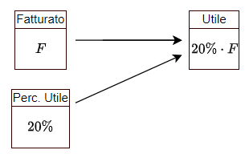
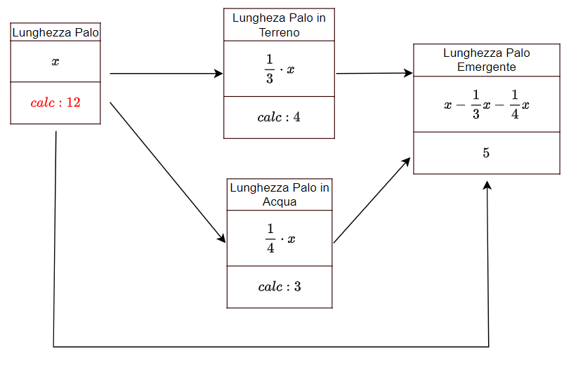

# Problemi di I grado

## UNITA' 1: Problemi ed equazioni: quantità e misure

In questo capitolo vedremo una serie di problemi che si possono risolvere con una equazione di I grado. Vediamo subito un esempio.

#### ESEMPIO 1

Maria ha 50 anni ed ha il doppio degli anni di sua figlia. Quanti anni ha la figlia di Maria?

Questo problema si può risolvere senza fare calcoli particolari, ma analizziamo cosa ci chiede e cosa dobbiamo fare per trovarlo. La prima cosa da individuare è <u>cosa ci chiede di trovare</u>, ossia quale è la **quantità richiesta** soluzione dell'esercizio, in questo caso gli <u>anni della figlia di Maria</u>. 

Oltre a questa vediamo che si parla di un'altra quantità, diversa dalla prima, gli <u>anni di Maria</u>. 

Tra gli anni della figlia e quelli di Maria c'è una relazione: gli anni di Maria sono il doppio di quelli della figlia (e quelli della figlia sono la metà di quelli di Maria). Noi non sappiamo quanti anni ha Maria, o la figlia, ma questo fatto ci dice che **una delle due quantità si calcola conoscendo l'altra** ossia che se la figlia ha $20$ anni, Maria ne ha $40$ e se Maria ne ha $60$, la figlia ne avrà $30$: le due quantità sono vincolate ad essere così.

Decidiamo di chiamare gli anni della figlia con una lettera, detta "incognita", diciamo $x$. Allora gli anni di Maria saranno calcolati dall'espressione $2 \cdot x$.

Per completare il ragionamento osserviamo che il problema parla di un altro **fatto**, ci dà un'altra **informazione** che non abbiamo ancora utilizzato: "Maria ha 50 anni". Questo secondo fatto obbliga gli anni di Maria ad essere uguali ad un numero specifico: è un vincolo, una **condizione** sugli anni di Maria e di conseguenza su quelli della figlia. Possono infatti, gli anni della figlia essere uguali a $10$? No, perché il doppio di $10$ non è $50$ (la condizione non è resa vera); possono essere $30$? Nemmeno, perché neanche il doppio di $30$ è $50$. Possono solo essere $25$ ossia la metà di $50$, unico numero possibile per l'età della figlia di Maria.

La traduzione in simboli della condizione è:
$$
50 = 2 \cdot x
$$
Questa è l'"equazione risolutiva del problema", che sarà vera quando $x=\dfrac{50}{2} \longrightarrow 25$. $ \bullet$

Il metodo per risolvere questi problemi si articola in quattro passi:

**PASSO 1: Quantità**

**PASSO 2: Relazioni**

**PASSO 3: Incognita**

**PASSO 4: Condizione**

Il primo passo è l'individuazione delle quantità nel testo del problema. Dopo aver letto attentamente il problema, tante volte quante sono necessarie per capire cosa dice, ossia quale situazione descrive e cosa ci chiede, bisogna individuare:

1. Quali sono le **quantità** di cui si parla nel testo del problema, sia la quantità richiesta, che tutte le altre;
2. Di quali quantità si conosce anche la **misura** (detta anche **valore noto** o **dato**) e di quali no.

Una quantità non è solo un "numero": la quantità è un concetto, una proprietà quantitativa di qualcosa, come ad esempio la lunghezza di una strada, la lunghezza dei lati di un rettangolo, il peso di una persona, di un etto e mezzo di prosciutto, oppure l'importo di un pagamento, l'ammontare di un debito, il prezzo di un prodotto etc.

Il numero che è associato alla quantità è la sua misura, ad esempio la lunghezza della strada è $60 \;Km$, il peso di una persona è $72 \; Kg$ il prezzo di un oggetto è $\text{\euro} \; 25$; la misura dipende dall'unità con cui misuriamo e può essere **nota**, perché è contenuta nel testo del problema, oppure no.

Alle quantità deve essere dato un nome preciso ed appropriato.

#### ESEMPIO 2

- Nella domanda "**Quanti anni** ha la figlia di Maria?", la quantità richiesta è il "Età (anni) della figlia di Maria";
- Nella domanda "**Quanti giornali** ha venduto?", la quantità richiesta è il "Numero di Copie Vendute";
- Nella domanda "**Quanti soldi** erano rimasti?", la quantità richiesta è l'"Importo Monetario Rimasto";
- In "**Trova le dimensioni** del rettangolo", si parla di due quantità, la "Lunghezza della Base" e la "Lunghezza dell'Altezza";
- In "**Quanto tempo** impiegherà Franco a **risparmiare 200 euro**?", si parla di due quantità: "Durata Periodo del Risparmio" e "Importo Risparmiato". Dell'Importo Risparmiato conosciamo anche la misura, $200$ euro, della durata no.

Come si vede, le somme di denaro vengono indicate come "importi", i periodi di tempo come "durate", poi abbiamo le lunghezze, i pesi eccetera. In generale il peso, la lunghezza, l'importo, si chiamano **grandezze**, mentre nelle situazioni specifiche indicate nei problemi le chiamiamo quantità. $ \bullet$

#### ESEMPIO 3

- Quali quantità sono presenti nella frase seguente? 

​	"Nel suo testamento, una donna ha lasciato 20.000 euro a suo marito e 12.000 euro a suo figlio"

La prima è l'"Importo Eredità del Marito"; è una quantità monetaria e la sua misura è 20.000 euro. La seconda è l'"Importo Eredità Figlio" che misura 12.000 euro. Tutte le quantità sono note.

- Di quali quantità si parla nella frase seguente?

  "Una trave di cemento è i due terzi del camion che la trasporta"

Si parla di tre quantità, che potremmo definire: "Lunghezza della Trave", "Lunghezza del Camion", "Rapporto Lunghezze Trave-Camion"; di queste conosciamo la misura (o il valore) solo della terza, e le quantità non sono indipendenti l'una dall'altra, ma la Lunghezza della Trave è uguale alla Lunghezza del Camion per due terzi. $ \bullet$

### ESERCIZIO 1.1 - Quantità e loro misure

a) Quante quantità riesci ad individuare nelle descrizioni seguenti? Scrivi un elenco e dai alle quantità un nome appropriato.

1. Un palo è conficcato nel terreno per un terzo della sua lunghezza e per un quarto è immerso nell’acqua di un fiume. Il fiume è profondo $3 \; m$.
2. Una cassa contiene 140 palline tra nere e bianche. Togliamo $\dfrac{1}{3}$ di quelle nere e $\dfrac{2}{5}$ di quelle bianche e mettiamole in una cesta.
3. Tre sorelle hanno una età complessiva pari a $75$​ anni. La maggiore delle tre ha una età pari ai tre mezzi dell’età della minore delle tre.
4. Due aerei decollano dallo stesso aeroporto nello stesso istante e volano in direzioni opposte. La velocità dell’aereo più veloce è di $100 \; \dfrac{Km}{h}$ superiore a quella del più lento.

b) Quante quantità riesci ad individuare nelle descrizioni seguenti? Scrivi un elenco e dai alle quantità un nome appropriato.

1. La signora Mueller ha investito una somma complessiva di $4000$ euro. Su di una parte ha guadagnato il $4\%$ mentre sulla rimanente ha perso il $3\%$.
2. Giacomo dipinge una parete in $3$ ore. Giovanni fa lo stesso lavoro in $5$ ore. Il primo dipinge la recinzione di un giardino in $12$ ore, il secondo lo fa nel doppio del tempo.

c) Quante quantità riesci ad individuare nelle descrizioni seguenti? Scrivi un elenco e dai alle quantità un nome appropriato.

1. Maria ed Antonio, se mettono insieme i loro risparmi, possiedono 64 euro.
2. Antonio ha 12 euro in più di Maria. 
3. Un padre ha il doppio dell'età del figlio.
4. Abbiamo quattro numeri; il secondo supera di 13 il primo, il terzo supera di 14 il secondo, il quarto supera di 15 il terzo.

## UNITA' 2: Relazioni tra quantità

Le quantità di cui si parla nel testo di un problema non sono indipendenti l'una dalle altre, ossia se sappiamo quanto misura una possiamo calcolare quanto misurano le altre. Facciamo alcuni esempi.

#### ESEMPIO 1

"Una trave di cemento è i due terzi del camion che la trasporta. E' più lunga la trave o il camion? E se il camion è lungo $15 \; m$ quanto è lunga la trave?"

Si vede chiaramente che la lunghezza della trave dipende da quella del camion e che se il camion, ad esempio è lungo $15 \;m$ la trave è lunga $10 \;m$ e quindi è più lungo il camion.$ \bullet$​

#### ESEMPIO 2

In una industria ci sono operai ed impiegati; gli operai superano di $1000$ unità il numero degli impiegati. Quali sono le quantità e le loro relazioni?

Abbiamo "Numero di Impiegati" e "Numero di Operai". Le due non sono "indipendenti", cioè se ne conosciamo una l'altra la troviamo facilmente, perché se gli impiegati sono $100$, gli operai sono $1.000 + 100 = 1.100$,  se gli impiegati sono $600$ gli operai sono $1.000 + 600 = 1.600$ e così via, per cui se gli impiegati sono $x$, gli operai sono $x + 1.000$. Osserviamo che nessuna delle due quantità è nota. $ \bullet$

Il diagramma in figura è detto diagramma delle dipendenze, perché indica come le quantità, rappresentate dai rettangoli, dipendono tra di loro. Ogni quantità ha un rettangolo con due o più scompartimenti; nel più alti c'è il nome della quantità, e negli altri le espressioni letterali che indicano i modi in cui la quantità si può calcolare o la sua misura nel caso sia una quantità nota. Se il rettangolo ha una freccia entrante vuol dire che la misura della quantità dipende da un'altra quantità e si calcola in base ad una espressione. 

Se una quantità ha più espressioni/numeri che ne determinano il valore questi devono essere tutti uguali tra di loro. 

#### ESEMPIO 3

Una azienda ha avuto, nell'anno appena trascorso, un fatturato di $2.100.000$ euro ed un utile pari al $20\%$ del fatturato. Quali sono le relazioni tra le quantità?

Nel testo si parla di due quantità, "Fatturato" ed "Utile", ed una relazione tra di loro. Solo il fatturato è noto.

Nel rettangolo del Fatturato abbiamo che $x = 2.100.000$ per cui in quello dell'Utile $20\% \cdot x,\{x=2.100.000\} \longrightarrow 20\% \cdot 2.100.000 \longrightarrow 420.000$. $ \bullet$

#### ESEMPIO 4

Un terzo di un palo è conficcato nel terreno, un quarto è immerso nell’acqua e la lunghezza del palo è completata dalla parte che emerge. Quante sono le quantità e quali sono le relazioni tra di loro?

Le misure delle quantità coinvolte sono espresse in relazione alla lunghezza del palo come riportato nella figura. L'ultimo pezzo del palo, la parte che emerge, è uguale a tutto il palo meno la parte in acqua e la parte in terra. $ \bullet$

#### ESEMPIO 5

Un vecchio video game è stato ribassato da $48$ a $18 \; \texteuro$. Quale è il diagramma per il calcolo della percentuale di sconto?

Nel testo di questo problema sono citate tre quantità: prezzo Iniziale, che potremmo indicare con Prezzo Listino o $P_l$, di cui conosciamo anche la misura, $48$ euro, Prezzo Scontato o  $Ps$, che è $18$ euro. Ci viene chiesta la percentuale di sconto, che possiamo indicare con $s\%$. Per risolverlo dobbiamo ricordare la definizione di percentuale di sconto che è il rapporto tra una quarta quantità, lo sconto $P_l - P_s$ e $P_l$, espressa in percentuale, 
$$
s\% = \dfrac{P_l-P_s}{P_l}
$$

Il diagramma delle dipendenze è quindi il seguente. $ \bullet$

### ESERCIZIO 2.1 - Relazioni tra quantità

Per ciascuna delle descrizioni seguenti individua le quantità coinvolte, la loro eventuale misura e disegna il diagramma delle dipendenze.

a) Nel suo testamento, una donna ha lasciato 20.000 euro a suo marito e 12.000 euro a suo figlio. Dopo la sua morte, le sue proprietà erano di sole 16.400 euro e la legge divide la proprietà in rapporto al lascito testamentario.  

b) Una cassa contiene 140 palline tra nere e bianche. Togliamo $\dfrac{1}{3}$ di quelle nere e $\dfrac{2}{5}$ di quelle bianche e mettiamole in una cesta.

c) Tre sorelle hanno una età complessiva pari a $75$​ anni. La maggiore delle tre ha una età pari ai tre mezzi dell’età della minore delle tre.

e)  Una somma di 1750 euro deve essere divisa tra due persone e la seconda ha i tre quarti di quanto ha la prima.

## UNITA' 3: Incognite ed Equazioni

#### ESEMPIO 1

Una trave di cemento è i due terzi del camion che la trasporta e la lunghezza del camion è $18$ metri. Quale è la misura della lunghezza della trave?

Abbiamo che $\text{Lunghezza Trave} : Sostituisci(\dfrac{2}{3} \cdot x, \{x = 18\}) \longrightarrow \dfrac{2}{3} \cdot 18 \longrightarrow 12$. $ \bullet$

#### ESEMPIO 2

Una trave di cemento è i due terzi del camion che la trasporta e la lunghezza della trave è $18$ metri. Quanto è lungo il camion?

Come nel problema precedente, ma stavolta il vincolo è che la lunghezza della trave è $18 \;m$ per cui l'equazione è $\dfrac{2}{3} \cdot x = 18$. 

La soluzione è quindi $\text{Lunghezza Camion} : Risolvi(\dfrac{2}{3} \cdot x = 18, \{x\}) \longrightarrow 27$. $ \bullet$

#### ESEMPIO 3

Una azienda ha avuto, nell'anno appena trascorso, un fatturato di $2.100.000$ euro ed un utile pari al $20\%$ del fatturato. Se indichiamo con $x$ la misura del costo sostenuto, quale è il diagramma delle dipendenze?

Nel testo si parla di "Fatturato", "Utile", "Costo", ed una relazione tra di loro.
Per cui  $\text{Utile}= 20 \% \cdot \text{Fatturato}$, ma sappiamo anche che $\text{Utile} = \text{Fatturato} -\text{Costo}$. Il primo fatto ci consente di calcolare la misura dell'utile specifica pere questo problema ($e_2)$, mentre il secondo ci permette di impostare una espressione per l'utile $(e_1)$ generale che vale per tutti i problemi, per cui abbiamo il diagramma seguente:

Le due espressioni devono essere uguali per cui abbiamo l'equazione:
$$
2.100.000 - C = 20\% \cdot 2.100.000
$$
che ha soluzione $Risolvi(2.100.000 - C = 20 \cdot \dfrac{1}{100} \cdot 2.100.000, \{C\}) \longrightarrow C=1.680.000$. $ \bullet$

#### ESEMPIO 4

In una industria ci sono operai ed impiegati; gli operai superano di $1000$ unità il numero degli impiegati e sono anche il quintuplo degli impiegati. Disegna il diagramma delle dipendenze.

Le quantità presenti sono due, numero degli impiegati e numero degli operai, sono dipendenti tra di loro e ci sono due modi di calcolare il numero di impiegati: sono sia $1000$ in più degli impiegati che cinque volte gli impiegati (se gli impiegati sono $100$, gli operai sono $1.000 + 100 = 1.100$, ma anche $500$, se gli impiegati sono $600$ gli operai sono $1.000 + 600 = 1.600$, ma anche $3000$ e così via. 

Possiamo dire quindi che se gli impiegati sono $x$, l'espressione (letterale) che ci consente di calcolare il numero degli operai è $1000 + x$ ma anche $5 \cdot x$ perché sono anche il quintuplo degli impiegati, quindi il diagramma è il seguente:

L'equazione risolutiva è $x + 1000 = 5x$, che ha soluzione $250$. $ \bullet$

#### ESEMPIO 5

Un terzo di un palo è conficcato nel terreno ed un quarto è immerso nell’acqua. Determina la lunghezza del palo sapendo che la parte che emerge è lunga $5$ metri.

Riprendendo l'esempio precedente, qui si aggiunge il fatto che la misura della parte emergente è $5$ metri. Quindi abbiamo il diagramma seguente

e l'equazione risolutiva è:
$$
x - \dfrac{1}{4}x - \dfrac{1}{3}x = 5
$$
La soluzione è $12$. $ \bullet$

#### ESEMPIO 6

Un vecchio video game è stato ribassato da $48$ a $18 \; \texteuro$. Quale è la percentuale di sconto?

Per risolvere il problema basta propagare i valori.
$$
s\% = \dfrac{P_l-P_s}{P_l}
$$

Sostituendo i numeri alle lettere otteniamo $s\% = \dfrac{48-18}{48} \cdot 100 \cdot \% \longrightarrow 0,625 \cdot 100\% \longrightarrow 62,5\%$. $ \bullet$

### ESERCIZIO 3.1 - Problemi sulla rappresentazione dell'età I

a) Scrivi l'espressione che calcola l’età indicata sulla base dell’età attuale nei casi seguenti.

1. Tra 10 anni se adesso ha $x$ anni;  &emsp;  [R. $x + 10$]
2. 10 anni fa se adesso ha $x$ anni;  &emsp;  [R. $x-10$]
3. Tra $y$ anni se l’età attuale è 40 anni;  &emsp; [R. $x+40$]
4. $y$ anni fa se attualmente ha 40 anni.  &emsp;  [R. $40-y$]

f) Trova l’età di una persona (in anni) in ciascuna delle seguenti situazioni.

1. Tra 5 anni se aveva 20 anni 10 anni fa;
2. Tra $y$ anni se aveva 30 anni 5 anni fa;
3. 5 anni fa se avrà venti anni tra $y$ anni.

### ESERCIZIO 3.2 - Problemi su sconti e percentuali

Risolvi i problemi seguenti.

a) Un vecchio video game è stato ribassato da 48 a 18€. Quale è la percentuale di sconto?  

b) Un oggetto è costato 120 euro; poiché si era ottenuto uno sconto del 25%, qual era il costo iniziale dell’oggetto?  

c) Un supermarket propone una offerta del tipo “prendi 3 e paghi 2” su di un certo tipo di pasta, così che ogni tre pacchi acquistati di pasta ne paga due. Quale è la percentuale di sconto per i clienti che usufruiscono di questa promozione?  Se un altro supermarket fa uno sconto del 40%, quale dei due è più conveniente?

d) Maria vende un immobile al prezzo di € 84 000, superiore del 5% rispetto al prezzo che aveva pagato per acquistarlo. Quanto era costato l’immobile?

### ESERCIZIO 3.3 - Problemi sull'età
Risolvi i seguenti problemi.

a) Luca ha $53$ anni e sua figlia ne ha $21$. Fra quanti anni l’età di Luca sarà i $\dfrac{5}{3}$ dell’età di sua figlia?  

b) La differenza fra l’età di Paolo e quella di Marco è di $15$ anni. Quanti anni ha Paolo, sapendo che Marco ne ha il doppio?  

c) Tre sorelle hanno una età complessiva pari a $75$ anni. La maggiore delle tre ha una età pari ai tre mezzi dell’età della minore delle tre. La sorella di mezzo ha cinque anni in meno della sorella maggiore. Quanti anni ha la sorella maggiore?

## UNITA' 5: Problemi sulla produttività del lavoro

La produttività (di periodo) di una unità produttiva è data dal rapporto tra la quantità $q$ di beni/servizi prodotti dall'unità e la durata $t$ del periodo di produzione: $\pi = \dfrac{q}{t}$.

Se abbiamo un gruppo (o squadra) di unità, il prodotto totale della squadra è la somma dei prodotti, nel caso di due unità $q_1$ e $q_2$, dei singoli.
$$
Q = q_1 + q_2
$$
Abbiamo due casi:

1. le unità lavorano insieme (per la stessa durata di tempo $t$) ed allora, dividendo per $t$, abbiamo che la produttività totale è la somma delle singole produttività $\pi_1$ e $\pi_2$:

$$
\Pi = \pi_1 + \pi_2 \\
$$

2. le unità non lavorano in squadra (ossia per la stessa durata di tempo), ma per tempi diversi, ad esempio $t_1$ e $t_2$; allora dalla somma delle produzioni, poiché $q_1=\pi_1 \cdot t_1$ e $q_2=\pi_2 \cdot t_2$ abbiamo che:

$$
Q = \pi_1 \cdot t_1 + \pi_2 \cdot t_2
$$

Usando queste formule si possono risolvere dei problemi che riguardano la produttività del lavoro.

#### ESEMPIO 1

Giacomo dipinge una parete in $3$ ore. Giovanni fa lo stesso lavoro in $5$ ore. Quanto impiegherebbero se lavorassero insieme?

Il prodotto di Giacomo è una parete; il tempo è $3$ ore e la sua produttività $\pi_1=\dfrac{1}{3}$ di parete l'ora. Analogamente per Giovanni abbiamo $\pi_2=\dfrac{1}{5}$ di parete l'ora. Insieme costituiscono un gruppo che deve produrre lo stesso prodotto (la stessa parete) in un tempo $t$ con una produttività di gruppo che è la somma delle due, cioè $\Pi = \dfrac{1}{3} + \dfrac{1}{5} \longrightarrow \dfrac{8}{15}$​.

La somma delle produttività deve essere uguale alla produttività del gruppo, per cui l'equazione è $\dfrac{1}{t}=\dfrac{8}{15}$, che ha soluzione $\dfrac{15}{8}$, ossia $1,8$ ore. $ \bullet$

### ESERCIZIO 5.1 - Problemi sul lavoro I

a) Lavorando insieme, la stampante $A$ e la stampante $B$ finirebbero il compito in $24$ minuti. La stampante $A$ da sola finirebbe la stampa in $60$ minuti. Quante pagine dovrebbero essere stampate se la stampante $B$ stampa $5$ pagine al minuto in più rispetto ad $A$?  

b) In $a$ giorni $16$ operai costruiscono un prefabbricato; in quanti giorni farebbero lo stesso lavoro $12$ operai? [R. $\dfrac{4}{3} a$]  

c) Sei operaie confezionano $120$ paia di guanti in $20$ giorni. Quanti giorni occorrono a $3$ operaie per confezionare $30$ paia di guanti dello stesso tipo? [R. $10$].

### ESERCIZIO 5.2 - Problemi sul lavoro II
Risolvi i seguenti problemi.

a) In una fabbrica ci sono $2$ macchine, la prima produce $10$ pezzi all’ora, la seconda $7$ pezzi all’ora.
Le due macchine hanno prodotto in tutto $191$ pezzi lavorando complessivamente $23$ ore. Determina il numero dei pezzi prodotti dall’una e dall’altra macchina.  

b) I dipendenti di una azienda ricevono uno stipendio medio mensile di $\text{\euro}\; 1300$. Poiché l’azienda aumenta la produzione, vengono assunti nuovi dipendenti pari al $14\%$ del personale e viene concesso un aumento di stipendio del $4\%$ a tutti. Se mensilmente l’azienda spende ora $231.192$ euro, quanti erano inizialmente i dipendenti? [R. $150$]

## UNITA' 6: Problemi su moto e velocità

### ESERCIZIO 6.1 - Problemi sul moto e sulla velocità
Risolvi i seguenti problemi.

a) Due aerei decollano dallo stesso aeroporto nello stesso istante e volano in direzioni opposte. La velocità dell’aereo più veloce è di $100 \;Km/h$ superiore a quella del più lento. Dopo $5$ ore di volo i due distano $2000 \;Km$. Trova la velocità di ciascun aereo.  

b) Una moto parte da Napoli verso Roma nello stesso istante in cui un’altra moto parte da Roma verso Napoli. La moto da Napoli viaggia ad una velocità di $40 \;Km/h$ mentre l’altra a $20 \;Km/h$. Se la distanza tra le due città è di $150 \;Km$ quanto tempo impiegheranno I due mezzi per incontrarsi e quale distanza avranno percorso?  

c) Un viaggiatore impiega $12$ ore per un tragitto di andata e ritorno, con una velocità di $20 \;Km/h$ per l’andata e $30 \;Km/h$ per il ritorno. Trova la durata (in ore) del tragitto di andata e di quello del ritorno.  

d) Un postino che viaggia a $30 \;Km/h$ è in viaggio da $3$ ore. Un altro postino, inviato per raggiungerlo, viaggia a $50 \;Km/h$. Quanto impiegherà il secondo per raggiungere il primo? Quale distanza coprirà?  

e) Una cisterna viene riempita da un primo rubinetto in $5$ ore. In quante ore viene riempita da un secondo rubinetto se i due rubinetti, aperti insieme, la riempiono in $4$ ore? (Indica con $x$ il numero di ore richiesto e determina la percentuale di cisterna che ogni rubinetto riesce a riempire ogni ora). [R. $20$ ore]

## UNITA' 7: Problemi su interesse ed investimenti

### ESERCIZIO 7.1 - Problemi su interesse ed investimenti I
a) Scrivi l’espressione che rappresenta l’interesse maturato in un anno da ogni capitale e semplificala nelle situazioni seguenti.

1. $2.000$ € al $5\%$; &emsp; [R. $\text{100€}$]
2. $C + 200$ €  al $6\%$;   &emsp;   [R. $12 + 0,06C$ €]
3. $C$ € al $5\%$ più $2C$ € al 5%; &emsp;   [R. $\dfrac{3}{20}C$ €]
4. $C$ € al $3\%$ e $2C\;—\;400$ € al $6\%$;
5. $C$ € al $7\%$, $2C$ € al $5\%$ e  $0.07C$ € al $3\%$.

### ESERCIZIO 7.2 - Problemi su interesse ed investimenti II
Risolvi i seguenti problemi.

a) Il signor Wong ha investito due somme di denaro che stanno tra di loro nel rapporto di $5$ a $3$. La prima somma è stata investita al tasso del $4\%$ e la seconda al tasso del $2\%$. L’interesse annuale della prima eccede quello della seconda di $112$ euro. Quali sono stati i due investimenti? [R. $16.800$, $28.000$]  

b) La signora Mueller ha investito una somma complessiva di $4.000$ euro. Su di una parte ha guadagnato il $4\%$ mentre sulla rimanente ha perso il $3\%$. Sommando guadagni e perdite il suo reddito dell’anno è stato di $55$ euro. Trova l’ammontare dei due capitali. [R. $2.500$, $1.500$]  

c) Il signor Black ha investito $3.000$ euro al tasso del $3\%$ e $1.000$ euro al tasso del $4\%$. Quanto deve investire al tasso del $6\%$ in modo che il suo ricavato annuo sia del $5\%$ dell’intero investimento?

## UNITA' 8: Problemi su monete e miscele

### ESERCIZIO 8.1 - Problemi sulle monete
Trova il valore complessivo di monete e francobolli nei casi seguenti:

a) 3 centesimi e 5 pezzi da 10 centesimi (in centesimi);  

b) 3 centesimi e 5 pezzi da 10 centesimi (in euro);  

c) q monete da 25 centesimi 7 centesimi (in centesimi).

### ESERCIZIO 8.2 - Problemi sulle miscele
a) Scrivi l’espressione del valore totale della merce in euro al chilo e semplifica (ricorda di trasformare tutte le quantità nella stessa unità di misura).

1. 3 Kg di te al costo di un euro e cinquanta l’etto;
2. $n$ Kg di caffè del costo di 90¢ l’etto;
3. $n + 3$ Kg di caffè del costo di 1,05€ il Kg;
4. $n$ Kg al costo di 1,75€ al Kg;  

b) Scrivi l’espressione del valore totale della merce in centesimi e semplifica

1. $n$ francobolli del costo di ¢ 35 ciascuno;
2. $20 \:–\; n$ francobolli del costo di ¢ 50 l’uno;
3. $x$ dozzine di matite del valore di ¢ 20 l’una;
4. 3 dozzine di matite a ¢ 60 la dozzina.

c) Risolvi i seguenti problemi.

1. Un venditore di caffè ha creato una miscela di due caffè del valore rispettivamente di 0,23 e 1,20 euro al Kg.  
   La miscela di 30 Kg ha un valore di 1,02 euro al Kg. Quanti Kg di ciascun caffè ha utilizzato?
2. In una fattoria vi sono tra maiali e galline 45 animali. Quanti sono i maiali e quante le galline sapendo che la somma complessiva delle zampe è 116? [R. 32 galline e 13 maiali]

### ESERCIZIO 8.3 - Problemi vari
Risolvi i seguenti problemi.

a) Un mattone pesa un chilo più mezzo mattone: quanto pesa il mattone?  

b) Una botte contiene 80 litri di vino che vengono versati in 44 bottiglie, parte da 2 litri e parte da 1 litro e mezzo. Quante sono le bottiglie da 1 litro e mezzo e quante quelle da 2 litri? [R. 16 e 28]  

c) Un treno parte completo dalla stazione A; alla stazione B scendono 42 passeggeri e ne salgono 1/24 di quelli rimasti; nella successiva stazione C scendono 75 passeggeri e ne salgono 3/5 di quelli rimasti più altri 2. Sapendo che alla partenza da C il treno e di nuovo completo, determina quanti passeggeri stanno sul treno. [R. 282]  

d) Per l’ingresso a uno spettacolo, ogni adulto paga 5 euro in più rispetto a un bambino. Determina il prezzo del biglietto ridotto sapendo che 20 bambini e 30 adulti pagano 15 euro di meno di quello che pagano 40 bambini e 15 adulti. [R. 18 euro]

e) Una azienda ha acquistato degli omaggi per i suoi clienti, in totale 500, spendendo in tutto 4500 euro. Per chi è cliente da più di un anno si è speso in media 10 euro, per chi da meno di un anno 5 euro. Quanti sono i soggetti clienti da più di un anno?