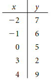
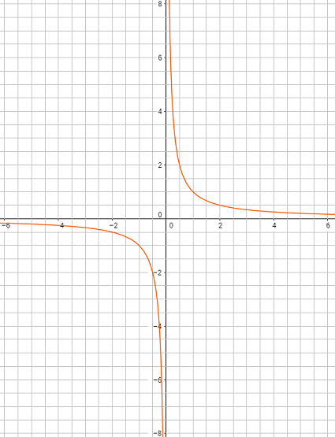

# Relazioni e funzioni

### ESERCIZIO 1 - Le relazioni binarie

a) Dati gli insiemi A = {Po, Adige, Arno, Tevere} e B = {x: x è una regione italiana}, determina il sottoinsieme di A X B relativo alla relazione «a scorre in b»  
b) Dati gli insiemi A = {1, 2, 3, 4, 5} e B = {-1, 0, 1, 2}, scrivi le coppie di ognuna delle seguenti relazioni da A a B  
&emsp;  R1: «x + y = 4»  
&emsp;  R2: «x = 2y»  
&emsp;  R3: «x è minore o uguale a y»

### ESERCIZIO 2 - Rappresentazione delle relazioni

a) Dati gli insiemi A = {x in N: x < 4} e B = {2, 4, 5}, rappresenta la relazione da A a B: «La somma di x e y è dispari»:  
&emsp;  1. In forma sagittale;  
&emsp;  2. Con tabella a doppia entrata;  
&emsp;  3. Con diagramma cartesiano

b) Considerato l’insieme A = {x in Z: -3 <= x < 4}, rappresenta le seguenti relazioni in A X A per elencazione e mediante una tabella a doppia entrata  
&emsp;  1. «Il prodotto tra x e y è positivo»  
&emsp;  2. «Il prodotto fra x e y è 0»  
&emsp;  3. «La somma di x e y è 0»

c) Dato l’insieme A = {x in N: x <= 10}, rappresenta mediante grafici cartesiani le seguenti relazioni in A X A  
&emsp;  1. x = y    
&emsp;  2. x <= y  
&emsp;  3. «La somma di x e y è pari»  

### ESERCIZIO 3 - Relazione Inversa

Dati gli insiemi A = {x in N: 1 < x < 7}, B = {x in N: 8 < x < 14}, per ognuna delle seguenti relazioni in A X B rappresenta per elencazione le coppie della relazione e della sua inversa.  
&emsp;  1. {(x;y): x è divisore di y}  
&emsp;  2. {(x;y): x = y - 4}  
&emsp;  3. {(x;y): x + y = 18}

### ESERCIZIO 4 - Relazioni definite in un insieme in se e loro proprietà

Rappresenta le relazioni seguenti in forma sagittale, con una tabella a doppia entrata e con un grafico cartesiano  
&emsp;  R1: «x è il triplo di y», A = {1, 3, 6, 9, 12}  
&emsp;  R2: «xy > 0», A = {x in Z: -2 < x < 2}  
&emsp;  R3: «x è divisore di y», A = {2, 4, 5, 7, 14, 30}. 

### ESERCIZIO 6 - Proprietà riflessiva, antiriflessiva, simmetrica, antisimmetrica e transitiva

a) Dato l’insieme A = {a, b, c, d}, stabilisci di quali proprietà gode ognuna delle seguenti relazioni definite in A.  
&emsp;  R1 = {(a;a),(a;b),(b;a),(c;d),(b;d),(d;b), (d;c)}  
&emsp;  R2 = {(a;a), (b;b), (c;c), (b;c)}  
&emsp;  R3 = {(a;b), (a;c), (a;d), (b;c), (b;d), (c;d)}

b) Scrivi le proprietà delle seguenti relazioni definite in un insieme A di persone:  
&emsp;  1. «x abita in un quartiere diverso da quello di y»;  
&emsp;  2. «x è nipote di y»;  
&emsp;  3. «x frequenta la stessa scuola di y»

c) Scrivi le proprietà delle seguenti relazioni definite in un insieme A di nazioni:  
&emsp;  1. «x confina con y»;  
&emsp;  2. «x ha una densità di popolazione non inferiore a y»;  
&emsp;  3. «x è in pace con y».

### ESERCIZIO 9 - Le funzioni

a) Considera le seguenti relazioni e stabilisci se sono funzioni oppure non lo sono, motivando le risposte.  
&emsp;  R1: «associa agli studenti della tua classe il voto dell’ultimo compito di matematica» (È importante sapere se il giorno del compito c’erano assenti?)  
&emsp;  R2: «associa a ogni materia i testi in adozione nella tua classe»  
&emsp;  R3: «associa ai fiumi di una nazione le città che essi bagnano»  
&emsp;  R4: «associa alle città italiane le regioni a cui appartengono»  
&emsp;  R5: «associa ai laghi italiani la loro superficie»

b) Utilizza i tre modi diversi (sagittale, con grafico cartesiano, con tabella a doppia entrata) per rappresentare le funzioni indicate fra i due insiemi A e B  
&emsp;  A = {Luca, Gianni, Eva}, B= {I, II, III, IV, V}  
&emsp;  f(Luca) = III, f(Gianni) = IV, f(Eva) = I

c) Come l'esercizio del punto b) ma con gli insiemi A e B riportati di seguito:  
&emsp;  A = {Van Gogh, Renoir, Picasso, Rembrandt}, B = {Olanda, Francia, Italia, Spagna};  
&emsp;  f (Van Gogh) = Olanda, f (Renoir) = Francia, f (Picasso) = Spagna, f (Rembrandt) = Olanda.

### ESERCIZIO 10 - Modelli e funzioni, la proporzionalità diretta ed inversa
a) Esprimere le relazioni seguenti con una equazione dopo aver scelto le lettere che rappresentano le quantità:
1. I litri di vernice necessari per reimbiancare una stanza variano direttamente con il numero di metri quadri delle pareti
2. L'ammontare dell'IVA da pagare varia direttamente con il prezzo di acquisto di una macchina
3. Le ore impiegate da un pendolare per recarsi da casa al posto di lavoro variano inversamente alla velocità media di percorrenza del tragitto  

b) La dose (in milligrammi) raccomandata di Demerol, un medicinale preoperatorio per bambini, varia direttamente com il peso (in Kg) del paziente. Se la dose per un paziente di 30 Kg è di 18 mg, quale è la dose per un bambino di 45 Kg?  

a) *QUOTA DI ISCRIZIONE*  
L'iscrizione ad una piscina costa 250 euro per le 12 settimane della stagione estiva. Se qualcuno si iscrive dopo l'inizio della stagione, una parte della della quota (proporzionale al ritardo) si può recuperare dalla quota dell'anno successivo.
1. Calcolare quanto consuma effettivamente chi si iscrive 5 settimane dopo l'inizio della stagione;  
2. Calcolare il consumo dopo 2 settimane;  
3. Compilare una tabella (2 colonne, 12 righe, I colonna: Numero settimane di ritardo, II colonna: Costo effettivo) che riporta quanto viene consumato da chi si iscrive in ritardo;  

b) *STAMPA LIBRI DI TESTO*  
Un editore valuta che il costo per stampare un numero variabile tra 1.000 e 10.000 copie di un certo libro di testo è 50 euro a copia; tra 10.001 e 20.000 copie il costo è 40 euro a copia e tra 20.001 e 50.000 il costo è 35 euro per copia.  
1. Trova quanto costa stampare 5.500 copie e 23.000 copie;
2. Compila una tabella (2 colonne, 5 righe, I colonna: Numero di copie, II colonna: Costo) che riporta i casi del punto a più quelli di 2.000, 7.000, 45.000 copie.  

### ESERCIZIO 11 Funzioni suriettive, iniettive, biiettive, inverse e composte
a) Indica quali delle seguenti funzioni da A a B sono suriettive:  
1. A = {-2, -1, 0, 1}, B = {-2, 1, 1, 2}, f(-2) = 2, f(-1) = 1, f(0) = -1, f(1) = 2;
2. A = {-1, 0, 1, 2}, B = {-1, 0, 1}, f(-1) = 0, f(0) = 1, f(1) = 0, f(2) =-1;
3. A = {-1, 0, 1}, B = {0, 1, 2}, f(-1) = 0, f(0) = 2, f(1) = 1.

b) Indica quali delle seguenti funzioni da A a B sono iniettive.
1. A = {1, 2, 3, 4}, B = {-1, 0, 1, 2}, f(1) = 2, f(2) = 0, f(3) = 2, f(4) = -1
2. A = {a, b, c, d}, B = {a, b, c}, f(a) = c, f(b) = a, f(c) = b, f(d) = c
3. A = {-2, -1, 0, 1}, B = {-1, 0, 1, 2, 3}, f(-2) = 2, f(-1) = 0, f(0) = -1, f(1) = 3

c) Consideriamo gli insiemi A = {0, 1, 2, 3, 4} e B = {a, b, c, d, e} e la funzione che associa 0 -> b; 1 -> c; 2 -> a; 3 -> e.  
Quale elemento di B va associato a 4 affinché la funzione risulti invertibile?

### ESERCIZIO 12 - Le funzioni numeriche e la proporzionalità diretta ed inversa
a) Costruire una tabella assegnando cinque valori (positivi e negativi) a x per ciascuna delle funzioni riportate di seguito:
1. y = x;
2. y = -x;
3. y = 1/2 x;
4. y = 2x +1;
5. y = 4x

a) In riferimento all'esercizio "Quota di Iscrizione":
1. Scrivere una espressione algebrica (variabile x: Numero settimane di ritardo) che calcola il costo effettivo analogamente ai dati nella tabella del punto 3;  
2. Disegnare il grafico della funzione ottenuta dalla espressione.

b) In riferimento all'esercizio "Stampa Libri di Testo":
1. Scrivere due espressioni algebriche (con la sola variabile x che indica il N. di copie) che calcolano il costo effettivo analogamente ai dati nella tabella del punto 2;
2. Disegna il grafico della funzione ottenuta dalla espressione.

### ESERCIZIO 13 - La funzione lineare
a) Date le seguenti tabelle, stabilisci se tra x e y c’è una dipendenza lineare. In caso affermativo, scrivi la corrispondente funzione e rappresentala nel piano cartesiano.
  
  

### ESERCIZIO 14 - La funzione valore assoluto e le funzioni definite a tratti
a) Per ogni funzione costruisci una tabella con cinque valori di x (positivi, negativi o nulli) e rappresenta il grafico
1. y = 2|x|;
2. y = 1 + |x|;
3. y = -2|x|

### ESERCIZIO 15 - Le funzioni goniometriche

### ESERCIZIO 16 - Funzioni Rilevanti
a) Per ciascuno dei grafici seguenti indica se:
* E' simmetrico rispetto all'asse x o all'asse y;
* E' simmetrico rispetto all'origine.
$y = x^2$;
  
$y = x^3$;
  
$\displaystyle y = \frac{1}{x}$
  
$\displaystyle y = \frac{3}{x^2}$
  
b) Per ciascuno dei grafici seguenti individua:  
* I tratti dell'asse x in cui la funzione è crescente o decrescente;
* Quali sono i punti di massimo o minimo relativo ed i rispettivi valori.  
$\displaystyle y = (x - 3)x^2$  
   
$\displaystyle y = (x-1)(x+1)x^2$  

