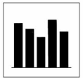

# Statistica Descrittiva

Al giorno d'oggi ciascuno di noi ha a disposizione una grande quantità di informazioni che riguardano la realtà che lo circonda. Internet ci fornisce continuamente dati su prodotti in vendita, informazioni economiche sui titoli in borsa, notizie su altri paesi etc.

Abbiamo potenzialmente la possibilità di sapere tante cose per decidere nella maniera migliore cosa comprare, dove andare, cosa mangiare, in breve per prendere delle decisioni informate. E' però necessario organizzare queste informazioni, perché sono tante e ci servono dei criteri per fare le scelte migliori e non fermarci alla prima opzione che ci si presenta.

Una caratteristica comune a tutte le cose di cui abbiamo parlato è la loro quantità: abbiamo più primi piatti tra cui scegliere, più negozi per comprare lo stesso prodotto, più persone cui dare la nostra amicizia, ciascuno con le sue caratteristiche e particolarità. È solo quando un certo numero di dati viene raccolto, confrontato, analizzato e compreso che vengono generate informazioni utili per prendere delle decisioni.

Proprio di questo si occupa la statistica, che ci dà un insieme di strumenti e tecniche per trasformare dati grezzi (non elaborati) in informazioni sintetiche e riassuntive che rappresentano informazioni utili per supportare un processo decisionale efficace.

## UNITA' 1: Statistica e Fenomeni Collettivi

La statistica è la scienza che studia i ***fenomeni collettivi***, ossia fenomeni che **non sono percepibili con una sola osservazione** di una entità ma richiedono un certo numero di osservazioni, fatte su un insieme di individui o unità.

Sono per esempio fenomeni collettivi:

- il fatturato ed i costi di una azienda (la somma del valore delle vendite);
- la clientela di una azienda in una regione in un certo mese;
- la natalità e la mortalità degli individui di una nazione o città o regione;
- la valutazione in "stelle" di un prodotto su Amazon (Numero di 5 Stelle, 4 Stelle etc.);
- la qualità della produzione (definita come la media di una caratteristica sui prodotti dell'azienda)

Concetti come "natalità", "fatturato", "produzione", si dicono "collettivi" nel senso che riguardano una collettività nel suo insieme e non dei singoli individui, anche se ciascun individuo partecipa al fenomeno. Vi sono quindi delle proprietà riferibili al collettivo che saranno espresse in funzione di quelle dei singoli individui, solitamente come conteggio, somme, medie e così via. Ad esempio il "fatturato aziendale" è la somma del ricavato di ogni singola vendita, il reddito familiare è la somma, o la media, del reddito dei componenti di una famiglia e così via.

Fissato un fenomeno collettivo da studiare, diciamo **unità statistica** la singola entità in cui si osserva il fenomeno in esame. L’insieme delle singole unità statistiche interessate dallo studio del fenomeno collettivo è detto **collettivo statistico** o **popolazione**. 

Alcuni esempi di unità statistiche:

- individui (clienti di un albergo, turisti, studenti, dipendenti di un’azienda, ecc...);
- oggetti (automobili, aziende, prodotti di consumo, ecc...);
- aggregati territoriali (stati, regioni, province, comuni, altro ancora);
- unità temporali (anni, mesi, giorni, altro ancora);

Il fenomeno di cui si parla è rilevabile attraverso una **osservazione o rilevazione**, mediante la quale si registrano i **dati di una unità**, ossia le **caratteristiche** che interessano.

Parlando di una popolazione di persone, caratteristiche di una singola unità sono il fatto che è nata il 22-04-2002, oppure che sia di sesso maschile o che pesa 67 Kg. Il "peso", la "data di nascita" o il "sesso" sono attributi di *tutte* le unità statistiche della popolazione e sono detti **caratteri** o **variabili**; se la popolazione è costituita dalle vendite di una azienda, le variabili di interesse possono essere il prodotto venduto, il venditore, il cliente etc.

Ci sono molti modi per rilevare una caratteristica in una osservazione. Ad esempio, se le unità sono le interrogazioni in una classe, la variabile "valutazione dell'interrogazione" potrebbe essere rilevata con un numero da 0 a 10 oppure con un giudizio, "sufficiente" o "insufficiente" e questo incide sul grado di accuratezza o **precisione** con cui rileviamo il fenomeno. Si dicono **valori** (o **modalità**) della variabile (o del carattere) i modi con cui una caratteristica viene rilevata: "sufficiente" e "insufficiente" sono un modo per fare una "valutazione dell'interrogazione", ma ce ne possono essere altri.

La modalità che viene effettivamente assunta dal carattere in una specifica osservazione è il **dato statistico**. Al posto di dire che "un carattere assume una certa modalità", possiamo dire anche che "La variabile assume un certo valore".

#### ESEMPIO 1

Si vuole analizzare il titolo di studio dei dipendenti di un ufficio in relazione all'età. I dipendenti sono 7 . Sono stati raccolti i dati riportati nella tabella seguente.

$$
\textbf{DIPENDENTI} \\
\begin{array}{|l|l|c|}
\hline
\textbf{Nominativo} & \textbf{Titolo di Studio} & \textbf{Eta} \\
\hline
\text{Antonio Rossi} & \text{Laurea} & 48 \\
\hline
\text{Francesca Verdi} & \text{Diploma}         & 59  \\
\hline
\text{Franco  Gialli}   & \text{Licenza Media}  & 37  \\
\hline
\text{Luigi  Neri}       & \text{Laurea}         & 23  \\
\hline
\text{Giacomo  Bianchi} & \text{Laurea}         & 24  \\
\hline
\text{Antonio  Bianchi} & \text{Laurea}          & 37  \\
\hline
\text{Amedeo  Verdi}    & \text{Diploma}         & 61  \\
\hline
\end{array}
$$

La popolazione è costituita dall’insieme dei dipendenti dell'ufficio e ciascun dipendente è una unità statistica. Le caratteristiche delle unità. o **variabili** di interesse, sono "Titolo di Studio" ed "Età".

Le modalità del Titolo di studio sono: {Laurea, Diploma, Licenza Media, Licenza Elementare} mentre le modalità dell’età sono i numeri che vanno da 18 a 70.  $\bullet$

#### ESEMPIO 2

Si vuole effettuare un'indagine statistica sulla qualità del trasporto pubblico per le scuole di una determinata città. Si devono quindi individuare la popolazione, le unità statistiche, i caratteri più significativi per l'indagine e le loro modalità.

La popolazione potrebbe essere l'insieme di tutti i viaggi effettuati in un certo periodo di tempo da tutte le persone che si recano in una qualunque scuola della città (insegnanti, studenti, personale amministrativo e tecnico). L'unità statistica è quindi il viaggio ed i caratteri più rilevanti sono:

- Uso del mezzo di trasporto (modalità: Si, No) 

- Tipologia del mezzo (modalità: Nessuno, Autobus, Metropolitana, Auto, Moto, Bicicletta, Altro);

- Età del Viaggiatore (modalità: numeri interi compresi tra 2 a 90);

- Sesso  del Viaggiatore (modalità: M, F; Tipo: categorico/binario);

- Distanza del Domicilio dalla Scuola: (modalità: numeri decimali);

- Motivazione del non utilizzo di un mezzo (modalità: descrizione testuale);

- Grado di soddisfazione (modalità: valori da 1 a 10).

- Data ed ora del viaggio (modalità: data ed ora)

$\bullet$

### ESERCIZIO 1.1 - Popolazioni, caratteri e modalità

a) Per effettuare un'indagine sull'utilizzo dei computer nella tua città, quali potrebbero essere i caratteri da rilevare? Quali le unità statistiche?  

b) Per effettuare una indagine statistica sul consumo di alcol tra i ragazzi da 16 a 21 anni della tua città, quale sarebbe la popolazione statistica da considerare? quali i caratteri e la modalità?

c) In una Provincia, si vuole analizzare il numero delle abitazioni occupate in rapporto al numero di stanze. Quale è la popolazione da considerare? Quali sono i caratteri da rilevare?

d) In un Comune si svolge una indagine sul numero di giornate con precipitazioni nevose, secondo i mesi dell'anno, negli ultimi 10 anni. Quali sono le unità statistiche? Quali i caratteri?

## UNITA' 2: Tipi di Caratteri e Livelli di Misura

I caratteri che si possono studiare in statistica si possono analizzare per **TIPOLOGIA** di dato e per **LIVELLO DI MISURA** del dato.

Si chiamano ***caratteri quantitativi*** quelli che hanno modalità numeriche. I dati sono il risultato di un **conteggio** o una **misurazione**, come ad esempio il reddito di una popolazione (in euro o altra unità), le vendite di un anno (ad esempio in milioni di euro), il numero delle unità abitative in un comune etc.

Si chiamano ***caratteri qualitativi*** quelli che hanno modalità che sono espressioni verbali, aggettivi o nomi. Ad esempio il carattere "sesso" ha modalità 'maschio' e 'femmina', o "Religione" che ha modalità:  'Cristiana', 'Islamica', 'Buddista', ecc. titolo di studio, marca .... In questi casi il carattere non assume valori numerici ma ammette gradi o attributi distinti.

I dati **quantitativi** (e le corrispondenti variabili) si distinguono ulteriormente in:

- **discreti (numeri naturali)**, se la misura è espressa da un numero naturale che non derivi da un arrotondamento di un numero reale, ma dalla natura stessa del dato (per esempio, l'età in anni, gli abitanti di una città, le autovetture prodotte da un marchio automobilistico in un anno, numero di figli di una famiglia ecc.), cioè derivi da una operazione di conteggio.
- **continui**, se possono manifestarsi con tutti i valori di un intervallo di numeri reali predefinito (esempio statura di un individuo, peso ecc.), ossia se derivano da una operazione di misura. In tal caso è rilevante anche l’unità di misura.

I dati **qualitativi**, a loro volta, possono essere distinti in:

- **arbitrari (illimitati)**, quando le modalità possibili sono di numero indefinito (non noto); esempi sono gli indirizzi di residenza, i codici fiscali delle persone ecc.
- **categorici (limitati)**, se le modalità possibili sono di numero finito e noto (il carattere sesso, con i valori, ad es.’M’ e ‘F’ o religione, con i valori ‘Cattolica’, ‘Islamica’, ecc.);
- **binari, (o dicotomici)** se indicano il possesso di una certa caratteristica da parte dell’unità o la verità di un certo fatto (es. possesso di una carta di credito da parte di un cliente). Assumono i valori Vero/Falso oppure Si/No.

La figura seguente riassume le caratteristiche dei tipi esaminati.

E' importante notare che le variabili sono <u>quantitative</u> non solo quando hanno i valori rappresentati con dei numeri ma quando sui numeri ha un senso fare delle operazioni aritmetiche. Ad esempio sulla variabile "Reddito" è possibile fare delle somme (es. reddito familiare) mentre sulla variabile Stato Civile: 0 - Celibe/Nubile, 1 - Coniugato, non ha senso fare delle somme, ossia sommare uno con zero. Analogamente i numeri telefonici sono variabili <u>qualitative illimitate</u> e non si possono sommare, anche se si chiamano "numeri" e sono composti da cifre. 

Le variabili si possono inoltre analizzare per livello di misura, ossia per il dettaglio della loro misura del fenomeno, ed abbiamo i livelli seguenti.

- **Livello Nominale**, se date due modalità è possibile solo affermare se queste sono uguali o diverse, e non è definibile alcuna relazione d'ordine, ad esempio la variabile "Sesso" con le modalità 'M' e 'F' o "Religione", con i valori 'Cattolica', 'Islamica' ecc., oppure i nomi e cognomi di persone o gli indirizzi;
- **Livello Ordinale**, ossia qualitativi o quantitativi ove sia significativo un qualche ordinamento naturale (ad esempio, il carattere titolo di studio, o grado nella gerarchia militare, via via più elevato). Per questi dati, anche quando sono quantitativi, non è confrontabile tra di loro una differenza di livello: ad esempio non si può dire quale salto tra i livelli diploma/laurea e licenza elementare/media sia il maggiore;
- **Livello di Intervallo**, ossia quantitativi per i quali è confrontabile tra di loro una **differenza di livello** tra il maggiore ed il minore, come ad esempio per le date o per la temperatura: l'incremento tra 5 e 10 gradi è maggiore di quello tra 17 e 21 gradi di temperatura.
- **Livello di Rapporto** Sono dati quantitativi per i quali ha significato il rapporto tra di loro, e quindi la percentuale. Lo zero significa assenza della misura, come ad esempio nel caso di Reddito, Peso, Età. Sono misure a tutti gli effetti.

I livelli sono riportati nella figura seguente.

#### ESEMPIO 1

Relativamente all'esercizio 1.1, che riguardava un'indagine statistica sulla qualità del trasporto pubblico per le scuole di una determinata città, abbiamo la situazione delle variabili riportata di seguito (l'unità statistica è l'individuo).

- Uso del mezzo di trasporto (modalità: Uso, Si, No; Tipo: categorico/binario, Livello Misurazione: nominale);

- Tipologia del mezzo (modalità: Autobus, Metropolitana, Auto, Moto, Bicicletta, Altro; Tipo: categorico, Livello Misurazione: nominale);

- Età (modalità: numeri interi compresi tra 2 a 90; Tipo: quantitativo discreto, Livello Misurazione: rapporto);

- Sesso (modalità: M, F; Tipo: categorico/binario, Livello Misurazione: nominale);

- Distanza del Domicilio dalla Scuola: (modalità: quantitativo/continuo, livello rapporto, eventualmente ripartita in fasce, 0 |- 2 Km, 2 |- 5 Km, 5 |- 10 Km, Oltre 10 Km);

- Motivazione del non utilizzo (Tipo: qualitativo/arbitrario illimitato, Livello Misurazione: nominale);

- Grado di soddisfazione (modalità: categorico, valori da 1 a 10, Livello Misurazione: ordinale).

## UNITA' 2: Frequenze ed Intensità

Avendo a disposizione i dati della popolazione, una prima analisi è quella che consiste nel calcolo di quante unità posseggono certe caratteristiche, cioè, nell'esempio del titolo di studio dei dipendenti, quanti dipendenti posseggono la laurea, quanti il diploma ecc. Questa analisi ci consente di sapere quale titolo di studio è il più frequente tra la popolazione e quale lo è meno (analisi delle frequenze).

La **Frequenza (assoluta) di una modalità** (in inglese "proportion") è il numero di unità della popolazione che presentano la modalità, ossia il numero di volte che la modalità di un carattere viene osservata nella popolazione.

La **Frequenza relativa di una modalità** è il rapporto tra la frequenza assoluta della modalità ed il numero delle unità della popolazione.

La **distribuzione di frequenza (assoluta o relativa) di un carattere** è l'associazione alle modalità del carattere, quantitativo o qualitativo, delle corrispondenti frequenze assolute/relative osservate.

#### ESEMPIO 1

Il direttore del personale di un’industria ha somministrato un breve questionario a 20 addetti nel quale si chiedeva:

- La qualifica (Operaio, Impiegato, Quadro, Dirigente)
- Il grado di pesantezza del lavoro svolto (1: "poco faticoso", 2: "moderatamente faticoso", 3: "faticoso", 4: "molto faticoso", 5: "estremamente faticoso")
- Il numero di figli a carico
- La retribuzione media oraria (in euro/h)
- La disponibilità di un’auto propria (0: "no", 1: "si")

I risultati sono riassunti nella tabella seguente.
$$
\textbf{RISULTATO QUESTIONARIO} \\
\begin{array}{|l|l|c|}
\hline
\textbf{Unita} & \textbf{Qualifica} & \textbf{Pesantezza} & \textbf{N. Figli} & \textbf{Retribuzione} & \textbf{Disp. Auto} \\
\hline 
1 & \text{Operaio}& 2 &  0 & 22,5 & 0 \\
\hline                                   
2 & \text{Impiegato}& 2 &  1 & 23,0 & 1 \\
\hline                                   
3 & \text{Operaio}	& 3  &  3 & 18,5 & 1 \\
\hline                                   
4 & \text{Impiegato}& 4	 &  2 & 18,3 & 1 \\
\hline                                   
5 & \text{Operaio}	& 1	 &  0 & 15,0 & 0 \\
\hline                                   
6 & \text{Impiegato}& 3	 &  1 & 25,7 & 0 \\
\hline                                   
7 & \text{Impiegato}& 3	 &  0 & 24,2 & 1 \\
\hline                                   
8 & \text{Operaio}	& 1	 &  2 & 16,7 & 1 \\
\hline                                   
9 & \text{Operaio}	& 2	 &  2 & 17,9 & 1 \\
\hline                                   
10 & \text{Operaio}	& 3	 &  1 & 15,0 & 0 \\
\hline                                   
11 & \text{Impiegato}& 4 &  2 & 24,6 & 0 \\
\hline                                   
12 & \text{Impiegato}& 2 &  0 & 26,8 & 1 \\
\hline                                   
13 & \text{Impiegato}& 3 &  2 & 21,5 & 1 \\
\hline                                   
14 & \text{Dirigente}& 5 &  2 & 50,3 & 1 \\
\hline                                   
15 & \text{Quadro}	& 3	 &  2 & 23,6 & 1 \\
\hline                                   
16 & \text{Operaio}	& 5	 &  2 & 18,4 & 1 \\
\hline                                   
17 & \text{Operaio} & 2	 &  1 & 18,9 & 0 \\
\hline                                   
18 & \text{Operaio}	& 4	 &  0 & 19,4 & 0 \\
\hline                                   
19 & \text{Operaio}	& 4	 &  3 & 19,3 & 1 \\
\hline                                   
20 & \text{Quadro}	& 1	 &  1 & 26,0 & 0 \\
\hline
\end{array}
$$

Ogni riga della tabella corrisponde a un individuo sul quale sono stati rilevati 5 caratteri. Ciascun carattere assume in corrispondenza di ogni individuo una determinata modalità.

Le frequenze assolute e relative, espresse in percentuale, del Gradi di Pesantezza (*distribuzione* dei Gradi di Pesantezza) e del Numero dei Figli sono le seguenti.

$$
\textbf{DIPENDENTI - Freq. Grado Pesantezza} \\
\begin{array}{|c|c|}
\hline
\textbf{Pesantezza} & \textbf{Freq.} & \textbf{Freq. (\%)}\\
\hline 
1 & 3 & 15\%\\
\hline 
2 & 5 & 25\% \\
\hline 
3 & 6 & 30 \% \\
\hline 
4 & 4 & 20 \% \\
\hline 
5 & 2 & 10 \% \\
\hline 
\textbf{Totale} & \mathbf{20} & \mathbf{100 \%} \\
\hline
\end{array}
$$

$$
\textbf{DIPENDENTI - Freq. N. Figli} \\
\begin{array}{|c|c|}
\hline
\textbf{N. Figli} & \textbf{Freq.} & \textbf{Freq. (\%)} \\
\hline 
0 & 5 & 25 \%\\
\hline 
1 & 5 & 25 \% \\
\hline 
2 & 8 & 40 \% \\
\hline 
3 & 2 & 10 \% \\
\hline 
\textbf{Totale} & \mathbf{20} & \mathbf{100\%}  \\
\hline
\end{array}
$$

Il grado di pesantezza più frequente è $3$ ed il numero di figli più frequente è $2$.  $\bullet$

Se si è in presenza di un carattere ordinato da analizzare che presenta molte modalità distinte, come ad esempio l'età degli individui, si possono avere notevoli difficoltà nella comprensione dei dati osservati.

In questi casi può essere conveniente o addirittura necessario raggruppare i valori in intervalli, denominati **classi** o **intervalli di classi** di valori tra loro disgiunti.

#### ESEMPIO 2

Riprendiamo l’esempio dei dipendenti di un ufficio che aveva i dati riportati di seguito.

$$
\textbf{DIPENDENTI} \\
\begin{array}{|l|l|c|}
\hline
\textbf{Nominativo} & \textbf{Titolo di Studio} & \textbf{Eta} \\
\hline
\text{Antonio Rossi} & \text{Laurea} & 48 \\
\hline
\text{Francesca Verdi} & \text{Diploma}         & 59  \\
\hline
\text{Franco  Gialli}   & \text{Licenza Media}  & 37  \\
\hline
\text{Luigi  Neri}       & \text{Laurea}         & 23  \\
\hline
\text{Giacomo  Bianchi} & \text{Laurea}         & 24  \\
\hline
\text{Antonio  Bianchi} & \text{Laurea}          & 37  \\
\hline
\text{Amedeo  Verdi}    & \text{Diploma}         & 61  \\
\hline
\end{array}
$$

Classifichiamo l’età creando tre classi (o fasce): $18 \vdash 30$ , $31 \vdash 50$ e $51 \vdash 70$. Nominiamo ciascuna fascia con le modalità "Giovane", "Maturo" ed "Anziano". Abbiamo allora la seguente distribuzione di frequenze:

$$
\textbf{FREQUENZA CLASSI ETA} \\
\begin{array}{|l|c|c|}
\hline
\textbf{Fascia Eta} & \textbf{Freq.} & \textbf{Freq.\%} \\
\hline 
\text{Giovane} & 1 & 14 \\
\hline                                   
\text{Maturo} & 4 & 57 \\
\hline
\text{Anziano} & 2 & 29 \\
\hline 
\textbf{Totale} & \mathbf{7} & \mathbf{100}  \\
\hline
\end{array}
$$

La classe di lavoratori più numerosa è quella dei Maturi.  $\bullet$

### Caratteri Trasferibili ed Intensità 

Un carattere è detto **trasferibile** se ha senso immaginare che (per un esito alternativo o futuro degli eventi) tutto o parte del carattere di un’unità statistica possa essere trasferito (incrementato o decrementato) a vantaggio di un’altra unità statistica. 

Esempi di caratteri trasferibili sono:

- il reddito di un soggetto (che anno dopo anno può variare a beneficio o danno per un altro soggetto) o il suo patrimonio (per cessione, donazione o altro);
- le vendite di una azienda (diminuzione o aumento a causa della concorrenza);
- il numero di auto in una famiglia (dismissione o acquisto nei confronti di un’altra famiglia);
- i Km percorsi in un anno da una delle auto di una famiglia (se viene usata una piuttosto che un’altra auto per gli spostamenti). 

I caratteri non trasferibili sono quelli propri di ciascuna unità, come la statura, il peso, l'età o il numero di figli partoriti da una donna.

La **Distribuzione di quantità o intensità** è l'associazione alle modalità di un <u>carattere qualitativo</u>, o alle classi se il carattere è quantitativo, del valore di un carattere <u>quantitativo trasferibile</u> calcolato (come somma, media o altro) su tutte le unità che hanno quel carattere (o ricadono nella classe considerata).

#### ESEMPIO 3

Riprendiamo l’esempio del questionario proposto nell'industria dal direttore del personale. La distribuzione delle retribuzioni per qualifica è riportata di seguito.

$$
\textbf{RETRIBUZIONE PER QUALIFICA} \\
\begin{array}{|l|c|c|}
\hline
\textbf{Qualifica}	& \textbf{N. Unita}	& \textbf{Retrib.}	& \textbf{Retrib.\%} \\
\hline
\text{Dirigente}	& 1	& 50,3	& 11 \\
\hline
\text{Quadro}	& 2	& 49,6	& 11 \\
\hline
\text{Impiegato}	& 7	& 164,1	& 37 \\
\hline
\text{Operaio}	& 10	& 181,6 & 41 \\
\hline
\textbf{Totale} &  \mathbf{20}	 & \mathbf{445,6}	 & \mathbf{100} \\
\hline
\end{array}
$$

Per ogni qualifica la colonna "Retrib." è ottenuta come somma delle retribuzioni individuali. E' importante osservare per quali qualifiche si raggiungono i valori massimi e minimi delle retribuzioni: il massimo si ha per gli operai ed il minimo per i quadri. $\bullet$

#### ESEMPIO 4

In una azienda che vende in tutta Italia, il riepilogo delle vendite in un determinato mese per area geografica è una distribuzione di intensità. L'unità statistica è la vendita, la variabile qualitativo è l'area di vendita (Nord, Centro, Sud, Isole) e quello quantitativo è l'importo della vendita. La distribuzione è la seguente.

$$
\textbf{VENDITE PER AREA} \\
\begin{array}{|l|c|}
\hline
\textbf{Area}	& \textbf{Vendite} \\
  & \textbf{(Ml di euro)}	\\
\hline
\text{Nord}	& 120	 \\
\hline
\text{Centro}	& 80	 \\
\hline
\text{Sud}	& 50	 \\
\hline
\text{Isole}	& 24	 \\
\hline
\textbf{Totale} & \mathbf{274} \\
\hline
\end{array}
$$

L'area che vende di più è il Nord, quella  he vende di meno è l'area commerciale delle Isole.  $\bullet$

### ESERCIZIO 2.1 - Frequenze assolute e relative

a) Per ognuno dei casi seguenti, calcola e riporta in una tabella le frequenze assolute e relative.

1. Statura degli studenti di una classe, espressa in centimetri: 160, 165, 165, 162, 163, 165, 168, 168, 166, 161, 162, 166, 168, 165, 165, 165, 163, 168, 162, 161, 163, 165, 165, 161, 168, 165, 163, 165.  
2. Pioggia caduta giornalmente nel mese di febbraio in una certa località, espressa in millimetri: 2, 3, 3, 4, 6, 8, 5, 5, 0, 0, 0, 1, 1, 4, 2, 5, 1, 0, 0, 0, 1, 2, 2, 0, 1, 0, 1, 2.  
3. Libri letti in un anno da 40 persone: completa i dati raccolti nella tabella seguente con le frequenze relative:

$$
\textbf{CARATTERE: Libri letti in un anno} \\
\begin{array}{|c|c|}
\hline
\textbf{Modalita} & \textbf{Frequenza} \\
\hline
0-2 & 9 \\
\hline
3-5 & 21 \\
\hline
6-8 & 4 \\
\hline
9-10 & 6 \\
\hline
\end{array}
$$

b) In un'indagine statistica sulla conoscenza delle lingue straniere da parte degli italiani di età compresa tra 16 e 40 anni (campione di 1000 unità) vengono poste le seguenti domande:

- Quante lingue conosci?

- Come le hai imparate?

1. Completa le seguenti tabelle in cui sono riassunti i risultati dell'indagine.
2. Calcola la percentuale di persone che conoscono almeno due lingue straniere.

$$
\textbf{CARATTERE: Numero di Lingue Straniere Conosciute} \\
\begin{array}{|c|c|}
\hline
\textbf{Modalita} & \textbf{Freq. Ass.} & \textbf{Freq. Rel.} \\
\hline
0 & 253  \\
\hline
1 & 536  \\
\hline
2 & 180 & 18\% \\
\hline
3 & & 2,8\%  \\
\hline
4 & 3  \\
\hline
\end{array}
$$

$$
\textbf{CARATTERE: Metodo di Apprendimento} \\
\begin{array}{|l|c|}
\hline
\textbf{Modalita} & \textbf{Freq. Ass.} & \textbf{Freq. Rel.} \\
\hline
\text{A Scuola} & 400 & 53,54 \%  \\
\hline
\text{Con Corsi Specifici} &  &   \\
\hline
\text{Viaggi Studio} & 156 & 20,89 \%  \\
\hline
\text{All'Universita} &  & 0,4 \%  \\
\hline
\end{array}
$$

c) I dati riportati nella seguente tabella si riferiscono a un gruppo di 20 soggetti per ognuno dei quali è stata osservata:

- l’**età** (colonna ***Eta***, in anni);
- il **livello socio-economico** (colonna ***Liv.***, modalità 1=elevato, 2=medio, 3=basso);
- la **zona di residenza**, (colonna ***Res.*** con modalità 1=urbana, 2=periferica)
- lo **stato di salute** (colonna ***Salute*** con modalità 1=buono, 0=cattivo);
- il **reddito** (colonna ***Reddito***, in euro). 

$$
\begin{array}{|c|c|c|c|r|}
\hline
\textbf{Eta} & \textbf{Liv.} & \textbf{Res.} & \textbf{Salute} & \textbf{Reddito} \\
\hline
33 & 1 & 1 & 1 & 75.000    \\
\hline
35 & 1 & 1 & 1 & 120.000   \\
\hline                         
6 & 1 & 1 & 0 & 55.000     \\
\hline                         
60 & 1 & 1 & 0 & 66.000    \\
\hline                         
18 & 3 & 1 & 1 & 14.000    \\
\hline                         
26 & 3 & 1 & 0 & 12.000    \\
\hline                         
6 & 3 & 1 & 0 & 17.500     \\
\hline                         
31 & 2 & 1 & 1 & 33.000    \\
\hline                         
26 & 2 & 1 & 1 & 42.000    \\
\hline                         
37 & 2 & 1 & 0 & 47.000   \\
\hline                         
23 & 1 & 1 & 0 & 51.000   \\
\hline                         
23 & 1 & 1 & 0 & 60.500   \\
\hline                         
27 & 1 & 1 & 0 & 140.000  \\
\hline                         
9 & 1 & 1 & 1 & 83.000    \\
\hline                         
37 & 1 & 2 & 1 & 73.000   \\
\hline                         
22 & 1 & 2 & 1 & 68.000   \\
\hline                         
67 & 1 & 2 & 1 & 65.000   \\
\hline                         
8 & 1 & 2 & 0 & 55.000    \\
\hline                         
6 & 1 & 2 & 1 & 59.000    \\
\hline                         
15 & 1 & 2 & 1 & 61.000   \\
\hline
\end{array}
$$

1. Calcola le distribuzioni semplici di frequenza dei caratteri livello socio-economico, stato di salute e età, utilizzando per quest’ultimo carattere le classi $0 \vdash 26$, $26 \vdash 51$ e $51 \vdash 76$; 
2. Calcola le frequenze assolute e relative per determinare la distribuzione del livello socio-economico.

#### Laboratorio FOGLIO ELETTRONICO

Tutti i dati utili alle esercitazioni di laboratorio sono contenuti nel file in formato Excel scaricabile [qui](http://felixblog.github.io/edu/dev/Statistica Descrittiva/Frequenze.xlsx).

a) Risolvi il punto a.1) con la sequenza di operazioni sul FOGLIO ELETTRONICO riportati di seguito.

1. Scarica ed apri il file di dati;
2. Sul foglio "Stature", copiare l'intervallo A2:A29 sull'intervallo B2:B29 e su quest'ultimo rimuovere i duplicati, in modo che  valori compaiano una sola volta. 
3. Generare, a partire dalla cella C2 e trascinando verso il basso, i valori delle frequenze con la formula: =CONTA.SE(\$A\$2:\$A\$29;B2).
4. L'intervallo B2:C8 conterrà la tabella della distribuzione di frequenza (assoluta) desiderata. 

b) Risolvi il punto a.2) dell'esercizio con una sequenza di operazioni analoga al punto a).

c) Risolvi il punto a.1) dell'esercizio con lo strumento TABELLA PIVOT

d) Risolvi il punto c.1) dell'esercizio prendendo ad esempio la sequenza di operazioni del punto a) del laboratorio.

### ESERCIZIO 2.2 - Intensità Assolute e Relative

Considera i dati dell'ESEMPIO 1 relativi ad un questionario somministrato a 20 addetti di una azienda.

a) Considerato che in un mese ci sono 20 giorni lavorativi e che la giornata lavorativa è di 8 ore, calcola:

1. La retribuzione mensile (intensità) per ciascuna unità;

2. la distribuzione della retribuzione mensile per qualifica, in assoluto ed in percentuale sul totale.

b) Considera le classi di retribuzione (fasce) seguenti: $0 \vdash 19$; $19 \vdash 26$; $26 \vdash 40$; $40 \vdash $, e calcola

1. le frequenze assolute e relative di tali classi;
2. la distribuzione della retribuzione mensile per fascia d'età.

## UNITA' 3: Tabelle e Serie Statistiche

È possibile trarre vantaggio dai risultati statistici solo se le informazioni sono interpretate facilmente e comunicate in modo efficace. Le tabelle ed i grafici sono strumenti usati comunemente per riepilogare e presentare risultati statistici: una tabella o un grafico possono infatti comunicare informazioni in modo molto più rapido e vivido di un rapporto scritto se il lettore è in grado di interpretarle. Per i grafici in particolare c'è molta verità nell'adagio "un'immagine vale più di mille parole".

Tabelle e i grafici possono essere utilizzati per riassumere i dati di una singola variabile (ad es. il canale TV preferito dagli spettatori o l'andamento dei tempi di consegna) o per esaminare la relazione tra due variabili (ad es. tra genere e numero di lettori di giornali).

Le tabelle sono uno strumento molto generale per riportare dati in relazione tra di loro e sono fondamentali per l’esposizione di dati statistici. Una tabella è costituita da un insieme di righe, ciascuna costituita da una sequenza di dati (celle), ed una intestazione che riporta il nome delle colonne.

Relativamente alla loro struttura le tabelle statistiche si distinguono in:

- univariate e multivariate;
- semplici e composte;
- ad una ed a più entrate.

 Relativamente al contenuto, le tipologie di tabelle che tratteremo sono:

- tabelle delle rilevazioni (o osservazioni);
- tabelle per le distribuzioni di frequenza (semplici e multiple);
- tabelle per le distribuzioni di intensità;
- serie statistiche.

In rapporto alle rilevazioni, le tabelle generalmente contengono dati derivati ottenuti dal raggruppamento delle osservazioni elementari e dall’applicazione di funzioni di aggregazione quali conteggi, somme, medie etc.

### Tabelle Univariate e Multivariate

Le tabelle **univariate** o monovariate sono le più semplici e presentano i dati di una sola variabile (carattere) per ciascuna unità statistica. La tabella si riduce così ad un elenco e fornisce supporto all’analisi statistica monovariata che consiste nell’analizzare le variabili singolarmente prese, cioè a una a una senza metterle in relazione fra di loro.

Sono tabelle univariate le distribuzioni di frequenza in quanto riportano i dati di un solo carattere. 

#### ESEMPIO 1

Se si rappresenta solo il carattere "titolo di studio" dei 7 dipendenti di un'azienda, si ha una tabella con una sola colonna in cui ogni riga corrisponde ad una unità statistica e la colonna indica il suo titolo di studio (licenza media, diploma di maturità, laurea triennale ecc.).

$$
\textbf{DIPENDENTI - Titolo di Studio} \\
\begin{array}{|l|l|c|}
\hline
\textbf{Titolo di Studio} \\
\hline
\text{Laurea} 		 \\
\hline
\text{Diploma}       \\
\hline
\text{Licenza Media}\\
\hline
\text{Laurea}       \\
\hline
\text{Laurea}       \\
\hline
\text{Laurea}        \\
\hline
\text{Diploma}       \\
\hline
\end{array}
$$

Univariata è anche la distribuzione delle frequenze del Titolo di Studio tra i dipendenti.

$$
\textbf{DIPENDENTI - Freq. Titolo di Studio} \\
\begin{array}{|l|c|}
\hline
\textbf{Titolo di Studio} & \textbf{Frequenza}\\
\hline
\text{Laurea} 	& 4	 \\
\hline
\text{Diploma}  & 2     \\
\hline
\text{Licenza Media} & 1 \\
\hline
\end{array}
$$

$\bullet$

In una **tabella multivariata** vengono riportate le modalità di più di un carattere.

Sono tabelle multivariate le distribuzioni di intensità in quanto coinvolgono dati di un carattere qualitativo e di uno quantitativo.

#### ESEMPIO 2

Nell'esempio del questionario fatto ai dipendenti dall'Ufficio del Personale, l'intera tabella dei dati  è una tabella multivariata.

E' multivariata anche la tabella dell costo delle retribuzioni per qualifica che coinvolge sia le qualifiche che le retribuzioni.

$$
\textbf{RETRIBUZIONE PER QUALIFICA} \\
\begin{array}{|l|c|c|}
\hline
\textbf{Qualifica}	& \textbf{Retrib.}	& \textbf{Retrib.\%} \\
\hline
\text{Dirigente}	& 50,3	& 11 \\
\hline
\text{Quadro}	& 49,6	& 11 \\
\hline
\text{Impiegato}	& 164,1	& 37 \\
\hline
\text{Operaio}	& 181,6 & 41 \\
\hline
\textbf{Totale}  & \mathbf{445,6}	 & \mathbf{100} \\
\hline
\end{array}
$$

$\bullet$

### Tabelle Semplici e Composte

Si dicono **semplici** le tabelle formate da due colonne che rappresentano dati di relazioni binarie.

#### ESEMPIO 3

Riportiamo in una TABELLA SEMPLICE i dati riguardanti le temperature registrate durante una giornata autunnale ad intervalli di sei ore:

$$
\textbf{TEMPERATURA} \\
\begin{array}{|c|c|}
\hline
\textbf{Ora} & \textbf{Gradi (°C)}\\
\hline
0	& 2 \\
\hline  
6	& 2 \\
\hline  
12	& 11 \\
\hline  
18	& 8 \\
\hline  
24	& 4 \\
\hline  
\end{array}
$$

$\bullet$

Le tabelle **composte** sono formate da più colonne che si riferiscono a varie caratteristiche di uno stesso fenomeno, anche senza legame tra esse e con eventuali attributi calcolati.

#### ESEMPIO 4

Riportiamo in una <u>tabella composta</u> i dati riguardanti le altezze ed i pesi di una famiglia di quattro persone: 

$$
\textbf{ALTEZZE E PESI} \\
\begin{array}{|l|c|c|}
\hline
\textbf{Familiare} & \textbf{Altezza (cm)} & \textbf{Peso (Kg)} \\
\hline
\text{Padre}	& 175	& 80 \\
\hline
\text{Madre}	& 170	& 64 \\
\hline
\text{Figlio}	& 180	& 74 \\
\hline
\text{Figlia}	& 173	& 60 \\
\hline
\end{array}
$$

$\bullet$

### Tabelle a Singola ed a Doppia Entrata

In una tabella **a singola entrata** le righe hanno **tutte lo steso numero di celle**; i caratteri sono sulle colonne ed in ogni cella è presente un dato che è una modalità del carattere della colonna, come tutte le tabelle incontrate finora.

#### ESEMPIO 5

Un esempio di tabella a singola entrata è quella seguente che riporta il numero di soggetti della popolazione italiana (dati assoluti in migliaia) ripartiti per Condizione lavorativa e sesso nell’anno 2003 

$$
\textbf{POPOLAZIONE ITALIANA - ANNO 2003} \\
\begin{array}{|l|c|r|}
\hline
\textbf{Cond. Lavorativa} & \textbf{Sesso} & \textbf{Unita (x 1.000)} \\
\hline
\text{Occupati				}	& \text{M} & 13.690 \\
\hline
\text{Disoccupati			}	& \text{M} & 450   \\
\hline
\text{In cerca di I occ.	}	& \text{M} & 445   \\
\hline
\text{Altre persone in cerca}	& \text{M} & 101   \\
\hline
\text{Non forze di lavoro	}	& \text{M} & 13.267 \\
\hline
\text{Occupati				}	& \text{F} & 8.365  \\
\hline
\text{Disoccupati			}	& \text{F} & 332   \\
\hline
\text{In cerca di I occ.	}	& \text{F} & 398   \\
\hline
\text{Altre persone in cerca}	& \text{F} & 370   \\
\hline
\text{Non forze di lavoro	}	& \text{F} & 20.061 \\
\hline
\end{array}
$$

$\bullet$

Nelle tabelle **a doppia entrata** i caratteri sono **sia sulle righe che sulle colonne**, ogni cella è individuata da due modalità: la prima del primo carattere e la seconda del secondo e nella cella può esserci una frequenza o una intensità.

#### ESEMPIO 6

Quella seguente è una tabella a doppia entrata che riporta gli stessi dati dell'esempio 5.
$$
\textbf{POPOLAZIONE ITALIANA - ANNO 2003} \\
\textbf{\;\;\;\;\;\;\;\;\;\;\;\;\;\;\;\;\;\;\;\;\;\;\;\;\;\;\;\;\;\;\;\;\;\;\;\;\;\;\;\;Sesso} \\
\begin{array}{l | r | r }
 \hline  
\textbf{Condizione Lavorativa} & \textbf{Maschi} & \textbf{Femmine} \\
\hline
\text{Occupati} & 13.690 & 8.365 \\
\hline  
\text{Disoccupati} & 450 & 332 \\
\hline  
\text{In cerca di I occup.} & 445 & 398 \\
\hline  
\text{Altre persone in cerca} & 101 & 370  \\
\hline  
\text{Non forze di lavoro} & 13.267 & 20.061  \\
\hline
\textbf{TOTALE} & \textbf{27.953} & \textbf{29.526} \\
\hline  
\end{array}
$$

Come si può vedere le modalità del carattere "Sesso" sono sulle colonne.   $\bullet$

### Serie Statistiche

Le tabelle che riportano nella prima colonna le modalità di un carattere qualitativo/categorico, quantitativo/discreto o le classi di uno quantitativo e nella seconda colonna una funzione di raggruppamento (conteggio, somma o media etc.) di un carattere quantitativo **trasferibile** calcolata su tutte le unità che ricadono nella classe considerata, vengono dette **serie statistiche**.

Le distribuzioni di frequenza ed intensità rappresentate in tabelle sono esempi di serie statistiche.

#### ESEMPIO 7

Numero di iscrizioni nell’anno scolastico 2012/2013 per ogni ordine e scuola.

$$
\textbf{NUMERO ISCRIZIONI SCUOLE AA.SS. 2012/2013} \\
\begin{array}{|l|r|}
\hline
\textbf{Tipo di Scuola} & \textbf{Iscrizioni}\\
\hline
\text{Scuola dell'infanzia}	& 1.686.095 \\
\hline  
\text{Scuola Primaria di I Grado}	& 2.828.240 \\
\hline  
\text{Scuola Secondaria di I Grado}	& 1.779.758 \\
\hline  
\text{Scuola Secondaria di II Grado }	& 2.652.448 \\
\hline  
\end{array}
$$

$\bullet$

Casi particolari di serie statistiche sono le serie ***storiche*** e quelle ***territoriali***.

Le tabelle che mostrano la successione dei valori che un fenomeno assume in tempi successivi sono **serie storiche**. Esempi sono la popolazione italiana dal 1960 ad oggi, le vendite di autovetture dal 2000 al 2006. Nelle serie storiche le unità statistiche sono istanti o intervalli temporali.

#### ESEMPIO 8

La tabella seguente riporta il reddito delle famiglie italiane con due serie storiche quinquennali.

$$
\textbf{REDDITO DELLE FAMIGLIE ITALIANE (Lire x 1.000)} \\
\begin{array}{|c|r|r|}
\hline
\textbf{Anni}	 & \textbf{Familiare}   & \textbf{Pro Capite}\\
\hline
1980 &	943		& 294	\\
1981 &	1.111	& 347	\\
1982 &	1.310	& 409	\\
1983 &	1.458	& 483	\\
1984 &	1.641	& 544	\\
\hline
\end{array}
$$

$\bullet$

Abbiamo una **serie territoriale** quando la serie espone la distribuzione di un fenomeno nello spazio: la produzione italiana di pomodori per regione, il reddito distinto per provincia. Nelle serie geografiche le unità statistiche sono posizioni o aree geografiche.

$$
\textbf{VENDITE PER AREA GEOGRAFICA (ANNO 2003)} \\
\begin{array}{|l|c|}
\hline
\textbf{Aree Territoriali}	& \textbf{Vendite}	\\
 & \textbf{(Ml. di euro)} \\
\hline
\text{Centro}	& 2.300 \\
\hline
\text{Sud}	& 1.200 \\
\hline
\text{Nord Est}	& 3.040 \\
\hline
\text{Nord Ovest}	& 2.700  \\
\hline
\text{Isole}	& 800  \\
\hline
\end{array}
$$

### ESERCIZIO 3.1 - Serie e Tabelle Statistiche

a) La tabella seguente riporta tre anni di dati mensili delle vendite di un produttore di birra, in barili.

$$
\begin{array}{|c|c|r|c|c|r|c|c|r|}
\hline
\textbf{Anno} & \textbf{Mese} & \textbf{Barili} & \textbf{Anno} & \textbf{Mese} & \textbf{Barili} & \textbf{Anno} & \textbf{Mese} & \textbf{Barili}\\ 	 
\hline
2010 & Gen & 14.673 & 2011 & Gen & 13.310 & 2012 & Gen & 15.188  \\
\hline
2010 & Feb & 14.912 & 2011 & Feb & 14.579 & 2012 & Feb & 14.999  \\
\hline
2010 & Mar & 16.563 & 2011 & Mar & 16.720 & 2012 & Mar & 17.654  \\
\hline
2010 & Apr & 16.545 & 2011 & Apr & 17.675 & 2012 & Apr & 17.860  \\
\hline
2010 & Mag & 17.971 & 2011 & Mag & 18.874 & 2012 & Mag & 18.216  \\
\hline
2010 & Giu & 17.929 & 2011 & Giu & 18.863 & 2012 & Giu & 18.092  \\
\hline
2010 & Lug & 18.693 & 2011 & Lug & 18.798 & 2012 & Lug & 17.174  \\
\hline
2010 & Ago & 18.025 & 2011 & Ago & 17.718 & 2012 & Ago & 17.502  \\
\hline
2010 & Set & 16.291 & 2011 & Set & 15.715 & 2012 & Set & 15.635  \\
\hline
2010 & Ott & 15.637 & 2011 & Ott & 14.609 & 2012 & Ott & 15.071  \\
\hline
2010 & Nov & 13.562 & 2011 & Nov & 13.121 & 2012 & Nov & 13.649  \\
\hline
2010 & Dic & 13.319 & 2011 & Dic & 13.934 & 2012 & Dic & 13.309  \\
\hline
\end{array}
$$

1. Costruisci la serie storica trimestrale (riepilogativa) delle vendite;
2. Costruisci una serie storica annuale riepilogativa (triennale);

## UNITA' 4: Grafici dei Dati Statistici

Le rappresentazioni grafiche hanno lo scopo di illustrare, mediante linee, segmenti, simboli convenzionali ecc., le RELAZIONI tra due insiemi di dati presenti in una tabella con almeno due colonne: la prima che diremo delle **etichette** e le altre che diremo **serie**.

#### ESEMPIO 1

Consideriamo la seguente tabella delle quantità (in quintali) vendute di una ditta negli anni indicati (serie storica annuale delle vendite).
$$
\begin{array}{|c|c|}
\hline
\textbf{Anno} & \textbf{Quantita} \\
\hline
2010 & 320 \\
\hline
2011 & 380 \\
\hline
2012 & 410 \\
\hline
2013 & 390 \\
\hline
2014 & 450 \\
\hline
2015 & 480 \\
\hline
2016 & 470 \\
\hline
2017 & 510 \\
\hline
2018 & 500 \\
\hline
2019 & 480 \\
\hline
\end{array}
$$

Il grafico a linee delle vendite negli anni è il seguente.

Come si può constatare il grafico da molte informazioni in più della tabella relative alla crescita e decrescita del fenomeno. La prima colonna, contenente gli anni è quella delle etichette ed è rappresentata sull'asse orizzontale, la seconda, la serie, sull'asse verticale  $\bullet$

La rappresentazione grafica dei dati statistici rispetto alla forma tabellare ha diversi vantaggi:

- consente una visualizzazione immediata della variazione di un fenomeno al variare di un’altra caratteristica e quindi una efficace e globale descrizione dei dati;
- ha potenzialità di analisi: permette di capire se le vendite globalmente crescono o calano, se sono correlate ad altri caratteri ecc.
- consente una forma più divulgativa per i dati statistici che non la forma tabellare.

Un grafico può avere più serie di dati che fanno riferimento alle stesse etichette (grafico multiserie). Per ora consideriamo solo grafici con una sola serie, in seguito vedremo qualche esempio di grafico multiserie. 

### Tipi di Grafici di Base (fondamentali)

Il cuore della rappresentazione grafica è la **corrispondenza** tra i **DATI** di una tabella e gli **ELEMENTI VISUALI degli oggetti grafici**: la **posizione** di un punto, il **colore** di un’area o di un segmento, l’**altezza** di un rettangolo,  ecc.

Gli ELEMENTI VISUALI più importanti che possono rappresentare dati sono:

- Posizione, ad esempio le coordinate di ogni punto nel grafico precedente;
- Forma, ad esempio circolare;
- Dimensioni della forma, come quella dell'esempio che è un piccolo punto;
- Colore.

Qualunque siano i dati tabellari da visualizzare, i tipi di grafici di base tra cui scegliere sono cinque:

| Tipi di Grafici Fondamentali                                 |                   Esempio                   |
| :----------------------------------------------------------- | :-----------------------------------------: |
| Grafico a linee (Line Chart)                                 |                |
| Grafico a Barre Verticali (Column Bar Chart)                 |            |
| Grafico a Barre Orizzontali (o a Nastri, Horizontal Bar Chart) |            |
| Grafico a Torta (Pie Chart)                                  |              |
| Grafico a Punti o a Dispersione (Dot Chart, Scatterplot)     |  |

### Grafico a Linee

E' un grafico fatto di tante figure puntiformi unite da segmenti. 

Riporta sull’asse orizzontale i dati, necessariamente **ordinati**, delle etichette e sull'asse verticale i dati, **quantitativi**, della serie. I due valori (corrispondenti ad una riga della tabella) sono rappresentati dalla posizione (nelle coordinate x-y) di una figura puntiforme che può essere un cerchio, quadrato ecc. I simboli consecutivi rispetto all'ordine delle etichette sono uniti da segmenti, la cui pendenza indica l'incremento/decremento tra posizioni successive.

Sono i grafici tipici per rappresentare le serie statistiche, soprattutto serie storiche, come nel caso dell'esempio precedente. In caso di grafici multiserie, serie distinte sono rappresentate con colore diverso.

Simboli Visuali: Posizione dei simboli, pendenza (dei segmenti), colore (per differenziarle, nel caso di più serie sullo stesso grafico).

#### ESEMPIO 2

La rappresentazione grafica della serie storica delle vendite mensili, trimestrali ed annuali (in barili) di un produttore di birra dell'esercizio 3.1 con dei grafici a linee è riportata di seguito.

Serie storica mensile.

Serie storica trimestrale.

Serie storica annuale.

$\bullet$

### Grafico a Barre Verticali

E' un grafico fatto di tanti rettangoli stretti ed alti posti in verticale come colonne, da sinistra a destra.

Riporta sull’asse orizzontale i dati delle etichette, anche se solo **categorici**, e sull'asse verticale la serie di dati **quantitativi**. Ogni riga della tabella è rappresentata da un rettangolo posizionato con la base in corrispondenza dell'etichetta e di altezza pari al valore della serie.

Sono i grafici tipici per rappresentare le distribuzioni statistiche, di frequenza o di quantità, di uno o più caratteri qualitativi. Nel caso delle etichette categoriche, sono particolarmente usati per le serie territoriali.

Simboli Visuali: Posizione dei Rettangoli, Altezza dei Rettangoli, colore (per differenziare le serie, nel caso di più serie sullo stesso grafico).

#### ESEMPIO 3

$$
\textbf{VENDITE MENSILI} \\
\textbf{6 Mesi - .000 eur} \\
\begin{array}{|l|c|}
\hline
\textbf{Mesi} & \textbf{Vendite}	\\
\hline
\text{Gen} & 88 \\
\hline
\text{Feb} & 94 \\
\hline
\text{Mar} & 103 \\
\hline
\text{Apr} & 113 \\
\hline
\text{Mag} & 122 \\
\hline
\text{Giu} & 110 \\
\hline
\textbf{Totale} & \mathbf{630} \\
\hline
\end{array}
$$

### Grafici a Barre Orizzontali

E' un grafico fatto di tanti rettangoli stretti e lunghi posti in orizzontale come dei nastri.

Riporta sull’asse verticale i dati delle etichette, solitamente **categorici** non ordinati, e sull'asse orizzontale la serie di dati **quantitativi**. Ogni riga della tabella è rappresentata da un rettangolo posizionato con la base in corrispondenza dell'etichetta e di lunghezza della base pari al valore della serie.

Sono i grafici tipici per rappresentare le distribuzioni statistiche **di quantità** di uno o più caratteri qualitativi **non ordinati**.

Simboli Visuali: Posizione dei rettangoli, lunghezza dell base dei rettangoli, colore (per differenziare le serie, nel caso di più serie sullo stesso grafico).

#### ESEMPIO 4

La serie territoriale seguente riporta alcuni dati di spesa regionale per gli spettacoli  ed il relativo grafico a barre orizzontali.  
$$
\textbf{SPESA REGIONALE PER SPETTACOLI} \\
\textbf{Italia - Anno 2002} \\
\begin{array}{|l|r|}
\hline
\textbf{Regione}	& \textbf{Spesa}	\\
\hline
\text{Lombardia} & 125.911 \\
\hline
\text{Lazio} & 73.555 \\
\hline
\text{Piemonte} & 60.202 \\
\hline
\text{Veneto} & 43.439 \\
\hline
\text{Liguria} & 28.031 \\
\hline
\text{Sicilia} & 28.383 \\
\hline
\text{Campania} & 20.568 \\
\hline
\text{Puglia} & 10.748 \\
\hline
\textbf{Totale} & \mathbf{630} \\
\hline
\end{array}
$$

### Grafici a Torta

Ha la forma di una torta suddivisa in spicchi di colore diverso; ogni spicchio rappresenta una percentuale del totale.

Ogni spicchio rappresenta una etichetta, **dato categorico**, e l'ampiezza dello spicchio, cioè il suo angolo al centro, è proporzionale alla percentuale sul totale del **dato quantitativo** della serie, in assoluto o in percentuale.

Simboli Visuali: Angoli, aree, colore.

Sono adatti a rappresentare graficamente serie di frequenza o intensità,mettendo in evidenza l'incidenza delle singole quantità sul totale.

#### ESEMPIO 5

$$
\textbf{VENDITE PER AREA GEOGRAFICA} \\
\textbf{Anno 2012 - .000 euro} \\
\begin{array}{|l|r|c|}
\hline
\textbf{Area}	& \textbf{Vendite} & \textbf{\%}	\\
\hline
\text{Nord}	& 120 & 44\%	 \\
\hline
\text{Centro}	& 80 & 29\%	 \\
\hline
\text{Sud}	& 50 & 18\%	 \\
\hline
\text{Isole}	& 24 & 9\%	 \\
\hline
\textbf{Totale} & \mathbf{274} & 100\% \\
\hline
\end{array}
$$

### Grafici a Punti o a Dispersione

Un grafico a punti o a dispersione (Scatter Plot) è una combinazione di **due variabili quantitative** rappresentate su un diagramma cartesiano, utile per rilevare correlazioni o raggruppamenti. I due valori (corrispondenti ad una riga della tabella) sono rappresentati mediante la posizione (coordinate x-y) di un simbolo grafico costituito da una figura puntiforme come un piccolo cerchio o triangolo o quadrato ecc.

Sono grafici analoghi a quelli a linee con la differenza che i punti non sono uniti da segmenti e le variabili sono entrambe quantitative.

Simboli Visuali: Posizione, forma e colore (per differenziare le serie, nel caso di più serie sullo stesso grafico).

####  ESEMPIO 6

La tabella seguente riporta la rilevazione fatta da una azienda su un campione di 5 suoi venditori. Per ciascuno, sono presenti il fatturato di un anno e la relativa esperienza di lavoro pregressa.

$$
\textbf{FATTURATO E ANNI DI ESPERIENZA} \\
\begin{array}{|c|r|}
\hline
\textbf{Esperienza}	& \textbf{Fatturato} \\
\textbf{(Anni)}  & \textbf{(Euro)}\\
\hline
2	& 6.000 	\\
\hline
5	& 9.000 	\\
\hline
7	& 16.000	\\
\hline
15	& 17.000	\\
\hline
22	& 23.000   \\
\hline
\end{array}
$$

### ESERCIZIO 4.1 - Grafici a Linee

a) Considerata la seguente tabella delle rilevazioni delle quantità vendute di una ditta (in quintali) negli anni indicati.

$$
\begin{array}{|c|c|}
\hline
\textbf{Anno} & \textbf{Quantita} \\
\hline
2010 & 320 \\
\hline
2011 & 380 \\
\hline
2012 & 410 \\
\hline
2013 & 390 \\
\hline
2014 & 450 \\
\hline
2015 & 480 \\
\hline
2016 & 470 \\
\hline
2017 & 510 \\
\hline
2018 & 500 \\
\hline
2019 & 480 \\
\hline
\end{array}
$$

1. Rappresenta i dati con un diagramma cartesiano a linee;
2. Quale è il massimo e quando si è verificato? Quale è il minimo?

b) La tabella seguente riporta le serie storiche delle esportazioni e delle importazioni (in milioni di euro) per l’Italia dal 1998 al 2007 (il file in formato Excel è scaricabile [qui](http://felixblog.github.io/edu/dev/Statistica Descrittiva/Import-Export.xlsx)):

$$
\begin{array}{|c|r|}
\hline
\textbf{Anno} & \textbf{Esportazioni} & \textbf{Importazioni} \\
\hline
1998 & 220.105 & 195.625 \\
\hline
1999 & 221.040 & 207.015 \\
\hline
2000 & 260.413 & 258.507 \\
\hline
2001 & 272.990 & 263.757 \\
\hline
2002 & 269.064 & 261.226 \\
\hline
2003 & 264.616 & 262.998 \\
\hline
2004 & 284.413 & 285.634 \\
\hline
2005 & 299.923 & 309.292 \\
\hline
2006 & 332.013 & 352.465 \\
\hline
2007 & 358.633 & 368.080 \\
\hline
\end{array}
$$
Rappresenta in un diagramma cartesiano:

1. La serie storica delle Esportazioni;
2. La serie storica delle Importazioni;
3. Le due serie nello stesso diagramma. Quale fenomeno si può notare?

#### SOLUZIONE

Punto a.1)

Punto b.3)

### ESERCIZIO 4.2 - Grafici a Barre

a) Rappresenta con un diagramma a barre verticali le tabelle delle frequenze assolute richieste nei punti 1., 2., 3., dell'esercizio 2.a.

b) Rappresenta mediante un diagramma a barre verticali la seguente tabella della rilevazione dei salari mensili (in euro) di 250 operai di una ditta:
$$
\begin{array}{|c|c|}
\hline
\textbf{Classe di Salario} & \textbf{Operai} \\
\hline
  900 \vdash 1000  & 20  \\
1.000 \vdash 1.100 & 55  \\
1.100 \vdash 1.200 & 125 \\
1.200 \vdash 1.300 & 34  \\
1.300 \vdash 1.400 & 16  \\
\hline
\end{array}
$$
c) Rappresenta mediante un diagramma a barre orizzontali (a nastro) la seguente tabella che riporta la rilevazione della spesa (migliaia di euro) per spettacoli in alcune regioni italiane nell'anno 2010

$$
\begin{array}{|l|r|}
\hline
\textbf{Regioni} & \textbf{Spesa} \\  	 
\hline
\text{Piemonte}  & 60.202   \\
\hline
\text{Lombardia}  & 125.911 \\
\hline
\text{Veneto}  & 43.439     \\
\hline
\text{Liguria}  & 28.383    \\
\hline
\text{Lazio}   & 73.555     \\
\hline
\text{Puglia}  & 10.748     \\
\hline
\text{Campania}  & 20.568   \\
\hline
\text{Sicilia} & 28.031     \\
\hline
\end{array}
$$
d) Rappresenta mediante un diagramma a barre verticali la seguente tabella doppia del numero degli occupati ripartiti per sesso e settore di attività economica (anno 2010, numeri in migliaia di unità).
$$
\begin{array}{|l|r|r|}
\hline
\textbf{ } & \textbf{Maschi} & \textbf{Femmine} \\  	 
\hline
\text{Agricoltura} & 1.165 & 658  \\
\hline
\text{Industria} & 5.259 & 1.656  \\
\hline
\text{Servizi} & 7.678 & 5.175    \\
\hline
\text{Altre Attivita} & 890 & 910 \\
\hline
\end{array}
$$

#### SOLUZIONE

Punto b)

Punto c)

### ESERCIZIO 4.3 - Grafici a Torta

a) Rappresenta con un diagramma a torta le tabelle delle frequenze percentuali richieste nei punti 1., 2., 3., dell'esercizio 2.a). 

b) Calcola la ripartizione percentuale del numero degli occupati maschi e delle occupate femmine per settore economico dell'esercizio 5.d) e rappresenta i dati con due diagrammi a torta. 

#### SOLUZIONE

Punto b)

### ESERCIZIO 4.4 - Grafici a Dispersione

a) Considera i seguenti dati relativi agli investimenti e al fatturato complessivo di un collettivo di aziende (in milioni di euro) :

$$
\begin{array}{|r|r|}
\hline
\textbf{Investimenti} & \textbf{Fatturato} \\ 	 
\hline
17,27 & 2.128,02  \\
\hline
18,006 & 2.430,05  \\
\hline             
13,428 & 1.623,97  \\
\hline             
14,123 & 1.799,35  \\
\hline             
28,942 & 3.844,14  \\
\hline             
17,135 & 1.696,33  \\
\hline             
12,537 & 1.649,75  \\
\hline             
24,17 & 3.112,98   \\
\hline
\end{array}
$$
Rappresenta i dati con un grafico a dispersione.

b) In uno studio atto a rilevare le relazione fra età e pulsazioni cardiache al minuto e sotto sforzo, sono state effettuate le seguenti rilevazioni:

$$
\begin{array}{|c|c|}
\hline
\textbf{Eta (Anni)} & \textbf{Pulsazioni (min)} \\ 	 
\hline
15 & 200 \\
\hline
20 & 195 \\
\hline
25 & 190 \\
\hline
30 & 190 \\
\hline
35 & 180 \\
\hline
40 & 185 \\
\hline
45 & 180 \\
\hline
50 & 175 \\
\hline
55 & 170 \\
\hline
60 & 170 \\
\hline
65 & 165 \\
\hline
70 & 160 \\
\hline
\end{array}
$$
Rappresenta i dati con un grafico a dispersione. Che conclusioni si possono trarre?

c) Consideriamo il peso (in kg) e l'altezza (in cm) di 10 individui riportati nella seguente tabella 

$$
\begin{array}{|c|c|}
\hline
\textbf{Peso} & \textbf{Altezza} \\ 	 
\hline
56 & 161  \\
\hline
66 & 165  \\
\hline
84 & 186  \\
\hline
61 & 162  \\
\hline
73 & 172  \\
\hline
90 & 191  \\
\hline
70 & 181  \\
\hline
61 & 164  \\
\hline
75 & 179  \\
\hline
82 & 184  \\
\hline
\end{array}
$$

1. Costruisci il grafico di dispersione per i due caratteri;

2. Individua dal grafico se tra l'altezza ed il peso c'è una correlazione positiva.

#### SOLUZIONE

Punto a)

## UNITA' 5: Moda, Media e Mediana

La reportistica manageriale spesso contiene frasi come:

- il salario medio per livello lavorativo;
- la spesa sanitaria della famiglia italiana;
- il consumo di latte di una famiglia di quattro persone;
- la metà degli impiegati spende meno di $178$ euro al mese per il pendolarismo lavorativo;
- l’età media dei nostri impiegati.

I termini come "salario medio", "spesa della famiglia italiana" ecc. si riferiscono ad un valore assunto come tipico dell’insieme dei dati che stiamo considerando, un valore rappresentativo di "tutto" l’insieme dei salari, dei consumi di latte, dell'età e così via.

Non essendo di interpretazione univoca, ci sono più modi di definire tale questo valore per uno stesso insieme di dati; tutti questi indicatori vengono chiamati **statistiche di posizione centrale**.

Le tre statistiche di posizione centrale più utilizzate sono:

a) la media aritmetica (la "media");

b) la moda.

c) la mediana;

Per le variabili quantitative possono essere calcolati tutti e tre gli indicatori: media, moda e mediana, mentre per le variabili qualitative può essere usata solo la moda.

### La Media

La **media** aritmetica di $n$ numeri $x_1, x_2, …, x_n$ è il rapporto tra la loro somma e il numero $n$.
$$
Media = \dfrac{x_1+x_2+...+x_n}{n}
$$
Se non si hanno a disposizione tutti i dati, ma solo la distribuzione della frequenza di una variabile quantitativa, la media è ottenuta moltiplicando la modalità per la frequenza, sommando e dividendo tutto per la numerosità della popolazione.

#### ESEMPIO 1

Riprendiamo l’esempio dei dipendenti di un ufficio che avevano le età riportate di seguito.

$$
\textbf{DIPENDENTI} \\
\begin{array}{|l|c|}
\hline
\textbf{Nominativo} & \textbf{Eta} \\
\hline
\text{Antonio Rossi} & 48 \\
\hline
\text{Francesca Verdi}    & 59  \\
\hline
\text{Franco  Gialli}  & 37  \\
\hline
\text{Luigi  Neri}        & 23  \\
\hline
\text{Giacomo  Bianchi}    & 24  \\
\hline
\text{Antonio  Bianchi}   & 37  \\
\hline
\text{Amedeo  Verdi}    & 61  \\
\hline
\end{array}
$$

L'età media dei dipendenti è 
$$
\dfrac{48+59+37+23+24+37+61}{7} = \dfrac{289}{7} \approx 41,3 \;\;\;\bullet
$$

#### ESEMPIO 2

Di seguito sono viene riportato il numero di notti trascorse in albergo da 90 clienti.

$$
\textbf{NOTTI IN ALBERGO} \\
\begin{array}{|c|c|}
\hline
\textbf{N. Notti}	& \textbf{N. Clienti}	\\
\hline
1 & 25	\\
\hline
2 & 21	\\
\hline
3 & 15	\\
\hline
4 & 12	\\
\hline
5 & 8	\\
\hline
6 & 6	\\
\hline
7 & 3	\\
\hline
\textbf{Totale} & \mathbf{90}	\\
\hline
\end{array}
$$

La media delle notti si ottiene con la formula seguente:
$$
Media = \dfrac{25 \cdot 1 + 21 \cdot 2 +15 \cdot 3 + 12 \cdot 4 +8 \cdot 5 +6 \cdot 6 +3 \cdot 7}{90} = \dfrac{257}{80} \approx 2,85 \;\;\;\bullet
$$

### La Moda

Dati i numeri $x_1, x_2,...,xn$, si chiama **moda** il valore a cui corrisponde la frequenza massima.

#### ESEMPIO 3

Nell'esempio precedente delle notti in albergo, la moda è $1$ con $25$ clienti.   $\bullet$

### La Mediana

Data la sequenza ordinata di $n$ numeri $x_1, x_2, … x_n$, la **mediana** è:

- il valore centrale, se $n$ è dispari;
- la media aritmetica dei due valori centrali, se $n$ è pari.

#### ESEMPIO 4

Per trovare la mediana tra i numeri $21, 35, 22, 26, 28$ bisogna eseguire i passi seguenti:

1. Ordinare i numeri: $21, 22, 26, 28, 35$;
2. Poiché i numeri sono 5 (dispari), la mediana è il numero centrale: $26$.

Se l'insieme fosse stato  $21, 35, 22, 26, 28, 24$:

1. Ordinare i numeri: $21, 22, 24, 26, 28, 35$;
2. Poiché i numeri sono pari, la mediana è la media dei due numeri centrali: $\dfrac{24 + 26}{2} = 25$

### ESERCIZIO 5.1 - Indici di Posizione Centrale - Media, Moda, Mediana

a) Calcola minimo, massimo e media delle vendite sui dati dell'esercizio 7.b).

b) Per i primi 15 giorni di un mese viene rilevato il ritardo (in minuti) accumulato da un determinato treno rispetto all’orario previsto di arrivo. Di seguito sono riportati i dati rilevati, che presentano segno negativo nel caso di anticipo sull’orario di arrivo:

$$
\begin{array}{|c|r|}
\hline
\textbf{Giorno} & \textbf{Ritardo} \\ 	 
\hline
1 & 10\phantom{--}   \\
2 & 15\phantom{--}   \\
3 & -2\phantom{--}   \\
4 & 0\phantom{--}    \\
5 & 50\phantom{--}   \\
6 & 20\phantom{--}   \\
7 & 0\phantom{--}    \\
8 & 9\phantom{--}    \\
9 & -5\phantom{--}   \\
10 & 8\phantom{--}   \\
11 & 10\phantom{--}  \\
12 & 20\phantom{--}  \\
13 & 6\phantom{--}   \\
14 & 10\phantom{--}  \\
15 & -10\phantom{--} \\
\hline
\end{array}
$$
Calcola minimo, massimo, la moda, la mediana, la media aritmetica della distribuzione;

c) Per otto famiglie viene rilevato il risparmio medio annuo (in euro) come segue: 

$$
\begin{array}{|c|c|}
\hline
\textbf{Famiglia} & \textbf{Risparmio} \\
\hline
\text{A} & 500    \\
\hline
\text{B} & 5.000  \\
\hline
\text{C} & 2.600  \\
\hline
\text{D} & 0      \\
\hline
\text{E} & 9.200  \\
\hline
\text{F} & 3.000  \\
\hline
\text{G} & 5.400  \\
\hline
\text{H} & 6.300  \\
\hline
\end{array}
$$
Determina moda, media e mediana.

d) Considera il grafico riportato di seguito (relativo al 2013, in cui erano presenti in Italia 5 milioni di immigrati).

1. Individua la popolazione, il carattere esaminato, la tipologia di tabella su cui il grafico si basa.
2. Se nel mondo sono presenti 218 nazionalità, quale è la percentuale che in media ha ogni altra nazionalità non rappresentata nel grafico?  

### ESERCIZIO 5.2

a) Le autovetture di un salone per la vendita di auto usate sono classificate secondo l’età dell’usato.

$$
\textbf{AUTO USATE} \\
\begin{array}{|c|c|}
\hline
\textbf{Eta Usato}	& \textbf{N. Auto}	\\
\textbf{(mesi)}	&  \\
\hline
6	& 12 \\
\hline
12	& 16 \\
\hline
18	& 15 \\
\hline
24	& 9  \\
\hline
30	& 5  \\
\hline
36	& 1  \\
\hline
48	& 1  \\
\hline
60	& 1  \\
\hline
\end{array}
$$

Determina la media, la mediana e la moda dell’età.

b) In un campionato una squadra di calcio ha giocato 36 partite, realizzando 52 punti. I goal segnati sono stati 58, quelli subiti 40. Calcola: 

1. la media dei punti a partita;
2. la media dei goal segnati per partita e quella dei goal subiti. 

## UNITA 6: I Rapporti Statistici: Composizione e Coesistenza

I rapporti statistici sono misure statistiche che hanno lo scopo di ***confrontare*** i dati tra di loro. In un rapporto statistico si mettono a confronto due termini, frequenze o quantità, di cui uno almeno è di natura statistica e tale che tra i due termini sussiste un qualche legame logico.

Un rapporto statistico indica quanta parte dell’intensità del fenomeno posta a numeratore **compete, in media,** ad ogni unità di intensità del fenomeno posta a denominatore o ogni 100 unità del denominatore, se il rapporto è espresso in percentuale.

I rapporti così costruiti permettono di confrontare l’intensità di un fenomeno misurato su un collettivo, in tempi o luoghi diversi, e sono largamente impiegati nella descrizione di fenomeni di tipo socio-economico.

#### Esempio 1

Sui giornali o in televisione sentiamo spesso parlare di tasso di disoccupazione, di occupazione e di altri indicatori relativi al Mercato del lavoro. Consideriamo ad esempio il tasso di disoccupazione. Misura quante persone, in percentuale, sono senza lavoro ma stanno cercando un'occupazione, rispetto al totale delle persone che potrebbero lavorare; è indicativo della situazione economica di un Paese ed in Italia ha mostrato un andamento variabile, con una media del $9,38\%$ tra il 2000 e il 2024.

$$
\text{Tasso di disoccupazione} = \dfrac{\text{N. disoccupati}}{\text{Forza lavoro totale}} \;\;\; \bullet
$$

A seconda di quale relazione sussiste tra il numeratore e il denominatore della frazione, si hanno diversi tipi di rapporti statistici. Ne prendiamo in considerazione quattro, in base ad altrettanti tipi di rapporti:

- Rapporto di composizione
- Rapporto di coesistenza
- Rapporto di derivazione
- Rapporto di densità
- Rapporti di Durata e Ripetizione

Mentre i primi tre si ottengono dividendo grandezze omogenee e sono pertanto numeri puri. Il rapporto di densità confronta due grandezze eterogenee ed è pertanto caratterizzato da un misura.

Il rapporto tra le quantità complessive corrispondenti a due diverse modalità (frequenza o intensità) viene chiamato **rapporto di coesistenza**. Il rapporto di coesistenza evidenzia il rapporto proporzionale tra due modalità o classi. 

$$
\text{Rapporto di Coesistenza} = \dfrac{\text{Freq. modalita A}}{\text{Freq. modalita B}}
$$

Esempi di rapporti di coesistenza sono i seguenti.

- Rapporto di Mascolinità: rapporto tra numero (o frequenza) di maschi e di femmine in una popolazione;
- Rapporto di Femminilità:  rapporto tra numero (o frequenza) di femmine e di maschi in una popolazione;
- Indice di Vecchiaia: rapporto tra numero (o frequenza) di anziani e di giovani in una popolazione;
- Indice di Qualità: rapporto tra numero di pezzi difettosi e non difettosi di una produzione.

### ESERCIZIO 6.1 - Rapporti di Composizione

Un **rapporto di composizione** (o di parte al tutto) è un rapporto tra l'ammontare complessivo di una quantità (frequenza o intensità) corrispondente ad una modalità di una variabile di una popolazione e la quantità complessiva della stessa.

a) Considera i dati della tabella dell'esercizio 3.b). Calcola i rapporti di composizione:

1. Percentuale dei laureati sul totale;
2. Percentuale dei soggetti maschi e dei soggetti femmine sul totale. 

### ESERCIZIO 6.2 - Rapporti di Coesistenza

A partire dalla descrizione riportata di seguito tratta dal Rapporto ISTAT "Popolazione residente e dinamica demografica, Anno 2021" rispondi alle domande

1. ...........

b) L'indice di vecchiaia ...

c) ......

## UNITA 7: I Rapporti di Derivazione e Densità

Un **rapporto di derivazione** è ottenuto dividendo la modalità di un fenomeno per quella corrispondente di un altro che, sul piano logico o temporale, ne costituisce l’antecedente o il presupposto, ossia quello da cui deriva o è causato.

Sono utilizzati per misurare l’efficienza/efficacia di un processo nella sua interezza o tra fasi di lavorazione successive, in sociologia, economia etc. e misurano quanta parte del fenomeno al numeratore compete in media ad una unità del denominatore (es. vendite per venditore)

$$
\text{Rapporto di Derivazione} = \dfrac{\text{Modalita Susseguente}}{\text{Modalita Antecedente}}
$$

Esempi di rapporti di derivazione sono i seguenti:

- % di Promozione: rapporto tra numero degli studenti promossi e numero totale studenti;
- % di Scarto: rapporto tra numero dei pezzi scartati per anomalie e numero dei pezzi prodotti;
- Rapporto (%) tra il numero dei reati commessi e la popolazione;
- Rapporto (%) tra numero di prodotti venduti e numero di venditori;
- **Quoziente (tasso) di natalità**, che può riguardare persone, imprese, iniziative etc., dato dal rapporto tra il numero di unità nate nel periodo di riferimento (es. se anno si parla di quoziente di natalità annuo) ed il numero medio della popolazione;
- **Quoziente (tasso) di mortalità**, di persone, imprese, iniziative etc., rapporto tra il numero di unità morte nel periodo di riferimento (es. se anno si parla di quoziente di mortalità annuo) ed il numero medio della popolazione.

Il **rapporto di densità** è un particolare tipo di rapporto di derivazione che confronta la misura del fenomeno globale con la misura di una quantità di un'altra  dimensione del contesto in cui il fenomeno si verifica e misura la **concentrazione** o la **distribuzione** (il ripartirsi) del fenomeno in relazione ad un'altra dimensione.

$$
\text{Rapporto di Densita} = \dfrac{\text{Misura Globale}}{\text{Misura Dimensione Interessata}}
$$

Esempi di rapporti di densità sono:

- Prodotto interno lordo pro capite: rapporto tra il prodotto interno lordo e la popolazione (interessata dal prodotto);
- Numero medio componenti per famiglia: rapporto tra popolazione e numero di famiglie (della popolazione);
- Indice di dotazione di posti letto negli istituti di cura: rapporto tra il numero di posti letto degli istituti di cura e la popolazione;
- Densità demografica: rapporto tra popolazione e territorio (interessato dalla popolazione);
- Quoziente di affollamento: numero di abitanti/ numero di vani;
- Inquinamento: sostanza inquinante in atmosfera/metro cubo;
- Numero di venditori per città (punto vendita);
- Numero di alunni per classe: rapporto tra numero di alunni e numero di classi contenenti gli alunni.

### ESERCIZIO 7.1 - Rapporti di Densità

È ottenuto dividendo l'ammontare di un aggregato per una quantità che rappresenta la dimensione spaziale, temporale o caratterizzante del campo di osservazione cui esso fa riferimento. Le quantità al numeratore e al denominatore sono grandezze eterogenee.

a) ...   

### ESERCIZIO 7.2 - Rapporti di Derivazione

a) ... 

## UNITA 8: Lo Studio dei Flussi: Rapporti di Durata e Ripetizione

I rapporti di durata mettono in relazione la consistenza media di un fenomeno con l’ammontare del suo rinnovamento in un dato intervallo di tempo per trovare la durata media di permanenza di una unità in un processo, ossia in una coda. Il ragionamento è il seguente.

Se per un certo periodo di tempo in un albergo ci sono flussi costanti di 50 arrivi e 50 partenze al giorno, quanti giorni resterebbe mediamente un ospite in albergo se nel periodo l'albergo è visitato stabilmente da 250 persone?

La situazione è illustrata nella figura seguente.

Consideriamo un "primo" giorno con un blocco di 50 arrivi da monitorare. Le 50 partenze del giorno sarebbero quelle arrivate alcuni giorni prima che ormai hanno attraversato tutto il periodo (cioè la fila); il secondo giorno ci sarebbe un nuovo arrivo di 50 unità, altrettante partenze di 50 unità che escono dalla fila) ed il nostro blocco da monitorare avanza di un "posto" nella fila ed alla fina avrà percorso tutta la fila che è di 250 persone, per cui indicando con $T$ la durata di permanenza in albergo 
$$
50 \cdot T = 250
$$
ossia $T = \dfrac{250}{50} \longrightarrow 5$ giorni.

In generale il rapporto di durata si ottiene rapportando l’ammontare di un fenomeno, supposto costante, al suo movimento, anch’esso ipotizzato costante, di entrata o di uscita da un sistema o processo.

$$
\text{Rapporto di Durata} = \dfrac{\text{Unita in Coda}}{\text{Entrate/Uscite al giorno}}
$$

Nella costruzione del rapporto si è ipotizzato che sia la consistenza del fenomeno sia il suo movimento di rinnovamento o di estinzione (nel nostro esempio numero di clienti arrivati o partiti) restino costanti nel tempo. Ma in realtà i fenomeni che si mettono in relazione per ottenere il concetto di durata sono tutt’altro che costanti nel tempo ed allora si ricorre a valori medi.

Il rapporto di durata esprime, in un dato periodo unitario di tempo (anno, mese, settimana, etc.) la permanenza media di un elemento in un sistema. Ad esempio, sono rapporti di durata: 

- la giacenza media di una merce in un magazzino;
- la degenza media degli ammalati in un ospedale;
- la permanenza media degli ospiti in una località (climatica, ecc.). 

Per calcolare i rapporti di durata si considera il numero degli elementi presenti nel sistema all’inizio ed alla fine del periodo di tempo stabilito; tali dati costituiscono i cosiddetti dati statici; si calcola poi il numero degli elementi entrati ed usciti dal sistema nello stesso periodo di tempo, questi dati sono detti dati dinamici.

Se i due dati dinamici sono eguali fra loro, ossia sono entrati nel sistema tanti elementi quanti ne sono usciti, anche i due dati statici sono eguali.

Il **rapporto di ripetizione** è reciproco del rapporto di durata e rappresenta una frequenza, ossia quante volte è, in media, si e rinnovato il fenomeno nel periodo di tempo preso in considerazione.

#### ESEMPIO 1

Si definisce rapporto di durata il rapporto fra il dato statico e quello dinamico. Se i due dati dinamici e, quindi, i due dati statici, sono diversi, si calcola il rapporto fra la semisomma dei dati statici e la semisomma dei dati dinamici. 

### ESERCIZIO 8.1 - Rapporti di Durata e Ripetizione (Studio dei Flussi)

<da completare>

a) ... 

## ESERCIZIO RIASSUNTIVO

La tabella seguente riporta alcune caratteristiche degli individui appartenenti alla forza vendite di un’azienda commerciale (il file contenente la tabella completa, in formato Excel, è scaricabile [qui](http://felixblog.github.io/edu/dev/Statistica Descrittiva/Forza-Vendita.xlsx)):
$$
\begin{array}{|c|c|c|c|c|}
\hline
\textbf{Sesso} & \textbf{Eta} & \textbf{Titolo di Studio} & \textbf{Provenienza} & \textbf{Fatturato} \\  	 
\hline
\text{M} & 46 & \text{Lic.MediaSuperiore} & \text{SUD} & 26.692   \\
\hline
\text{F} & 29 & \text{Lic.MediaInferiore} & \text{ISOLE} & 19.740  \\
\hline
\text{M} & 28 & \text{Lic.MediaSuperiore} & \text{ISOLE} & 25.717 \\
\hline
\text{M} & 52 & \text{Laurea} & \text{SUD} & 43.670                \\
\hline
... & ... & ... & ... & ... \\
\hline
\text{F} & 37 & \text{Lic.MediaSuperiore} & \text{SUD} & 28.670 \\
\hline
\text{M} & 55 & \text{Laurea} & \text{SUD} & 48.428 \\
\hline
\end{array}
$$
a) Analizza i caratteri e le modalità della popolazione

1. Quale è  l'unità statistica?  Quale è la popolazione di riferimento?

2. Indica la tipologia di ciascun carattere.

b) Analizza il titolo di studio e l'età

1. Determina la distribuzione di frequenza secondo il titolo di studio.

2. Determina la distribuzione di frequenza secondo l’età, con riferimento alle classi di seguito indicate:
   fino a 25, da 26 a 35, da 36 a 50, oltre 50 anni.

3. Calcola minimo, massimo, moda, mediana e media aritmetica dell'età.

c) Analizza il fatturato

1. Costruisci la distribuzione di frequenza secondo il fatturato, utilizzando le seguenti classi: 0–20,
   21–30, 31–40, 41–50.
2. Calcola minimo, massimo, moda, mediana e media aritmetica del fatturato.
3. Rappresenta graficamente le variabili osservate.
4. Costruisci le distribuzioni di intensità del fatturato per provenienza geografica e per titolo di studio e rappresentale graficamente.

#### Laboratorio FOGLIO ELETTRONICO

a) Risolvi il punto a.3) dell'esercizio con la sequenza di operazioni sul FOGLIO ELETTRONICO riportati di seguito.

1. Scarica ed apri il file di dati;
2. Generare, a partire dalla cella G2 e trascinando verso il basso, i valori delle CLASSI di reddito con la formula: =SE(F2<=20;"A";SE(F2<=30;"B";SE(F2<=40;"C";"D")));
3. Scrivere, nell'intervallo H2:H5, l'elenco delle quattro lettere A, B, C, D;
4. Generare, a partire dalla cella I2 e trascinando verso il basso, i valori delle frequenze con la formula:  =CONTA.SE(\$G\$2:\$G\$31;H2).
5. L'intervallo H2:I5 conterrà la tabella di distribuzione di frequenza cercata (A -> (0–20), B -> (21-30), C -> (31-40), D -> (41-50)). 

b) Risolvi il punto b.5) dell'esercizio con una sequenza di operazioni analoga a quella del punto precedente.

d) Costruisci la distribuzione di intensità del fatturato per provenienza geografica (punto g) dell'esercizio) con lo strumento TABELLA PIVOT.

d)  Costruisci la distribuzione di intensità del fatturato per titolo di studio (punto g) dell'esercizio) con lo strumento TABELLA PIVOT.

